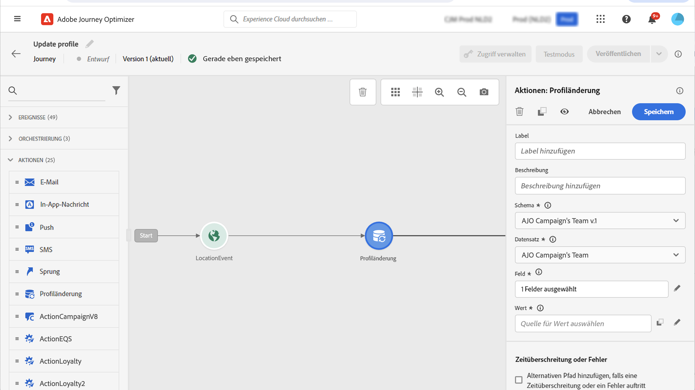

# Profil aktualisieren {#update-profile}

>[!CONTEXTUALHELP]
>id="ajo_journey_update_profiles"
>title="Aktivität „Profil aktualisieren“"
>abstract="Mit der Aktionsaktivität „Profil aktualisieren“ können Sie ein vorhandenes Adobe Experience Platform-Profil mit Informationen aus dem Ereignis, aus einer Datenquelle oder mit einem bestimmten Wert aktualisieren."

Verwenden Sie die **[!UICONTROL Profil aktualisieren]** Aktionsaktivität zum Aktualisieren eines bestehenden Adobe Experience Platform-Profils mit Informationen, die von einem Ereignis, einer Datenquelle oder einem bestimmten Wert stammen.

## Empfehlungen

* Die Aktion **Profil aktualisieren** kann nur in Journeys verwendet werden, die mit einem Ereignis beginnen, das über einen Namespace verfügt.
* Die Aktion aktualisiert nur die vorhandenen Felder, sie erstellt keine neuen Profilfelder.
* Sie können die Aktion **Profil aktualisieren** nicht verwenden, um Erlebnisereignisse zu generieren, z. B. einen Kauf.
* Wie bei jeder anderen Aktion können Sie im Falle von Fehlern oder Timeouts einen alternativen Pfad definieren und nicht zwei Aktionen parallel platzieren.
* Die an Adobe Experience Platform gesendete Aktualisierungsanfrage ist unmittelbar/innerhalb einer Sekunde. Es dauert normalerweise ein paar Sekunden, manchmal aber auch mehr, ohne dass dies garantiert werden kann. Wenn eine Aktion beispielsweise &quot;Feld 1&quot;verwendet, die von einer **Profil aktualisieren** -Aktion, die direkt zuvor platziert wurde, sollten Sie nicht erwarten, dass &quot;Feld 1&quot;in der -Aktion aktualisiert wird.
* Die Aktivität **Profil aktualisieren** unterstützt keine XDM-Felder, die als Aufzählung definiert sind.

## Verwenden der Profilaktualisierung

1. Entwerfen Sie Ihre Journey, indem Sie mit einem Ereignis beginnen. Siehe diesen [Abschnitt](../building-journeys/journey.md).

1. Legen Sie im Abschnitt **Aktion** der Palette die Aktivität **Profil aktualisieren** auf der Arbeitsfläche ab.

   

1. Wählen Sie ein Schema aus der Liste aus.

1. Klicken Sie auf **Feld**, um das Feld auszuwählen, das Sie aktualisieren möchten. Es kann nur ein Feld ausgewählt werden.

   

1. Wählen Sie einen Datensatz aus der Liste aus.

   >[!NOTE]
   >
   >Die Aktion **Profil aktualisieren** aktualisiert die Profildaten in Echtzeit, sie aktualisiert jedoch keine Datensätze. Die Datensatzauswahl ist erforderlich, da das Profil ein Datensatz ist, der mit einem Datensatz verknüpft ist.

1. Klicken Sie auf das Feld **Wert**, um den gewünschten Wert zu definieren:

   * Mit dem einfachen Ausdruckseditor können Sie ein Feld aus einer Datenquelle oder aus dem eingehenden Ereignis auswählen.

      

   * Wenn Sie einen bestimmten Wert definieren oder erweiterte Funktionen nutzen möchten, klicken Sie auf **Erweiterter Modus**.

      

Die Aktivität **Profil aktualisieren** ist jetzt konfiguriert.

## Verwenden des Testmodus {#using-the-test-mode}

Im Testmodus wird die Aktualisierung des Profils nicht simuliert. Die Aktualisierung wird für das Testprofil durchgeführt.

Nur Testprofile können im Testmodus in eine Journey eintreten. Sie können entweder ein neues Testprofil erstellen oder ein vorhandenes Profil in ein Testprofil umwandeln. In Adobe Experience Platform können Sie Profilattribute über einen CSV-Dateiimport oder API-Aufruf aktualisieren. Eine einfachere Methode besteht darin, die Aktionsaktivität **Profil aktualisieren** zu verwenden und das boolesche Feld „Testprofil“ von „false“ in „true“ zu ändern.

Weitere Informationen dazu, wie Sie ein vorhandenes Profil in ein Testprofil umwandeln, finden Sie in diesem [Abschnitt](../segment/creating-test-profiles.md#create-test-profiles-csv).
