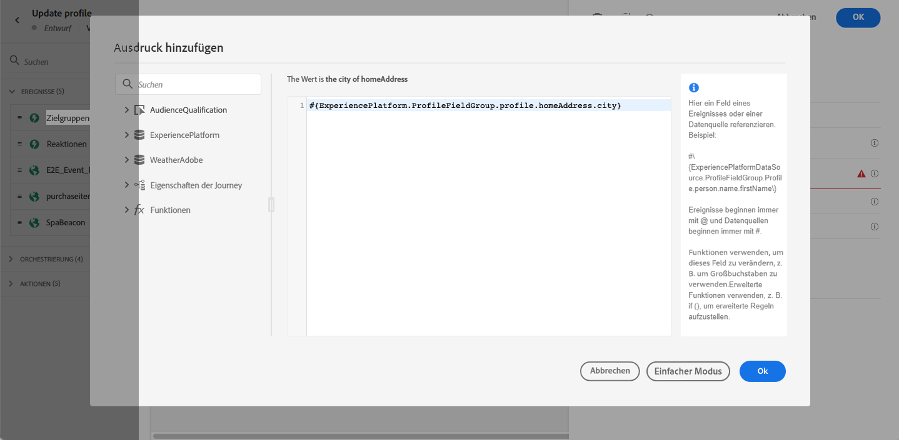

# Profil aktualisieren {#update-profile}

>[!CONTEXTUALHELP]
>id="ajo_journey_update_profiles"
>title="Profilaktivität aktualisieren"
>abstract="Mit der Aktivität Profil-Update können Sie ein vorhandenes Adobe Experience Platform-Profil mit Informationen aus dem Ereignis, einer Datenquelle oder mithilfe eines bestimmten Werts aktualisieren."

Verwenden Sie die **[!UICONTROL Update Profile]** Aktionsaktivität zum Aktualisieren eines vorhandenen Adobe Experience Platform-Profils mit Informationen, die von einem Ereignis, einer Datenquelle oder einem bestimmten Wert stammen.

## Empfehlungen

* Die **Profil aktualisieren** -Aktion kann nur in Journeys verwendet werden, die mit einem Ereignis beginnen, das über einen Namespace verfügt.
* Die Aktion aktualisiert nur bestehende Felder, es werden keine neuen Profilfelder erstellt.
* Sie können die **Profil aktualisieren** -Aktion zum Generieren von Erlebnisereignissen, z. B. einem Kauf.
* Wie bei jeder anderen Aktion können Sie im Falle von Fehlern oder Timeouts einen alternativen Pfad definieren und nicht zwei Aktionen parallel platzieren.
* Die an Adobe Experience Platform gesendete Aktualisierungsanfrage ist unmittelbar/innerhalb einer Sekunde. Normalerweise dauert es einige Sekunden, manchmal aber mehr ohne Garantie. Wenn eine Aktion beispielsweise &quot;Feld 1&quot;verwendet, die von einer **Profil aktualisieren** -Aktion, die direkt zuvor platziert wurde, sollten Sie nicht erwarten, dass &quot;Feld 1&quot;in der -Aktion aktualisiert wird.
* Die **Profil aktualisieren** -Aktivität unterstützt keine XDM-Felder, die als Auflistung definiert sind.

## Profil-Update verwenden

1. Gestalten Sie Ihre Journey, indem Sie mit einem Ereignis beginnen. Siehe dies [Abschnitt](../building-journeys/journey.md).

1. Im **Aktion** in der Palette **Profil aktualisieren** -Aktivität in die Arbeitsfläche.

   

1. Wählen Sie ein Schema aus der Liste aus.

1. Klicken Sie auf **Feld** , um das zu aktualisierende Feld auszuwählen. Es kann nur ein Feld ausgewählt werden.

   

1. Wählen Sie einen Datensatz aus der Liste aus.

   >[!NOTE]
   >
   >Die **Profil aktualisieren** -Aktion aktualisiert die Profildaten in Echtzeit, aktualisiert jedoch keine Datensätze. Die Datensatzauswahl ist erforderlich, da das Profil ein Datensatz ist, der mit einem Datensatz verknüpft ist.

1. Klicken Sie auf **Wert** -Feld, um den zu verwendenden Wert zu definieren:

   * Mithilfe des einfachen Ausdruckseditors können Sie ein Feld aus einer Datenquelle oder aus dem eingehenden Ereignis auswählen.

      

   * Wenn Sie einen bestimmten Wert definieren oder erweiterte Funktionen nutzen möchten, klicken Sie auf **Erweiterter Modus**.

      

Die **Profil aktualisieren** ist jetzt konfiguriert.

## Testmodus verwenden {#using-the-test-mode}

Im Testmodus wird die Profilaktualisierung nicht simuliert. Die Aktualisierung wird am Testprofil durchgeführt.

Nur Testprofile können in eine Journey im Testmodus eintreten. Sie können entweder ein neues Testprofil erstellen oder ein vorhandenes Profil in ein Testprofil umwandeln. In Adobe Experience Platform können Sie Profilattribute über einen CSV-Dateiimport oder API-Aufrufe aktualisieren. Eine einfachere Methode besteht darin, eine **Profil aktualisieren** Aktionsaktivität und ändern Sie das boolesche Feld des Testprofils von &quot;false&quot;in &quot;true&quot;.

Weiterführende Informationen dazu, wie Sie ein vorhandenes Profil in ein Testprofil umwandeln können, finden Sie in diesem Abschnitt [Abschnitt](../segment/creating-test-profiles.md#create-test-profiles-csv).
