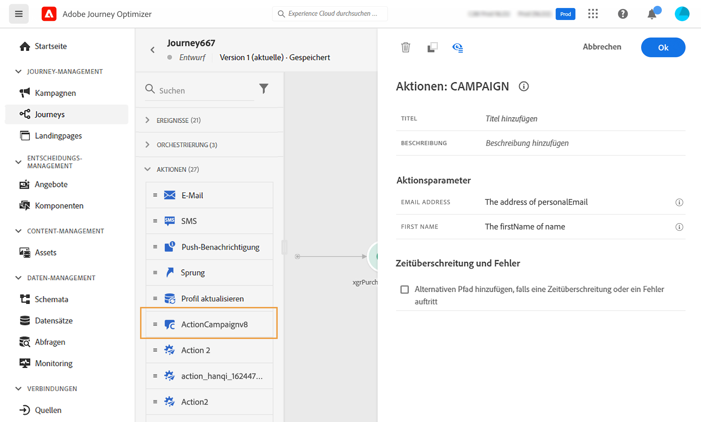

# Aktionen in Adobe Campaign v7/v8 {#using_campaign_classic}

Für Adobe Campaign v7 und v8 ist eine Integration verfügbar. Diese ermöglicht Ihnen das Senden von E-Mails, Push-Benachrichtigungen und SMS mit der Transaktionsnachrichtenfunktion von Adobe Campaign.

Die Verbindung zwischen der Journey Optimizer- und der Campaign-Instanz wird bei der Bereitstellung von Adobe hergestellt. Kontaktieren Sie diesbezüglich Adobe.

Damit dies funktioniert, müssen Sie eine dedizierte Aktion konfigurieren. Siehe diesen [Abschnitt](../action/acc-action.md).

In diesem [Abschnitt](../building-journeys/ajo-ac.md) wird ein Anwendungsfall schrittweise beschrieben.

1. Beginnen Sie bei der Erstellung Ihrer Journey mit einem Ereignis. Weitere Informationen finden Sie in [diesem Abschnitt](../building-journeys/journey.md).
1. Wählen Sie im Abschnitt **Aktion** der Palette eine Campaign-Aktion aus und fügen Sie sie zu Ihrer Journey hinzu.
1. Unter **Aktionsparameter** werden alle Felder angezeigt, die in der Nachrichten-Payload erwartet werden. Sie müssen jedes dieser Felder entweder im Ereignis oder der Datenquelle dem zu verwendenden Feld zuordnen. Dies ähnelt benutzerdefinierten Aktionen. Siehe diesen [Abschnitt](../building-journeys/using-custom-actions.md).

