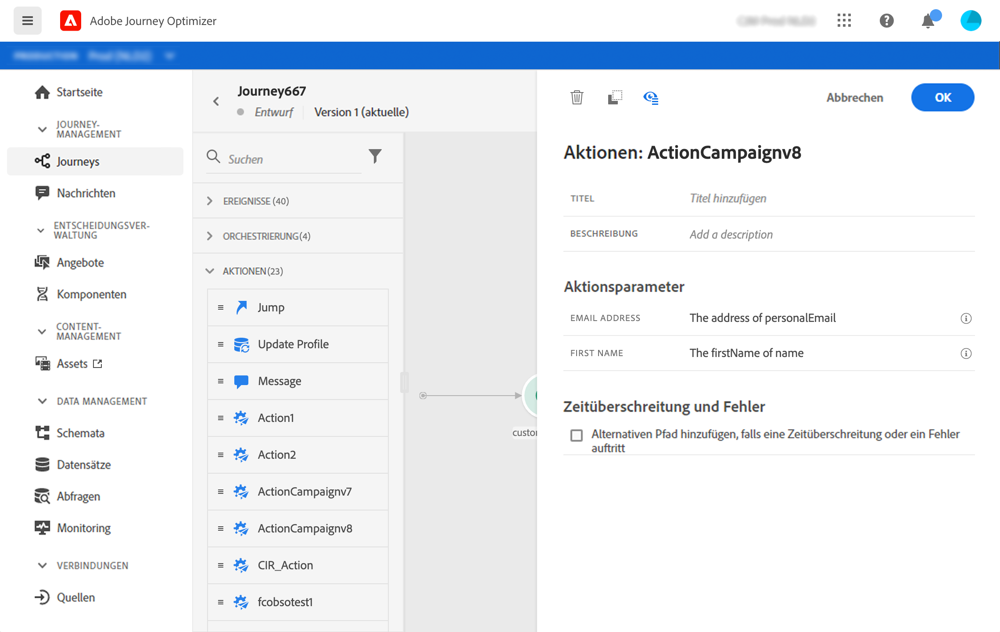

# Adobe Campaign v7/v8-Aktionen {#using_campaign_classic}

Eine Integration ist verfügbar, wenn Sie über Adobe Campaign v7 oder v8 verfügen. Sie ermöglicht den Versand von E-Mails, Push-Benachrichtigungen und SMS mit den Funktionen für Transaktionsnachrichten in Adobe Campaign.

Die Verbindung zwischen den Journey Optimizer- und Campaign-Instanzen wird von Adobe zur Bereitstellungszeit eingerichtet. Adobe kontaktieren.

Dazu müssen Sie eine dedizierte Aktion konfigurieren. Siehe diesen [Abschnitt](../action/acc-action.md).

Ein durchgängiges Anwendungsbeispiel wird in diesem [Abschnitt](../building-journeys/campaign-classic-use-case.md) vorgestellt.

1. Beginnen Sie bei der Erstellung Ihrer Journey mit einem Ereignis. Siehe diesen [Abschnitt](../building-journeys/journey.md).
1. Wählen Sie im Bereich **Aktion** der Palette eine Kampagnenaktion aus und fügen Sie sie Ihrer Journey hinzu.
1. Unter **Aktionsparameter** werden alle Felder angezeigt, die in der Nachrichten-Payload erwartet werden. Sie müssen jedes dieser Felder entweder im Ereignis oder der Datenquelle dem zu verwendenden Feld zuordnen. Dies ähnelt benutzerdefinierten Aktionen. Siehe diesen [Abschnitt](../building-journeys/using-custom-actions.md).

