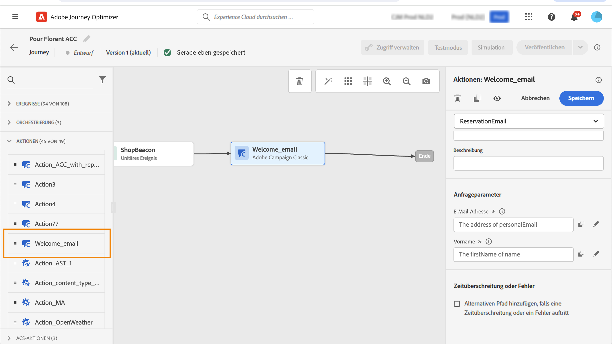

# Aktionen in Adobe Campaign v7/v8 {#using_campaign_classic}

Wenn Sie über Adobe Campaign v7 oder v8 verfügen, ist eine Integration verfügbar. Sie ermöglicht den Versand von E-Mails, Push-Benachrichtigungen und SMS mithilfe von Transaktionsnachrichten in Adobe Campaign.

Die Verbindung zwischen der Journey Optimizer- und der Campaign-Instanz wird von Adobe zur Bereitstellungszeit eingerichtet. Wenden Sie sich an Adobe.

Dazu müssen Sie eine dedizierte Aktion konfigurieren. Siehe hierzu [Abschnitt](../action/acc-action.md).

Ein durchgängiges Anwendungsbeispiel wird in diesem Abschnitt vorgestellt [Abschnitt](../building-journeys/ajo-ac.md).

1. Gestalten Sie Ihre Journey, beginnend mit einem Ereignis. Siehe dies [Abschnitt](../building-journeys/journey.md).
1. Im **Aktion** Wählen Sie in der Palette eine Kampagnenaktion aus und fügen Sie sie Ihrer Journey hinzu.
1. Im **Aktionsparameter**, werden alle in der Payload der Nachricht erwarteten Felder angezeigt. Sie müssen jedes dieser Felder dem Feld zuordnen, das Sie verwenden möchten, entweder aus dem Ereignis oder aus der Datenquelle. Dies ähnelt benutzerdefinierten Aktionen. Siehe hierzu [Abschnitt](../building-journeys/using-custom-actions.md).

