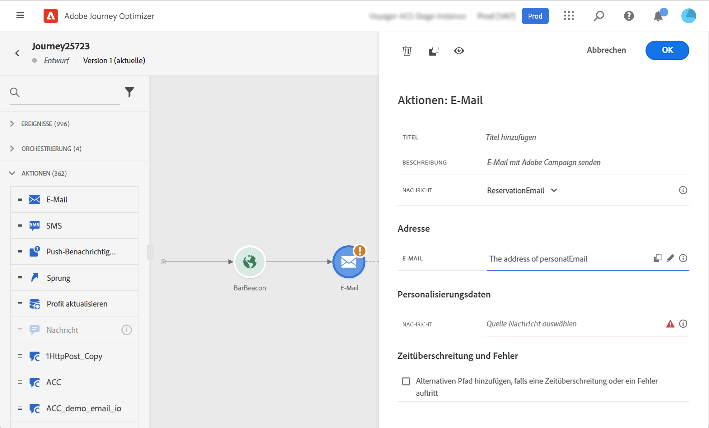
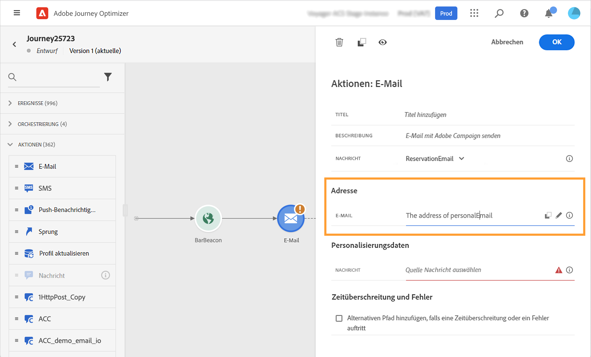
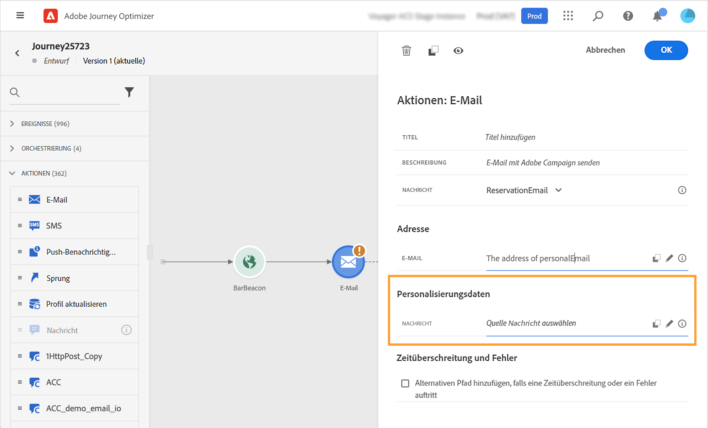
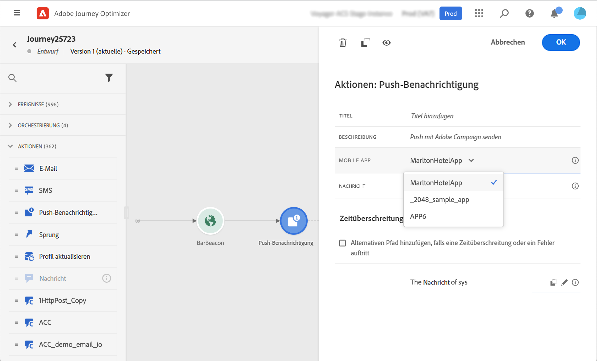

# [!DNL Adobe Campaign] Standard-Aktionen {#using_campaign_action}

>[!BEGINSHADEBOX]

**Auf dieser Seite** Erfahren Sie, wie Sie die integrierten Aktionsaktivitäten für E-Mails, Push-Benachrichtigungen und SMS in Adobe Campaign Standard in Ihren Journey verwenden können, indem Sie sich auf die Transaktionsnachrichten-Vorlagen von Campaign Standard verlassen.

>[!ENDSHADEBOX]

>[!CONTEXTUALHELP]
>id="ajo_journey_action_custom_acs"
>title="Benutzerdefinierte Aktionen"
>abstract="Für [!DNL Adobe Campaign] Standard ist eine Integration verfügbar. Diese ermöglicht Ihnen das Senden von E-Mails, Push-Benachrichtigungen und SMS mit der Transaktionsnachrichtenfunktion von [!DNL Adobe Campaign]."

Wenn Sie [!DNL Adobe Campaign] Standard haben, sind die folgenden integrierten Aktionsaktivitäten verfügbar: **[!UICONTROL E-Mail]**, **[!UICONTROL Push]** und **[!UICONTROL SMS]**.

>[!NOTE]
>
>Dazu müssen Sie die integrierte Aktion konfigurieren. Mehr dazu erfahren Sie auf [dieser Seite](../action/acs-action.md).

Wählen Sie für jeden dieser Kanäle eine [!DNL Adobe Campaign] Transaktionsnachrichten-Standardvorlage **Vorlage**. Für die integrierten E-Mail-, SMS- und Push-Kanäle werden Transaktionsnachrichten verwendet, um den Nachrichtenversand auszuführen. Wenn Sie also eine bestimmte Nachrichtenvorlage in Ihren Journey verwenden möchten, müssen Sie sie in [!DNL Adobe Campaign] Standard veröffentlichen. Auf [dieser Seite](https://experienceleague.adobe.com/docs/campaign-standard/using/communication-channels/transactional-messaging/getting-started-with-transactional-msg.html?lang=de) erfahren Sie, wie Sie diese Funktion verwenden.

>[!NOTE]
>
>Die Transaktionsnachricht in Campaign Standard und das zugehörige Ereignis müssen veröffentlicht werden, damit sie in Journey Optimizer verwendet werden können. Wenn das Ereignis veröffentlicht wird, die Nachricht jedoch nicht, wird sie nicht in der Benutzeroberfläche von Journey Optimizer angezeigt. Wenn die Nachricht veröffentlicht wird, das zugehörige Ereignis jedoch nicht, wird sie in der Benutzeroberfläche von Journey Optimizer angezeigt, sie kann jedoch nicht verwendet werden.

![[!DNL Adobe Campaign] Standardaktionskonfiguration in Journey](assets/journey59.png)

Sie können eine ereignisbasierte (d. h. Echtzeit-) oder eine profilbasierte Transaktionsnachrichtenvorlage verwenden.

>[!NOTE]
>
>Wenn wir Echtzeit-Transaktionsnachrichten (rtEvent) senden oder Nachrichten über eine benutzerdefinierte Aktion mit einem Drittanbietersystem weiterleiten, ist eine spezifische Einrichtung für die Verwaltung von Ermüdung, Blockierungsliste oder Abmeldung erforderlich. Wenn beispielsweise ein Attribut „unsubscribe“ in [!DNL Adobe Experience Platform] oder in einem Drittanbietersystem gespeichert ist, muss vor dem Nachrichtenversand eine Bedingung hinzugefügt werden, um diese Bedingung zu überprüfen.

Wenn Sie eine Vorlage auswählen, werden alle Felder, die in der Payload der Nachricht erwartet werden, im Konfigurationsbereich der Aktivität unter **[!UICONTROL Adresse]** und **[!UICONTROL Personalisierungsdaten]** angezeigt. Sie müssen jedes dieser Felder im Ereignis oder der Datenquelle dem zu verwendenden Feld zuordnen. Sie können auch den erweiterten Ausdruckseditor verwenden, um einen Wert manuell zu übergeben, Datenmanipulationen an abgerufenen Informationen vorzunehmen (z. B. eine Zeichenfolge in Großbuchstaben zu konvertieren) oder Funktionen wie „if, then, else“ zu verwenden. Weitere Informationen finden Sie auf [dieser Seite](expression/expressionadvanced.md).



## E-Mail und SMS {#section_asc_51g_nhb}

Für **[!UICONTROL E-Mail]** und **[!UICONTROL SMS]** sind die Parameter identisch.

>[!NOTE]
>
>Bei Verwendung der Transaktionsvorlage eines Profils für E-Mails wird der Abmeldemechanismus automatisch von [!DNL Adobe Campaign] Standard gehandhabt.
>Fügen Sie einen **[!UICONTROL Abmelde-Link]** Inhaltsbaustein in die [Transaktions-E-Mail-Vorlage](https://experienceleague.adobe.com/docs/campaign-standard/using/communication-channels/transactional-messaging/getting-started-with-transactional-msg.html?lang=de) ein.
>Wenn Sie eine ereignisbasierte Vorlage (rtEvent) verwenden, fügen Sie einen Link in die Nachricht ein, der die E-Mail-Adresse des Empfängers als URL-Parameter weitergibt und zu einer Landingpage zur Abmeldung weiterleitet.
>Erstellen Sie die Landingpage und stellen Sie sicher, dass die Abmeldeentscheidung der Empfängerin bzw. des Empfängers an Adobe übermittelt wird.

Zuerst müssen Sie eine Transaktionsnachrichtenvorlage auswählen.

Es stehen zwei Kategorien zur Verfügung: **[!UICONTROL Adresse]** und **[!UICONTROL Personalisierungsdaten]**.

Über die Benutzeroberfläche können Sie einfach festlegen, wo die **[!UICONTROL Adresse]** oder die **[!UICONTROL Personalisierungsdaten]** abgerufen werden sollen. Sie können Ereignisse und Felder der verfügbaren Datenquellen durchsuchen. Sie können den erweiterten Ausdruckseditor auch für erweiterte Anwendungsfälle verwenden, z. B. für die Verwendung einer Datenquelle, die die Übermittlung von Parametern oder die Durchführung von Manipulationen erfordert. Weitere Informationen finden Sie auf [dieser Seite](expression/expressionadvanced.md).

**[!UICONTROL Adresse]**

>[!NOTE]
>
>Diese Kategorie ist nur sichtbar, wenn Sie eine ereignisbasierte Transaktionsnachricht auswählen. Bei „Profil“-Nachrichten **[!UICONTROL das Feld &quot;]**&quot; automatisch vom System aus [!DNL Adobe Campaign] Standard abgerufen.

Dies sind die Felder, die das System benötigt, um zu wissen, wohin die Nachricht gesendet werden soll. Bei einer E-Mail-Vorlage ist dies die E-Mail-Adresse. Bei einer SMS ist es die Mobiltelefonnummer.



**[!UICONTROL Personalisierungsdaten]**

>[!NOTE]
>
>Sie können keine Sammlungen in Personalisierungsdaten übergeben. Wenn die Transaktions-E-Mail oder -SMS Sammlungen erwartet, funktioniert dies nicht. Beachten Sie außerdem, dass die Personalisierungsdaten ein erwartetes Format haben (Beispiel: Zeichenfolge, Dezimalzahl usw.). Sie müssen darauf achten, dass diese erwarteten Formate eingehalten werden.

Dies sind die Felder, die von der [!DNL Adobe Campaign] Standard-Nachricht erwartet werden. Diese Felder können verwendet werden, um die Nachricht zu personalisieren, eine bedingte Formatierung anzuwenden oder eine bestimmte Nachrichtenvariante auszuwählen.



## Push-Benachrichtigung {#section_im3_hvf_nhb}

Vor der Verwendung der Push-Aktivität muss Ihre App mit Campaign Standard konfiguriert werden, um Push-Benachrichtigungen zu senden. Verwenden Sie diesen [Artikel](https://helpx.adobe.com/de/campaign/kb/integrate-mobile-sdk.html), um die erforderlichen Implementierungsschritte für Mobilgeräte auszuführen.

Wählen Sie zunächst eine App aus der Dropdown-Liste und eine Transaktionsnachricht aus.



Es stehen zwei Kategorien zur Verfügung: **[!UICONTROL Zielgruppe]** und **[!UICONTROL Personalisierungsdaten]**.

**[!UICONTROL Target]**

>[!NOTE]
>
>Diese Kategorie ist nur sichtbar, wenn Sie eine ereignisbasierte Nachricht auswählen. Bei Profilnachrichten werden die **[!UICONTROL Target]**-Felder automatisch vom System mithilfe der von [!DNL Adobe Campaign] Standard durchgeführten Abstimmung abgerufen.

In diesem Abschnitt müssen Sie die **[!UICONTROL Push-Plattform]** definieren. In der Dropdown-Liste können Sie **[!UICONTROL Apple Push Notification Server]** (iOS) oder **[!UICONTROL Firebase Cloud Messaging]** (Android) auswählen. Sie können alternativ ein bestimmtes Feld aus einem Ereignis oder einer Datenquelle auswählen oder einen erweiterten Ausdruck definieren.

Sie müssen auch das **[!UICONTROL Anmeldetoken]** definieren. Der Ausdruck hängt davon ab, wie das Token in der Ereignis-Payload oder in anderen [!DNL Journey Optimizer]-Informationen definiert wird. Es kann sich um ein einfaches Feld oder einen komplexeren Ausdruck handeln, wenn das Token beispielsweise in einer Sammlung definiert ist:

```
@event{Event_push._experience.campaign.message.profileSnapshot.pushNotificationTokens.first().token}
```

**[!UICONTROL Personalisierungsdaten]**

>[!NOTE]
>
>Sie können keine Sammlungen in Personalisierungsdaten übergeben. Wenn die Transaktions-Push-Benachrichtigung Sammlungen erwartet, funktioniert dies nicht. Beachten Sie außerdem, dass die Personalisierungsdaten ein erwartetes Format haben (Beispiel: Zeichenfolge, Dezimalzahl usw.). Sie müssen darauf achten, dass diese erwarteten Formate eingehalten werden.

Dies sind die Felder, die von der Transaktionsvorlage erwartet werden, die in Ihrer [!DNL Adobe Campaign]-Standardnachricht verwendet wird. Sie können diese Felder verwenden, um Ihre Nachricht zu personalisieren, eine bedingte Formatierung anzuwenden oder eine bestimmte Nachrichtenvariante auszuwählen.

+++ KI-Wissensreferenz

Dieser Abschnitt enthält strukturiertes Wissen zur Unterstützung von Interpretation, Abrufen und Antworten auf Fragen zu diesem Thema.

Zum vollständigen Verständnis sollten diese Informationen mit der Dokumentation auf dieser Seite kombiniert werden. Keine der beiden Quellen ist für Einzelpersonen gedacht. Die Seite beschreibt die Funktion, während dieser Abschnitt zusätzlichen Kontext bietet, der dabei hilft, Begriffe, Absichten, Anwendbarkeit und Begrenzungen zu unterscheiden.

* **TL;DR:** Auf dieser Seite wird erläutert, wie Sie die integrierten Aktionsaktivitäten für E-Mail, SMS und Push-Benachrichtigungen von Adobe Campaign Standard in Journey Optimizer Journey über die Transaktionsnachrichten-Vorlagen von Campaign verwenden.

**intents:**

* Konfigurieren von E-Mail-, SMS- oder Push-Aktionsaktivitäten in einer Journey mithilfe der Adobe Campaign Standard-Integration
* Transaktionsnachrichten-Vorlage aus Campaign Standard auswählen und Journey-Feldern zuordnen
* Ordnen Sie die Daten-Felder Adresse und Personalization aus Journey-Ereignissen oder Datenquellen der Nachrichten-Payload zu
* Handhabung von Abmeldungen für ereignis- und profilbasierte Transaktions-E-Mail-Vorlagen
* Konfigurieren der Zielplattform für Push-Benachrichtigungen und des Registrierungs-Tokens für Push-Aktionen in Campaign Standard

**Glossar:**

* **Transaktionsnachrichten**: Adobe Campaign Standard-Funktion zum Senden von ausgelösten Echtzeit-Nachrichten (E-Mail, SMS, Push) basierend auf Ereignissen *produktspezifisch)*
* **rtEvent**: Transaktionsnachrichtenvorlage für Echtzeit-Ereignisse in Adobe Campaign Standard, die für ereignisbasiertes Messaging verwendet wird *produktspezifisch)*
* **Profiltransaktionsvorlage**: Eine Campaign Standard-Transaktionsnachrichtenvorlage, die Profildaten für die Empfängerauflösung und die Abmeldebehandlung verwendet *(produktspezifisch)*
* **Registrierungs-Token**: Kennung auf Geräteebene, die erforderlich ist, um eine Push-Benachrichtigung auf eine bestimmte Mobile-App-*auszurichten (produktspezifisch)*

**Leitplanken:**

* Die integrierte Aktion muss vor der Verwendung konfiguriert werden. Weitere Informationen finden Sie auf der Seite Aktionskonfiguration .
* Damit die Vorlage in Campaign Standard verwendet werden kann, müssen sowohl die Journey Optimizer-Transaktionsnachricht als auch das zugehörige Ereignis veröffentlicht werden.
* Sammlungen können nicht in Personalization-Datenfeldern übergeben werden.
* Bei ereignisbasierten (rtEvent) Vorlagen muss die Abmeldeverwaltung vor dem Versand manuell mit einer Bedingung durchgeführt werden.
* Bei profilbasierten Push-Nachrichten werden die Zielfelder automatisch abgerufen. Die Zielkategorie ist nur für Ereignisnachrichten sichtbar.
* Die Mobile App muss mit Campaign Standard konfiguriert werden, bevor die Push-Aktivität verwendet werden kann.

**Terminologie:**

* Kanonischer Name: Adobe Campaign Standard — Akronym: ACS — Varianten: Campaign Standard
* Synonyme: „Ereignis-Transaktionsnachricht“ = „rtEvent“; „Echtzeit-Transaktionsnachricht“ = „rtEvent“
* Verwechseln Sie nicht: „Profil-Transaktionsvorlage“ (Abmeldung wird automatisch verarbeitet) ≠ „Ereignis-Transaktionsvorlage“ (Abmeldung muss manuell erfolgen)

**FAQ:**

* **F: Welche Kanäle sind über die Adobe Campaign Standard-Integration verfügbar?** - Die Kanäle E-Mail, SMS und Push-Benachrichtigungen sind als integrierte Aktionsaktivitäten verfügbar.
* **F: Muss die Transaktionsnachricht in Campaign Standard veröffentlicht werden, bevor sie in Journey Optimizer verwendet werden kann?** — Ja, sowohl die Transaktionsnachricht als auch das zugehörige Ereignis müssen veröffentlicht werden. Eine unveröffentlichte Nachricht kann nicht verwendet werden, selbst wenn sie in der Benutzeroberfläche sichtbar ist.
* **F: Wie wird die Abmeldung für profilbasierte E-Mail-Vorlagen gehandhabt?** — Die Abmeldung wird automatisch von Adobe Campaign Standard vorgenommen, wenn eine Profiltransaktionsvorlage verwendet wird. Fügen Sie der Vorlage den Inhaltsbaustein Abmelde-Link hinzu.
* **F: Kann ich eine Sammlung als Personalisierungsdaten übergeben?** — Nein, Sammlungen können nicht in Personalization Data übergeben werden. Die Transaktionsnachricht darf keine Sammlungen erwarten.
* **F: Wo kann ich die Empfängeradresse für eine ereignisbasierte E-Mail zuordnen?** — Die Kategorie Adresse im Konfigurationsbereich für die Aktivität ist nur für Ereignis-Transaktionsnachrichten sichtbar. Bei Profilnachrichten wird die Adresse automatisch abgerufen.

+++
