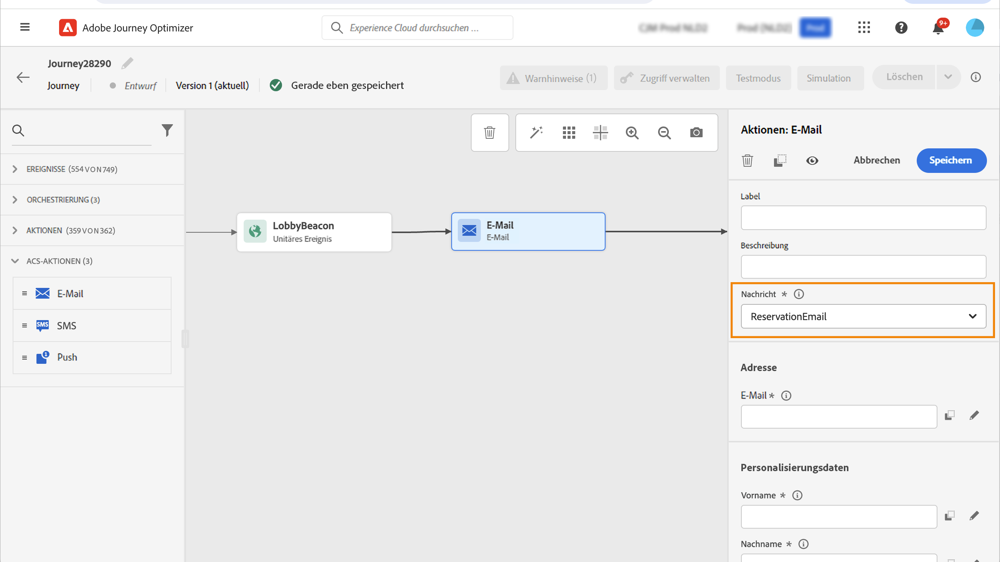
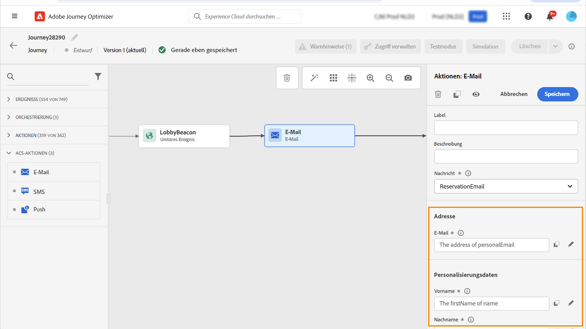
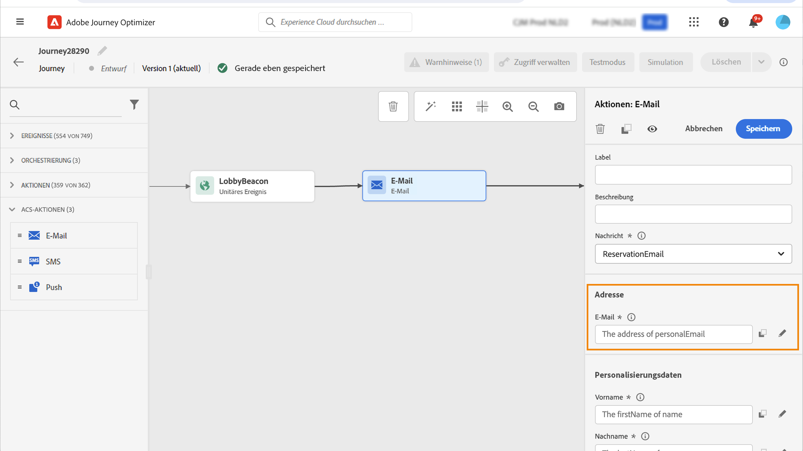
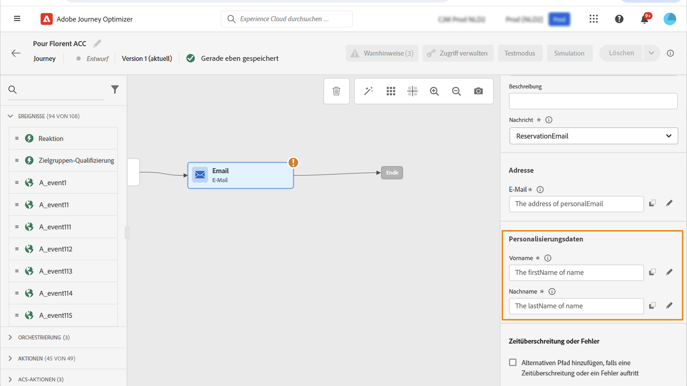

# Aktionen in Adobe Campaign Standard {#using_campaign_action}

Wenn Sie über Adobe Campaign Standard verfügen, sind die folgenden integrierten Aktionsaktivitäten verfügbar: **[!UICONTROL Email]**, **[!UICONTROL Push]** und **[!UICONTROL SMS]**.

>[!NOTE]
>
>Dazu müssen Sie die integrierte Aktion konfigurieren. Siehe [diese Seite](../action/acs-action.md).

Für jeden dieser Kanäle wählen Sie eine Transaktionsnachricht in Adobe Campaign Standard aus **template**. Bei den integrierten E-Mail-, SMS- und Push-Kanälen verwenden wir Transaktionsnachrichten, um den Nachrichtenversand auszuführen. Wenn Sie eine bestimmte Nachrichtenvorlage in Ihren Journeys verwenden möchten, müssen Sie sie demnach in Adobe Campaign Standard veröffentlichen. Siehe [diese Seite](https://experienceleague.adobe.com/docs/campaign-standard/using/communication-channels/transactional-messaging/getting-started-with-transactional-msg.html) , um zu erfahren, wie Sie diese Funktion verwenden.

>[!NOTE]
>
>Die Transaktionsnachricht von Campaign Standard und das zugehörige Ereignis müssen veröffentlicht werden, damit sie in Journey Optimizer verwendet werden können. Wenn das Ereignis veröffentlicht wurde, die Nachricht jedoch nicht, wird sie nicht in der Benutzeroberfläche von Journey Optimizer angezeigt. Wenn die Nachricht veröffentlicht wurde, das zugehörige Ereignis jedoch nicht, wird sie in der Benutzeroberfläche von Journey Optimizer angezeigt, sie kann jedoch nicht verwendet werden.



Sie können eine Ereignisvorlage (auch als Echtzeit-Ereignis bezeichnet) oder eine Vorlage für Profil-Transaktionsnachrichten verwenden.

>[!NOTE]
>
>Wenn wir Echtzeit-Transaktionsnachrichten (rtEvent) senden oder Nachrichten mithilfe einer benutzerdefinierten Aktion mit einem Drittanbietersystem weiterleiten, ist eine spezifische Einrichtung für die Verwaltung von Ermüdung, Blockierungsliste oder Abmeldung erforderlich. Wenn beispielsweise ein Attribut &quot;unsubscribe&quot;in Adobe Experience Platform oder in einem Drittanbietersystem gespeichert ist, muss vor dem Nachrichtenversand eine Bedingung hinzugefügt werden, um diese Bedingung zu überprüfen.

Wenn Sie eine Vorlage auswählen, werden alle in der Payload der Nachricht erwarteten Felder im Konfigurationsbereich für die Aktivität unter **[!UICONTROL Address]** und **[!UICONTROL Personalization Data]**. Sie müssen jedes dieser Felder dem Feld zuordnen, das Sie verwenden möchten, entweder aus dem Ereignis oder aus der Datenquelle. Sie können auch den erweiterten Ausdruckseditor verwenden, um einen Wert manuell zu übergeben, Datenmanipulationen an abgerufenen Informationen durchzuführen (z. B. eine Zeichenfolge in Großbuchstaben zu konvertieren) oder Funktionen wie &quot;if, then, else&quot;zu verwenden. Siehe [diese Seite](expression/expressionadvanced.md).



## E-Mail und SMS {#section_asc_51g_nhb}

Für **[!UICONTROL Email]** und **[!UICONTROL SMS]**, sind die Parameter identisch.

>[!NOTE]
>
>Wenn Sie für E-Mails eine Profil-Transaktionsvorlage verwenden, wird der Abmeldemechanismus von Campaign Standard integriert verarbeitet. Fügen Sie einfach eine **[!UICONTROL Unsubscription link]** Inhaltsbaustein in der Vorlage ([Weitere Informationen](https://experienceleague.adobe.com/docs/campaign-standard/using/communication-channels/transactional-messaging/getting-started-with-transactional-msg.html)). Wenn Sie eine ereignisbasierte Vorlage (rtEvent) verwenden, müssen Sie der Nachricht einen Link hinzufügen, über den die E-Mail der Person im URL-Parameter übergeben wird und auf eine Landingpage zum Abmelden verwiesen wird. Sie müssen diese Landingpage erstellen und sicherstellen, dass die Entscheidung der Person, sich abzumelden, an Adobe übermittelt wird.

Wählen Sie zunächst eine Transaktionsnachrichtenvorlage aus.

Zwei Kategorien sind verfügbar: **[!UICONTROL Address]** und **[!UICONTROL Personalization Data]**.

Sie können einfach definieren, wo Sie die **[!UICONTROL Address]** oder **[!UICONTROL Personalization Data]** über die -Benutzeroberfläche. Sie können Ereignisse und die Felder der verfügbaren Datenquelle durchsuchen. Sie können den erweiterten Ausdruckseditor auch für erweiterte Anwendungsfälle verwenden, z. B. für die Verwendung einer Datenquelle, für die Parameter übergeben oder Manipulationen durchgeführt werden müssen. Siehe [diese Seite](expression/expressionadvanced.md).

**[!UICONTROL Address]**

>[!NOTE]
>
>Diese Kategorie ist nur sichtbar, wenn Sie eine &quot;Ereignis&quot;-Transaktionsnachricht auswählen. Bei &quot;Profil&quot;-Nachrichten wird die **[!UICONTROL Address]** wird vom System automatisch aus Adobe Campaign Standard abgerufen.

Dies sind die Felder, die das System benötigt, um zu wissen, wo die Nachricht gesendet werden soll. Bei einer E-Mail-Vorlage ist dies die E-Mail-Adresse. Bei einer SMS ist dies die Mobiltelefonnummer.



**[!UICONTROL Personalization Data]**

>[!NOTE]
>
>Sie können keine Kollektion in Personalisierungsdaten übergeben. Wenn die Transaktions-E-Mail oder SMS Sammlungen erwartet, funktioniert dies nicht. Beachten Sie außerdem, dass die Personalisierungsdaten ein erwartetes Format aufweisen (Beispiel: Zeichenfolge, Dezimalzahl usw.). Sie müssen darauf achten, dass diese erwarteten Formate eingehalten werden.

Dies sind die Felder, die von der Adobe Campaign Standard-Nachricht erwartet werden. Diese Felder können verwendet werden, um die Nachricht zu personalisieren, eine bedingte Formatierung anzuwenden oder eine bestimmte Nachrichtenvariante auszuwählen.



## Push {#section_im3_hvf_nhb}

Vor der Verwendung der Push-Aktivität muss Ihre Mobile App zusammen mit Campaign Standard konfiguriert werden, um Push-Benachrichtigungen zu senden. Verwenden Sie diese [Artikel](https://helpx.adobe.com/campaign/kb/integrate-mobile-sdk.html) , um die erforderlichen Implementierungsschritte für Mobilgeräte durchzuführen.

Wählen Sie zunächst eine Mobile App aus der Dropdown-Liste und eine Transaktionsnachricht aus.


Zwei Kategorien sind verfügbar: **[!UICONTROL Target]** und **[!UICONTROL Personalization Data]**.

**[!UICONTROL Target]**

>[!NOTE]
>
>Diese Kategorie ist nur sichtbar, wenn Sie eine Ereignismeldung auswählen. Bei Profilnachrichten muss die **[!UICONTROL Target]** -Felder werden vom System automatisch mithilfe der von Adobe Campaign Standard durchgeführten Abstimmung abgerufen.

In diesem Abschnitt müssen Sie die **[!UICONTROL Push platform]**. In der Dropdown-Liste können Sie **[!UICONTROL Apple Push Notification Server]** (iOS) oder **[!UICONTROL Firebase Cloud Messaging]** (Android). Alternativ können Sie ein bestimmtes Feld aus einem Ereignis oder einer Datenquelle auswählen oder einen erweiterten Ausdruck definieren.

Außerdem müssen Sie die **[!UICONTROL Registration Token]**. Der Ausdruck hängt davon ab, wie das Token in der Ereignis-Payload oder in anderen [!DNL Journey Optimizer] Informationen. Dies kann ein einfaches Feld oder ein komplexerer Ausdruck sein, wenn das Token beispielsweise in einer Sammlung definiert ist:

```
@{Event_push._experience.campaign.message.profileSnapshot.pushNotificationTokens.first().token}
```

**[!UICONTROL Personalization Data]**

>[!NOTE]
>
>Sie können keine Kollektion in Personalisierungsdaten übergeben. Wenn die Transaktions-Push-Benachrichtigung Sammlungen erwartet, funktioniert sie nicht. Beachten Sie außerdem, dass die Personalisierungsdaten ein erwartetes Format aufweisen (Beispiel: Zeichenfolge, Dezimalzahl usw.). Sie müssen darauf achten, dass diese erwarteten Formate eingehalten werden.

Dies sind die Felder, die von der in Ihrer Adobe Campaign Standard-Nachricht verwendeten Transaktionsvorlage erwartet werden. Diese Felder können verwendet werden, um Ihre Nachricht zu personalisieren, eine bedingte Formatierung anzuwenden oder eine bestimmte Nachrichtenvariante auszuwählen.
