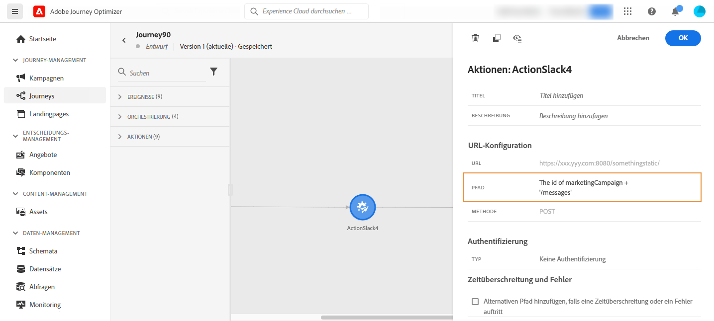
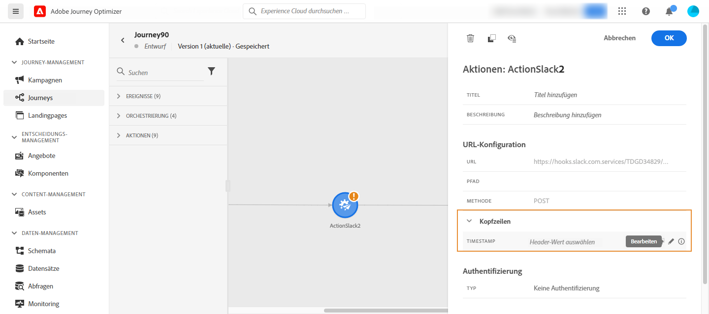

# Verwenden benutzerdefinierter Aktionen {#use-custom-actions}

>[!BEGINSHADEBOX]

**Auf dieser Seite** Erfahren Sie, wie Sie mithilfe benutzerdefinierter Aktionen eine Journey über einen REST-API-Aufruf mit einer JSON-Payload mit einem Drittanbietersystem verbinden und dabei Data Governance- und Einverständnisrichtlinien anwenden.

>[!ENDSHADEBOX]

>[!CONTEXTUALHELP]
>id="ajo_journey_action_custom"
>title="Benutzerdefinierte Aktionen"
>abstract="Mit benutzerdefinierten Aktionen können Sie die Verbindung eines Drittanbietersystems konfigurieren, um Nachrichten oder API-Aufrufe zu senden. Eine Aktion kann mit jedem Dienst eines beliebigen Anbieters konfiguriert werden, der über eine REST-API mit einer JSON-formatierten Payload aufgerufen werden kann."

Verwenden Sie benutzerdefinierte Aktionen zum Konfigurieren der Verbindung zu einem Drittanbietersystem, um Nachrichten oder API-Aufrufe zu senden. Eine Aktion kann mit jedem Dienst eines beliebigen Anbieters konfiguriert werden, der über eine REST-API mit einer JSON-formatierten Payload aufgerufen werden kann.

Weitere Informationen zu benutzerdefinierten Aktionen finden Sie in [diesem Abschnitt](../action/action.md).

Weitere Informationen zum Erstellen und Konfigurieren einer benutzerdefinierten Aktion finden Sie auf [dieser Seite](../action/about-custom-action-configuration.md).

Auf [dieser Seite](../action/action-response.md) erfahren Sie, wie Sie API-Aufrufantworten aus benutzerdefinierten Aktionen zur Personalisierung verwenden können.

## Einverständnis und Data Governance {#privacy}

In Journey Optimizer können Sie Data Governance- und Einverständnisrichtlinien auf Ihre benutzerdefinierten Aktionen anwenden. Damit verhindern Sie, dass bestimmte Felder in Drittanbietersysteme exportiert werden, und können Kunden ausschließen, die dem Empfang von E-Mails, Push- oder SMS-Nachrichten nicht zugestimmt haben. Weitere Informationen finden Sie auf den folgenden Seiten:

* [Data Governance](../action/action-privacy.md).
* [Einverständnis](../action/consent.md).

## URL-Konfiguration

Der Konfigurationsbereich der Aktivität **Benutzerdefinierte Aktion** zeigt die URL-Konfigurationsparameter und die Authentifizierungsparameter an, die für die benutzerdefinierte Aktion konfiguriert sind. Sie können den statischen Teil der URL nicht in der Journey, sondern müssen ihn in der globalen Konfiguration der benutzerdefinierten Aktion einrichten. [Weitere Informationen](../action/about-custom-action-configuration.md).

### Dynamischer Pfad

Wenn die URL einen dynamischen Pfad enthält, geben Sie den Pfad im Feld **[!UICONTROL Pfad]** an.

Verwenden Sie zum Verketten von Feldern und Nur-Text-Zeichenfolgen die Zeichenfolgen-Funktionen oder das Pluszeichen (+) im erweiterten Ausdruckseditor. Schließen Sie Nur-Text-Zeichenfolgen in einfachen Anführungszeichen (&#39;) oder in doppelten Anführungszeichen (&quot;) ein. [Weitere Informationen](expression/expressionadvanced.md).

Die folgende Tabelle zeigt ein Beispiel für die Konfiguration:

| Feld | Wert |
| --- | --- |
| URL | `https://xxx.yyy.com:8080/somethingstatic/` |
| Pfad | `The _id + '/messages'` |

Die verkettete URL sieht folgendermaßen aus:

`https://xxx.yyy.com:8080/somethingstatic/`\&lt;ID>`/messages`

### Kopfzeilen und Abfrageparameter {#headers}

Im Abschnitt **[!UICONTROL URL-Konfiguration]** werden die dynamischen, jedoch nicht die konstanten Header- und Abfrageparameter-Felder angezeigt. Dynamische Header- und Abfrageparameter-Felder werden im Aktionskonfigurationsbildschirm als Variable definiert. [Weitere Informationen](../action/about-custom-action-configuration.md#url-configuration)

Um den Wert der dynamischen Header- und Abfrageparameter-Felder anzugeben, klicken Sie in das Feld oder auf das Stiftsymbol und wählen Sie das gewünschte Feld aus.

## Aktionsparameter

Im Abschnitt **[!UICONTROL Aktionsparameter]** sehen Sie die Nachrichtenparameter, die als _Variable_ definiert sind. Für diese Parameter können Sie festlegen, wo diese Informationen abgerufen werden sollen (Beispiel: Ereignisse, Datenquellen), Werte manuell übergeben oder den erweiterten Ausdruckseditor für erweiterte Anwendungsfälle verwenden. Erweiterte Anwendungsfälle können Datenmanipulationen und andere Funktionen sein. Mehr dazu erfahren Sie auf [dieser Seite](expression/expressionadvanced.md).

+++ KI-Wissensreferenz

Dieser Abschnitt enthält strukturiertes Wissen zur Unterstützung von Interpretation, Abrufen und Antworten auf Fragen zu diesem Thema.

Zum vollständigen Verständnis sollten diese Informationen mit der Dokumentation auf dieser Seite kombiniert werden. Keine der beiden Quellen ist für Einzelpersonen gedacht. Die Seite beschreibt die Funktion, während dieser Abschnitt zusätzlichen Kontext bietet, der dabei hilft, Begriffe, Absichten, Anwendbarkeit und Begrenzungen zu unterscheiden.

* **TL;DR:** Auf dieser Seite wird erläutert, wie Sie eine benutzerdefinierte Aktionsaktivität in einer Journey hinzufügen und konfigurieren, um eine REST-API eines Drittanbieters mit einer JSON-Payload aufzurufen. Dies umfasst die URL-Konfiguration, die Zuordnung von Header-/Abfrageparametern, die Zuordnung von Aktionsparametern sowie die Anwendung von Data Governance- und Einverständnisrichtlinien.

**intents:**

* Hinzufügen einer benutzerdefinierten Aktionsaktivität zu einer Journey, um Daten über die REST-API an ein Drittanbietersystem zu senden
* Konfigurieren eines dynamischen URL-Pfads durch Verketten von Feldern und statischem Text im Ausdruckseditor
* Dynamische Header- und Abfrageparameterwerte aus Journey-Ereignissen oder Datenquellen zuordnen
* Zuordnen von Aktionsparametern (als Variable definiert) zu Ereignisfeldern, Datenquellenfeldern oder statischen Werten
* Wenden Sie Data Governance- und Einverständnisrichtlinien an, um zu steuern, welche Daten über benutzerdefinierte Aktionen exportiert werden

**Glossar:**

* **Benutzerdefinierte Aktion**: Eine Journey-Aktionsaktivität, die einen externen REST-API-Endpunkt mit einer JSON-formatierten Payload aufruft, um Drittanbietersysteme zu integrieren *(produktspezifisch)*
* **Dynamischer Pfad**: Der Variablenteil der benutzerdefinierten Aktions-URL, der pro Ausführung mithilfe von Feldern aus dem Journey-Kontext definiert wird *(produktspezifisch)*
* **Aktionsparameter**: Nachrichten-Payload-Felder, die in der benutzerdefinierten Aktionskonfiguration als „Variable“ definiert sind und Journey-Daten auf Journey-Ebene zugeordnet sind *(produktspezifisch)*

**Leitplanken:**

* Der statische Teil der URL kann auf der Journey nicht geändert werden. Er muss in der globalen benutzerdefinierten Aktionskonfiguration festgelegt werden.
* Dynamische Header- und Abfrageparameter-Felder werden im Aktionskonfigurationsbildschirm als Variable definiert, nicht auf der Journey.
* Data Governance- und Einverständnisrichtlinien können angewendet werden, um zu verhindern, dass bestimmte Felder exportiert werden, oder um nicht einverstandene Kunden auszuschließen.

**Terminologie:**

* Kanonischer Name: Benutzerdefinierte Aktion — Akronym: none — Varianten: benutzerdefinierte Aktionen, Drittanbieteraktion
* Synonyme: „action parameters“ = „Nachrichtenparameter als Variable definiert“
* Verwechseln Sie nicht: „Static URL Part“ (festgelegt in der globalen Aktionskonfiguration, nicht bearbeitbar in Journey) ≠ „dynamic path“ (festgelegt in der Journey pro Ausführung)

**FAQ:**

* **F: Kann ich die Basis-URL einer benutzerdefinierten Aktion innerhalb der Journey ändern?** - Nein, nur der dynamische Pfadteil kann auf der Journey festgelegt werden. Der statische Teil der URL wird in der globalen Konfiguration der benutzerdefinierten Aktion konfiguriert.
* **F: Wie erstelle ich einen dynamischen URL-Pfad, der eine Profil-ID enthält?** - Verwenden Sie das Feld Pfad mit dem erweiterten Ausdruckseditor, um das ID-Feld mit statischen Zeichenfolgen zu verketten, z. B.: `_id + '/messages'`.
* **F: Wie wende ich Einverständnisregeln auf eine benutzerdefinierte Aktion an?** — Konfigurieren Sie Einverständnisrichtlinien für die benutzerdefinierte Aktion, um Kunden auszuschließen, die dem Empfang der entsprechenden Kommunikation nicht zugestimmt haben. Weitere Informationen finden Sie auf der Seite „Einverständnis“.
* **F: Wo ordne ich die Werte für dynamische Kopfzeilen zu?** - Klicken Sie im Abschnitt URL-Konfiguration des Aktivitätsbereichs in das dynamische Header-Feld oder verwenden Sie das Stiftsymbol, um das gewünschte Feld aus Ereignissen oder Datenquellen auszuwählen.
* **F: Welche Arten von Werten kann ich Aktionsparametern zuweisen?** - Sie können Ereignisfeldern, Datenquellenfeldern Parameter zuordnen, Werte manuell übergeben oder den erweiterten Ausdruckseditor zur Datenbearbeitung verwenden.

+++
