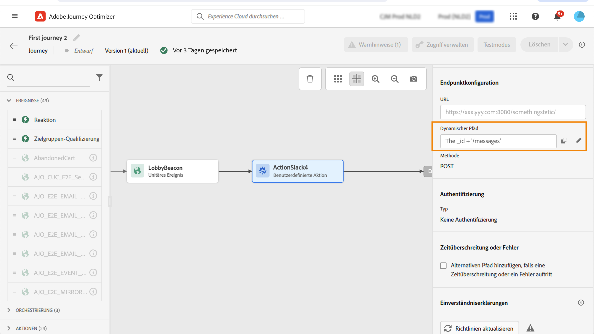

# Verwenden benutzerdefinierter Aktionen {#use-custom-actions}

>[!CONTEXTUALHELP]
>id="ajo_journey_action_custom"
>title="Benutzerdefinierte Aktionen"
>abstract="Mit benutzerdefinierten Aktionen können Sie die Verbindung eines Drittanbietersystems konfigurieren, um Nachrichten oder API-Aufrufe zu senden. Eine Aktion kann mit jedem Dienst eines beliebigen Anbieters konfiguriert werden, der über eine REST-API mit einer JSON-formatierten Payload aufgerufen werden kann."

Verwenden Sie benutzerdefinierte Aktionen zum Konfigurieren der Verbindung zu einem Drittanbietersystem, um Nachrichten oder API-Aufrufe zu senden. Eine Aktion kann mit jedem Dienst eines beliebigen Anbieters konfiguriert werden, der über eine REST-API mit einer JSON-formatierten Payload aufgerufen werden kann.

Weitere Informationen zu benutzerdefinierten Aktionen finden Sie in [diesem Abschnitt](../action/action.md).

Weitere Informationen zum Erstellen und Konfigurieren einer benutzerdefinierten Aktion finden Sie auf [dieser Seite](../action/about-custom-action-configuration.md).

Auf [dieser Seite](../action/action-response.md) erfahren Sie, wie Sie API-Aufrufantworten aus benutzerdefinierten Aktionen zur Personalisierung verwenden können.

## Einverständnis und Data Governance {#privacy}

In Journey Optimizer können Sie Data Governance- und Einverständnisrichtlinien auf Ihre benutzerdefinierten Aktionen anwenden. Damit verhindern Sie, dass bestimmte Felder in Drittanbietersysteme exportiert werden, und können Kunden ausschließen, die dem Empfang von E-Mails, Push- oder SMS-Nachrichten nicht zugestimmt haben. Weitere Informationen finden Sie auf den folgenden Seiten:

* [Data Governance](../action/action-privacy.md).
* [Einverständnis](../action/consent.md).

## URL-Konfiguration

Der Konfigurationsbereich der Aktivität **Benutzerdefinierte Aktion** zeigt die URL-Konfigurationsparameter und die Authentifizierungsparameter an, die für die benutzerdefinierte Aktion konfiguriert sind. Sie können den statischen Teil der URL nicht in der Journey, sondern müssen ihn in der globalen Konfiguration der benutzerdefinierten Aktion einrichten. [Weitere Informationen](../action/about-custom-action-configuration.md).

### Dynamischer Pfad

Wenn die URL einen dynamischen Pfad enthält, geben Sie den Pfad im Feld **[!UICONTROL Pfad]** an.

Verwenden Sie zum Verketten von Feldern und Nur-Text-Zeichenfolgen die Zeichenfolgen-Funktionen oder das Pluszeichen (+) im erweiterten Ausdruckseditor. Schließen Sie Nur-Text-Zeichenfolgen in einfachen Anführungszeichen (&#39;) oder in doppelten Anführungszeichen (&quot;) ein. [Weitere Informationen](expression/expressionadvanced.md).

Die folgende Tabelle zeigt ein Beispiel für die Konfiguration:

| Feld | Wert |
| --- | --- |
| URL | `https://xxx.yyy.com:8080/somethingstatic/` |
| Pfad | `The _id + '/messages'` |

Die verkettete URL sieht folgendermaßen aus:

`https://xxx.yyy.com:8080/somethingstatic/`\&lt;ID>`/messages`

### Kopfzeilen und Abfrageparameter {#headers}

Im Abschnitt **[!UICONTROL URL-Konfiguration]** werden die dynamischen, jedoch nicht die konstanten Header- und Abfrageparameter-Felder angezeigt. Dynamische Header- und Abfrageparameter-Felder werden im Aktionskonfigurationsbildschirm als Variable definiert. [Weitere Informationen](../action/about-custom-action-configuration.md#url-configuration)

Um den Wert der dynamischen Header- und Abfrageparameter-Felder anzugeben, klicken Sie in das Feld oder auf das Stiftsymbol und wählen Sie das gewünschte Feld aus.

## Aktionsparameter

Im Abschnitt **[!UICONTROL Aktionsparameter]** sehen Sie die Nachrichtenparameter, die als _Variable_ definiert sind. Für diese Parameter können Sie festlegen, wo diese Informationen abgerufen werden sollen (Beispiel: Ereignisse, Datenquellen), Werte manuell übergeben oder den erweiterten Ausdruckseditor für erweiterte Anwendungsfälle verwenden. Erweiterte Anwendungsfälle können Datenmanipulationen und andere Funktionen sein. Mehr dazu erfahren Sie auf [dieser Seite](expression/expressionadvanced.md).

