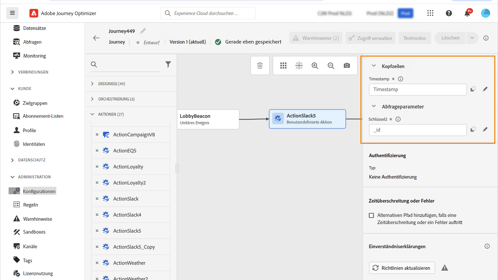

# Verwenden benutzerdefinierter Aktionen {#use-custom-actions}

Über benutzerdefinierte Aktionen können Sie die Verbindung eines Drittanbietersystems zum Senden von Nachrichten oder API-Aufrufen konfigurieren. Eine Aktion kann mit jedem Dienst eines beliebigen Anbieters konfiguriert werden, der über eine REST-API mit einer JSON-formatierten Payload aufgerufen werden kann.

## URL-Konfiguration

Der Konfigurationsbereich der Aktivität **Benutzerdefinierte Aktion** zeigt die URL-Konfigurationsparameter und die Authentifizierungsparameter an, die für die benutzerdefinierte Aktion konfiguriert sind. Sie können den statischen Teil der URL nicht in der Journey, sondern müssen ihn in der globalen Konfiguration der benutzerdefinierten Aktion einrichten. [Weitere Informationen](../action/about-custom-action-configuration.md).

### Dynamischer Pfad

Wenn die URL einen dynamischen Pfad enthält, geben Sie den Pfad im Feld **[!UICONTROL Pfad]** an.

Verwenden Sie zum Verketten von Feldern und Nur-Text-Zeichenfolgen die Zeichenfolgen-Funktionen oder das Pluszeichen (+) im erweiterten Ausdruckseditor. Schließen Sie Nur-Text-Zeichenfolgen in einfachen Anführungszeichen (&#39;) oder in doppelten Anführungszeichen (&quot;) ein. [Weitere Informationen](expression/expressionadvanced.md).

Die folgende Tabelle zeigt ein Beispiel für die Konfiguration:

| Feld | Wert |
| --- | --- |
| URL | `https://xxx.yyy.com:8080/somethingstatic/` |
| Pfad | `The id of marketingCampaign + '/messages'` |

Die verkettete URL sieht folgendermaßen aus:

`https://xxx.yyy.com:8080/somethingstatic/`\&lt;campaign ID\>`/messages`

### Header

Im Abschnitt **[!UICONTROL URL-Konfiguration]** werden die dynamischen Header-Felder, jedoch nicht die konstanten Header-Felder angezeigt. Dynamische Header-Felder sind HTTP-Header-Felder, deren Wert als Variable konfiguriert ist. [Weitere Informationen](../action/about-custom-action-configuration.md).

Geben Sie bei Bedarf den Wert der dynamischen Header-Felder an:

1. Wählen Sie in der Journey die benutzerdefinierte Aktion aus.
1. Klicken Sie im Abschnitt **[!UICONTROL URL-Konfiguration]** im Konfigurationsbereich auf das Stiftsymbol neben dem Header-Feld.

   

1. Wählen Sie ein Feld aus und klicken Sie auf **[!UICONTROL OK]**.

## Aktionsparameter

Im Abschnitt **[!UICONTROL Aktionsparameter]** sehen Sie die Nachrichtenparameter, die als _Variable_ definiert sind. Für diese Parameter können Sie festlegen, wo diese Informationen abgerufen werden sollen (Beispiel: Ereignisse, Datenquellen), Werte manuell übergeben oder den erweiterten Ausdruckseditor für erweiterte Anwendungsfälle verwenden. Erweiterte Anwendungsfälle können Datenmanipulationen und andere Funktionen sein. Weitere Informationen finden Sie in der [Dokumentation zu Adobe Journey Orchestration](expression/expressionadvanced.md).

**Verwandte Themen**

[Konfigurieren einer Aktion](../action/about-custom-action-configuration.md)
