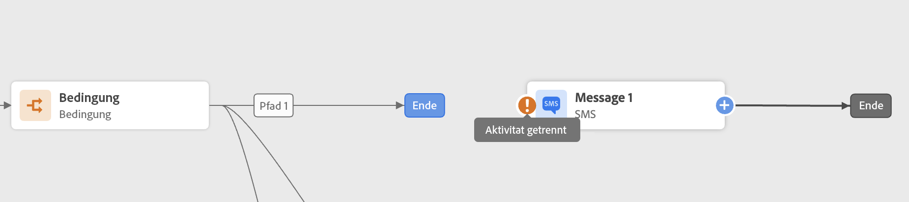

# Gestalten Ihrer Journey {#design-your-journey}

>[!CONTEXTUALHELP]
>id="ajo_journey_canvas"
>title="Gestalten Ihrer Journey"
>abstract="Über die Benutzeroberfläche der Journey können Sie Aktivitäten einfach aus der Palette in die Arbeitsfläche ziehen und dort ablegen. Sie können auch auf eine Aktivität doppelklicken, um sie im nächsten verfügbaren Schritt auf der Arbeitsfläche hinzuzufügen."

Adobe Journey Optimizer enthält eine Arbeitsfläche für die Omnichannel-Orchestrierung, die es Marketing-Experten ermöglicht, die Marketing-Interaktion mit einer Eins-zu-Eins-Kundeninteraktion zu harmonisieren. Über die Benutzeroberfläche können Sie Aktivitäten einfach aus der Palette in die Arbeitsfläche ziehen, um Ihre Journey zu erstellen. Beachten Sie, dass Sie beim nächsten verfügbaren Schritt auch auf eine Aktivität doppelklicken können, um sie der Arbeitsfläche hinzuzufügen.

Ereignisse, Orchestrierungs- und Aktionsaktivitäten haben eine bestimmte Rolle und einen bestimmten Platz im Prozess. Die Aktivitäten werden sequenziert: Wenn eine Aktivität abgeschlossen ist, wird der Fluss fortgesetzt und die nächste Aktivität verarbeitet usw.

## Erste Schritte mit dem Journey-Design {#gs-journey-design}

Die **Palette** befindet sich auf der linken Bildschirmseite. Alle verfügbaren Aktivitäten sind in verschiedene Kategorien unterteilt: [Veranstaltungen](#jo-event), [Orchestrierung](#jo-orch) und [Aktionen](#jo-actions). Sie können die verschiedenen Kategorien erweitern/reduzieren, indem Sie auf ihren Namen klicken. Um eine Aktivität in Ihrer Journey zu verwenden, ziehen Sie sie per Drag-and-Drop aus der Palette auf Ihre Arbeitsfläche.

Beim Starten einer neuen Journey werden Elemente, die nicht als erster Schritt auf der Arbeitsfläche abgelegt werden können, ausgeblendet. Dies betrifft alle Aktionen, die Bedingungsaktivität, die Wartezeit und die Reaktion.

Die **[!UICONTROL Filter items]** über das Symbol oben links können Sie die folgenden Filter anzeigen:

* **Nur verfügbare Elemente anzeigen**: Sie können nicht verfügbare Elemente in der Palette ein- oder ausblenden (z. B. Ereignisse, die einen anderen Namespace als den in Ihrer Journey verwenden). Standardmäßig sind nicht verfügbare Elemente ausgeblendet. Wenn Sie sie anzeigen möchten, erscheinen sie grau.

* **Nur aktuelle Elemente anzeigen**: Mit diesem Filter können Sie neben den nativen fünf Ereignissen und Aktionen nur die letzten fünf verwendeten Ereignisse und Aktionen anzeigen. Dies ist für jeden Benutzer spezifisch. Standardmäßig werden alle Elemente angezeigt.

Sie können auch die **[!UICONTROL Search]** -Feld. Es werden nur Ereignisse und Aktionen gefiltert.

Die **Arbeitsfläche** ist der zentrale Bereich im Journey-Designer. In diesem Bereich können Sie Ihre Aktivitäten ablegen und konfigurieren. Klicken Sie auf eine Aktivität auf der Arbeitsfläche, um sie zu konfigurieren. Dadurch wird der Konfigurationsbereich für die Aktivität auf der rechten Seite geöffnet.

Die **Aktivitätskonfigurationsbereich** angezeigt, wenn Sie auf eine Aktivität in der Palette klicken. Füllen Sie die erforderlichen Felder aus. Klicken Sie auf **[!UICONTROL Delete]** zum Löschen der Aktivität. Klicken **[!UICONTROL Cancel]** , um die Änderungen abzubrechen, oder **[!UICONTROL Ok]** zur Bestätigung. Um Aktivitäten zu löschen, können Sie auch eine Aktivität (oder mehrere) auswählen und die Rücktaste drücken. Durch Drücken der Esc-Taste wird der Konfigurationsbereich für die Aktivität geschlossen.

Standardmäßig sind schreibgeschützte Felder ausgeblendet. Um schreibgeschützte Felder anzuzeigen, klicken Sie auf die **Schreibgeschützte Felder anzeigen** rechts oben im Konfigurationsbereich für die Aktivität. Diese Einstellung gilt für alle Aktivitäten in allen Journeys.

Je nach Status der Journey können Sie mithilfe der Schaltflächen oben rechts verschiedene Aktionen für Ihre Journey durchführen: **[!UICONTROL Publish]**, **[!UICONTROL Duplicate]**, **[!UICONTROL Delete]**, **[!UICONTROL Journey properties]**, **[!UICONTROL Test]**. Diese Schaltflächen werden angezeigt, wenn keine Aktivität ausgewählt ist. Einige Schaltflächen werden kontextuell angezeigt. Die Protokollschaltfläche für den Testmodus wird angezeigt, wenn der Testmodus aktiviert ist.

## Ihre Journey beginnen {#start-your-journey}

Beim Entwerfen Ihrer Journey möchten Sie als erste Frage stellen, wie Profile in die Journey eintreten werden. Es gibt zwei Möglichkeiten:

1. **Mit einem Ereignis beginnen**: Wenn eine Journey so eingerichtet ist, dass Ereignisse überwacht werden, treten Kontakte in die Journey ein **unitual** in Echtzeit. Die in Ihrer Journey enthaltenen Nachrichten werden an die Person gesendet, die sich derzeit in der Journey befindet. [Weitere Informationen zu Ereignissen](../event/about-events.md)

1. **Mit einem Segment lesen beginnen**: Sie können Ihre Journey so einrichten, dass sie Adobe Experience Platform-Segmente überwacht. In diesem Fall treten alle Kontakte, die zum angegebenen Segment gehören, in die Journey ein. In Ihrer Journey enthaltene Nachrichten werden an die Kontakte gesendet, die zum Segment gehören. [Weitere Informationen zum Lesen von Segmenten](read-segment.md).

## Nächste Schritte definieren{#define-next-steps}

Nach dem ersten Ereignis oder dem Lesen des Segments können Sie die verschiedenen Aktivitäten kombinieren, um Ihre mehrstufigen kanalübergreifenden Szenarien zu erstellen. Wählen Sie in der Palette die erforderlichen Schritte aus.

### Veranstaltungen{#jo-event}

Ereignisse lösen eine personalisierte Journey aus, z. B. einen Online-Kauf. Sobald jemand in eine Journey eintritt, bewegt er sich als Einzelperson durch, und keine zwei Personen bewegen sich in derselben Geschwindigkeit oder auf demselben Pfad.

Wenn Sie Ihre Journey mit einem Ereignis starten, wird die Journey beim Empfang des Ereignisses ausgelöst. Jede Person in der Journey folgt dann einzeln den nächsten Schritten, die in Ihrer Journey definiert sind.

Sie können **mehrere Ereignisse** in Ihrer Journey verwenden, sofern sie denselben Namespace verwenden. Ereignisse werden im Voraus konfiguriert. [Weitere Informationen zu Journey-Ereignissen](about-journey-activities.md#event-activities)

Sie können auch eine **Reaktion** -Ereignis nach einer Nachricht, um auf Tracking-Daten zu reagieren, die sich auf die Nachricht beziehen. Auf diese Weise können Sie beispielsweise eine andere Nachricht senden, wenn der Kontakt die vorherige Nachricht geöffnet oder darin geklickt hat. [Weitere Informationen zu Reaktionsereignissen](reaction-events.md).

Verwendung **Segmentqualifikation** Ereignisaktivität , um Kontakte dazu zu bringen, basierend auf den Ein- und Austritten von Adobe Experience Platform-Segmenten in eine Journey einzutreten oder in einer Journey fortzufahren. Sie können alle neuen Silber-Kunden in eine Journey eintreten lassen und personalisierte Nachrichten senden. Weitere Informationen finden Sie hier . [Abschnitt](segment-qualification-events.md).

### Orchestrierung{#jo-orch}

Orchestrierungsaktivitäten sind unterschiedliche Bedingungen, die bei der Bestimmung des nächsten Schritts in der Journey helfen.

Verwenden Sie in den Orchestrierungsaktivitäten die Variable **Segment lesen** -Aktivität, um Ihre Journey so festzulegen, dass sie ein Adobe Experience Platform-Segment überwacht. [Erfahren Sie mehr über die Aktivität Segment lesen .](read-segment.md).

Mit den anderen Aktivitäten können Sie Bedingungen zu Ihrer Journey hinzufügen, um mehrere Pfade zu definieren, eine Wartezeit vor der Ausführung der nächsten Aktivität festlegen oder Ihre Journey beenden. [Erfahren Sie mehr über Orchestrierungsaktivitäten](about-journey-activities.md#orchestration-activities).

### Aktionen{#jo-actions}

Aktionen sind das Ergebnis irgendeiner Art von Triggern, wie das Senden einer Nachricht. Es ist der Teil der Journey, den der Kunde erfährt. Dabei kann es sich um eine E-Mail-, SMS- oder Push-Nachricht oder um eine Drittanbieteraktion handeln, z. B. eine Slack-Nachricht.

Mit den Kanalaktionsaktivitäten können Sie eine Nachricht einfügen, die in [!DNL Journey Optimizer]. [Erfahren Sie mehr über die Aktionsaktivitäten des Kanals](journeys-message.md)

Verwenden Sie in den Aktionsaktivitäten benutzerdefinierte Aktionen, um Nachrichten mit Drittanbietersystemen zu senden. [Weitere Informationen zu benutzerdefinierten Aktionen](about-journey-activities.md#action-activities).

## Hinzufügen alternativer Pfade{#paths}

Sie können eine Ausweichaktion für den Fall eines Fehlers oder einer Zeitüberschreitung für die folgenden Journey-Aktivitäten definieren: **[!UICONTROL Condition]** und **[!UICONTROL Action]**.

Um eine Ausweichaktion für eine Aktivität hinzuzufügen, wählen Sie die **[!UICONTROL Add an alternative path in case of a timeout or an error]** in den Eigenschaften der Aktivität: Nach der Aktivität wird ein anderer Pfad hinzugefügt. Die Zeitüberschreitungsdauer wird von Admin-Benutzern im [Journey-Eigenschaften](../building-journeys/journey-gs.md#change-properties). Wenn beispielsweise das Senden einer E-Mail zu lange dauert oder ein Fehler auftritt, können Sie sich für den Versand einer Push-Benachrichtigung entscheiden.

Verschiedene Aktivitäten (Ereignis, Aktion, Warten) ermöglichen es Ihnen, mehrere Pfade nach ihnen hinzuzufügen. Platzieren Sie dazu den Cursor auf die Aktivität und klicken Sie auf das Symbol &quot;+&quot;. Es können nur Ereignis- und Warteaktivitäten parallel festgelegt werden. Wenn mehrere Ereignisse parallel festgelegt werden, wird der Pfad zum ersten Ereignis ausgewählt.

Wenn Sie ein Ereignis überwachen, empfehlen wir, nicht unbegrenzt auf das Ereignis zu warten. Dies ist nicht obligatorisch, sondern nur eine Best Practice. Wenn Sie ein oder mehrere Ereignisse nur während einer bestimmten Zeit überwachen möchten, platzieren Sie ein oder mehrere Ereignisse und eine Warteaktivität parallel. Siehe [diesem Abschnitt](../building-journeys/general-events.md#events-specific-time).

Um den Pfad zu löschen, platzieren Sie den Cursor darauf und klicken Sie auf **[!UICONTROL Delete path]** Symbol.

Wenn zwei Aktivitäten von der Arbeitsfläche getrennt werden, wird eine Warnung angezeigt. Setzen Sie den Cursor auf das Warnsymbol, um die Fehlermeldung anzuzeigen. Um das Problem zu beheben, verschieben Sie einfach die getrennte Aktivität und verbinden Sie sie mit der vorherigen Aktivität.

## Aktivitäten kopieren und einfügen {#copy-paste}

Sie können eine oder mehrere Aktivitäten einer Journey kopieren und entweder in dieselbe oder eine andere Journey einfügen. Auf diese Weise sparen Sie Zeit, wenn Sie zahlreiche Aktivitäten wiederverwenden möchten, die bereits in einer vorherigen Journey konfiguriert wurden.

**Wichtige Hinweise**

* Sie können sie über verschiedene Registerkarten und Browser hinweg kopieren und einfügen. Sie können Aktivitäten nur innerhalb derselben Instanz kopieren/einfügen.
* Sie können ein Ereignis nicht kopieren/einfügen, wenn die Ziel-Journey über ein Ereignis verfügt, das einen anderen Namespace verwendet.
* Eingefügte Aktivitäten können auf Daten verweisen, die nicht in der Ziel-Journey vorhanden sind, z. B. wenn Sie Daten über verschiedene Sandboxes kopieren/einfügen. Überprüfen Sie stets die Fehler und nehmen Sie die erforderlichen Anpassungen vor.
* Beachten Sie, dass Sie eine Aktion nicht rückgängig machen können. Um eingefügte Aktivitäten zu löschen, müssen Sie sie auswählen und löschen. Stellen Sie daher sicher, dass Sie nur die gewünschten Aktivitäten auswählen, bevor Sie sie kopieren.
* Sie können Aktivitäten aus jeder Journey kopieren, auch aus Aktivitäten, die schreibgeschützt sind.
* Sie können beliebige Aktivitäten auswählen, auch solche, die nicht verknüpft sind. Verknüpfte Aktivitäten bleiben nach dem Einfügen verknüpft.

Im Folgenden finden Sie die Schritte zum Kopieren/Einfügen von Aktivitäten:

1. Öffnen Sie eine Journey.
1. Wählen Sie die Aktivitäten aus, die Sie kopieren möchten, indem Sie die Maus beim Klicken bewegen. Sie können auch auf jede Aktivität klicken, während Sie die **Strg/Befehl** Schlüssel. Verwendung **Strg/Befehl + A** , wenn Sie alle Aktivitäten auswählen möchten.
   
1. Presse **Strg/Befehl + C**.
Wenn Sie nur eine Aktivität kopieren möchten, können Sie darauf klicken und die **Kopieren** rechts oben im Konfigurationsbereich für die Aktivität.
   
1. Drücken Sie in jeder Journey die **Strg/Befehl + V** , um die Aktivitäten einzufügen, ohne sie mit einem vorhandenen Knoten zu verknüpfen. Eingefügte Aktivitäten werden in derselben Reihenfolge angeordnet. Nach dem Einfügen bleiben Aktivitäten ausgewählt, damit Sie sie einfach verschieben können. Sie können den Cursor auch auf einen leeren Platzhalter setzen und auf **Strg/Befehl + V**. Eingefügte Aktivitäten werden mit dem Knoten verknüpft.
   
