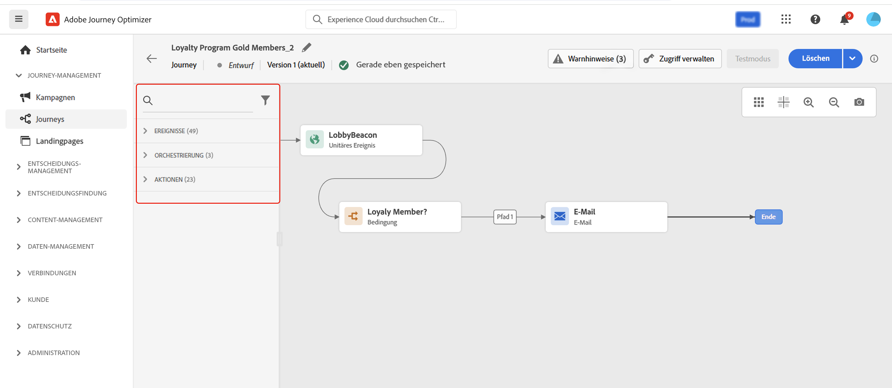
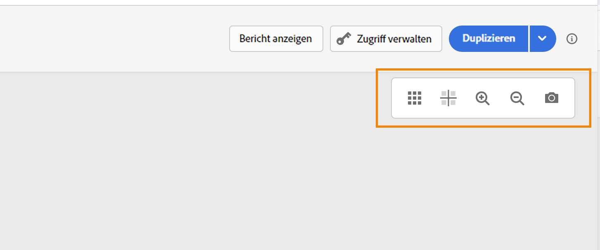
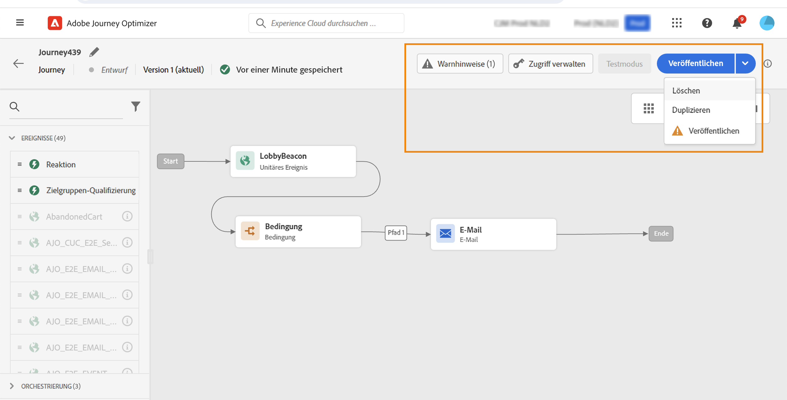
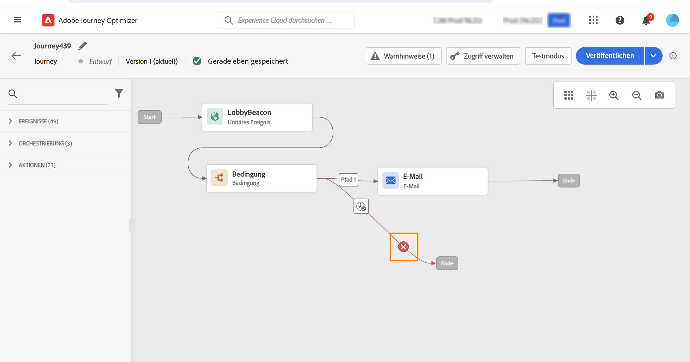
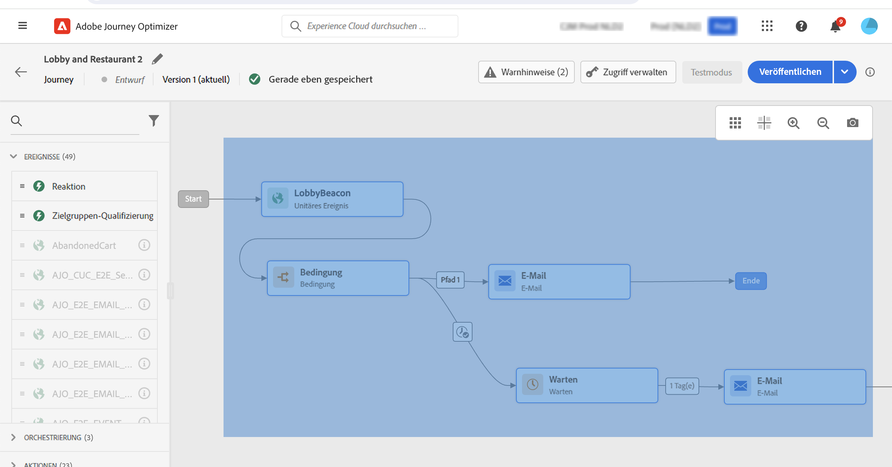
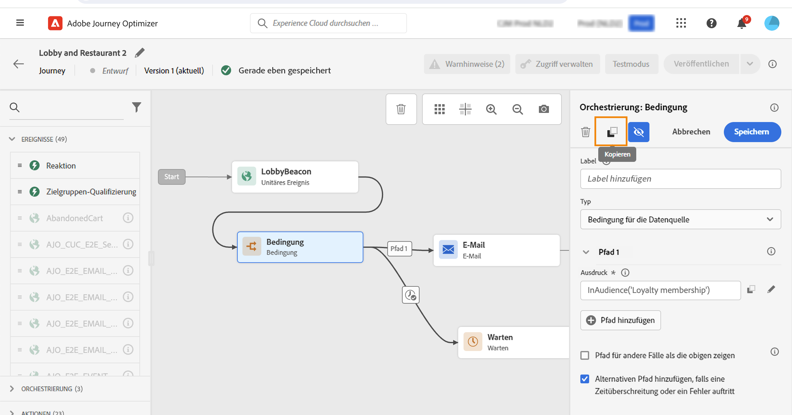
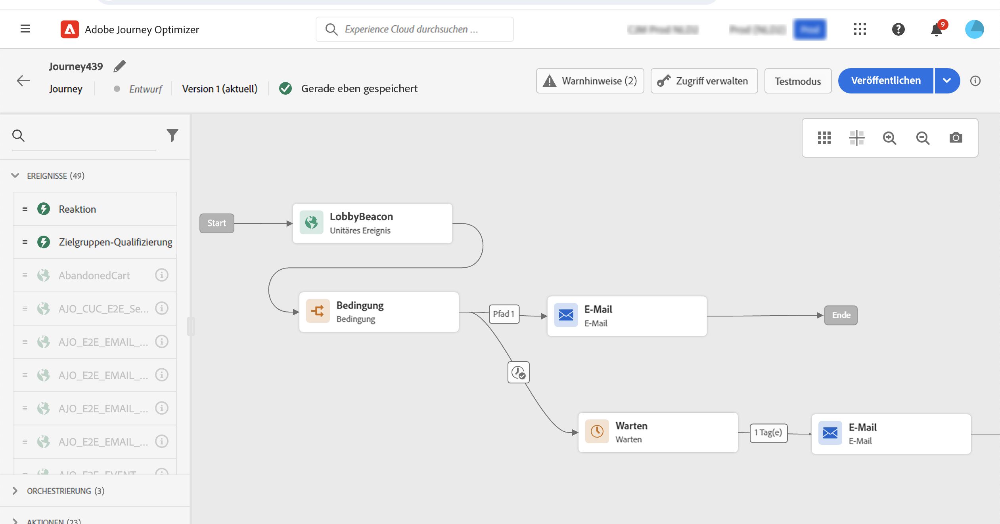

# Gestalten einer Journey {#design-your-journey}

>[!CONTEXTUALHELP]
>id="ajo_journey_canvas"
>title="Gestalten einer Journey"
>abstract="Die Benutzeroberfläche für die Journey ermöglicht es Ihnen, Aktivitäten einfach von der Palette in die Arbeitsfläche zu ziehen. Sie können auch auf eine Aktivität doppelklicken, um sie im nächsten verfügbaren Schritt der Arbeitsfläche hinzuzufügen."

Adobe Journey Optimizer verfügt über eine Arbeitsfläche für die Omnichannel-Orchestrierung, mit der Marketing-Experten Marketing-Maßnahmen mit Eins-zu-eins-Kundeninteraktionen aufeinander abstimmen können. Die Benutzeroberfläche ermöglicht es, Aktivitäten einfach von der Palette in die Arbeitsfläche zu ziehen, um eine Journey zu erstellen. Sie können auch auf eine Aktivität doppelklicken, um sie im nächsten verfügbaren Schritt der Arbeitsfläche hinzuzufügen.

Ereignisse, Orchestrierungs- und Aktionsaktivitäten haben eine bestimmte Rolle und einen bestimmten Platz im Prozess. Die Aktivitäten finden der Reihe nach statt: Nach Beendigung einer Aktivität wird der Fluss fortgesetzt und die nächste Aktivität wird verarbeitet usw.

## Erste Schritte beim Entwerfen von Journeys {#gs-journey-design}

Die **Palette** befindet sich auf der linken Bildschirmseite. Alle verfügbaren Aktivitäten sind in verschiedene Kategorien unterteilt: [Ereignisse](#jo-event), [Orchestrierung](#jo-orch) und [Aktionen](#jo-actions). Sie können die verschiedenen Kategorien erweitern/reduzieren, indem Sie auf ihren Namen klicken. Um eine Aktivität in Ihrer Journey zu verwenden, ziehen Sie sie per Drag-and-Drop aus der Palette in Ihre Arbeitsfläche.

Beim Erstellen einer neuen Journey werden Elemente ausgeblendet, die nicht als erster Schritt auf der Arbeitsfläche abgelegt werden können. Dies betrifft alle Aktionen, die Bedingungsaktivität, die Wartezeit und die Reaktion.

Mit dem Symbol **[!UICONTROL Elemente filtern]** oben links können Sie die folgenden Filter anzeigen:

* **Nur verfügbare Elemente anzeigen**: Blenden Sie nicht verfügbare Elemente in der Palette ein oder aus, z. B. die Ereignisse, die einen anderen Namespace verwenden als die in der Journey verwendeten. Standardmäßig werden nicht verfügbare Elemente ausgeblendet. Wenn Sie sie anzeigen lassen, werden sie grau dargestellt.

* **Nur aktuelle Elemente anzeigen**: Mit diesem Filter können Sie neben den nativen auch die letzten fünf Ereignisse und Aktionen anzeigen. Dies ist benutzerspezifisch. Standardmäßig werden alle Elemente angezeigt.

Sie können auch das Feld **[!UICONTROL Suche]** verwenden. Es werden nur Ereignisse und Aktionen gefiltert.

Die **Arbeitsfläche** ist der zentrale Bereich im Journey-Designer. In diesem Bereich können Sie Ihre Aktivitäten ablegen und konfigurieren. Klicken Sie auf eine Aktivität auf der Arbeitsfläche, um sie zu konfigurieren. Dadurch wird der Konfigurationsbereich für die Aktivität auf der rechten Seite geöffnet.

Die **Symbolleiste** oben rechts auf der Arbeitsfläche ermöglicht es Ihnen, das Raster ein- und auszublenden, ein- und auszuzoomen und einen Screenshot der Arbeitsfläche herunterzuladen. Weitere Informationen finden Sie in [diesem Abschnitt](../building-journeys/journey-gs.md#timeout_and_error).

<!--and show/hide timeout and error paths-->

{width="70%" align="left"}

Der **Konfigurationsbereich für die Aktivität** wird angezeigt, wenn Sie auf eine Aktivität in der Palette klicken. Füllen Sie die erforderlichen Felder aus. Klicken Sie auf das Symbol **[!UICONTROL Löschen]**, um die Aktivität zu löschen. Klicken Sie auf **[!UICONTROL Abbrechen]**, um die Änderungen zu ignorieren, oder auf **[!UICONTROL OK]**, um sie zu bestätigen. Um Aktivitäten zu löschen, können Sie auch eine Aktivität (oder mehrere) auswählen und die Rücktaste drücken. Durch Drücken der Esc-Taste wird der Konfigurationsbereich für die Aktivität geschlossen.

Standardmäßig sind schreibgeschützte Felder ausgeblendet. Um sie anzuzeigen, klicken Sie auf das Symbol **Schreibgeschützte Felder anzeigen** oben links im Konfigurationsbereich für die Aktivitäten. Diese Einstellung gilt für alle Aktivitäten in allen Journeys.

Abhängig vom Status der Journey können Sie mithilfe der Schaltflächen oben rechts verschiedene Aktionen für Ihre Journey ausführen: **[!UICONTROL Veröffentlichen]**, **[!UICONTROL Duplizieren]**, **[!UICONTROL Löschen]**, **[!UICONTROL Eigenschaften der Journey]**, **[!UICONTROL Test]**. Diese Schaltflächen werden angezeigt, wenn keine Aktivität ausgewählt ist. Einige Schaltflächen werden kontextuell angezeigt. Die Schaltfläche für das Testmodusprotokoll wird angezeigt, wenn der Testmodus aktiviert ist.

## Starten der Journey {#start-your-journey}

Wenn Sie Ihre Journey entwerfen, stellen Sie sich als Erstes die Frage, wie Profile in die Journey eintreten werden. Es gibt zwei Möglichkeiten:

1. **Beginn mit einem Ereignis**: Wenn eine Journey so eingestellt ist, dass sie auf Ereignisse wartet, treten Personen **einheitlich** in Echtzeit in die Journey ein. Nachrichten, die in Ihrer Journey enthalten sind, werden an die Person gesendet, die gerade in die Journey kommt. [Weitere Informationen zu Ereignissen](../event/about-events.md)

1. **Beginn mit dem Schritt „Segment lesen“**: Sie können Ihre Journey so einstellen, dass sie auf Adobe Experience Platform-Segmente wartet. In diesem Fall treten alle dem angegebenen Segment angehörenden Personen in die Journey ein. Die in Ihrer Journey enthaltenen Nachrichten werden an die dem Segment angehörenden Personen gesendet. [Erfahren Sie mehr über das Lesen von Segmenten](read-segment.md).

## Nächste Schritte definieren{#define-next-steps}

Nach dem ersten Ereignis oder dem Schritt „Segment lesen“ können Sie die verschiedenen Aktivitäten kombinieren, um Ihre mehrstufigen Cross-Channel-Szenarien zu erstellen. Wählen Sie in der Palette die gewünschten Schritte aus.

### Ereignisse{#jo-event}

Ereignisse sind Auslöser personalisierter Journeys, z. B. eines Online-Kaufs. Wenn eine Person in eine Journey eintritt, durchläuft sie sie als Individuum. Jede Person bewegt sich in einer anderen Geschwindigkeit und auf einem anderen Pfad.

Wenn Sie Ihre Journey mit einem Ereignis beginnen, wird die Journey ausgelöst, sobald das Ereignis eintritt. Jede Person in der Journey folgt dann einzeln den nächsten Schritten, die in Ihrer Journey definiert sind.

Sie können **mehrere Ereignisse** in Ihrer Journey hinzufügen, sofern sie denselben Namespace verwenden. Die Ereignisse werden zuvor konfiguriert. [Weitere Informationen zu Journey-Ereignissen](about-journey-activities.md#event-activities)

Sie können nach einer Nachricht auch ein **Reaktions**-Ereignis hinzufügen, um auf Tracking-Daten im Zusammenhang mit der Nachricht zu reagieren. So können Sie z. B. eine weitere Nachricht senden, wenn der Kontakt die vorherige Nachricht geöffnet oder in ihr auf etwas geklickt hat. [Weitere Informationen zu Reaktionsereignissen](reaction-events.md).

Verwenden Sie die Ereignisaktivität **Segmentqualifikation**, um Personen auf der Grundlage von Adobe Experience Platform-Segmenteintritten und -austritten zu veranlassen, in eine Journey einzutreten oder eine Journey fortzusetzen. Sie können alle neuen Silber-Kunden dazu bringen, in eine Journey einzutreten und ihnen personalisierte Nachrichten senden. Weiterführende Informationen finden Sie in diesem [Abschnitt](segment-qualification-events.md).

### Orchestrierung{#jo-orch}

Orchestrierungsaktivitäten sind Bedingungen, die beim Bestimmen des nächsten Schritts der Journey helfen.

In den Orchestrierungsaktivitäten können Sie die Aktivität **Segment lesen** verwenden, um eine Journey so einzurichten, dass sie auf ein Adobe Experience Platform-Segment reagiert. [Weitere Informationen über die Aktivität „Segment lesen“](read-segment.md)

Die anderen Aktivitäten ermöglichen es Ihnen, Bedingungen zu Ihrer Journey hinzuzufügen, um mehrere Pfade zu definieren, eine Wartezeit festzulegen, bevor Sie die nächste Aktivität ausführen, oder Ihre Journey zu beenden. [Weitere Informationen zu Orchestrierungsaktivitäten](about-journey-activities.md#orchestration-activities).

### Aktionen{#jo-actions}

Aktionen sind das Ergebnis eines Auslösers, wie das Senden einer Nachricht. Sie sind die Teile der Journey, die der Kunde bzw. die Kundin wahrnimmt. Dabei kann es sich um eine E-Mail-, SMS- oder Push-Nachricht oder um eine Drittanbieteraktion handeln, z. B. um eine Slack-Nachricht.

Mit den Kanalaktionsaktivitäten können Sie eine Nachricht einfügen, die in [!DNL Journey Optimizer] entworfen wurde. [Weitere Informationen zu Kanalaktionsaktivitäten](journeys-message.md)

Verwenden Sie in den Aktionsaktivitäten benutzerdefinierte Aktionen, um Nachrichten mit Drittanbietersystemen zu senden. [Weitere Informationen zu benutzerdefinierten Aktionen](about-journey-activities.md#action-activities).

## Hinzufügen alternativer Pfade{#paths}

Für den Fall eines Fehlers oder einer Zeitüberschreitung können Sie eine Ausweichaktion für die folgenden Journey-Aktivitäten definieren: **[!UICONTROL Bedingung]** und **[!UICONTROL Aktion]**.

Um eine Ausweichaktion für eine Aktivität hinzuzufügen, wählen Sie das Feld **[!UICONTROL Alternativen Pfad im Fall einer Zeitüberschreitung oder eines Fehlers hinzufügen]** in den Eigenschaften der Aktivität aus. Nach der Aktivität wird dadurch ein weiterer Pfad hinzugefügt. Die Zeitüberschreitungsdauer wird von Admin-Benutzern in den [Journey-Eigenschaften](../building-journeys/journey-gs.md#change-properties) festgelegt. Wenn beispielsweise der Versand einer E-Mail zu lange dauert oder ein Fehler dabei auftritt, können Sie sich für den Versand einer Push-Benachrichtigung entscheiden.

Verschiedene Aktivitäten (Ereignis, Aktion, Warten) ermöglichen es Ihnen, nach der Aktivität mehrere Pfade hinzuzufügen. Setzen Sie dazu den Cursor auf die Aktivität und klicken Sie auf das „+“-Symbol. Nur Ereignis- und Warteaktivitäten können parallel festgelegt werden. Wenn mehrere Ereignisse parallel festgelegt werden, wird der Pfad des Ereignisses ausgewählt, das zuerst stattfindet.

Wir empfehlen, beim Überwachen eines Ereignisses nicht auf unbestimmte Zeit auf das Ereignis zu warten. Dies ist nicht obligatorisch, sondern nur eine Best Practice. Wenn Sie ein oder mehrere Ereignisse nur während einer bestimmten Zeit überwachen möchten, platzieren Sie ein oder mehrere Ereignisse und eine Warteaktivität parallel. Weitere Informationen finden Sie in [diesem Abschnitt](../building-journeys/general-events.md#events-specific-time).

Um den Pfad zu löschen, platzieren Sie den Cursor darauf und klicken Sie auf das Symbol **[!UICONTROL Pfad löschen]**.

Wenn zwei Aktivitäten auf der Arbeitsfläche getrennt werden, wird eine Warnung angezeigt. Platzieren Sie den Cursor auf das Warnsymbol, um die entsprechende Fehlermeldung anzuzeigen. Um das Problem zu beheben, verschieben Sie einfach die getrennte Aktivität und verbinden Sie sie mit der vorherigen Aktivität.

## Kopieren und Einfügen von Aktivitäten {#copy-paste}

Sie können eine oder mehrere Aktivitäten einer Journey kopieren und entweder in derselben oder einer anderen Journey einfügen. So sparen Sie Zeit, wenn Sie verschiedene Aktivitäten wiederverwenden möchten, die bereits in einer vorherigen Journey konfiguriert wurden.

**Wichtige Hinweise**

* Sie können über verschiedene Tabs und Browser hinweg kopieren und einfügen. Sie können Aktivitäten nur innerhalb derselben Instanz kopieren/einfügen.
* Sie können ein Ereignis nicht kopieren/einfügen, wenn die Ziel-Journey über ein Ereignis verfügt, das einen anderen Namespace verwendet.
* Eingefügte Aktivitäten können auf Daten verweisen, die in der Ziel-Journey nicht vorhanden sind, z. B. wenn Sie Daten in verschiedene Sandboxes kopieren/einfügen. Führen Sie stets eine Fehlerprüfung durch und nehmen Sie die erforderlichen Anpassungen vor.
* Beachten Sie, dass sich eine Aktion nicht rückgängig machen lässt. Um eingefügte Aktivitäten zu löschen, müssen Sie sie auswählen und löschen. Wählen Sie also vor dem Kopieren ausschließlich benötigte Aktivitäten aus.
* Sie können Aktivitäten aus beliebigen Journeys kopieren, auch aus solchen, die schreibgeschützt sind.
* Sie können beliebige Aktivitäten auswählen, auch solche, die nicht verknüpft sind. Verknüpfte Aktivitäten bleiben nach dem Einfügen verknüpft.

Im Folgenden werden die Schritte zum Kopieren/Einfügen von Aktivitäten beschrieben:

1. Öffnen Sie eine Journey.
1. Wählen Sie die Aktivitäten aus, die Sie kopieren möchten, indem Sie die Maus darüber bewegen und klicken. Alternativ können Sie auf die einzelnen Aktivitäten klicken, während Sie die **Strg-/Befehlstaste** gedrückt halten. Verwenden Sie **Strg/Befehl + A**, wenn Sie alle Aktivitäten auswählen möchten.
   
1. Drücken Sie **Strg/Befehl + C**.
Wenn Sie nur eine Aktivität kopieren möchten, können Sie darauf klicken und oben links im Konfigurationsbereich für die Aktivität das **Kopieren**-Symbol verwenden.
   
1. Drücken Sie in einer beliebigen Journey die **Strg-/Befehlstaste + V**, um die Aktivitäten einzufügen, ohne sie mit einem vorhandenen Knoten zu verknüpfen. Eingefügte Aktivitäten werden in derselben Reihenfolge angeordnet. Nach dem Einfügen bleiben Aktivitäten ausgewählt, damit Sie sie einfach verschieben können. Sie können den Cursor auch auf einen leeren Platzhalter setzen und **Strg/Befehl + V** drücken. Eingefügte Aktivitäten werden mit dem Knoten verknüpft.
   
