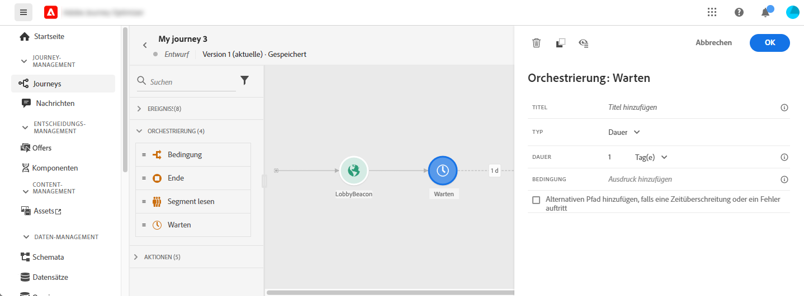
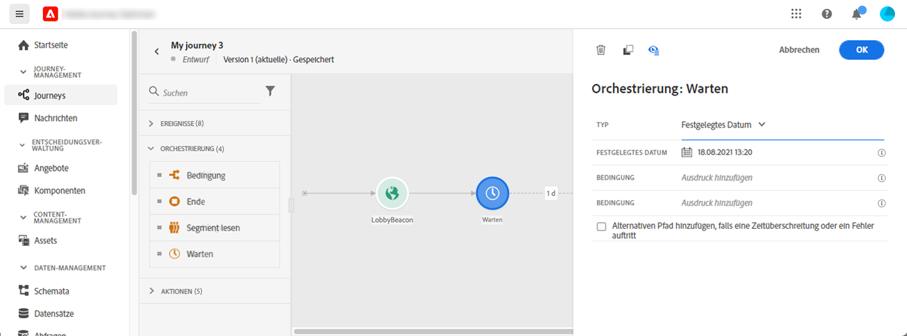
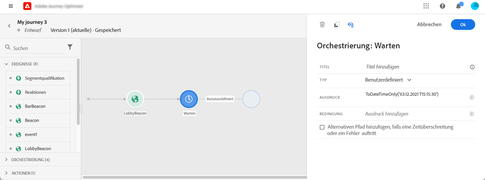

# Warteaktivität {#wait-activity}

>[!BEGINSHADEBOX]

**Auf dieser Seite** Erfahren Sie, wie Sie die Warteaktivität so konfigurieren, dass sie einen Pfad für eine relative Dauer oder bis zu einem benutzerdefinierten berechneten Datum anhält, bevor die nächste Aktivität ausgeführt wird.

>[!ENDSHADEBOX]

>[!CONTEXTUALHELP]
>id="ajo_journey_wait"
>title="Aktivität „Warten“"
>abstract="Die Aktivität Warten ermöglicht es, zu warten, bevor die nächste Aktivität im Pfad ausgeführt wird. Sie können den Zeitpunkt festlegen, zu dem die nächste Aktivität ausgeführt wird. Es stehen zwei Optionen zur Verfügung: „Dauer“ und „Benutzerdefiniert“."

Mit einer Aktivität vom Typ **[!UICONTROL Warten]** können Sie eine Dauer definieren, nach deren Ablauf die nächste Aktivität ausgeführt wird.  Die maximale Wartezeit beträgt **90 Tage**.

Sie können zwei Arten der Aktivität vom Typ **Warten** festlegen:

* Eine Wartezeit basierend auf einer relativen Dauer. [Weitere Informationen](#duration)
* Ein benutzerdefiniertes Datum, das mithilfe von Funktionen berechnet wird. [Weitere Informationen](#custom)

<!--
* [Email send time optimization](#email_send_time_optimization)
* [Fixed date](#fixed_date) 
-->

## Recommendations {#wait-recommendations}

Verwenden Sie diese Empfehlungen, um Wartezeiten vorhersehbar und sicher zu halten.

### Mehrere Warteaktivitäten {#multiple-wait-activities}

Achten Sie bei der Verwendung mehrerer Aktivitäten vom Typ **Warten** in einer Journey darauf, dass der [globale Timeout](journey-properties.md#global_timeout) für Journeys 91 Tage beträgt, d. h., Profile werden immer spätestens 91 Tage nach ihrem Eintritt aus der Journey ausgeschlossen. Weitere Informationen finden Sie auf [dieser Seite](journey-properties.md#global_timeout).

Ein Kontakt kann nur dann eine Aktivität vom Typ **Warten** annehmen, wenn noch genügend Zeit bleibt, um die Wartezeit vor Ablauf des 91-tägigen Timeouts der Journey zu beenden.

### Warten und erneuter Eintritt {#wait-reentrance}

Eine Best Practice, um keine Aktivitäten vom Typ **Warten** zu verwenden, um den erneuten Eintritt zu blockieren. Verwenden Sie stattdessen die Option **Erneuten Eintritt erlauben** auf der Ebene der Journey-Eigenschaften. Weitere Informationen finden Sie auf [dieser Seite](../building-journeys/journey-properties.md#entrance).

### Warten und Testmodus {#wait-test-mode}

Im Testmodus können Sie mit dem Parameter **[!UICONTROL Wartezeit im Test]** die Dauer jeder Aktivität vom Typ **Warten** festlegen. Der Standardwert ist 10 Sekunden. Dadurch erhalten Sie die Testergebnisse schnell. Weitere Informationen finden Sie auf [dieser Seite](../building-journeys/testing-the-journey.md).

### Warte- und Mobile-Kanäle {#wait-mobile-channels}

Wenn Sie eine [In-App-Nachricht](../in-app/create-in-app.md) nach dem Versand einer [Push-Benachrichtigung](../../rp_landing_pages/push-landing-page.md) anzeigen möchten, verwenden Sie eine Aktivität **Warten**, damit die Payload-Zeit der In-App-Nachricht weitergegeben wird. Normalerweise wird eine Wartezeit von 5 bis 15 Minuten empfohlen. Die genauen Zeiten können jedoch je nach Payload-Komplexität und Personalisierungsanforderungen variieren.

## Konfiguration {#wait-configuration}

Hier Wartezeit und Timing konfigurieren.

### Dauer der Wartezeit {#duration}

Wählen Sie den Typ **Dauer**, um die relative Dauer der Wartezeit vor der Ausführung der nächsten Aktivität auszuwählen. Die maximale Wartezeit beträgt **90 Tage**.

<!--
## Fixed date wait{#fixed_date}

Select the date for the execution of the next activity.

-->

### Benutzerdefinierte Wartezeit {#custom}

Wählen Sie den Typ **Benutzerdefiniert** aus, um ein benutzerdefiniertes Datum zu definieren. Dabei verwenden Sie einen erweiterten Ausdruck, der auf einem von einem Ereignis oder einer benutzerdefinierten Aktion stammenden Feld basiert. Sie können eine relative Dauer nicht direkt definieren, z. B. 7 Tage, aber Sie können Funktionen verwenden, um sie bei Bedarf zu berechnen (z. B. 2 Tage nach Kauf).

Der Ausdruck im Editor sollte ein `dateTimeOnly`-Format aufweisen. Weitere Informationen finden Sie auf [dieser Seite](expression/expressionadvanced.md). Weitere Informationen zum Format „TimeOnly“ finden Sie auf [dieser Seite](expression/data-types.md).

Es empfiehlt sich, benutzerdefinierte Datumsangaben zu verwenden, die spezifisch für Ihre Profile sind, und zu vermeiden, dass für alle Profile dasselbe Datum verwendet wird. Definieren Sie beispielsweise nicht `toDateTimeOnly('2024-01-01T01:11:00Z')`, sondern `toDateTimeOnly(@event{Event.productDeliveryDate})`, was für jedes Profil spezifisch ist. Beachten Sie, dass die Verwendung von festen Datumsangaben Probleme bei der Ausführung der Journey verursachen kann. Weitere Informationen zur Auswirkung von Warteaktivitäten auf die Journey-Verarbeitungsrate finden Sie [in diesem Abschnitt](entry-management.md#wait-activities-impact).

>[!CAUTION]
>
>Beachten Sie beim Arbeiten mit `dateTimeOnly` Ausdrücken Folgendes:
>
>* Sie können einen `dateTimeOnly`-Ausdruck direkt verwenden oder ihn mithilfe einer Funktion in ihn konvertieren, z. B. `toDateTimeOnly(@event{Event.offerOpened.activity.endTime})`, wenn sich der Feldwert im `2023-08-12T09:46:06Z` befindet.
>* Die **Zeitzone** wird in den Journey-Eigenschaften definiert. Daher ist es nicht möglich, von der Benutzeroberfläche aus auf einen vollständigen ISO-8601-Zeitstempel zu verweisen, der Zeit- und Zeitzonenversatz mischt, z. B. `2023-08-12T09:46:06.982-05`. [Weitere Informationen](../building-journeys/timezone-management.md)
>* Beim Erstellen eines benutzerdefinierten Warteausdrucks mit `toDateTimeOnly()` dürfen Sie **nicht** `Z` oder einen Zeitzonenversatz anhängen (z. B. `-05:00`). Der Ausdruck muss auf die konfigurierte Zeitzone der Journey ohne explizite Zeitzonenbezeichner verweisen, da andernfalls Profile in der Warteaktivität stecken bleiben können.
>
>| | Beispiel |
>| --- | --- |
>| **Richtig** | `toDateTimeOnly(concat(toString(toDateOnly(nowWithDelta(2, "days"))),"T10:00:00"))` |
>| **falsch** | `toDateTimeOnly(concat(toString(toDateOnly(nowWithDelta(2, "days"))),"T10:00:00Z"))` ❌ (enthält `Z`) |

Um zu überprüfen, ob die Warteaktivität erwartungsgemäß funktioniert, können Sie Schritt-Ereignisse verwenden. [Weitere Informationen](../reports/query-examples.md#common-queries).

## Profilaktualisierung nach Wartezeit {#profile-refresh}

Wenn ein Profil bei einer Aktivität des Typs **Warten** in einer Journey geparkt wird, die mit einer Aktivität des Typs **Zielgruppe lesen** beginnt, aktualisiert die Journey automatisch die Profilattribute von Unified Profile Service (UPS), um die neuesten verfügbaren Daten abzurufen.

* **Bei Journey-Eintritt:** Profile verwenden Attributwerte aus dem Zielgruppen-Snapshot, der beim Starten der Journey ausgewertet wurde.
* **Nach einem Warteknoten:** Die Journey führt eine Suche durch, um die neuesten Profildaten von UPS abzurufen, nicht die älteren Snapshot-Daten. Dies bedeutet, dass sich die Profilattribute möglicherweise seit dem Beginn der Journey geändert haben.

Dadurch wird sichergestellt, dass nachgelagerte Aktivitäten nach einer Wartezeit aktuelle Profilinformationen verwenden. Dies kann jedoch zu unerwarteten Ergebnissen führen, wenn Sie davon ausgehen, dass die Journey während der gesamten Ausführung nur die Original-Snapshot-Daten verwendet.

Beispiel: Wenn sich ein Profil beim Journey-Start für eine Zielgruppe des Typs„Silber-Kundschaft“ qualifiziert, aber während einer 3-tägigen Wartezeit zu „Gold-Kundschaft“ aufsteigt, wird bei Aktivitäten nach der Wartezeit der aktualisierte Status „Gold-Kundschaft“ angezeigt.

## Automatischer Warteknoten  {#auto-wait-node}

>[!CONTEXTUALHELP]
>id="ajo_journey_auto_wait_node"
>title="Über den automatischen Warteknoten"
>abstract="Nach **eingehenden Aktion** automatisch ein „Warten“-Knoten eingefügt. Standardmäßig ist dieser Zeitraum auf 3 Tage festgelegt, um sicherzustellen, dass Profile lange genug im Journey bleiben, um die Nachricht oder das Erlebnis anzuzeigen. Die Wartezeit kann aktualisiert oder der Knoten entfernt werden, wenn der Anwendungsfall dies erfordert."

Jede Aktivität für eingehende Erlebnisse (In-App-Nachricht, Code-basiertes Erlebnis oder Karte) geht mit einer 3-tägigen **Warteaktivität** einher. Da eingehende Nachrichten automatisch enden, wenn ein Profil das Ende der Journey erreicht, ist davon auszugehen, dass Sie möchten, dass Ihre Benutzenden sie mindestens 3 Tage lang sehen. Sie können bei Bedarf diese **Warteaktivität** entfernen oder ihre Konfiguration ändern.

+++ KI-Wissensreferenz

Dieser Abschnitt enthält strukturiertes Wissen zur Unterstützung von Interpretation, Abrufen und Antworten auf Fragen zu diesem Thema.

Zum vollständigen Verständnis sollten diese Informationen mit der Dokumentation auf dieser Seite kombiniert werden. Keine der beiden Quellen ist für Einzelpersonen gedacht. Die Seite beschreibt die Funktion, während dieser Abschnitt zusätzlichen Kontext bietet, der dabei hilft, Begriffe, Absichten, Anwendbarkeit und Begrenzungen zu unterscheiden.

* **TL;DR:** Auf dieser Seite wird beschrieben, wie Sie die Warteaktivität in einer Journey so konfigurieren, dass der Profilfortschritt für eine relative Dauer oder bis zu einem benutzerdefinierten berechneten Datum angehalten wird, bevor Sie den nächsten Schritt ausführen.

**intents:**

* Fügen Sie die Aktivität Warten hinzu, um eine Journey für eine bestimmte Dauer (bis zu 90 Tage) anzuhalten
* Konfigurieren einer benutzerdefinierten Wartezeit mit einem erweiterten Ausdruck, um das Berechnen eines profilspezifischen Datums zu verzögern
* verstehen, wie Warteaktivitäten mit der globalen Zeitüberschreitung nach Journey interagieren (91 Tage),
* Verwenden Sie die Wartezeit im Testparameter , um die Validierung des Testmodus zu beschleunigen
* Erfahren Sie, wie Profilattribute nach einem Warteknoten in den Journey der Zielgruppe lesen aktualisiert werden

**Glossar:**

* **Warteaktivität** Eine Journey-Orchestrierungsaktivität, die den Profilfortschritt für eine bestimmte Dauer oder bis zu einem berechneten Datum anhält, bevor die nächste Aktivität ausgeführt wird *(produktspezifisch)*
* **Wartezeit**: Ein Wartetyp, der einen relativen Zeitraum für das Anhalten mit maximal 90 Tagen festlegt *produktspezifisch)*
* **Benutzerdefinierte Wartezeit**: Ein Wartetyp, der einen `dateTimeOnly` Ausdruck verwendet, der von Profil- oder Ereignisdaten abgeleitet wurde, um ein bestimmtes Datum/eine bestimmte Uhrzeit in der Zukunft für die Wiederaufnahme zu definieren *(produktspezifisch)*
* **Knoten „Automatische Wartezeit**: Eine 3-tägige Warteaktivität wird automatisch nach eingehenden Erlebnisaktivitäten (In-App, Code-basiert, Karte) eingefügt, um das Profil lange genug auf der Journey zu halten, um die *anzuzeigen (produktspezifisch)*
* **Wartezeit im Test**: Ein Journey-Testmodusparameter, der die tatsächlichen Wartezeiten (standardmäßig 10 Sekunden) überschreibt, damit Testergebnisse schnell zurückgegeben werden *(produktspezifisch)*

**Leitplanken:**

* Die maximale Wartezeit beträgt 90 Tage.
* Profile werden nach 91 Tagen (globale Zeitüberschreitung) von einer Journey gelöscht, unabhängig von ausstehenden Warteaktivitäten.
* Ein Profil kann nur dann in eine Warteaktivität eintreten, wenn ausreichend Zeit auf dem Journey verbleibt, um die Wartezeit vor der maximalen Wartezeit von 91 Tagen abzuschließen.
* Verwenden Sie keine Warteaktivitäten, um den erneuten Eintritt zu blockieren. Verwenden Sie stattdessen die Option Erneuten Eintritt erlauben in den Journey-Eigenschaften.
* Benutzerdefinierte Warteausdrücke müssen `dateTimeOnly` Format verwenden und dürfen kein `Z` Suffix und keinen expliziten Zeitzonenversatz enthalten.
* Die Verwendung eines festen statischen Datums (z. B. `toDateTimeOnly('2024-01-01T01:11:00Z')`) in einer benutzerdefinierten Wartezeit kann zu Problemen führen. Verwenden Sie stattdessen profilspezifische dynamische Datumsangaben.
* Profilattribute werden vom Unified Profile Service nach einem Warteknoten in den Journey des Typs „Zielgruppe lesen“ aktualisiert, was zu unerwarteten Ergebnissen führen kann, wenn Momentaufnahmenkonsistenz erwartet wird.

**Terminologie:**

* Kanonischer Name: Warteaktivität — Akronym: none — Varianten: Warteknoten, Warteschritt
* Synonyme: „Duration wait“ = „Relative Wartezeit“; „Benutzerdefinierte Wartezeit“ = „Ausdrucksbasierte Wartezeit“
* Verwechseln Sie nicht: „Wartezeit für die Dauer“ (relativ, z. B. in 3 Tagen) ≠ „Benutzerdefinierte Wartezeit“ (absolutes berechnetes Datum aus Profildaten)

**FAQ:**

* **F: Wie lange kann eine Warteaktivität maximal dauern?** — Die maximale Wartezeit beträgt 90 Tage. Für Profile gilt außerdem das 91-tägige globale Journey-Timeout.
* **F: Wie behandelt der Testmodus Warteaktivitäten?** — Im Testmodus überschreibt der Parameter „Wartezeit im Test“ die tatsächliche Wartezeit. Der Standardwert ist 10 Sekunden, sodass Tests schnell abgeschlossen werden.
* **F: Warum sollte ich es vermeiden, Z an einen benutzerdefinierten Warteausdruck anzuhängen?** — Das Hinzufügen von Z oder eines Zeitzonenversatzes zu einem `toDateTimeOnly()` kann dazu führen, dass Profile in der Warteaktivität hängen bleiben. Der Ausdruck muss auf der konfigurierten Zeitzone der Journey basieren.
* **F: Werden Profilattribute nach einem Warteknoten aktualisiert?** — Ja, in Journey mit dem Schritt „Zielgruppe lesen“ aktualisiert der Journey nach längerer Wartezeit die Profilattribute vom Unified Profile Service, sodass nachgelagerte Aktivitäten möglicherweise aktualisierte Werte sehen anstatt der ursprünglichen Zielgruppen-Momentaufnahme-Daten.
* **F: Was ist der automatische Warteknoten?** - Eine 3-tägige Warteaktivität wird automatisch nach eingehenden Erlebnisaktivitäten (In-App, Code-basiert, Karte) eingefügt, um sicherzustellen, dass Profile lange genug auf der Journey bleiben, um die Nachricht zu sehen. Sie kann bei Bedarf entfernt oder neu konfiguriert werden.

+++
