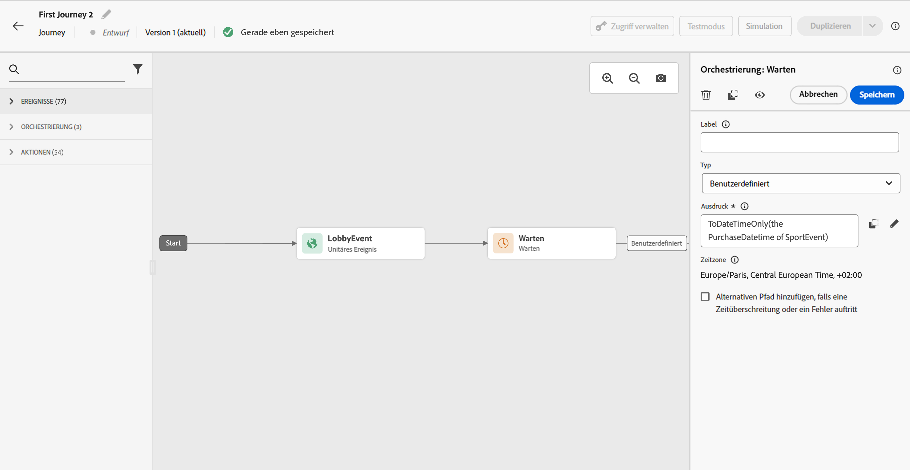

# Warteaktivität{#wait-activity}

>[!CONTEXTUALHELP]
>id="ajo_journey_wait"
>title="Warteaktivität"
>abstract="Wenn Sie warten möchten, bevor Sie die nächste Aktivität im Pfad ausführen, können Sie eine Warteaktivität verwenden. Sie können den Zeitpunkt festlegen, zu dem die nächste Aktivität ausgeführt wird. Es stehen zwei Optionen zur Verfügung: „Dauer“ und „Benutzerdefiniert“."

Wenn Sie warten möchten, bevor Sie die nächste Aktivität im Pfad ausführen, können Sie eine **[!UICONTROL Warteaktivität]** verwenden. Sie können den Zeitpunkt festlegen, zu dem die nächste Aktivität ausgeführt wird. Drei Optionen stehen zur Wahl:

* [Dauer](#duration)
* [Benutzerspezifisch](#custom)

<!--
* [Email send time optimization](#email_send_time_optimization)
* [Fixed date](#fixed_date) 
-->

## Informationen zur Warteaktivität{#about_wait}

Die maximale Wartezeit beträgt 30 Tage. Im Testmodus können Sie mit dem Parameter **[!UICONTROL Wartezeit im Test]** die Dauer jeder Warteaktivität festlegen. Der Standardwert ist 10 Sekunden. Dadurch erhalten Sie die Testergebnisse schnell. Weitere Informationen finden Sie auf [dieser Seite](../building-journeys/testing-the-journey.md)

Seien Sie vorsichtig, wenn Sie mehrere Aktivitäten vom Typ „Warten“ in einer Journey verwenden, da die globale maximale Wartezeit für Journeys 30 Tage beträgt, d. h., ein Profil wird immer 30 Tage nach seinem Eintritt aus der Journey ausgeschlossen.

## Wartezeit mit Dauer{#duration}

Wählen Sie die Dauer der Wartezeit vor der Ausführung der nächsten Aktivität aus.

<!--
## Fixed date wait{#fixed_date}

Select the date for the execution of the next activity.

-->

## Benutzerdefinierte Wartezeit{#custom}

Mit dieser Option können Sie ein benutzerdefiniertes Datum definieren, z. B. den 12. Juli 2020 um 17 Uhr, wobei Sie einen erweiterten Ausdruck verwenden, der auf einem von einem Ereignis oder einer Datenquelle stammenden Feld basiert. Sie können keine benutzerdefinierte Dauer (z. B. 7 Tage) festlegen. Der Ausdruck im Ausdruckseditor sollte ein „dateTimeOnly“-Format aufweisen. Mehr dazu erfahren Sie auf [dieser Seite](expression/expressionadvanced.md). Weitere Informationen zum „dateTimeOnly“-Format finden Sie auf [dieser Seite](expression/data-types.md).

>[!NOTE]
>
>Sie können einen „dateTimeOnly“-Ausdruck nutzen oder eine Funktion zur Konvertierung in ein „dateTimeOnly“-Format verwenden. Beispiel: toDateTimeOnly(@{Event.offerOpened.activity.endTime}). Das Feld im Ereignis hat die folgende Form: 2016-08-12T09:46:06Z.
>
>Die Angabe der **Zeitzone** ist für die Eigenschaften Ihrer Journey erforderlich. Aus diesem Grund ist es heute nicht möglich, von der Oberfläche direkt auf eine Zeitstempelmischzeit nach ISO-8601 und einen Zeitzonenversatz (z. B. 2016- 08-06.12T09:46:06.982-05) zu verweisen. Weitere Informationen finden Sie auf [dieser Seite](../building-journeys/timezone-management.md).

Um zu überprüfen, ob die Warteaktivität erwartungsgemäß funktioniert, können Sie Schritt-Ereignisse verwenden. Weitere Informationen finden Sie auf [dieser Seite](../reports/query-examples.md#common-queries).

<!--## Email send time optimization{#email_send_time_optimization}

This type of wait uses a score calculated in Adobe Experience Platform. The score calculates the propensity to click or open an email in the future based on past behavior. Note that the algorithm calculating the score needs a certain amount of data to work. As a result, when it does not have enough data, the default wait time will apply. At publication time, you’ll be notified that the default time applies.

>[!NOTE]
>
>The first event of your journey must have a namespace.
>
>This capability is only available after an **[!UICONTROL Email]** activity. You need to have Adobe Campaign Standard.

1. In the **[!UICONTROL Amount of time]** field, define the number of hours to consider to optimize email sending.
1. In the **[!UICONTROL Optimization type]** field, choose if the optimization should increase clicks or opens.
1. In the **[!UICONTROL Default time]** field, define the default time to wait if the predictive send time score is not available.

    >[!NOTE]
    >
    >Note that the send time score can be unavailable because there is not enough data to perform the calculation. In this case, you will be informed, at publication time, that the default time applies.

-->

