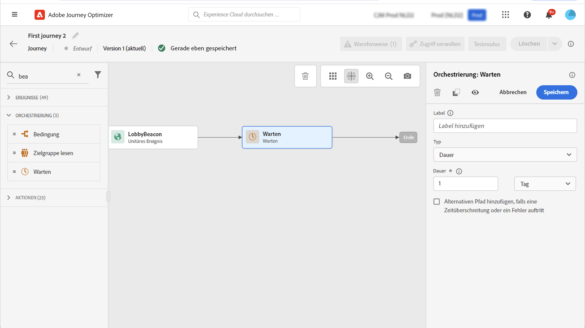

# Warteaktivität {#wait-activity}

>[!CONTEXTUALHELP]
>id="ajo_journey_wait"
>title="Warteaktivität"
>abstract="Wenn Sie warten möchten, bevor Sie die nächste Aktivität im Pfad ausführen, können Sie eine Warteaktivität verwenden. Sie können den Zeitpunkt festlegen, zu dem die nächste Aktivität ausgeführt wird. Es stehen zwei Optionen zur Verfügung: „Dauer“ und „Benutzerdefiniert“."

Sie können eine **[!UICONTROL Warten]** -Aktivität, um eine Dauer zu definieren, bevor die nächste Aktivität ausgeführt wird. Die folgenden Optionen sind verfügbar:

* [Dauer](#duration)
* [Benutzerspezifisch](#custom)

<!--
* [Email send time optimization](#email_send_time_optimization)
* [Fixed date](#fixed_date) 
-->

## Informationen zur Warteaktivität {#about_wait}

Die maximale Wartezeit beträgt 29 Tage. Im Testmodus können Sie mit dem Parameter **[!UICONTROL Wartezeit im Test]** die Dauer jeder Warteaktivität festlegen. Der Standardwert ist 10 Sekunden. Dadurch erhalten Sie die Testergebnisse schnell. Weiterführende Informationen finden Sie auf [dieser Seite](../building-journeys/testing-the-journey.md).

Gehen Sie bei der Verwendung mehrerer **Warten** -Aktivitäten in einer Journey, da das globale Journey-Timeout 30 Tage beträgt, d. h., ein Profil verlässt die Journey immer 30 Tage nach seiner Eingabe. Weiterführende Informationen finden Sie auf [dieser Seite](../building-journeys/journey-gs.md#global_timeout).

Eine Person kann **Warten** nur dann aktiviert werden, wenn genügend Zeit im Journey verbleibt, um die Wartezeit vor dem 30-tägigen Journey-Timeout abzuschließen. Wenn Sie beispielsweise zwei **Warten** Aktivitäten, die auf jeweils 20 Tage festgelegt sind, erkennt das System, dass die zweite **Warten** -Aktivität endet nach der 30-tägigen Zeitüberschreitung. Die zweite **Warten** -Aktivität ignoriert werden und der Kontakt die Journey verlässt, bevor er sie startet. In diesem Beispiel bleibt die Kundin bzw. der Kunde insgesamt 20 Tage in der Journey.

Eine Best Practice, nicht zu verwenden **Warten** Aktivitäten, um den Wiedereintritt zu blockieren. Verwenden Sie stattdessen die Option **Erneuten Eintritt erlauben** auf der Ebene der Journey-Eigenschaften. Weiterführende Informationen finden Sie auf [dieser Seite](../building-journeys/journey-gs.md#entrance).

## Dauer der Wartezeit {#duration}

Wählen Sie die Dauer der Wartezeit vor der Ausführung der nächsten Aktivität aus. Die maximale Wartezeit beträgt 29 Tage.

<!--
## Fixed date wait{#fixed_date}

Select the date for the execution of the next activity.

-->

## Benutzerdefinierte Wartezeit {#custom}

Verwenden Sie die **Benutzerdefiniert** Typ : definiert ein benutzerdefiniertes Datum mithilfe eines erweiterten Ausdrucks basierend auf einem Feld, das von einem Ereignis oder einer benutzerdefinierten Aktionsantwort stammt. Sie können eine relative Dauer nicht direkt definieren, z. B. 7 Tage, aber Sie können Funktionen verwenden, um sie bei Bedarf zu berechnen (z. B. 2 Tage nach Kauf).

Der Ausdruck im Editor sollte eine `dateTimeOnly` Format. Mehr dazu erfahren Sie auf [dieser Seite](expression/expressionadvanced.md). Weitere Informationen zum &quot;dateTimeOnly&quot;-Format finden Sie unter [diese Seite](expression/data-types.md).

Es empfiehlt sich, benutzerdefinierte Daten zu verwenden, die spezifisch für Ihre Profile sind, und zu vermeiden, dass für alle dasselbe Datum verwendet wird. Definieren Sie beispielsweise nicht `toDateTimeOnly('2024-01-01T01:11:00Z')` aber `toDateTimeOnly(@event{Event.productDeliveryDate})` die für jedes Profil spezifisch ist. Beachten Sie, dass die Verwendung von festen Datumsangaben Probleme bei der Ausführung des Journey verursachen kann.

>[!NOTE]
>
>Sie können `dateTimeOnly` Ausdruck verwenden oder eine Funktion zum Konvertieren in eine `dateTimeOnly`. Beispiel: `toDateTimeOnly(@event{Event.offerOpened.activity.endTime})`, das Feld im Ereignis weist die Form 2023-08-12T09 auf:46:06Z.
>
>Die Angabe der **Zeitzone** ist für die Eigenschaften Ihrer Journey erforderlich. Aus diesem Grund ist es in der Benutzeroberfläche nicht möglich, direkt auf eine vollständige ISO-8601-Zeitstempelmischzeit und einen Zeitzonenversatz wie 2023-08-12T09 zu verweisen:46:06.982-05. [Weitere Informationen](../building-journeys/timezone-management.md).

Um zu überprüfen, ob die Warteaktivität erwartungsgemäß funktioniert, können Sie Schritt-Ereignisse verwenden. [Weitere Informationen](../reports/query-examples.md#common-queries).

<!--## Email send time optimization{#email_send_time_optimization}

This type of wait uses a score calculated in Adobe Experience Platform. The score calculates the propensity to click or open an email in the future based on past behavior. Note that the algorithm calculating the score needs a certain amount of data to work. As a result, when it does not have enough data, the default wait time will apply. At publication time, you'll be notified that the default time applies.

>[!NOTE]
>
>The first event of your journey must have a namespace.
>
>This capability is only available after an **[!UICONTROL Email]** activity. You need to have Adobe Campaign Standard.

1. In the **[!UICONTROL Amount of time]** field, define the number of hours to consider to optimize email sending.
1. In the **[!UICONTROL Optimization type]** field, choose if the optimization should increase clicks or opens.
1. In the **[!UICONTROL Default time]** field, define the default time to wait if the predictive send time score is not available.

    >[!NOTE]
    >
    >Note that the send time score can be unavailable because there is not enough data to perform the calculation. In this case, you will be informed, at publication time, that the default time applies.

-->
