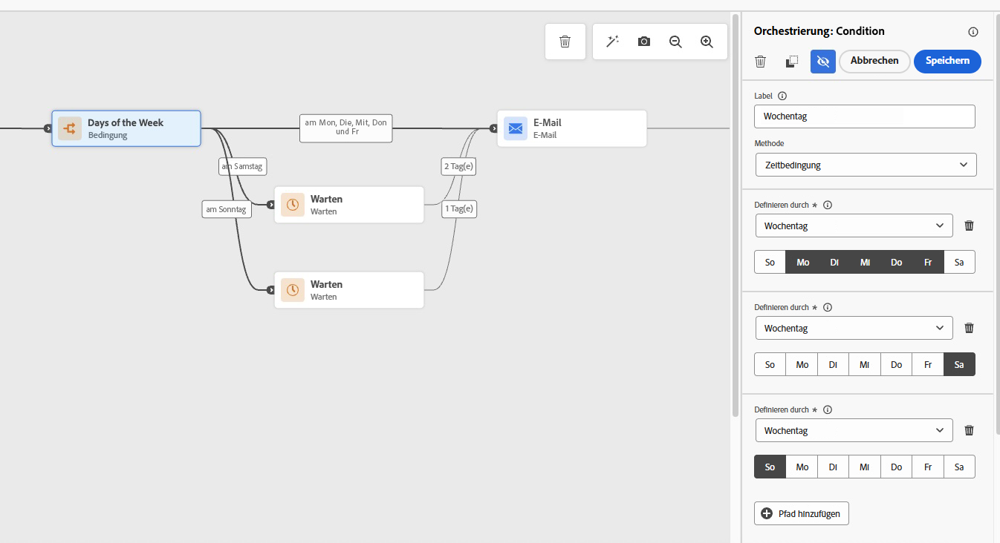
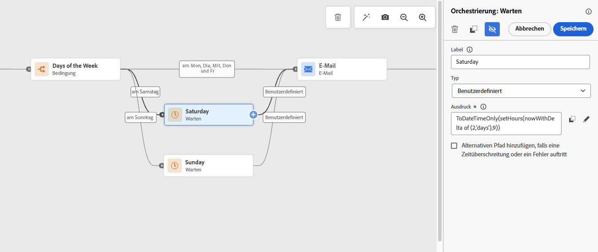

# E-Mails nur an Wochentagen senden {#send-emails-only-on-weekdays}

Dieser Anwendungsfall zeigt, wie Sie eine Journey in Adobe Journey Optimizer konfigurieren, die E-Mails nur an Werktagen (Montag bis Freitag) sendet. Bei Profilen, die an Wochenenden (Samstag oder Sonntag) auf die Journey zugreifen, werden E-Mails automatisch in die Warteschlange gestellt und am Montag zu einer bestimmten Zeit versendet. Dies gewährleistet eine optimale Interaktion durch den Versand von Nachrichten während der Arbeitswoche.

## Anwendungsfall - Übersicht

**Die Herausforderung**: Sicherstellen, dass E-Mails nur an Wochentagen gesendet werden, auch wenn Profile am Wochenende auf die Journey gelangen können. Für Wochenendeinträge sollten E-Mails am Montag zu einer bestimmten Zeit in die Warteschlange gestellt und gesendet werden.

**Die Lösung**: Verwenden Sie eine Aktivität vom Typ Bedingung , um den Wochentag zu identifizieren. Bei Wochenendeinträgen wird die E-Mail durch Warteaktivitäten mit benutzerdefinierten Formeln bis Montag verzögert. Wochentagseinträge gehen direkt zum Schritt E-Mail-Versand über.

Dieser Ansatz zeigt Ihnen, wie Sie:

* Bedingungsaktivität verwenden, um zu überprüfen, ob der aktuelle Tag Samstag oder Sonntag ist
* Implementieren von Warteaktivitäten mit benutzerdefinierten Formeln für Wochenendeinträge
* Wochenend-E-Mails für Montag-Versand zu einer bestimmten Stunde in die Warteschlange stellen
* Sofortiges Senden von E-Mails für Wochentagseinträge (Montag-Freitag)

Dieser Ansatz eignet sich ideal für:

* B2B-E-Mail-Kampagnen (Business-to-Business)
* Professionelle Newsletter und Mitteilungen
* Geschäftliche Ankündigungen
* Arbeitsbezogene Produktaktualisierungen
* Jede Marketing-Kampagne, bei der ein Versand am Wochenende nicht gewünscht ist

>[!VIDEO]
>
>Sehen Sie sich das Schritt-für-Schritt[Video-Tutorial](#how-to-video) unten auf dieser Seite an, um die vollständige Implementierung zu sehen.

## Voraussetzungen

Um diesen Anwendungsfall zu implementieren, benötigen Sie:

* Eine aktive Adobe Journey Optimizer-Instanz
* Eine konfigurierte [E-Mail-Kanaloberfläche](../configuration/channel-surfaces.md)
* Ein [Zielgruppe](../audience/about-audiences.md) oder [Ereignis](../event/about-events.md) zum Trigger der Journey
* Grundlegendes zu [Journey-Bedingungen](condition-activity.md) und [Ausdrücken](expression/expressionadvanced.md)

## Implementierungsschritte

### Schritt 1: Journey erstellen

1. Navigieren Sie zu **[!UICONTROL Journey-Verwaltung]** > **[!UICONTROL Journey]** in Adobe Journey Optimizer.

1. Klicken Sie **[!UICONTROL Journey erstellen]**, um eine neue Journey zu erstellen. [Erfahren Sie mehr über das Erstellen von Journey](journey-gs.md)

1. Konfigurieren Sie die Journey-Eigenschaften:
   * **Name**: E-Mail-Kampagne am Wochentag
   * **Beschreibung**: Sendet E-Mails nur an Wochentagen (Montag bis Freitag)
   * Den entsprechenden Namespace für Ihren Anwendungsfall festlegen

[Weitere Informationen zu Journey-Eigenschaften](journey-properties.md)

1. Journey-Einstiegspunkt auswählen:
   * **[Zielgruppe lesen](read-audience.md)**: Für Batch-Kampagnen, die auf eine bestimmte Zielgruppe abzielen
   * **[Ereignis](../event/about-events.md)**: Für Journey, die in Echtzeit ausgelöst werden und auf dem Kundenverhalten basieren

### Schritt 2: Fügen Sie die Aktivität Bedingung hinzu, um den Wochentag zu überprüfen

Fügen Sie direkt nach dem Start des Journey eine **[!UICONTROL Bedingung]**-Aktivität hinzu, um zu überprüfen, ob der aktuelle Tag Samstag oder Sonntag ist. Dadurch wird der Workflow entsprechend verzweigt.

1. Ziehen Sie eine Aktivität **[!UICONTROL Bedingung]** auf die Arbeitsfläche nach Ihrem Einstiegspunkt. [Weitere Informationen zu Bedingungsaktivitäten](condition-activity.md)

1. Klicken Sie auf die Aktivität Bedingung , um das Konfigurationsfenster zu öffnen.

1. Wählen **[!UICONTROL Abschnitt „Bedingungstyp]** die Option **[!UICONTROL Data Source-Bedingung]**. [Weitere Informationen zu Bedingungstypen](condition-activity.md#data_source_condition)

### Schritt 3: Konfigurieren der Bedingung, um Samstag zu identifizieren

Erstellen Sie den ersten Bedingungspfad zur Identifizierung von Samstagseinträgen.

1. Klicken Sie auf **[!UICONTROL Erweiterter Modus]**, um den Ausdruckseditor zu öffnen. [Erfahren Sie mehr über den Ausdruckseditor](expression/expressionadvanced.md)

1. Geben Sie den folgenden Ausdruck ein, um zu überprüfen, ob der aktuelle Tag Samstag ist:

   ```javascript
   dayOfWeek(now()) == 7
   ```

   Dabei wird die `dayOfWeek()`-Funktion mit `now()` verwendet, um den aktuellen Tag abzurufen. [Weitere Informationen zu Datumsfunktionen](functions/date-functions.md)

   

1. Klicken Sie **[!UICONTROL OK]**, um die Bedingung zu speichern.

1. Beschriften Sie diesen Pfad mit „Samstag“.

### Schritt 4: Einen zweiten Bedingungspfad für Sonntag hinzufügen

1. Klicken Sie in der Aktivität Bedingung auf **[!UICONTROL Pfad hinzufügen]**, um eine zweite Bedingung zu erstellen.

1. Geben Sie im Ausdruckseditor für den zweiten Pfad Folgendes ein:

   ```javascript
   dayOfWeek(now()) == 1
   ```

   Dadurch wird geprüft, ob der aktuelle Tag Sonntag ist.

1. Beschriften Sie diesen Pfad mit „Sonntag“.

1. Aktivieren Sie **[!UICONTROL Pfad für andere Fälle als die obigen anzeigen]**, um einen Pfad für Wochentagseinträge (Montag bis Freitag) zu erstellen.

   **Wert für Wochentag:**
   * 1= Sonntag
   * 2= Montag
   * 3= Dienstag
   * 4= Mittwoch
   * 5= Donnerstag
   * 6= Freitag
   * 7= Samstag

>[!NOTE]
>
>Die `dayOfWeek()` gibt eine Ganzzahl zurück, die den Wochentag darstellt, wobei 1 Sonntag und 7 Samstag ist. Dies entspricht dem ISO-8601-Standard für die Tagesnummerierung.

### Schritt 4: Warteaktivitäten für Wochenendeinträge konfigurieren

Verwenden Sie für Profile, die am Samstag oder Sonntag eintreten, Warteaktivitäten mit benutzerdefinierten Formeln, um die E-Mail bis Montag zur gewünschten Stunde zu verzögern.



**Für den Samstagspfad:**

1. Fügen Sie eine Aktivität **[!UICONTROL Warten]** hinzu. [Weitere Informationen zu Warteaktivitäten](wait-activity.md)

1. Wählen **[!UICONTROL als Wartetyp]** Dauer“ aus.

1. Klicken Sie **[!UICONTROL Erweiterter Modus]**, um eine benutzerdefinierte Formel einzugeben.

1. Geben Sie die folgende Formel ein, um bis Montag um 9 Uhr zu warten:

   ```javascript
   toDuration("PT" + (48 - getHourOfDay(now())) + "H")
   ```

   Oder verwenden Sie diese alternative Formel:

   ```javascript
   setHours(nowWithDelta(2, "days"), 9)
   ```

   **Erklärung**: Diese Formel berechnet die Wartezeit von Samstag bis Montag um 9 Uhr morgens. Der Wert X=2 stellt 2 Tage vor dar (Samstag + 2 Tage = Montag). [Weitere Informationen zu Datumsfunktionen](functions/date-functions.md#nowWithDelta)

**Für den Sonntagspfad:**

1. Fügen Sie eine Aktivität **[!UICONTROL Warten]** hinzu.

1. Wählen **[!UICONTROL als Wartetyp]** Dauer“ aus.

1. Klicken Sie **[!UICONTROL Erweiterter Modus]**, um eine benutzerdefinierte Formel einzugeben.

1. Geben Sie die folgende Formel ein, um bis Montag um 9 Uhr zu warten:

   ```javascript
   setHours(nowWithDelta(1, "days"), 9)
   ```

   **Erklärung**: Diese Formel wartet einen Tag (Sonntag + 1 Tag = Montag) und setzt die Zeit auf 9 Uhr. Der Wert X=1 bedeutet 1 Tag vorwärts und H=9 bedeutet 9 Uhr nachts.

>[!TIP]
>
>Sie können den Parameter Stunde (H) jederzeit anpassen, wenn die E-Mail am Montag gesendet werden soll. Ändern Sie beispielsweise 9 bis 10 für 10 Uhr oder 14 für 14 Uhr.

### Schritt 5: Konfigurieren des Wochentagspfads

Für den **Wochentagspfad** (Montag bis Freitag):

1. Fahren Sie direkt fort, um eine **[!UICONTROL E-Mail]**-Aktionsaktivität hinzuzufügen. Für Wochentagseinträge ist keine Warteaktivität erforderlich. [Weitere Informationen zu E-Mail-Aktionen](journeys-message.md)

1. Konfigurieren der E-Mail-Nachricht:
   * Wählen oder erstellen Sie Ihren [E-Mail-Inhalt](../email/get-started-email-design.md)
   * Konfigurieren der [E-Mail-Parameter](../email/email-settings.md)
   * Richten Sie [Personalisierung](../personalization/personalize.md) nach Bedarf ein

1. Fügen Sie nach **[!UICONTROL E-Mail]** Aktivität „Ende“ hinzu. [Weitere Informationen zu Endaktivitäten](end-activity.md)

### Schritt 6: Wochenendpfade mit E-Mails zusammenführen

Führen Sie nach den Warteaktivitäten für den Samstag- und den Sonntagspfad diese mit derselben E-Mail-Aktionsaktivität zusammen:

1. Fügen Sie in der Aktivität „Warten am Samstag“ die Aktion **[!UICONTROL E-Mail]** hinzu.

1. Stellen Sie von der Aktivität Sonntagswarte aus eine Verbindung zur gleichen E-Mail-Aktion her.

1. Der Wochentagspfad sollte auch zu dieser E-Mail-Aktion fließen.


### Schritt 7: Journey testen

Testen Sie vor der Veröffentlichung Ihre Journey-Logik gründlich im Testmodus von Adobe Journey Optimizer, um zu bestätigen, dass alles erwartungsgemäß funktioniert:

1. Klicken Sie auf **[!UICONTROL Test]**-Schaltfläche oben rechts.

1. Testmodus aktivieren. [Erfahren Sie, wie Sie Ihren Journey testen können](testing-the-journey.md)

1. Erstellen [Testprofile](../audience/creating-test-profiles.md) mit simulierten Eingabezeiten an verschiedenen Wochentagen:
   * **Samstagseingabe**: Überprüfen Sie, ob das Profil dem Samstagspfad folgt, am Montag zur angegebenen Stunde wartet und E-Mails erhält
   * **Sonntagseintrag**: Überprüfen Sie, ob das Profil dem Sonntagspfad folgt, am Montag zur angegebenen Stunde wartet und E-Mails erhält
   * **Montag-Freitag-Einträge**: Überprüfen Sie, ob E-Mails sofort und ohne Wartezeit gesendet werden

1. Überprüfen Sie die Journey-Visualisierung, um sicherzustellen, dass die Profile den richtigen bedingten Pfaden folgen (Samstag, Sonntag oder Wochentag).

1. Prüfen Sie die Journey auf Fehler oder Warnungen. [Erfahren Sie mehr über die Fehlerbehebung bei Journey](troubleshooting.md)

1. Überprüfen Sie, ob die Warteformeln die richtige Dauer für Ihre gewünschte Montag-Lieferzeit berechnen.

>[!IMPORTANT]
>
>Testen Sie Ihre Journey-Logik immer gründlich, bevor Sie sie in der Produktionsumgebung veröffentlichen. Verwenden Sie den Testmodus, um verschiedene Eintrittsszenarien zu simulieren und zu überprüfen, ob die Wochenendeinträge korrekt in die Warteschlange der Montagsbereitstellung gestellt werden. [Erfahren Sie mehr über Best Practices beim Journey-Testen](testing-the-journey.md)

### Schritt 8: Veröffentlichen des Journey

Sobald der Test abgeschlossen ist:

1. Klicken **[!UICONTROL oben]** auf „Veröffentlichen“.

1. Bestätigen Sie die Veröffentlichung. [Erfahren Sie mehr über das Veröffentlichen von Journey](publish-journey.md)

1. Überwachen Sie die Journey-Leistung mithilfe von [Journey](report-journey.md)Berichten und [Live-Berichten](../reports/journey-live-report.md).

## Best Practices und Überlegungen

### Optimieren des Workflows mit erweiterten Formeln

So verbessern Sie Ihren Workflow und bewältigen komplexere Geschäftsanforderungen:

* **Komplexe Geschäftszeiten**: Erweitern Sie die Formeln, um Feiertage, Zeitzonen oder bestimmte Geschäftszeiten über den grundlegenden Wochentag-Check hinaus zu berücksichtigen.

* **Benutzerdefinierte Versandzeiten**: Passen Sie den Stundenparameter (H) in der Warteformel an Ihre optimale Versandzeit an. Wenn beispielsweise 10 Uhr bessere Interaktionsraten aufweist, ändern Sie die Formel so, dass sie Stunde 10 verwendet.

* **Unterstützung mehrerer Zeitzonen**: Erwägen Sie, separate Journey für verschiedene geografische Regionen zu erstellen, um die Montagsbereitstellung in der lokalen Zeitzone jeder Empfängerin und jedes Empfängers sicherzustellen.

### Zeitzonen-Management

Die `now()` und die Journey-Ausführung verwenden die auf Journey-Ebene konfigurierte Zeitzone. Beachten Sie Folgendes:

* **Journey-Zeitzone**: Stellen Sie sicher, dass die Journey-Zeitzone Ihren Anforderungen entspricht. Konfigurieren Sie dies vor der Veröffentlichung in den Journey-Eigenschaften. [Weitere Informationen zum Zeitzonen-Management](timezone-management.md).

* **Globale Zielgruppen**: Wenn Ihre Zielgruppe mehrere Zeitzonen umfasst, erfolgt die Prüfung am Wochentag in der konfigurierten Zeitzone der Journey und nicht in der lokalen Zeitzone der Empfängerin bzw. des Empfängers.

* **Lokalisierte Planung**: Erstellen Sie für einen zeitzonenspezifischen Versand separate Journey für verschiedene Regionen oder verwenden Sie die Zeitzoneneinstellungen in der Aktivität „Zielgruppe lesen“.

### Journey-Eingabe und -Timing

* **Journey lesen**: Planen Sie für Batch-Journey [Zielgruppe lesen](read-audience.md#schedule) den Trigger zu einem Zeitpunkt, der für Ihre Zielgruppe sinnvoll ist. Frühe Morgenausführungen (z. B. 6:00 Uhr morgens) sind in der Geschäftskommunikation üblich.

* **Ereignisbasierte Journey**: Die Bedingung wird sofort beim Empfang des Ereignisses ausgewertet. Profile, die an Wochenenden eintreten, warten automatisch bis Montag. [Weitere Informationen zu Ereignissen](../event/about-events.md)

* **Wartezeitüberschreitungsüberlegungen**: Stellen Sie sicher, dass Ihre [Journey-Zeitüberschreitungseinstellungen ](journey-properties.md#timeout) die maximale Wartezeit (bis zu 2 Tage von Samstag bis Montag) berücksichtigen.

### Tests sind unerlässlich

Wie im Implementierungshandbuch betont, testen Sie Ihre Journey-Logik immer, um zu bestätigen, dass alles wie erwartet funktioniert:

* Verwenden Sie **Testmodus** um verschiedene Eintrittsszenarien zu simulieren, ohne echte E-Mails zu senden
* Testen Sie alle drei Pfade: Samstagseinträge, Sonntagseinträge und Wochentagseinträge
* Überprüfen, ob die Berechnungen der Wartezeit korrekt sind
* Versand am Montag zur angegebenen Uhrzeit bestätigen
* Überprüfen der Journey-Visualisierung, um ein korrektes Pfadrouting sicherzustellen

### Wiedereintritt und Häufigkeit

* Konfigurieren Sie für wiederkehrende Kampagnen die Einstellungen **[!UICONTROL erneuten Eintritt]** entsprechend. [Weitere Informationen zu den Einstellungen für den erneuten Eintritt](entry-management.md)

* Wenn Profile erneut auf die Journey zugreifen können, werden sie jedes Mal einer Wochentagsprüfung unterzogen, um sicherzustellen, dass die Wochenendeinträge immer für Montag in der Warteschlange stehen.

* Erwägen Sie das Hinzufügen [Regeln für die Frequenzlimitierung](../conflict-prioritization/journey-capping.md), um Übermeldungen zu vermeiden, wenn Profile häufig erneut eintreten können.

## Erweiterte Varianten

### Zielgruppenbestimmung nach bestimmten Tagen

Um E-Mails nur an bestimmten Tagen (z. B. Dienstag und Donnerstag) zu senden, ändern Sie die Bedingung:

```javascript
dayOfWeek(now()) == 3 or dayOfWeek(now()) == 5
```

Fügen Sie für alle anderen Tage eine Warteaktivität hinzu, die die Anzahl der Tage bis zum nächsten Dienstag oder Donnerstag berechnet.

### Unterschiedliche Versandzeiten für verschiedene Tage

Sie können mehrere Pfade mit unterschiedlichen Warteformeln für unterschiedliche Wochenendverhaltensweisen erstellen:

* **Versand am Samstag → Mittwoch**: Verwenden Sie `nowWithDelta(4, "days")`
* **Versand am Sonntag → Dienstag**: Verwenden Sie `nowWithDelta(2, "days")`

Dies ermöglicht mehr Flexibilität in Ihrem Versandzeitplan.

### Versand während der Geschäftszeiten

Um den Versand während der Geschäftszeiten sicherzustellen, passen Sie den Stundenparameter in Ihrer Warteformel an. Zum Beispiel für die Lieferung um 14 Uhr statt um 9 Uhr:

```javascript
setHours(nowWithDelta(1, "days"), 14)
```

Sie können nach dem Senden auch eine zweite Bedingung hinzufügen, um zu überprüfen, ob die aktuelle Zeit innerhalb der Geschäftszeiten liegt, bevor Sie senden.

### Urlaubsausschluss

Um Feiertage auszuschließen, fügen Sie einen zusätzlichen Bedingungspfad hinzu, der nach bestimmten Daten sucht:

```javascript
toDateTimeOnly(now()) == toDateTimeOnly("2024-12-25T00:00:00")
```

Wenn die Bedingung mit einem Feiertag übereinstimmt, fügen Sie eine Warteaktivität hinzu, um bis zum nächsten Geschäftstag zu verzögern. [Erfahren Sie mehr über Datumsvergleichsfunktionen](functions/date-functions.md)

## Verwandte Themen

* [Über Bedingungsaktivitäten](condition-activity.md) - Erfahren Sie, wie Sie verschiedene Pfade in Ihrem Journey erstellen.
* [Bedingungen auf einer Journey verwenden](conditions.md) - Detaillierte Anleitung zu Journey-Bedingungen
* [Warteaktivität](wait-activity.md) - Konfigurieren der Wartezeiten und Formeln
* [Datumsfunktionen](functions/date-functions.md) - Vollständige Referenz für Datums- und Uhrzeitfunktionen
* [Ausdruckseditor](expression/expressionadvanced.md) - Erstellen komplexer Ausdrücke
* [Journey testen](testing-the-journey.md) - Validieren der Journey-Logik vor der Veröffentlichung
* [Zeitzonenverwaltung](timezone-management.md) - Verarbeiten Sie verschiedene Zeitzonen in Journey
* [Best Practices für das Journey](journey-gs.md#best-practices) - Empfohlene Ansätze für das Journey-Design

## Anleitungsvideo

Erfahren Sie, wie Sie mit Adobe Journey Optimizer E-Mails nur an Wochentagen senden. Dieses Video zeigt die schrittweise Implementierung von Bedingungsaktivitäten und Warteformeln, um Wochenendeinträge für die Montagsbereitstellung in die Warteschlange zu stellen.

>[!VIDEO](https://video.tv.adobe.com/v/3469330?quality=12&learn=on)

## Weitere Ressourcen

* [Dokumentation zum Ausdruckseditor](expression/expressionadvanced.md) - Erstellen und Überprüfen von Journey-Ausdrücken
* [Journey-Designer-Handbuch](using-the-journey-designer.md) - Beherrschen der Journey-Arbeitsfläche
* [Übersicht über Journey-Anwendungsfälle](jo-use-cases.md) - Erkunden Sie mehr Journey-Muster und -Beispiele
* [Community-Blogpost: Nur an Wochentagen E-Mails senden](https://experienceleaguecommunities.adobe.com/t5/journey-optimizer-blogs/how-to-send-emails-only-on-weekdays-in-adobe-journey-optimizer/ba-p/760400){target="_blank"} - Original-Blogpost mit detaillierten Beispielen

