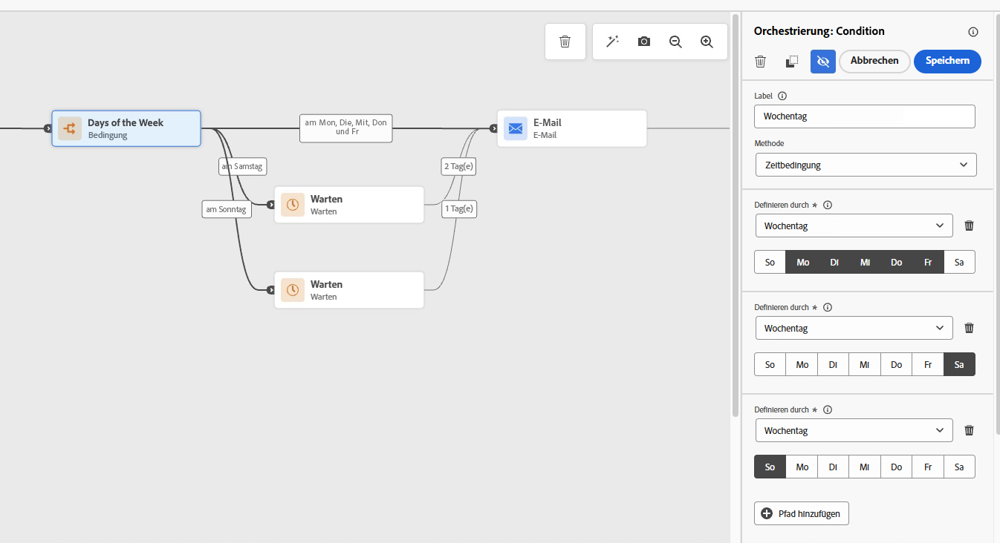
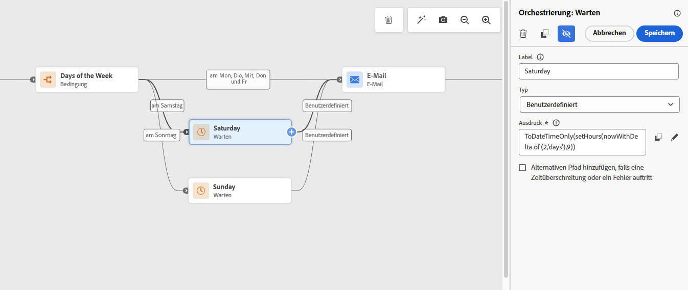

# Senden von E-Mails nur an Wochentagen {#send-emails-only-on-weekdays}

>[!BEGINSHADEBOX]

**Auf dieser Seite:** Erfahren Sie, wie Sie eine Journey konfigurieren, die E-Mails nur an Wochentagen sendet und Wochenendeinträge für den Montag-Versand mithilfe einer Bedingungsaktivität in die Warteschlange stellt. Außerdem erfahren Sie, wie Sie Aktivitäten mit benutzerdefinierten Formeln abwarten können.

>[!ENDSHADEBOX]

Dieser Anwendungsfall zeigt, wie Sie eine Journey in [!DNL Adobe Journey Optimizer] konfigurieren, die E-Mails nur an Werktagen (Montag bis Freitag) sendet. Bei Profilen, die an Wochenenden (Samstag oder Sonntag) in die Journey eintreten, werden E-Mails automatisch in die Warteschlange gestellt und am Montag zu einer festgelegten Zeit versendet. Dies gewährleistet optimale Interaktion, da Nachrichten während der Arbeitswoche versendet werden.

## Anwendungsfälle – Überblick

**Die Herausforderung**: Sicherstellen, dass E-Mails nur an Werktagen gesendet werden, auch wenn Profile am Wochenende in die Journey eintreten. Für Eintritte am Wochenende sollten E-Mails in die Warteschlange gestellt und am Montag zu einer festgelegten Zeit gesendet werden.

**Die Lösung**: Verwenden Sie eine Bedingungsaktivität, um den Wochentag zu identifizieren. Bei Eintritten am Wochenende wird die E-Mail durch Warteaktivitäten mit benutzerdefinierten Formeln bis Montag verzögert. Eintritte an Werktagen gehen direkt zum Schritt für den E-Mail-Versand über.

Dieser Ansatz zeigt, wie Sie mit einer Bedingungsaktivität überprüfen, ob der aktuelle Tag ein Samstag oder Sonntag ist, Warteaktivitäten mit benutzerdefinierten Formeln für Eintritte am Wochenende implementieren, Wochenend-E-Mails zum Versand am Montag zu einer bestimmten Uhrzeit in die Warteschlange stellen und E-Mails für Eintritte an Werktagen (Montag bis Freitag) sofort senden.

Dies ist ideal für B2B-E-Mail-Kampagnen (Business-to-Business), professionelle Newsletter und Kommunikation, geschäftliche Ankündigungen, arbeitsbezogene Produktaktualisierungen und alle Marketing-Kampagnen, bei denen ein Versand am Wochenende nicht gewünscht ist.

>[!NOTE]
>
>Um diesen Anwendungsfall zu implementieren, benötigen Sie eine aktive Adobe Journey Optimizer-Instanz mit einer konfigurierten [E-Mail-Kanaloberfläche](../configuration/channel-surfaces.md), einer [Zielgruppe](../audience/about-audiences.md) oder einem [Ereignis](../event/about-events.md) zum Auslösen der Journey sowie ein grundlegendes Verständnis von [Journey-Bedingungen](conditions.md) und [Ausdrücken](expression/expressionadvanced.md).

## Implementierungsschritte

Führen Sie diese Schritte aus, um den E-Mail-Fluss nur für Wochentage zu erstellen.

### Schritt 1: Erstellen der Journey

1. Navigieren Sie zu **[!UICONTROL Journey-]** > **[!UICONTROL Journey]** in [!DNL Adobe Journey Optimizer].

1. Klicken Sie auf **[!UICONTROL Journey erstellen]**, um [eine neue Journey zu erstellen](journey-gs.md).

1. Konfigurieren Sie die [Journey-Eigenschaften](journey-properties.md).

1. Wählen Sie den Journey-Eintrittspunkt aus:
   * **[Zielgruppe lesen](read-audience.md)**: Für Batch-Kampagnen, die eine bestimmte Zielgruppe ansprechen
   * **[Ereignis](../event/about-events.md)**: Für Journeys, die in Echtzeit basierend auf dem Kundenverhalten ausgelöst werden

### Schritt 2: Fügen Sie eine Aktivität vom Typ Bedingung hinzu, um den Wochentag zu überprüfen

Fügen Sie direkt nach dem Start der Journey eine Aktivität des Typs **[!UICONTROL Bedingung]** hinzu, um zu prüfen, ob der aktuelle Tag ein Samstag oder Sonntag ist. Dadurch wird der Workflow entsprechend verzweigt.

1. Ziehen Sie eine Aktivität [**[!UICONTROL Optimieren &#x200B;]**&#x200B;auf &#x200B;](optimize.md) Arbeitsfläche nach Ihrem Einstiegspunkt.

1. Klicken Sie auf die Aktivität des Typs **[!UICONTROL Bedingung]**, um das zugehörige Konfigurations-Panel zu öffnen.

1. Wählen Sie **[!UICONTROL Zeitbedingung]** als Bedingungstyp aus.

1. Wählen Sie **[!UICONTROL Wochentag]** als Zeitfilteroption aus.

1. Wählen Sie als **ersten Pfad (Samstag)** nur **Samstag** aus. Beschriften Sie diesen Pfad mit „Samstag“.

1. Klicken Sie auf **[!UICONTROL Pfad hinzufügen]**, um eine zweite Bedingung zu erstellen.

1. Wählen Sie als **zweiten Pfad (Sonntag)** die Option **[!UICONTROL Wochentag]** aus und wählen Sie nur **Sonntag**. Beschriften Sie diesen Pfad mit „Sonntag“.

   


1. Aktivieren Sie **[!UICONTROL Pfad für andere Fälle als die obigen anzeigen]**, um einen Pfad für Eintritte an Werktagen (Montag bis Freitag) zu erstellen.

>[!NOTE]
>
>Die Zeitzone, die für die Auswertung des Wochentags verwendet wird, wird auf Journey-Ebene in den Journey-Eigenschaften definiert, nicht auf Bedingungsebene. Die in der Formel verwendete [Zeitzone](timezone-management.md) der Journey ist die konfigurierte Zeitzone der Journey, nicht die der Empfängerin oder des Empfängers.

### Schritt 3: Warteaktivitäten für Wochenendeinträge konfigurieren

Verwenden Sie für Profile, die am Samstag oder Sonntag eintreten, Aktivitäten des Typs **[!UICONTROL Warten]** mit benutzerdefinierten Formeln, um die E-Mail bis zur gewünschten Uhrzeit am Montag zu verschieben.

Verwenden Sie in der Aktivität **[!UICONTROL Warten]** die folgende Formel:

```javascript
toDateTimeOnly(setHours(nowWithDelta(X, "days"), H))
```

Dabei gilt:

* **X** ist die Anzahl der Tage, die gewartet werden soll:
   * Verwenden Sie **2** für Samstag (bis Montag warten)
   * Verwenden Sie **1** für Sonntag (bis Montag warten)
* **H** ist die Uhrzeit, zu der Sie senden möchten (z. B. **9** für 9 Uhr)


**Beispiel für Samstag:**

```javascript
toDateTimeOnly(setHours(nowWithDelta(2, "days"), 9))
```

**Beispiel für Sonntag:**

```javascript
toDateTimeOnly(setHours(nowWithDelta(1, "days"), 9))
```

Implementierung in der Journey:

1. Fügen Sie im Pfad **Samstag** nach der Bedingung eine Aktivität **[!UICONTROL Warten]** hinzu.

1. Wählen Sie **[!UICONTROL Dauer]** als Wartetyp aus.

1. Klicken Sie auf **[!UICONTROL Erweiterter Modus]**, um die benutzerdefinierte Formel einzugeben.

1. Geben Sie Folgendes ein: `toDateTimeOnly(setHours(nowWithDelta(2, "days"), 9))`

   

1. Wiederholen Sie dieselben Schritte für den Pfad **Sonntag** wie folgt: `toDateTimeOnly(setHours(nowWithDelta(1, "days"), 9))`

>[!TIP]
>
>Für komplexere Geschäftszeiten (z. B. nur zwischen 9 und 17 Uhr an Werktagen) können Sie die Formel und die Bedingungen zusätzlich erweitern.

### Schritt 4: Werktagsverzweigung

Für Profile, die von Montag bis Freitag eintreten, fahren Sie wie gewohnt mit dem Schritt zum E-Mail-Versand fort.

1. Fügen Sie im Pfad **Werktag** (dem Pfad „Andere Fälle“) direkt eine Aktionsaktivität **[!UICONTROL E-Mail]** hinzu. Für Eintritte an Werktagen ist keine Aktivität **[!UICONTROL Warten]** erforderlich.

1. Konfigurieren Sie Ihre E-Mail-Nachricht wie benötigt.

### Schritt 5: Abschließen des Journey Flows

Nach den Aktivitäten **[!UICONTROL Warten]** für die Pfade „Samstag“ und „Sonntag“ sollten alle drei Pfade (Samstag, Sonntag und Werktag) zur selben Aktivität für die Aktion **[!UICONTROL E-Mail]** fließen. Fügen Sie nach der E-Mail eine Aktivität **[!UICONTROL Ende]** hinzu.

### Visuelle Workflow-Übersicht

Der vollständige Journey-Workflow folgt dieser Logik:

* **Start** → **[!UICONTROL Bedingung]**: Ist heute Samstag oder Sonntag?
   * **Ja (Samstag):** **[!UICONTROL Warten]** bis Montag 9 Uhr → **[!UICONTROL E-Mail senden]**
   * **Ja (Sonntag):** **[!UICONTROL Warten]** bis Montag 9 Uhr → **[!UICONTROL E-Mail senden]**
   * **Nein (Montag–Freitag):** Sofort **[!UICONTROL E-Mail senden]**

Dadurch wird sichergestellt, dass alle E-Mails nur an Werktagen gesendet werden und die Eintritte an Wochenenden automatisch für den Versand am Montag in die Warteschlange gestellt werden.

### Schritt 6: Testen der Journey

Testen Sie vor der Veröffentlichung Ihre Journey-Logik gründlich im Testmodus von [!DNL Adobe Journey Optimizer], um zu bestätigen, dass alles erwartungsgemäß funktioniert:

1. Klicken Sie hierfür oben rechts auf die Schaltfläche **[!UICONTROL Testen]**.

1. Aktivieren Sie den [Testmodus](testing-the-journey.md).

1. Erstellen Sie [Testprofile](../audience/creating-test-profiles.md) mit simulierten Eintrittszeiten an verschiedenen Wochentagen:
   * **Eintritt am Samstag**: Prüfen Sie, ob das Profil dem Pfad „Samstag“ folgt, wartet und am Montag zur angegebenen Uhrzeit E-Mails erhält
   * **Eintritt am Sonntag**: Prüfen Sie, ob das Profil dem Pfad „Sonntag“ folgt, wartet und am Montag zur angegebenen Uhrzeit E-Mails erhält
   * **Eintritte Montag–Freitag**: Prüfen Sie, ob E-Mails sofort und ohne Wartezeit gesendet werden

1. Prüfen Sie die Journey-Visualisierung, um sicherzustellen, dass die Profile den richtigen Bedingungspfaden folgen (Samstag, Sonntag oder Werktag).

1. Prüfen Sie auf [Fehler oder Warnungen](troubleshooting.md) in der Journey.

1. Prüfen Sie, ob die Warteformeln die richtige Dauer für die gewünschte Versandzeit am Montag berechnen.

>[!IMPORTANT]
>
>Testen Sie Ihre Journey-Logik immer im Testmodus, um sicherzustellen, dass sich die Warteaktivitäten wie erwartet verhalten. Verwenden Sie den Testmodus, um verschiedene Eintrittsszenarien zu simulieren und zu prüfen, ob die Eintritte an Wochenenden korrekt in die Warteschlange zum Versand am Montag gestellt werden. Weitere Informationen finden Sie unter [Best Practices für Journeys](testing-the-journey.md).

### Schritt 7: Veröffentlichen der Journey

Nach Abschluss der Tests:

1. Klicken Sie rechts oben auf **[!UICONTROL Veröffentlichen]**.

1. Bestätigen Sie die [Veröffentlichung](publish-journey.md).

1. Überwachen Sie die Journey-Leistung mithilfe von [Journey-Berichten](report-journey.md) und [Live-Berichten](../reports/journey-live-report.md).


## Verwandte Themen

* [Aktivitäten optimieren](optimize.md) - Erfahren Sie, wie Sie verschiedene Pfade in Ihrem Journey erstellen.
* [Verwenden von Bedingungen in einer Journey](conditions.md): Detaillierte Anleitung zu Journey-Bedingungen
* [Aktivität „Warten“](wait-activity.md): Konfigurieren der Wartezeiten und Formeln
* [Datumsfunktionen](functions/date-functions.md): Vollständige Referenz für Datums- und Uhrzeitfunktionen
* [Ausdruckseditor](expression/expressionadvanced.md): Erstellen komplexer Ausdrücke
* [Best Practices für Journeys](journey-gs.md#best-practices): Empfohlene Ansätze für das Journey-Design

+++ KI-Wissensreferenz

Dieser Abschnitt enthält strukturiertes Wissen zur Unterstützung von Interpretation, Abrufen und Antworten auf Fragen zu diesem Thema.

Zum vollständigen Verständnis sollten diese Informationen mit der Dokumentation auf dieser Seite kombiniert werden. Keine der beiden Quellen ist für Einzelpersonen gedacht. Die Seite beschreibt die Funktion, während dieser Abschnitt zusätzlichen Kontext bietet, der dabei hilft, Begriffe, Absichten, Anwendbarkeit und Begrenzungen zu unterscheiden.

* **TL;DR:** Auf dieser Seite finden Sie einen Anwendungsfall, in dem Sie eine Journey schrittweise konfigurieren können, die E-Mails nur an Wochentagen sendet. Verwenden Sie dazu eine Wochentagsbedingung und benutzerdefinierte Warteformeln, um Wochenendeinträge bis Montag zu verzögern.

**intents:**

* Konfigurieren Sie eine Aktivität vom Typ Bedingung , um eine Journey je nach Wochentag (Samstag, Sonntag oder Wochentag) zu verzweigen.
* Schreiben von benutzerdefinierten Warteausdrücken mithilfe von `toDateTimeOnly(setHours(nowWithDelta(X, "days"), H))`, um Wochenendprofile bis Montag zu verzögern
* Erstellen Sie eine Drei-Pfad-Journey, die alle Pfade in einer einzigen E-Mail-Aktion zusammenführt
* Testen Sie die E-Mail-Logik nur für Wochentage mithilfe von Testprofilen mit verschiedenen simulierten Eintrittstagen.
* Veröffentlichen und Überwachen einer Journey, die den E-Mail-Versand am Wochenende unterdrückt

**Glossar:**

* **Zeitbedingung**: Ein Bedingungs-Aktivitätstyp in Journey Optimizer, der Journey-Pfade basierend auf Datums-/Uhrzeitkriterien wie Wochentag *produktspezifisch) verzweigt*
* **nowWithDelta**: Eine Ausdrucksfunktion, die den aktuellen Datums-/Uhrzeitversatz um eine angegebene Anzahl von Tagen oder anderen Einheiten zurückgibt *(produktspezifisch)*
* **setHours**: Eine Ausdrucksfunktion, die eine bestimmte Stunde auf einen bestimmten Datums-/Uhrzeitwert *produktspezifisch) festlegt*
* **toDateTimeOnly**: Eine Ausdrucksfunktion, die einen Wert in das für benutzerdefinierte Warteaktivitäten erforderliche `dateTimeOnly`-Format konvertiert *(produktspezifisch)*

**Leitplanken:**

* Die für die Wochentagsauswertung verwendete Zeitzone ist die konfigurierte Zeitzone der Journey (festgelegt in den Journey-Eigenschaften) und nicht die Zeitzone der einzelnen Empfängerin bzw. des Empfängers.
* Für diesen Anwendungsfall sind eine aktive E-Mail-Kanaloberfläche und eine Zielgruppe oder ein Ereignis zum Trigger der Journey erforderlich.
* Grundlegendes zu Journey-Bedingungen und zum erweiterten Ausdruckseditor ist eine Voraussetzung.
* Testen Sie die Journey vor der Veröffentlichung immer im Testmodus, um sicherzustellen, dass die Warteformeln die richtige Montag-Versandzeit ergeben.

**Terminologie:**

* Kanonischer Name: E-Mail-Planung am Wochentag — Akronym: Keine — Varianten: E-Mails nur am Wochentag, E-Mail-Versand während der Geschäftszeiten
* Synonyme: „Saturday path“ / „Sunday path“ = „Weekend Paths“; „Other Cases Path“ = „Weekday Path“
* Nicht verwechseln: Journey-Zeitzone (für die Wochentagsauswertung) ≠ lokale Zeitzone des Empfängers

**FAQ:**

* **F: Welche Formel verzögert einen Samstagseintrag bis Montag um 9 Uhr?** — `toDateTimeOnly(setHours(nowWithDelta(2, "days"), 9))` auf dem Samstagspfad verwenden (2 Tage vorwärts landet am Montag).
* **F: Welche Formel verzögert einen Sonntagseintrag bis Montag um 9 Uhr?** — `toDateTimeOnly(setHours(nowWithDelta(1, "days"), 9))` auf dem Sonntagspfad verwenden (1 Tag vorwärts landet am Montag).
* **F: Welche Zeitzone wird bei der Auswertung der Wochentagsbedingung verwendet?** — Die in den Journey-Eigenschaften definierte konfigurierte Zeitzone der Journey ist nicht die lokale Zeitzone der Empfängerin oder des Empfängers.
* **F: Benötigen Wochentagseinträge eine Warteaktivität?** — Nein, Profile, die montags bis freitags eintreten, gehen ohne Wartezeit direkt zur E-Mail-Aktionsaktivität über.
* **F: Wie kann ich testen, ob die Wochenendeinträge korrekt in die Warteschlange gestellt sind?** — Erstellen Sie im Testmodus Testprofile mit simulierten Samstag- und Sonntagseingabezeiten und überprüfen Sie, ob sie dem richtigen bedingten Pfad folgen, und erhalten Sie die E-Mail am Montag zur konfigurierten Stunde.

+++
