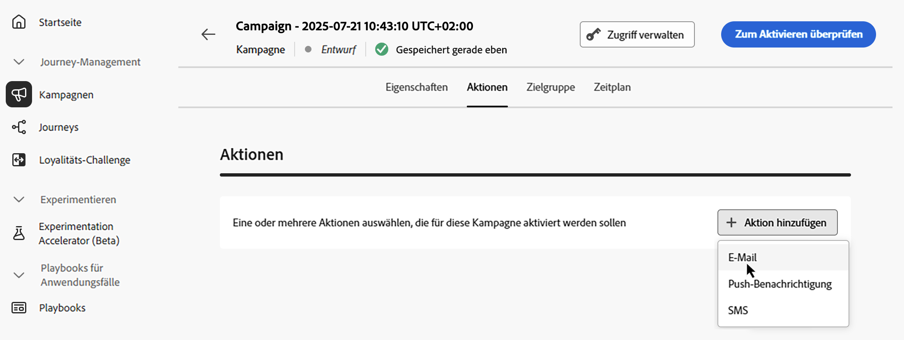
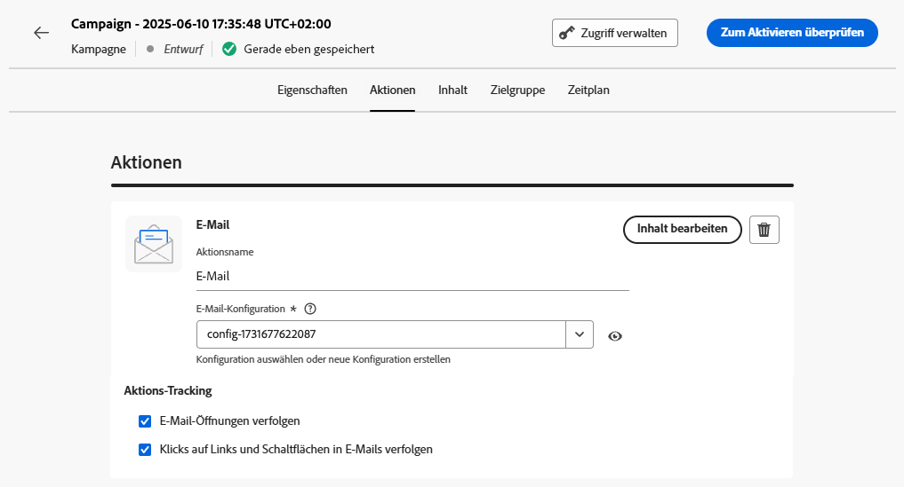

# Konfigurieren der Aktion einer Kampagne, die durch API ausgelöst wird {#api-action}

Verwenden Sie die Registerkarte **[!UICONTROL Aktionen]**, um eine Kanalkonfiguration für Ihre Nachricht auszuwählen und um zusätzliche Einstellungen wie Tracking, Inhaltsexperiment oder mehrsprachige Inhalte zu konfigurieren.

1. **Auswählen des Kanals**.

   Navigieren Sie zur Registerkarte **[!UICONTROL Aktionen]**, klicken Sie auf die Schaltfläche **[!UICONTROL Aktion hinzufügen]** und wählen Sie den Kommunikationskanal aus.

   

   >[!NOTE]
   >
   >Weitere Informationen zu den unterstützten Kanälen finden Sie in der Tabelle in diesem Abschnitt: [Kanäle in Journeys und Kampagnen](../channels/gs-channels.md#channels). Die verfügbaren Kanäle variieren je nach Ihrem Lizenzierungsmodell und Ihren Add-ons.
   >
   >Durch API ausgelöste Kampagnen mit hohem Durchsatz unterstützen derzeit nur den E-Mail-Kanal.

1. **Auswählen einer Kanalkonfiguration**

   Eine Konfiguration wird durch [Systemadmins](../start/path/administrator.md) definiert. Sie enthält alle technischen Parameter zum Senden der Nachricht, wie z. B. Kopfzeilenparameter, Subdomain, Mobile Apps usw. [Informationen zum Einrichten von Kanalkonfigurationen](../configuration/channel-surfaces.md)

   

1. **Nutzen der Optimierung**

   Verwenden Sie den Abschnitt **[!UICONTROL Nachrichtenoptimierung]**, um Inhaltsexperimente auszuführen, Targeting-Regeln zu nutzen oder erweiterte Kombinationen aus Experimenten und Targeting zu verwenden. Diese verschiedenen Optionen und die jeweils zu befolgenden Schritte werden im Abschnitt [Optimierung in Kampagnen](../content-management/gs-message-optimization.md) beschrieben.
<!--
1. **Create a content experiment**

    Use the **[!UICONTROL Content experiment]** section to define multiple delivery treatments in order to measure which one performs best for your target audience. Click the **[!UICONTROL Create experiment]** button then follow the steps detailed in this section: [Create a content experiment](../content-management/content-experiment.md).-->

1. **Hinzufügen mehrsprachiger Inhalte**

   Verwenden Sie den Abschnitt **[!UICONTROL Sprachen]**, um in Ihrer Kampagne Inhalte in mehreren Sprachen zu erstellen. Klicken Sie dazu auf die Schaltfläche **[!UICONTROL Sprachen hinzufügen]** und wählen Sie die gewünschten **[!UICONTROL Spracheinstellungen]** aus. Detaillierte Informationen zur Einrichtung und Verwendung mehrsprachiger Funktionen finden Sie in diesem Abschnitt: [Erste Schritte mit mehrsprachigen Inhalten](../content-management/multilingual-gs.md)

Je nach ausgewähltem Kommunikationskanal stehen zusätzliche Einstellungen zur Verfügung. Erweitern Sie die folgenden Abschnitte, um weitere Informationen zu erhalten.

+++**Anwenden von Begrenzungsregeln** (E-Mail, Push, SMS)

Wählen Sie in der Dropdown-Liste **[!UICONTROL Geschäftsregeln]** einen Regelsatz aus, um Begrenzungsregeln auf Ihre Kampagne anzuwenden. Mithilfe von Kanalregelsätzen können Sie die Frequenzbegrenzung nach Kommunikationstyp festlegen, um zu verhindern, dass Kundinnen und Kunden zu viele ähnliche Nachrichten erhalten. [Erfahren Sie, wie Sie mit Regelsätzen arbeiten](../conflict-prioritization/rule-sets.md)

+++

+++**Verfolgen von Interaktionen** (E-Mail, SMS).

Verwenden Sie den Abschnitt **[!UICONTROL Aktions-Tracking]**, um zu verfolgen, wie Ihre Empfängerinnen und Empfänger auf Ihre E-Mail- oder SMS-Sendungen reagieren. Die Tracking-Ergebnisse sind nach Ausführung der Kampagne im Kampagnenbericht verfügbar. [Weitere Informationen zu Kampagnenberichten](../reports/campaign-global-report-cja.md)

+++

+++**Aktivieren des Schnellversandmodus** (Push).

Der Schnellversandmodus ist ein Add-on für [!DNL Journey Optimizer], das den sehr schnellen Versand von Push-Nachrichten in großen Mengen im Rahmen von Kampagnen ermöglicht. Der Schnellversand wird verwendet, wenn eine Verzögerung beim Nachrichtenversand geschäftskritisch wäre oder wenn Sie eine dringende Push-Benachrichtigung an Mobiltelefone senden möchten, z. B. eine Eilmeldung an Benutzende, die Ihre Nachrichten-App installiert haben. [Auf dieser Seite](../push/create-push.md#rapid-delivery) erfahren Sie, wie Sie den Schnellversandmodus für Push-Benachrichtigungen aktivieren.

Weitere Informationen zur Leistung bei Verwendung des Schnellversandmodus finden Sie unter [Produktbeschreibung für Adobe Journey Optimizer](https://helpx.adobe.com/de/legal/product-descriptions/adobe-journey-optimizer.html){target="_blank"}.

+++

## Nächste Schritte {#next}

Sobald die Konfiguration und der Inhalt Ihrer Kampagne fertiggestellt sind, können Sie ihren Inhalt entwerfen. [Weitere Informationen](api-triggered-campaign-content.md)
