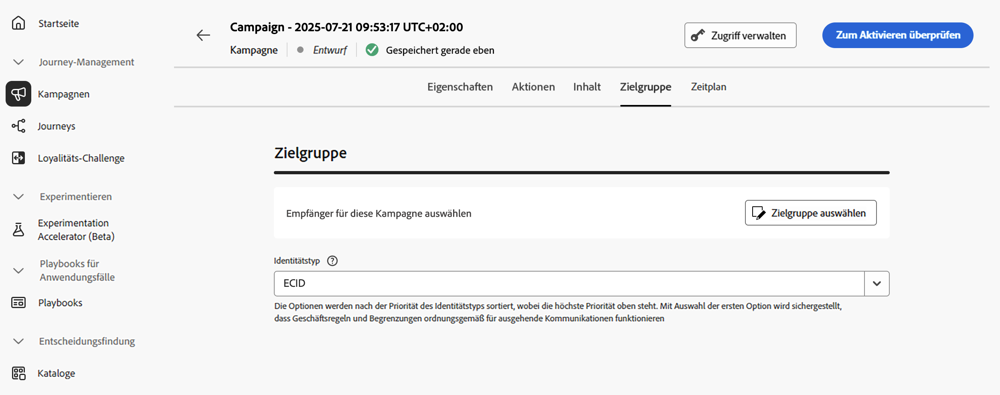
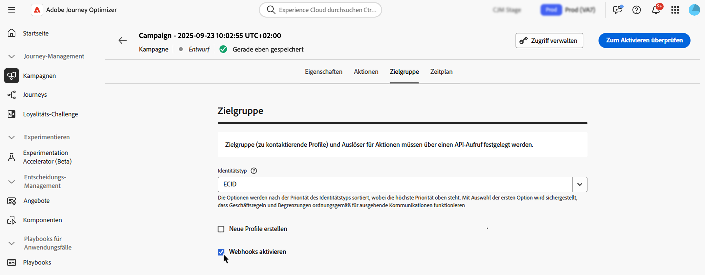

# Definieren der Zielgruppe einer Kampagne, die durch API ausgelöst wird {#api-audience}

Definieren Sie auf der Registerkarte **[!UICONTROL Zielgruppe]** die Zielgruppe der Kampagne.

## Auswählen der Zielgruppe

**Klicken Sie bei durch APIs ausgelösten Marketing-Kampagnen** auf die Schaltfläche **[!UICONTROL Zielgruppe auswählen]**, um die Liste der verfügbaren Adobe Experience Platform-Zielgruppen anzuzeigen. [Weitere Informationen zu Zielgruppen](../audience/about-audiences.md).

>[!IMPORTANT]
>
>Zielgruppen und Attribute aus der [Zielgruppenkomposition](../audience/get-started-audience-orchestration.md) stehen derzeit nicht zur Verwendung mit Healthcare Shield oder Privacy and Security Shield zur Verfügung.

**Bei durch APIs ausgelösten Transaktionskampagnen** müssen die Zielgruppenprofile im API-Aufruf definiert sein. Ein einzelner API-Aufruf unterstützt bis zu 20 eindeutige Empfängerinnen und Empfänger. Jede Empfängerin und jeder Empfänger muss über eine eindeutige Benutzer-ID verfügen. Doppelte Benutzer-IDs sind nicht zulässig. Weitere Informationen finden Sie in der [Dokumentation zum API zur Ausführung interaktiver Nachrichten](https://developer.adobe.com/journey-optimizer-apis/references/messaging/#tag/execution/operation/postIMUnitaryMessageExecution){target="_blank"}

## Auswählen des Identitätstyps

Wählen Sie im Feld **[!UICONTROL Identitätstyp]** den Schlüsseltyp aus, der zur Identifizierung der Kontakte in der ausgewählten Zielgruppe verwendet werden soll. Sie können entweder einen vorhandenen Identitätstyp verwenden oder mit dem Identity Service einen neuen erstellen. Standardmäßige Identity-Namespaces werden auf [dieser Seite](https://experienceleague.adobe.com/de/docs/experience-platform/identity/features/namespaces#standard){target="_blank"} aufgeführt.

Pro Kampagne ist nur ein Identitätstyp zulässig. Kontakte, die zu einem Segment gehören, in dem der ausgewählte Identitätstyp nicht unter den verschiedenen Identitäten vorkommt, können von der Kampagne nicht angesprochen werden. Weitere Informationen zu Identitätstypen und Namespaces sind in der [Dokumentation zu Adobe Experience Platform](https://experienceleague.adobe.com/docs/experience-platform/identity/home.html?lang=de){target="_blank"} verfügbar.

## Aktivieren der Profilerstellung bei der Ausführung einer Kampagne

In einigen Fällen müssen Sie möglicherweise Transaktionsnachrichten an Profile senden, die nicht im System sind. Wenn zum Beispiel unbekannte Benutzende versuchen, ihr Passwort auf Ihrer Website zurückzusetzen. Wenn ein Profil nicht in der Datenbank vorhanden ist, erlaubt Journey Optimizer Ihnen, es automatisch bei der Ausführung der Kampagne zu erstellen, um das Senden der Nachricht an dieses Profil zu ermöglichen.

Um die Profilerstellung bei der Ausführung einer Kampagne zu aktivieren, aktivieren Sie die Option **[!UICONTROL Neue Profile erstellen]**. Wenn diese Option deaktiviert ist, werden unbekannte Profile für jeden Versand zurückgewiesen und der API-Aufruf schlägt fehl.

>[!IMPORTANT]
>
>Diese Option ist für die **Erstellung von sehr wenigen Profilen** in einem Anwendungsfall mit großem Transaktionsversandvolumen vorgesehen, wobei ein Großteil der Profile bereits auf der Plattform vorhanden ist.
>
>Unbekannte Profile werden im **Profil-Datensatz von AJO Interactive Messaging** erstellt, und zwar in drei Standard-Namespaces (E-Mail, Telefon und ECID) für jeden ausgehenden Kanal (E-Mail, SMS und Push). Wenn Sie jedoch einen benutzerdefinierten Namespace verwenden, wird die Identität mit demselben benutzerdefinierten Namespace erstellt.
>
>Die Profilerstellung bei der Ausführung ist für [Kampagnen mit hohem Durchsatz](../campaigns/api-triggered-high-throughput.md) nicht verfügbar, da dieser Modus nicht auf Adobe-Profilen basiert. Das System überprüft nicht, ob die Profile vorhanden sind oder nicht.

## Aktivieren von Webhooks {#webhook}

Bei durch APIs ausgelösten Transaktions-Kampagnen können Sie Webhooks aktivieren, um Echtzeit-Feedback zum Ausführungsstatus Ihrer Nachrichten zu erhalten. Um dies zu tun, aktivieren Sie die Option **[!UICONTROL Webhooks aktivieren]**, um Versandstatusereignisse an einen konfigurierten Webhook zu senden.

Webhook-Konfigurationen werden zentral im Menü **[!UICONTROL Administration]**/**[!UICONTROL Kanäle]**/**[!UICONTROL Feedback-Webhook]** verwaltet. Von dort aus können Admins Webhook-Endpunkte erstellen und bearbeiten. [Informationen zum Erstellen von Feedback-Webhooks](../configuration/feedback-webhooks.md)

## Nächste Schritte {#next}

Sobald die Konfiguration und der Inhalt der Kampagne fertiggestellt sind, können Sie ihre Ausführung planen. [Weitere Informationen](api-triggered-campaign-schedule.md)
