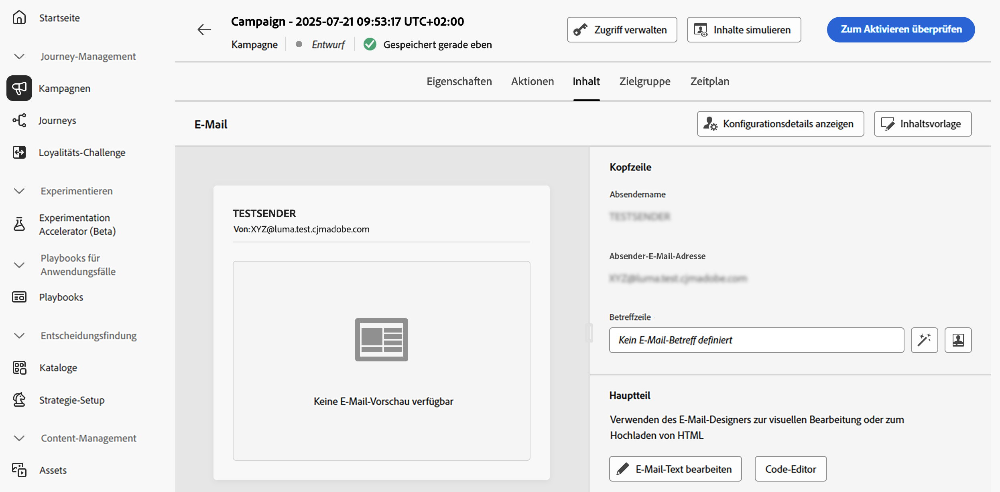
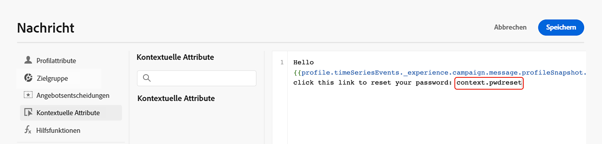
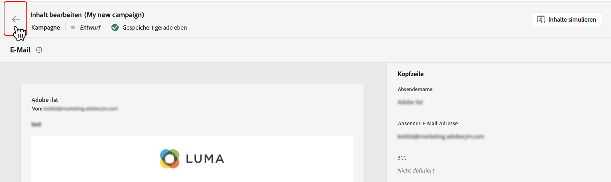

# Bearbeiten des Inhalts einer Kampagne, die durch API ausgelöst wird {#api-content}

Um den Nachrichteninhalt zu konfigurieren, navigieren Sie zur Registerkarte **[!UICONTROL Inhalt]** oder klicken Sie auf die Schaltfläche **[!UICONTROL Inhalt bearbeiten]**.

## Entwerfen des Inhalts {#design}

Der Prozess der Inhaltserstellung hängt vom ausgewählten Kanal ab. Auf den folgenden Seiten erfahren Sie, wie Sie Ihren Nachrichteninhalt erstellen:

<table style="table-layout:fixed"><tr style="border: 0;">
<td>

<a href="../email/create-email.md"><strong>E-Mail</strong></a>
</td>
<td>

<a href="../sms/create-sms.md"><strong>SMS</strong></a>
</td>
<td>

<a href="../push/create-push.md"><strong>Push-Benachrichtigung</strong></a>
</td>
</tr></table>

>[!IMPORTANT]
>
>[Kampagnen mit hohem Durchsatz](../campaigns/api-triggered-high-throughput.md) basieren nicht auf Adobe-Profilen: Alle Personalisierungen müssen als Kontextdaten in die API-Payload aufgenommen werden, wie unten beschrieben. Dieser Modus ist nur für den E-Mail-Kanal und in der US-Region verfügbar.

## Personalisieren von Inhalten mit kontextuellen Daten {#contextual}

Sie können zusätzliche Daten zur Personalisierung Ihrer Nachricht an die API-Payload übergeben.

In diesem Beispiel möchten Kundinnen oder Kunden ihr Kennwort zurücksetzen. Sie senden ihnen deshalb zum Zurücksetzen des Kennworts eine URL, die in einem Drittanbieter-Tool generiert wird. Bei durch API ausgelösten Kampagnen können Sie diese generierte URL in die API-Payload übergeben und in der Kampagne in die Nachricht einfügen.

Dazu müssen Sie sie an die API-Payload übergeben und mithilfe des Personalisierungseditors in Ihre Nachricht einfügen. Verwenden Sie die Syntax `{{context.<contextualAttribute>}}`, wobei `<contextualAttribute>` mit dem Namen der Variablen in Ihrer API-Payload übereinstimmen muss, die die zu übergebenden Daten enthält.

Beachten Sie, dass im Menü in der linken Leiste derzeit kein kontextuelles Attribut verfügbar ist. Attribute müssen direkt in Ihren Personalisierungsausdruck eingegeben werden, ohne dass eine Überprüfung durch [!DNL Journey Optimizer] durchgeführt wird.

**Unbedingt lesen**

* Die in die Anfrage übergebenen Kontextattribute dürfen 200 KB nicht überschreiten und sind stets vom Typ „String“.
* Die Syntax `context.system` ist auf die interne Nutzung bei Adobe beschränkt und sollte nicht zur Weitergabe von kontextuellen Attributen verwendet werden.
* Im Gegensatz zu profilaktivierten Ereignissen werden die in der REST-API übergebenen kontextuellen Daten für die einmalige Kommunikation verwendet und nicht im Profil gespeichert. Das Profil wird nur mit den Namespace-Details erstellt, falls es nicht vorhanden ist.
* Die Verwendung einer großen Zahl oder umfangreicher kontextueller Daten in Ihren Inhalten kann die Performance beeinträchtigen.

## Testen und Überprüfen Ihres Inhalts

Nachdem der Inhalt definiert ist, verwenden Sie die Schaltfläche **[!UICONTROL Inhalt simulieren]**, um eine Vorschau anzuzeigen und den Inhalt mit Testprofilen oder Beispieleingabedaten zu testen, die aus einer CSV- oder JSON-Datei hochgeladen oder manuell hinzugefügt wurden. [Informationen zum Anzeigen von Inhalten in der Vorschau und Testen von Inhalten](../content-management/preview-test.md). Klicken Sie auf den Linkspfeil, um zum Bildschirm der Kampagnenerstellung zurückzukehren.

## Nächste Schritte {#next}

Sobald die Konfiguration und der Inhalt Ihrer Kampagne fertiggestellt sind, können Sie die Zielgruppe der Kampagne definieren. [Weitere Informationen](api-triggered-campaign-audience.md)
