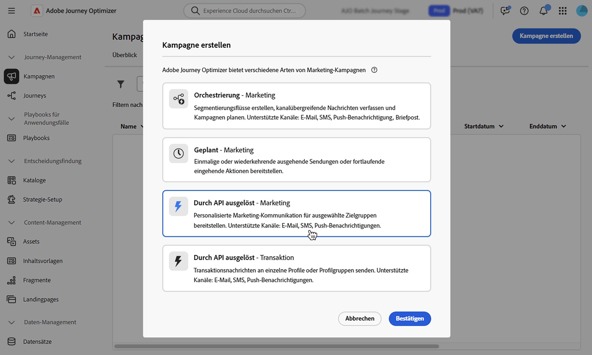

# Definieren der API-ausgelösten Kampagneneigenschaften {#api-properties}

Gehen Sie wie folgt vor, um eine neue von einer API ausgelöste Kampagne zu erstellen:

1. Navigieren Sie zum Menü **[!UICONTROL Kampagnen]** und wählen Sie die Registerkarte **[!UICONTROL API-ausgelöst]** aus.

1. Klicken Sie auf **[!UICONTROL Kampagne erstellen]** und wählen Sie den Kampagnentyp aus:

   * **[!UICONTROL API-ausgelöst - Marketing]** - Wählen Sie diese Art von API-ausgelöster Kampagne, um personalisierte Marketing-Nachrichten an ausgewählte Zielgruppen zu senden.

   * **[!UICONTROL API-ausgelöst - Transaktion]** - Transaktionskampagnen dienen dem Versand von Transaktionsnachrichten, d. h. Nachrichten, die nach einer von einem Kontakt durchgeführten Aktion gesendet werden: Anforderung zum Zurücksetzen des Passworts, Warenkorbkauf usw.

   

1. Geben Sie auf **[!UICONTROL Registerkarte]** einen Namen und eine Beschreibung für Ihre Kampagne ein.

   

1. Verwenden Sie das Feld **Tags**, um Ihrer Kampagne einheitliche Adobe Experience Platform-Tags zuzuweisen. Dies ermöglicht eine einfache Klassifizierung und verbesserte Suche über die Kampagnenliste. [Erfahren Sie, wie Sie mit Tags arbeiten](../start/search-filter-categorize.md#tags).

1. Sie können den Zugriff auf diese Kampagne basierend auf Zugriffs-Labels einschränken. Um eine Zugriffsbeschränkung hinzuzufügen, navigieren Sie zur Schaltfläche **[!UICONTROL Zugriff verwalten]** oben auf dieser Seite. Es muss sichergestellt sein, dass Sie nur Labels ausgewählt werden, für die eine Berechtigung besteht. [Erfahren Sie mehr über die Zugriffssteuerung auf Objektebene](../administration/object-based-access.md).

## Nächste Schritte {#next}

Sobald Ihre Kampagnenkonfiguration und -inhalte fertig sind, können Sie die entsprechende Aktion konfigurieren. [Weitere Informationen](api-triggered-campaign-action.md)
