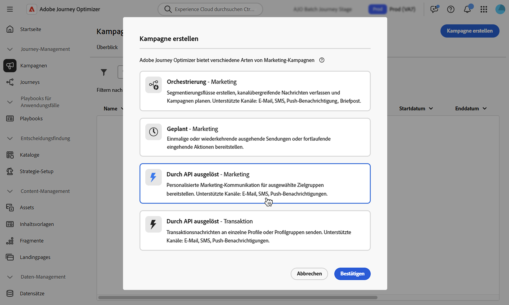
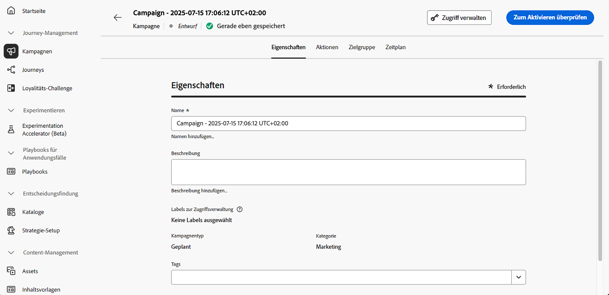

# Definieren der Eigenschaften einer Kampagne, die durch API ausgelöst wird {#api-properties}

Gehen Sie wie folgt vor, um eine neue Kampagne zu erstellen, die durch API ausgelöst wird:

1. Navigieren Sie zum Menü **[!UICONTROL Kampagnen]** und wählen Sie die Registerkarte **[!UICONTROL Durch API ausgelöst]** aus.

1. Klicken Sie auf die Schaltfläche **[!UICONTROL Kampagne erstellen]** und wählen Sie den Kampagnentyp aus:

   * **[!UICONTROL API-ausgelöst – Marketing]** – Wählen Sie diesen durch API ausgelösten Kampagnentyp aus, um personalisierte Marketing-Kommunikation an ausgewählte Zielgruppen zu senden.

   * **[!UICONTROL API-ausgelöst – Transaktion]** – Transaktionskampagnen dienen dem Versand von Transaktionsnachrichten, d. h. Nachrichten, die aufgrund einer von einem Kontakt durchgeführten Aktion gesendet werden: Zurücksetzen des Passworts, Warenkorbkauf usw.

     +++Modus mit hohem Durchsatz

     Für durch API ausgelöste Transaktionskampagnen können Sie den Modus mit **[!UICONTROL hohem Durchsatz]** aktivieren. Dieser Modus ist für groß angelegtes Echtzeit-Messaging konzipiert (bis zu 5.000 Transaktionen pro Sekunde) und bietet eine höhere Verfügbarkeit bei geringerer Latenz. [Informationen zum Arbeiten mit dem Modus mit hohem Durchsatz](../campaigns/api-triggered-high-throughput.md)

     >[!AVAILABILITY]
     >
     >Derzeit ist der Modus mit hohem Durchsatz nur für den E-Mail-Kanal und in der US-Region verfügbar.
     >
     >Diese Funktion ist nur für den E-Mail-Kanal verfügbar und steht Unternehmen zur Verfügung, die das Adobe-Add-on für **Transaktions-Messaging mit hohem Durchsatz** erworben haben. Weitere Informationen erhalten Sie beim Adobe-Support.

     +++

   

1. Geben Sie auf der Registerkarte **[!UICONTROL Eigenschaften]** einen Namen und eine Beschreibung für Ihre Kampagne ein.

   

1. Verwenden Sie das Feld **Tags**, um Ihrer Kampagne einheitliche Adobe Experience Platform-Tags zuzuweisen. Dies ermöglicht eine einfache Klassifizierung und verbesserte Suche über die Kampagnenliste. [Erfahren Sie, wie Sie mit Tags arbeiten](../start/search-filter-categorize.md#tags).

1. Sie können den Zugriff auf diese Kampagne basierend auf Zugriffs-Labels einschränken. Um eine Zugriffsbeschränkung hinzuzufügen, navigieren Sie zur Schaltfläche **[!UICONTROL Zugriff verwalten]** oben auf dieser Seite. Es muss sichergestellt sein, dass Sie nur Labels ausgewählt werden, für die eine Berechtigung besteht. [Erfahren Sie mehr über die Zugriffssteuerung auf Objektebene](../administration/object-based-access.md).

## Nächste Schritte {#next}

Sobald die Konfiguration und der Inhalt der Kampagne fertiggestellt sind, können Sie ihre Aktion konfigurieren. [Weitere Informationen](api-triggered-campaign-action.md)
