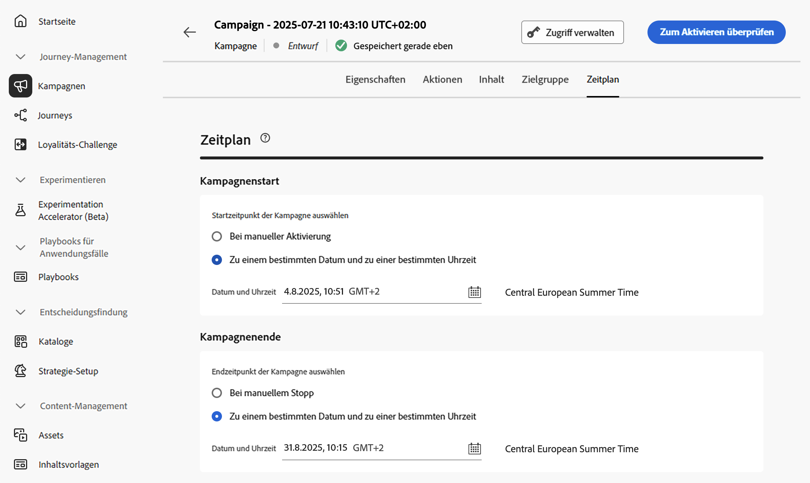

# Planen der Kampagne, die durch API ausgelöst wird {#api-schedule}

Definieren Sie auf der Registerkarte **[!UICONTROL Zeitplan]** den Zeitplan der Kampagne.

Standardmäßig starten durch API ausgelöste Kampagnen, wenn sie ausgelöst werden, und enden, sobald die Nachricht einmal gesendet wurde. Wenn Sie Ihre Kampagne nicht direkt nach der Auslösung ausführen möchten, können Sie das Datum und die Uhrzeit für den Versand der Nachricht mit der Option **[!UICONTROL Kampagnenstart]** angeben.

Über die Option **[!UICONTROL Kampagnenende]** können Sie angeben, wann die Ausführung einer Kampagne gestoppt werden soll. Außerhalb der angegebenen Daten wird die Kampagne nicht ausgeführt.

>[!NOTE]
>
>Stellen Sie bei der Planung von Kampagnen in [!DNL Adobe Journey Optimizer] sicher, dass Ihr Startdatum und Ihre Startzeit mit dem gewünschten ersten Versand übereinstimmen.

## Nächste Schritte {#next}

Nachdem die Kampagnenkonfiguration und der Inhalt fertig sind, können Sie sie überprüfen und aktivieren. [Weitere Informationen](review-activate-campaign.md)
