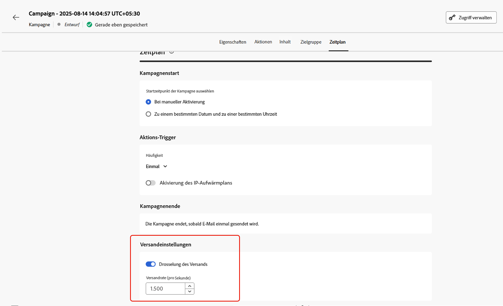

# Planen der Kampagne, die durch API ausgelöst wird {#api-schedule}

Definieren Sie auf der Registerkarte **[!UICONTROL Zeitplan]** den Zeitplan der Kampagne.

## Festlegen von Start- und Enddatum

Standardmäßig starten durch API ausgelöste Kampagnen, wenn sie ausgelöst werden, und enden, sobald die Nachricht einmal gesendet wurde. Wenn Sie Ihre Kampagne nicht direkt nach der Auslösung ausführen möchten, können Sie das Datum und die Uhrzeit für den Versand der Nachricht mit der Option **[!UICONTROL Kampagnenstart]** angeben.

Über die Option **[!UICONTROL Kampagnenende]** können Sie angeben, wann die Ausführung einer Kampagne gestoppt werden soll. Außerhalb der angegebenen Daten wird die Kampagne nicht ausgeführt.

>[!NOTE]
>
>Stellen Sie bei der Planung von Kampagnen in [!DNL Adobe Journey Optimizer] sicher, dass Ihr Startdatum und Ihre Startzeit mit dem gewünschten ersten Versand übereinstimmen.

## Festlegen der Ratensteuerung

[!DNL Journey Optimizer] ermöglicht es Ihnen, die Ratensteuerung für ausgehende Aktionen (E-Mail, SMS, Push-Benachrichtigungen) zu aktivieren.

Diese Funktion ist besonders nützlich, um eine Überlastung nachgelagerter Systeme zu verhindern, beispielsweise Landingpages oder Plattformen für die Kundenunterstützung. Beispielsweise können Sie eine Ratenbeschränkung von 165 Nachrichten pro Sekunde festlegen, um einen stabilen Versand sicherzustellen, ohne die nachgelagerten Systeme zu überfordern.

Um die Versandrate zu steuern, aktivieren Sie die Option **[!UICONTROL Versand drosseln]** im Abschnitt **[!UICONTROL Versandeinstellungen]** und geben Sie die gewünschte **[!UICONTROL Versandrate]** pro Sekunde an.

* Unterstützte Mindestversandrate: 1 pro Sekunde.
* Maximal unterstützte Versandrate: 2.000 pro Sekunde, wenn die Option „Versand drosseln“ aktiviert ist.

>[!IMPORTANT]
>
>Bei der Festlegung einer Versandrate beträgt der maximale Zeitraum, für den die Kampagnenzielgruppe bedient werden kann, 12 Stunden. Wenn die Versandrate auf einen Wert eingestellt ist, der es nicht ermöglicht, dass die gesamte Zielgruppe die Nachricht innerhalb des 12-Stunden-Zeitrahmens erhält, werden die verbleibenden Profile aus der Kampagne ausgeschlossen. Die Anzahl dieser ausgeschlossenen Profile wird im Kampagnenbericht angezeigt.

## Nächste Schritte {#next}

Nachdem die Kampagnenkonfiguration und der Inhalt fertig sind, können Sie sie überprüfen und aktivieren. [Weitere Informationen](../campaigns/review-activate-api-triggered-campaign.md)
