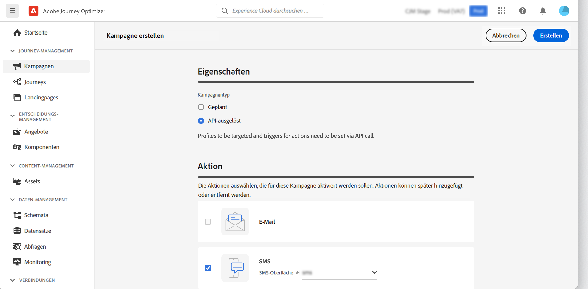
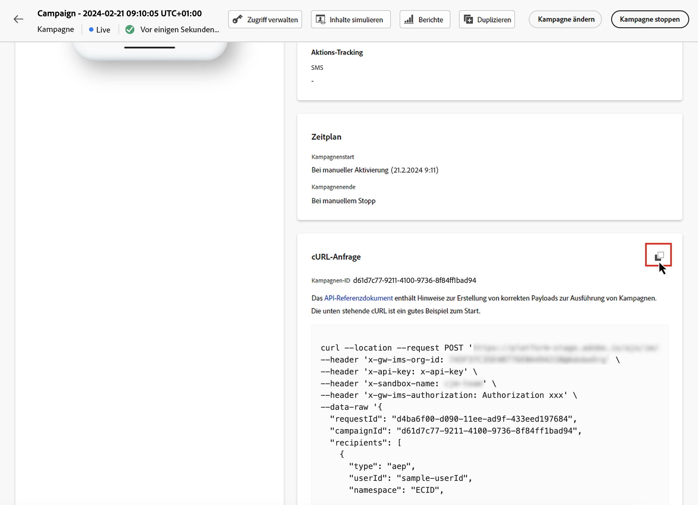
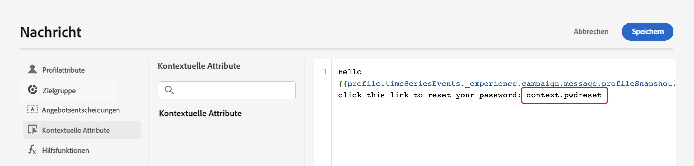
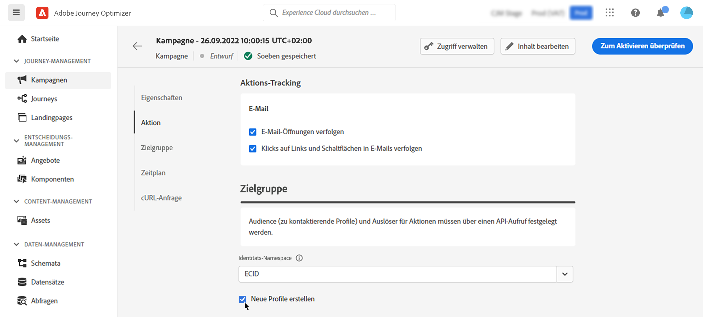

# Auslösen von Kampagnen mit APIs {#trigger-campaigns}

## Über von einer API ausgelöste Kampagnen {#about}

Mit [!DNL Journey Optimizer] können Sie Kampagnen erstellen und diese dann in einem externen System über eine [Interactive Message Execution REST-API](https://developer.adobe.com/journey-optimizer-apis/references/messaging/#tag/execution) auslösen. Auf diese Weise können Sie diversen Bedarf an Marketing- und Transaktionsnachrichten abdecken, wie z. B. das Zurücksetzen von Passwörtern, OTP-Token usw.

Dazu müssen Sie zunächst in Journey Optimizer eine von einer API ausgelöste Kampagne erstellen und deren Ausführung dann über einen API-Aufruf starten.

Für von einer API ausgelöste Kampagnen stehen die Kanäle E-Mail, SMS und Push-Benachrichtigungen zur Verfügung.

>[!NOTE]
>
>Ab sofort wird der Schnellversand-Modus für Kampagnen, die durch die Push-Benachrichtigungs-API ausgelöst werden, nicht mehr unterstützt.

## Erstellen einer API-ausgelösten Kampagne {#create}

### Konfigurieren und Aktivieren der Kampagne {#create-activate}

Um eine API-ausgelöste Kampagne zu erstellen, gehen Sie wie folgt vor. Detaillierte Informationen zum Erstellen einer Kampagne finden Sie in [diesem Abschnitt](create-campaign.md).

1. Erstellen Sie eine neue Kampagne vom Typ **[!UICONTROL API-ausgelöst]**.

1. Wählen Sie die Kategorie **[!UICONTROL Marketing]** oder **[!UICONTROL Transaktion]** je nach dem Typ der Kommunikation aus, die Sie versenden möchten.

1. Wählen Sie einen der unterstützten Kanäle und die zugehörige Kanaloberfläche aus, die zum Senden Ihrer Nachricht verwendet werden soll, und klicken Sie auf **[!UICONTROL Erstellen]**.

   

1. Geben Sie einen Titel und eine Beschreibung für die Kampagne an und klicken Sie dann auf **[!UICONTROL Inhalt bearbeiten]**, um die zu sendende Nachricht zu konfigurieren.

   >[!NOTE]
   >
   >Sie können an die API-Payload zusätzliche Daten zur Nachrichtenpersonalisierung übergeben. [Weitere Informationen](#contextual)
   >
   >Die Verwendung einer großen Zahl oder umfangreicher kontextuelle Daten in Ihren Inhalten kann die Leistung beeinträchtigen.

1. Geben Sie im Abschnitt **[!UICONTROL Zielgruppe]** den Namespace an, der zur Identifizierung der Kontakte verwendet werden soll.

   * Wenn Sie eine Kampagne des Typs **Transaktion** erstellen, müssen die Zielgruppenprofile im API-Aufruf definiert werden. Die Option **[!UICONTROL Erstellen neuer Profile]** ermöglicht es Ihnen, automatisch Profile zu erstellen, die nicht in der Datenbank vorhanden sind. [Erfahren Sie mehr über die Erstellung von Profilen bei der Kampagnenausführung](#profile-creation)

   * Klicken Sie bei Kampagnen des Typs **Marketing** auf die Schaltfläche **[!UICONTROL Zielgruppe]**, um die Zielgruppe auszuwählen, die angesprochen werden soll.

1. Konfigurieren Sie das Start- und Enddatum der Kampagne.

   Wenn Sie ein bestimmtes Start- und/oder Enddatum für eine Kampagne konfigurieren, wird diese nicht außerhalb dieses Zeitraums ausgeführt und API-Aufrufe schlagen fehl, wenn eine Kampagne durch APIs ausgelöst wird.

1. Klicken Sie auf **[!UICONTROL Zum Aktivieren überprüfen]**, um sicherzustellen, dass Ihre Kampagne korrekt konfiguriert ist, und aktivieren Sie sie.

Sie können die Kampagne jetzt über die APIs ausführen. [Weitere Informationen](#execute)

### Ausführen der Kampagne {#execute}

Nachdem Ihre Kampagne aktiviert wurde, müssen Sie die generierte Beispiel-cURL-Anfrage abrufen und in der API verwenden, um Ihre Payload zu erstellen und die Kampagne auszulösen.

1. Öffnen Sie die Kampagne und kopieren Sie dann die Beispielanfrage aus dem Abschnitt **[!UICONTROL cURL-Anfrage]**.

   

1. Verwenden Sie diese cURL-Anfrage in den APIs, um Ihre Payload zu erstellen und die Kampagne auszulösen. Weitere Informationen finden Sie in der [Dokumentation zur API für die Ausführung interaktiver Nachrichten](https://developer.adobe.com/journey-optimizer-apis/references/messaging/#tag/execution).

   Beispiele für API-Aufrufe finden Sie auch auf [dieser Seite](https://developer.adobe.com/journey-optimizer-apis/references/messaging-samples/).

   >[!NOTE]
   >
   >Beachten Sie, dass, wenn Sie bei der Erstellung der Kampagne ein bestimmtes Start- und/oder Enddatum konfiguriert haben, die Kampagne außerhalb dieses Zeitraums nicht ausgeführt wird und API-Aufrufe fehlschlagen.

## Verwenden von kontextuellen Attributen in von einer API ausgelösten Kampagnen {#contextual}

Bei von einer API ausgelösten Kampagnen können Sie zusätzliche Daten in die API-Payload übertragen und innerhalb der Kampagne nutzen, um Ihre Nachricht zu personalisieren.

In diesem Beispiel möchten Kunden ihr Kennwort zurücksetzen. Sie senden ihnen deshalb zum Zurücksetzen des Kennworts eine URL, die in einem Drittanbieter-Tool generiert wird. Bei von einer API ausgelösten Kampagnen können Sie diese generierte URL in die API-Payload übergeben und in der Kampagne in die Nachricht einfügen.

>[!NOTE]
>
>Im Gegensatz zu profilaktivierten Ereignissen werden die in der REST-API übergebenen kontextuellen Daten für die einmalige Kommunikation verwendet und nicht im Profil gespeichert. Das Profil wird nur mit den Namespace-Details erstellt, falls es nicht vorhanden ist.

Um diese Daten in Ihren Kampagnen verwenden zu können, müssen Sie sie an die API-Payload übergeben und mithilfe des Ausdruckseditors zu Ihrer Nachricht hinzufügen. Verwenden Sie dazu die Syntax `{{context.<contextualAttribute>}}`, wobei `<contextualAttribute>` mit dem Namen der Variablen in Ihrer API-Payload, die die zu übergebenden Daten enthält, übereinstimmen muss.

Die Syntax `{{context.<contextualAttribute>}}` ist nur einem Zeichenfolgen-Datentyp zugeordnet.

>[!IMPORTANT]
>
>Die in die Anfrage übergebenen Kontextattribute dürfen 50 KB nicht überschreiten und sind stets vom Typ „Zeichenfolge“.
>
>Die Syntax `context.system` ist auf die interne Nutzung bei Adobe beschränkt und sollte nicht zur Weitergabe von kontextuellen Attributen verwendet werden.

Beachten Sie, dass im Menü in der linken Leiste derzeit kein kontextuelles Attribut verfügbar ist. Attribute müssen direkt in Ihren Personalisierungsausdruck eingegeben werden, ohne dass eine Überprüfung durch [!DNL Journey Optimizer] durchgeführt wird.

## Profilerstellung bei der Kampagnenausführung {#profile-creation}

In einigen Fällen müssen Sie möglicherweise Transaktionsnachrichten an Profile senden, die nicht im System sind. Wenn zum Beispiel ein unbekannter Benutzer versucht, sein Kennwort auf Ihrer Website zurückzusetzen.

Wenn ein Profil nicht in der Datenbank vorhanden ist, erlaubt Journey Optimizer Ihnen, es automatisch bei der Ausführung der Kampagne zu erstellen, um das Senden der Nachricht an dieses Profil zu ermöglichen.

>[!IMPORTANT]
>
>Im Fall von Transaktionsnachrichten wird diese Funktion für **Erstellung von Profilen mit sehr geringem Volumen** in einem Anwendungsfall mit großem Versandvolumen bereitgestellt, wobei ein Großteil der Profile bereits in der Plattform vorhanden ist.

Um die Profilerstellung bei der Kampagnenausführung zu aktivieren, schalten Sie die Option **[!UICONTROL Neue Profile erstellen]** im Abschnitt **[!UICONTROL Zielgruppe]** ein. Wenn diese Option deaktiviert ist, werden unbekannte Profile für jeden Versand zurückgewiesen und der API-Aufruf schlägt fehl.

>[!NOTE]
>
>Unbekannte Profile werden im **Profil-Datensatz von AJO Interactive Messaging** erstellt, und zwar in drei Standard-Namespaces (E-Mail, Telefon und ECID) für jeden ausgehenden Kanal (E-Mail, SMS und Push).
