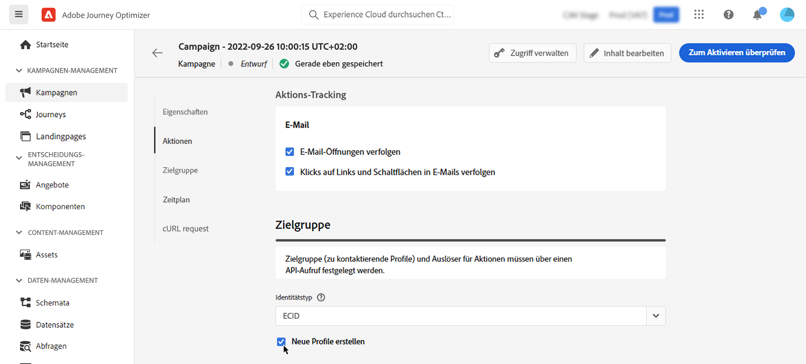

# Auslösen von Kampagnen mithilfe von APIs {#trigger-campaigns}

## Über API-gesteuerte Kampagnen {#about}

Mit [!DNL Journey Optimizer]können Sie Kampagnen erstellen und sie dann von einem externen System basierend auf dem Benutzerauslöser aufrufen, indem Sie die [REST API zur Ausführung interaktiver Nachrichten](https://developer.adobe.com/journey-optimizer-apis/references/messaging/#tag/execution). Auf diese Weise können Sie verschiedene betriebliche und Transaktionsnachrichten abdecken, wie z. B. Kennwortrücksätze, OTP-Token usw.

Dazu müssen Sie zunächst eine API-gesteuerte Kampagne in Journey Optimizer erstellen und dann ihre Ausführung über einen API-Aufruf starten.

Als Kanäle für API-gesteuerte Kampagnen stehen E-Mail-, SMS- und Push-Nachrichten zur Verfügung.

## API-gesteuerte Kampagne erstellen {#create}

Der Prozess zum Erstellen API-gesteuerter Kampagnen bleibt identisch mit geplanten Kampagnen, mit Ausnahme der Zielgruppenauswahl, die in der API-Payload durchgeführt wird. Detaillierte Informationen zum Erstellen einer Kampagne finden Sie unter [diesem Abschnitt](create-campaign.md).

Gehen Sie wie folgt vor, um eine API-gesteuerte Kampagne zu erstellen:

1. Erstellen Sie eine neue Kampagne mit der **[!UICONTROL API-triggered]** Typ.

1. Wählen Sie den Kanal und die Kanaloberfläche für den Nachrichtenversand aus und klicken Sie auf **[!UICONTROL Create]**.

   

1. Geben Sie einen Titel und eine Beschreibung für die Kampagne an und konfigurieren Sie dann die zu sendende Nachricht.

   

   >[!NOTE]
   >
   >Sie können zusätzliche Daten an die API-Payload übergeben, die Sie zur Personalisierung Ihrer Nachricht nutzen können. [Weitere Infos](#contextual)
   >
   >Die Verwendung einer großen Zahl oder umfangreicher Kontextdaten in Ihrem Inhalt kann sich auf die Leistung auswirken.

1. Im **[!UICONTROL Audience]** Geben Sie den Namespace an, mit dem die Kontakte aus dem Segment identifiziert werden sollen.

   Die **[!UICONTROL Create new profiles]** ermöglicht die automatische Erstellung von Profilen, die nicht in der Datenbank vorhanden sind. [Erfahren Sie mehr über die Erstellung von Profilen bei der Kampagnenausführung](#profile-creation)

1. Konfigurieren Sie das Start- und Enddatum der Kampagne.

   Wenn Sie ein bestimmtes Start- und/oder Enddatum für eine Kampagne konfigurieren, wird diese nicht außerhalb dieser Daten ausgeführt und API-Aufrufe schlagen fehl, wenn die Kampagne von APIs ausgelöst wird.

1. Im **[!UICONTROL cURL request]** -Abschnitt, rufen Sie die **[!UICONTROL Campaign ID]** , um in der API-Payload zu verwenden.

   

1. Klicken **[!UICONTROL Review to activate]** , um zu überprüfen, ob Ihre Kampagne korrekt konfiguriert ist, und aktivieren Sie sie.

## Kontextattribute in API-ausgelösten Kampagnen verwenden {#contextual}

Mit API-gesteuerten Kampagnen können Sie zusätzliche Daten in die API-Payload übertragen und innerhalb der Kampagne nutzen, um Ihre Nachricht zu personalisieren.

In diesem Beispiel möchten Kunden ihr Kennwort zurücksetzen und ihnen eine URL zum Zurücksetzen des Kennworts senden, die in einem Tool eines Drittanbieters generiert wird. Mit API-gesteuerten Kampagnen können Sie diese generierte URL in die API-Payload übergeben und sie in die Kampagne nutzen, um sie der Nachricht hinzuzufügen.

>[!NOTE]
>
>Im Gegensatz zu profilaktivierten Ereignissen werden die in der REST-API übergebenen Kontextdaten für die einmalige Kommunikation verwendet und nicht für das Profil gespeichert. Das Profil wird höchstens mit den Namespace-Details erstellt, wenn es als fehlend erkannt wurde.

Um diese Daten in Ihren Kampagnen verwenden zu können, müssen Sie sie an die API-Payload übergeben und mithilfe des Ausdruckseditors zu Ihrer Nachricht hinzufügen. Verwenden Sie dazu die `{{context.<contextualAttribute>}}` Syntax, wobei `<contextualAttribute>` sollte mit dem Namen der Variablen in Ihrer API-Payload übereinstimmen, die die Daten enthält, die Sie übergeben möchten.

Die `{{context.<contextualAttribute>}}` -Syntax ist nur einem String-Datentyp zugeordnet.

>[!IMPORTANT]
>
>Die `context.system` -Syntax ist auf die interne Nutzung von Adobe beschränkt und sollte nicht zur Weitergabe von Kontextualattributen verwendet werden.

Beachten Sie, dass im Menü in der linken Leiste derzeit kein kontextbezogenes Attribut verfügbar ist. Attribute müssen direkt in Ihren Personalisierungsausdruck eingegeben werden, ohne dass eine Überprüfung durch [!DNL Journey Optimizer].

## Kampagne ausführen {#execute}

Um eine API-gesteuerte Kampagne auszuführen, müssen Sie zunächst deren ID abrufen und an die API-Payload übergeben. Öffnen Sie dazu die Kampagne und kopieren Sie die ID aus dem **[!UICONTROL cURL request]** Abschnitt.

Anschließend können Sie diese ID in Ihrer API-Payload verwenden, um die Kampagne auszulösen. Siehe Abschnitt [Dokumentation zur API für die Ausführung interaktiver Nachrichten](https://developer.adobe.com/journey-optimizer-apis/references/messaging/#tag/execution) für weitere Informationen.

Beachten Sie, dass, wenn Sie bei der Erstellung der Kampagne ein bestimmtes Start- und/oder Enddatum konfiguriert haben, diese nicht außerhalb dieses Datums ausgeführt wird und API-Aufrufe fehlschlagen.

## Profilerstellung bei der Kampagnenausführung {#profile-creation}

In einigen Fällen müssen Sie möglicherweise Transaktionsnachrichten an Profile senden, die nicht im System vorhanden sind. Beispiel: Ein unbekannter Benutzer versucht, das Kennwort auf Ihrer Website zurückzusetzen.

Wenn ein Profil nicht in der Datenbank vorhanden ist, können Sie es mit Journey Optimizer automatisch erstellen, wenn Sie die Kampagne ausführen, damit die Nachricht an dieses Profil gesendet werden kann.

>[!IMPORTANT]
>
>Diese Funktion ist für **Profilerstellung mit sehr geringem Volumen** in einem Anwendungsfall für den Versand von Transaktionsnachrichten mit großem Volumen, wobei ein Großteil der Profile bereits in der Plattform vorhanden ist.

Um die Profilerstellung bei der Kampagnenausführung zu aktivieren, aktivieren Sie die **[!UICONTROL Create new profiles]** -Option in der **[!UICONTROL Audience]** Abschnitt.

>[!NOTE]
>
>Unbekannte Profile werden im **AJO-Profildatensatz für interaktive Nachrichten** Datensatz, in drei Standard-Namespace (E-Mail, Telefon und ECID) für jeden ausgehenden Kanal (E-Mail, SMS und Push).
