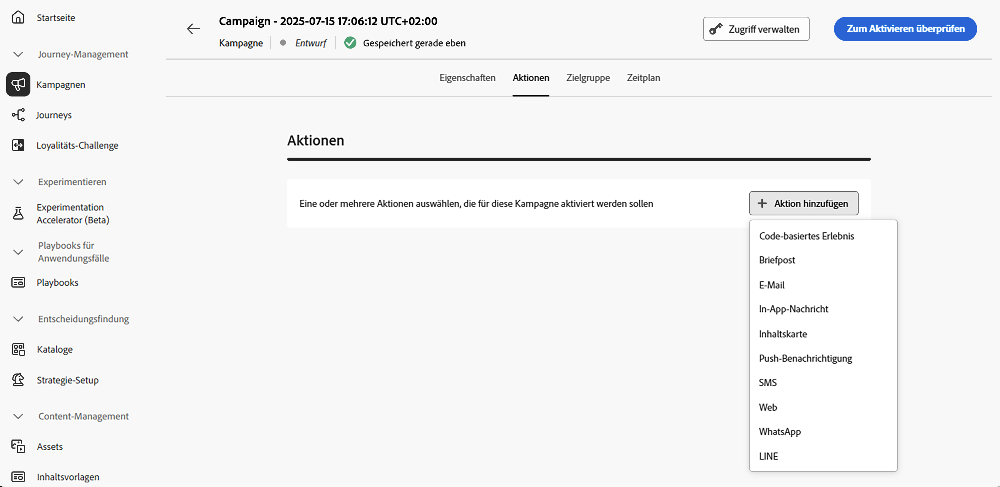
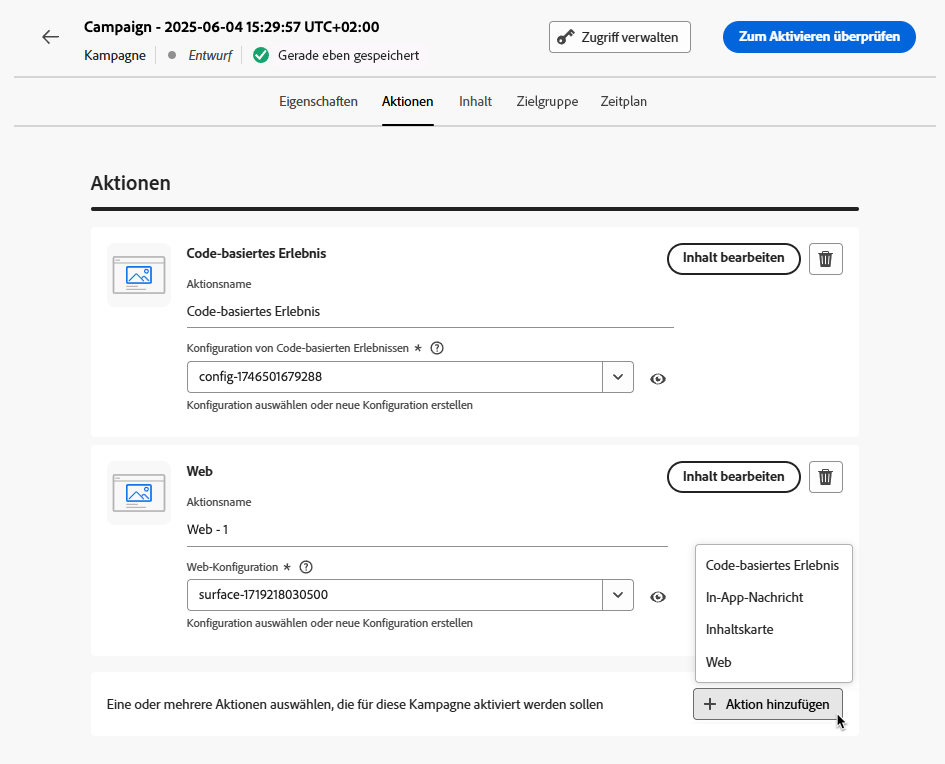

# Konfigurieren der Kampagnenaktion {#action-campaign-action}

Verwenden Sie die Registerkarte **[!UICONTROL Aktionen]**, um eine Kanalkonfiguration für Ihre Nachricht auszuwählen und um zusätzliche Einstellungen wie Tracking, Inhaltsexperiment oder mehrsprachige Inhalte zu konfigurieren.

1. **Auswählen des Kanals**

   Navigieren Sie zur Registerkarte **[!UICONTROL Aktionen]**, klicken Sie auf die Schaltfläche **[!UICONTROL Aktion hinzufügen]** und wählen Sie den Kommunikationskanal aus.

   

   >[!NOTE]
   >
   >Weitere Informationen zu den unterstützten Kanälen finden Sie in der Tabelle in diesem Abschnitt: [Kanäle in Journeys und Kampagnen](../channels/gs-channels.md#channels).
   >
   >Die verfügbaren Kanäle variieren je nach Ihrem Lizenzierungsmodell und Ihren Add-ons.

   Wenn Sie einen eingehenden Kanal auswählen (Code-basiertes Erlebnis, In-App-Nachricht, Inhaltskarte oder Web-Aktion), können Sie weitere eingehende Aktionen hinzufügen – insgesamt bis zu 10 Aktionen in einer Kampagne. [Weitere Informationen](#multi-action)

1. **Auswählen einer Kanalkonfiguration**

   Eine Konfiguration wird durch [Systemadmins](../start/path/administrator.md) definiert. Sie enthält alle technischen Parameter zum Senden der Nachricht, wie z. B. Kopfzeilenparameter, Subdomain, Mobile Apps usw. [Informationen zum Einrichten von Kanalkonfigurationen](../configuration/channel-surfaces.md)

   

1. **Nutzen der Optimierung**

   Verwenden Sie den Abschnitt **[!UICONTROL Optimierung]**, um Inhaltsexperimente durchzuführen, Targeting-Regeln zu nutzen oder erweiterte Kombinationen aus Experimenten und Targeting zu verwenden. Diese verschiedenen Optionen und die zu befolgenden Schritte werden in [diesem Abschnitt](../content-management/gs-message-optimization.md) ausführlich beschrieben.
<!--
1. **Create a content experiment**

    Use the **[!UICONTROL Content experiment]** section to define multiple delivery treatments in order to measure which one performs best for your target audience. Click the **[!UICONTROL Create experiment]** button then follow the steps detailed in this section: [Create a content experiment](../content-management/content-experiment.md).-->

1. **Hinzufügen mehrsprachiger Inhalte**

   Verwenden Sie den Abschnitt **[!UICONTROL Sprachen]**, um in Ihrer Kampagne Inhalte in mehreren Sprachen zu erstellen. Klicken Sie dazu auf die Schaltfläche **[!UICONTROL Sprachen hinzufügen]** und wählen Sie die gewünschten **[!UICONTROL Spracheinstellungen]** aus. Detaillierte Informationen zum Einrichten und Verwenden mehrsprachiger Funktionen finden Sie in [diesem Abschnitt](../content-management/multilingual-gs.md).

Je nach ausgewähltem Kommunikationskanal stehen zusätzliche Einstellungen zur Verfügung. Erweitern Sie die folgenden Abschnitte, um weitere Informationen zu erhalten.

+++**Anwenden von Begrenzungsregeln** (E-Mail, Direkt-Mail, Push, SMS)

Wählen Sie in der Dropdown-Liste **[!UICONTROL Geschäftsregeln]** einen Regelsatz aus, um Begrenzungsregeln auf Ihre Kampagne anzuwenden. Mithilfe von Kanalregelsätzen können Sie die Frequenzbegrenzung nach Kommunikationstyp festlegen, um zu verhindern, dass Kundinnen und Kunden zu viele ähnliche Nachrichten erhalten. [Erfahren Sie, wie Sie mit Regelsätzen arbeiten](../conflict-prioritization/rule-sets.md)

+++

+++**Verfolgen von Interaktionen** (E-Mail, SMS).

Verwenden Sie den Abschnitt **[!UICONTROL Aktions-Tracking]**, um zu verfolgen, wie Ihre Empfängerinnen und Empfänger auf Ihre E-Mail- oder SMS-Sendungen reagieren. Die Tracking-Ergebnisse sind nach Ausführung der Kampagne im Kampagnenbericht verfügbar. [Weitere Informationen zu Kampagnenberichten](../reports/campaign-global-report-cja.md)

+++

+++**Aktivieren des Schnellversandmodus** (Push).

Der Schnellversandmodus ist ein Add-on für [!DNL Journey Optimizer], das den sehr schnellen Versand von Push-Nachrichten in großen Mengen im Rahmen von Kampagnen ermöglicht. Der Schnellversand wird verwendet, wenn eine Verzögerung beim Nachrichtenversand geschäftskritisch wäre oder wenn Sie eine dringende Push-Benachrichtigung an Mobiltelefone senden möchten, z. B. eine Eilmeldung an Benutzende, die Ihre Nachrichten-App installiert haben. [Auf dieser Seite](../push/create-push.md#rapid-delivery) erfahren Sie, wie Sie den Schnellversandmodus für Push-Benachrichtigungen aktivieren.

Weitere Informationen zur Leistung bei Verwendung des Schnellversandmodus finden Sie unter [Produktbeschreibung für Adobe Journey Optimizer](https://helpx.adobe.com/de/legal/product-descriptions/adobe-journey-optimizer.html){target="_blank"}.

+++

+++**Zuweisen von Prioritätswerten** (Web, In-App, Code-basiert)

Wenn Sie der Kampagne einen Prioritätswert zuweisen, können Sie eine eingehende Kampagne bei erzwungenen Begrenzungen wie z. B. einer Frequenzbegrenzung priorisieren. Geben Sie einen numerischen Wert ein (0–100). Bitte beachten Sie: Je höher die Zahl, desto höher die Priorität. [Informationen zum Zuweisen von Prioritätswerten zu Journeys und Kampagnen](../conflict-prioritization/priority-scores.md)

+++

+++**Festlegen zusätzlicher Versandregeln** (Inhaltskarten)

Für Inhaltskartenkampagnen können Sie zusätzliche Versandregeln aktivieren, um die Ereignisse und Kriterien auszuwählen, die die Nachricht auslösen sollen. [Informationen zum Erstellen von Inhaltskarten](../content-card/create-content-card.md)

+++

+++**Definieren von Triggern** (In-App)

Für In-App-Nachrichten können Sie über die Schaltfläche **[!UICONTROL Trigger bearbeiten]** die Ereignisse und Kriterien auswählen, die die Nachricht auslösen sollen. [Informationen zum Erstellen einer In-App-Nachricht](../in-app/create-in-app.md)

+++

## Hinzufügen von mehreren eingehenden Aktionen {#multi-action}

>[!CONTEXTUALHELP]
>id="ajo_multi_action"
>title="Hinzufügen von mehreren eingehenden Aktionen"
>abstract="Innerhalb einer Kampagne können mehrere eingehende Aktionen ausgewählt werden. Mit dieser Funktion können Sie mehrere Code-basierte Erlebnisse, In-App-Nachrichten, Inhaltskarten oder Web-Aktionen gleichzeitig an verschiedenen Orten bereitstellen, wobei jede Aktion einen bestimmten Inhalt enthält."

Um die Orchestrierung einer Kampagne zu vereinfachen, können Sie in einer Kampagne mehrere eingehende Aktionen definieren, wobei jede Aktion einen bestimmten Inhalt enthält.

>[!NOTE]
>
>Diese Funktion ist nur für Inbound-Kanäle verfügbar. Derzeit werden Outbound-Kanäle wie E-Mail nicht unterstützt.

Mit dieser Funktion können Sie mehrere Code-basierte Erlebnisse, In-App-Nachrichten, Inhaltskarten oder Web-Aktionen gleichzeitig an verschiedenen Orten bereitstellen, ohne unterschiedliche Kampagnen erstellen zu müssen. Dies erleichtert die Bereitstellung Ihrer Journey und ermöglicht ein reibungsloseres Reporting, indem alle Daten in einer einzigen Kampagne zusammengefasst werden.

Sie können beispielsweise ein Code-basiertes Erlebnis mit geringfügig unterschiedlichen Inhalten an mehrere Endpunkte senden. Erstellen Sie dazu verschiedene Code-basierte Aktionen innerhalb derselben Kampagne mit jeweils einer anderen Endpunktkonfiguration.

Gehen Sie wie folgt vor, um in einer Kampagne mehrere eingehende Aktionen zu definieren.

1. Wählen Sie im Abschnitt **[!UICONTROL Aktionen]** eine eingehende Aktion (**Code-basiertes Erlebnis**, **In-App-Nachricht**, **Inhaltskarte** oder **Web**) aus.

1. Wählen Sie die Kanalkonfiguration aus und definieren Sie einen bestimmten Inhalt für diese Aktion.

1. Verwenden Sie die Schaltfläche **[!UICONTROL Aktion hinzufügen]**, um eine weitere eingehende Aktion aus der Dropdown-Liste auszuwählen.

   {width="80%"}

1. Gehen Sie ähnlich vor, um weitere Aktionen hinzuzufügen. Sie können bis zu zehn eingehende Aktionen zu einer Kampagne hinzufügen.

Sobald die Kampagne [live](review-activate-campaign.md) ist, werden alle Aktionen gleichzeitig aktiviert.

## Nächste Schritte {#next}

Sobald Ihre Kampagnenaktion fertiggestellt ist, können Sie den Inhalt entwerfen. [Weitere Informationen](campaign-content.md)
