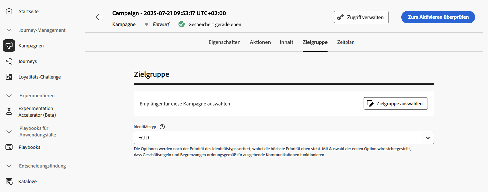

# Definieren der Zielgruppe einer Aktionskampagne {#action-campaign-audience}

>[!BEGINSHADEBOX]

**Auf dieser Seite** Wählen Sie die Audience und den Identitätstyp auf der Registerkarte Audience aus, damit Ihre Kampagne auf die richtigen Personen ausgerichtet ist.

>[!ENDSHADEBOX]

Definieren Sie auf der Registerkarte **[!UICONTROL Zielgruppe]** die Zielgruppe der Kampagne.

1. **Zielgruppe auswählen**

   Klicken Sie für Marketing-Kampagnen auf die Schaltfläche **[!UICONTROL Zielgruppe auswählen]**, um die Liste der verfügbaren Adobe Experience Platform-Zielgruppen anzuzeigen. [Weitere Informationen zu Zielgruppen](../audience/about-audiences.md).

   >[!IMPORTANT]
   >
   >Zielgruppen und Attribute aus der [Zielgruppenkomposition](../audience/get-started-audience-orchestration.md) stehen derzeit nicht zur Verwendung mit Healthcare Shield oder Privacy and Security Shield zur Verfügung.

1. **Auswählen des Identitätstyps**

   Wählen Sie im Feld **[!UICONTROL Identitätstyp]** den Schlüsseltyp aus, der zur Identifizierung der Kontakte in der ausgewählten Zielgruppe verwendet werden soll. Sie können entweder einen vorhandenen Identitätstyp verwenden oder mit dem Identity Service einen neuen erstellen. Standardmäßige Identity-Namespaces werden auf [dieser Seite](https://experienceleague.adobe.com/de/docs/experience-platform/identity/features/namespaces#standard){target="_blank"} aufgeführt.

   Pro Kampagne ist nur ein Identitätstyp zulässig. Kontakte, die zu einem Segment gehören, in dem der ausgewählte Identitätstyp nicht unter den verschiedenen Identitäten vorkommt, können von der Kampagne nicht angesprochen werden. Weitere Informationen zu Identitätstypen und Namespaces sind in der [Dokumentation zu Adobe Experience Platform](https://experienceleague.adobe.com/docs/experience-platform/identity/home.html?lang=de){target="_blank"} verfügbar.

## Nächste Schritte {#next}

Sobald die Zielgruppe Ihrer Aktionskampagne fertiggestellt ist, können Sie die Kampagne planen. [Weitere Informationen](campaign-schedule.md)
