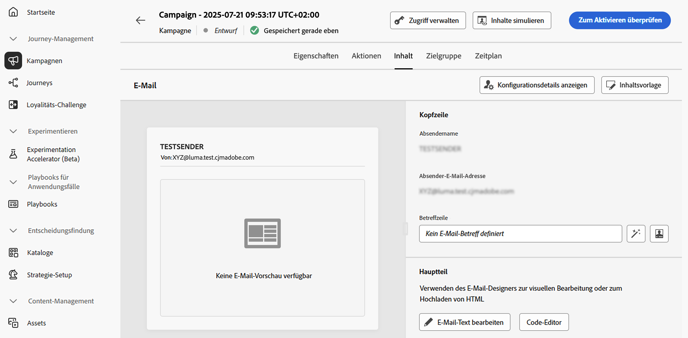

# Bearbeiten des Inhalts einer Aktionskampagne {#action-campaign-content}

Um den Nachrichteninhalt zu konfigurieren, navigieren Sie zur Registerkarte **[!UICONTROL Inhalt]** oder klicken Sie auf die Schaltfläche **[!UICONTROL Inhalt bearbeiten]**.

## Entwerfen des Inhalts {#action-campaign-channels}

Der Prozess der Inhaltserstellung hängt vom ausgewählten Kanal ab. Auf den folgenden Seiten erfahren Sie, wie Sie Ihren Nachrichteninhalt erstellen:

<table style="table-layout:fixed"><tr style="border: 0;">
<td>

<a href="../email/create-email.md"><strong>E-Mail</strong></a>
</td>
<td>

<a href="../sms/create-sms.md"><strong>SMS</strong></a>
</td>
<td>

<a href="../push/create-push.md"><strong>Push-Benachrichtigung</strong></a>
</td>
<td>

<a href="../direct-mail/create-direct-mail.md"><strong>Direkt-Mail</strong></a>
</td>
</tr></table>

<table style="table-layout:fixed"><tr style="border: 0;">
<td>

<a href="../in-app/create-in-app.md"><strong>In-App</strong></a>
</td>
<td>

<a href="../web/create-web.md"><strong>Web</strong></a>
</td>
<td>

<a href="../code-based/create-code-based.md"><strong>Code-basiertes Erlebnis</strong></a>
</td>
<td>

<a href="../content-card/create-content-card.md"><strong>Inhaltskarten</strong></a>
</td>
</tr></table>

<table style="table-layout:fixed"><tr style="border: 0;">
<td></td>
<td>

<a href="../line/get-started-line.md"><strong>LINE</strong></a>
</td>
<td>

<a href="../whatsapp/get-started-whatsapp.md"><strong>WhatsApp</strong></a>
</td>
<td></td>
</tr></table>

## Testen und Überprüfen Ihres Inhalts

Nachdem der Inhalt definiert ist, verwenden Sie die Schaltfläche **[!UICONTROL Inhalt simulieren]**, um eine Vorschau anzuzeigen und den Inhalt mit Testprofilen oder Beispieleingabedaten zu testen, die aus einer CSV- oder JSON-Datei hochgeladen oder manuell hinzugefügt wurden. [Erfahren Sie, wie Sie Inhalte in der Vorschau anzeigen und testen können](../content-management/preview-test.md)

Klicken Sie auf den Linkspfeil, um zum Bildschirm der Kampagnenerstellung zurückzukehren.

## Nächste Schritte {#next}

Sobald der Inhalt Ihrer Aktionskampagne fertiggestellt ist, können Sie die Zielgruppe der Kampagne definieren. [Weitere Informationen](campaign-audience.md)
