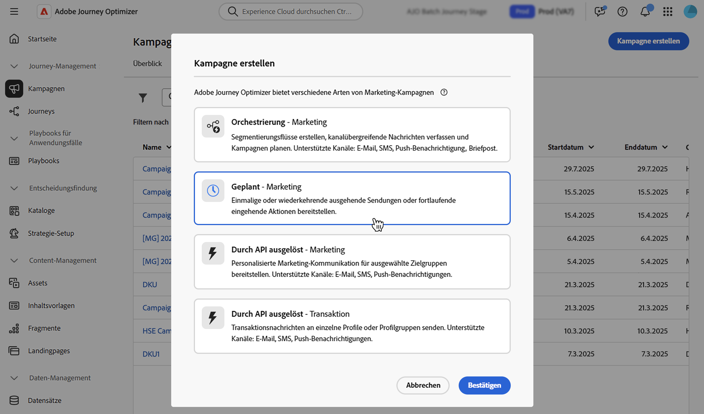
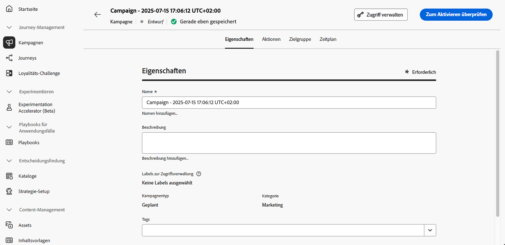

# Definieren der Eigenschaften einer Aktionskampagne {#action-campaign-properties}

Gehen Sie wie folgt vor, um eine Aktionskampagne zu erstellen und ihre Eigenschaften zu definieren:

1. Navigieren Sie zum Menü **[!UICONTROL Kampagnen]** und wählen Sie die Registerkarte **[!UICONTROL Aktion]** aus.

1. Klicken Sie auf die Schaltfläche **[!UICONTROL Kampagne erstellen]** und wählen Sie den Kampagnentyp **[!UICONTROL Geplant – Marketing]** aus.

   

1. Geben Sie auf der Registerkarte **[!UICONTROL Eigenschaften]** einen Namen und eine Beschreibung für Ihre Kampagne ein.

   

1. Verwenden Sie das Feld **Tags**, um Ihrer Kampagne einheitliche Adobe Experience Platform-Tags zuzuweisen. Dies ermöglicht eine einfache Klassifizierung und verbesserte Suche über die Kampagnenliste. [Erfahren Sie, wie Sie mit Tags arbeiten](../start/search-filter-categorize.md#tags).

1. Sie können den Zugriff auf diese Kampagne basierend auf Zugriffs-Labels einschränken. Um eine Zugriffsbeschränkung hinzuzufügen, navigieren Sie zur Schaltfläche **[!UICONTROL Zugriff verwalten]** oben auf dieser Seite. Es muss sichergestellt sein, dass Sie nur Labels ausgewählt werden, für die eine Berechtigung besteht. [Erfahren Sie mehr über die Zugriffssteuerung auf Objektebene](../administration/object-based-access.md).

## Nächste Schritte {#next}

Sobald Ihre Aktionskampagne erstellt und konfiguriert ist, können Sie deren Aktion konfigurieren. [Weitere Informationen](campaign-action.md)
