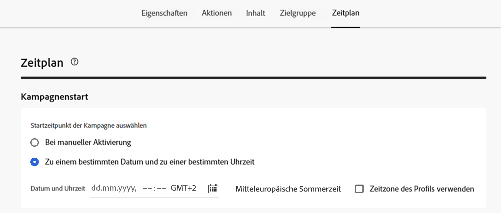
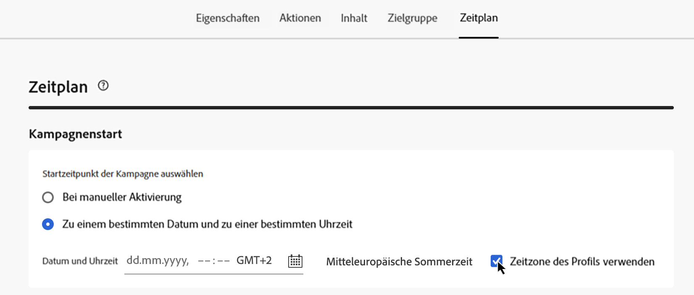
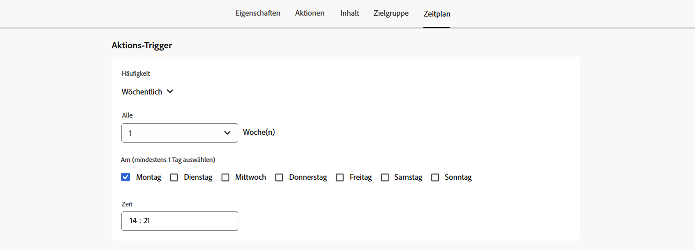
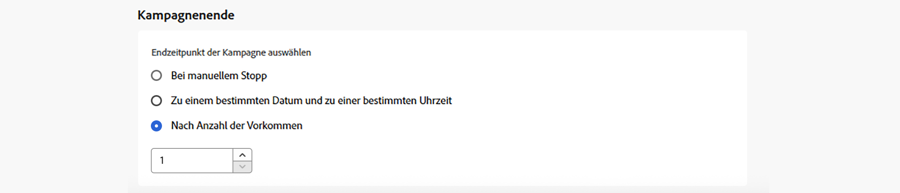
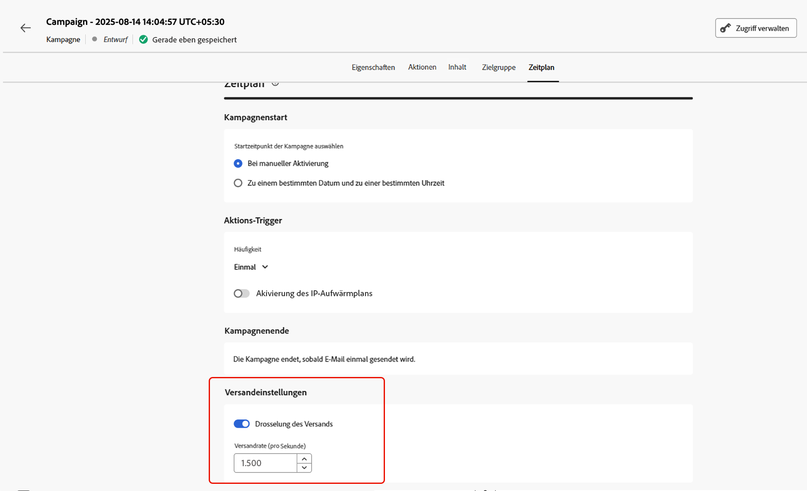

# Planen der Aktionskampagne {#action-campaign-schedule}

Definieren Sie auf der Registerkarte **[!UICONTROL Zeitplan]** den Zeitplan der Kampagne.

## Festlegen des Startdatums einer Kampagne

Standardmäßig starten Aktionskampagnen, sobald sie manuell aktiviert werden, und enden, sobald die Nachricht einmal gesendet wurde. Wenn Sie Ihre Kampagne nicht direkt nach der Aktivierung ausführen möchten, können Sie das Datum und die Uhrzeit für den Versand der Nachricht im Abschnitt **[!UICONTROL Kampagnenstart]** angeben.

Stellen Sie bei der Planung von Kampagnen in [!DNL Adobe Journey Optimizer] sicher, dass Ihr Startdatum und Ihre Startzeit mit dem gewünschten ersten Versand übereinstimmen. Wenn bei wiederkehrenden Kampagnen die anfängliche geplante Zeit bereits überschritten ist, werden die Kampagnen gemäß ihren Intervallregeln auf das nächste verfügbare Zeitfenster verschoben.

## Zur Ortszeit der Empfängerin oder des Empfängers senden {#profile-timezone}

>[!CONTEXTUALHELP]
>id="ajo_campaigns_schedule_profile_timezone"
>title="Zeitzone des Profils verwenden"
>abstract="Nachrichten basierend auf der Zeitzone des Profils jeder Empfängerin und jedes Empfängers senden. Alle Empfängerinnen und Empfänger erhalten die Nachricht zur gleichen Ortszeit, unabhängig von ihrem geografischen Standort. Das System verwendet das Feld „timeZone“ aus den Adobe Experience Platform-Profilen, wobei die Zeitzone der Kampagnenerstellerin bzw. des Kampagnenerstellers als Fallback dient."

Wenn Sie eine Kampagne für ein bestimmtes Datum und eine bestimmte Uhrzeit planen, können Sie Nachrichten basierend auf der Zeitzone des Profils jedes Empfängers senden. Dadurch wird sichergestellt, dass alle Empfänger die Nachricht zur gleichen Ortszeit erhalten, unabhängig von ihrem geografischen Standort.

Wenn Sie beispielsweise eine Kampagne so planen, dass sie um 9 Uhr morgens mit der Zeitzone des Profils gesendet wird, erhalten Empfängerinnen und Empfänger in New York (ET) diese um 9 Uhr MEZ, während Empfängerinnen und Empfänger in Los Angeles (PT) sie um 9 Uhr MEZ erhalten.

>[!AVAILABILITY]
>
>Die Planung mit Zeitzonen des Profils ist nur für diese ausgehenden Kanäle verfügbar: E-Mail, Push, SMS, WhatsApp und LINE.

So aktivieren Sie die Zeitzonenplanung für Profile:

1. Geben Sie **[!UICONTROL Abschnitt Kampagnenstart das]** und die Uhrzeit für den Versand der Nachricht an.

1. Aktivieren Sie die **[!UICONTROL Zeitzone des Profils verwenden]**.

   

**Funktionsweise:**

Das System verwendet das Feld `profile.timeZone` aus dem Adobe Experience Platform-Profil jedes Empfängers, um dessen lokale Zeitzone zu bestimmen. Wenn ein Profil keinen Zeitzonenwert hat, verwendet das System die Zeitzone, in der die Kampagne erstellt wurde, als Ausweichlösung.

Die Kampagne verbleibt im **Live**-Status, während Nachrichten über alle Zeitzonen hinweg zugestellt werden. Sobald alle Zeitzonen verarbeitet wurden, ändert sich der Kampagnenstatus in **Abgeschlossen**.

**Unterstützte Zeitzonenkennungen:**

Das `profile.timeZone` kann entweder eine IANA-Benennung oder als UTC-Versatz definiert sein. Die IANA-Benennung ist das bevorzugte Format, da es sich automatisch an die Sommerzeit anpasst.

Bei der IANA-Benennung wird zwischen Groß- und Kleinschreibung unterschieden und die Kennungen müssen mit der offiziellen IANA-Benennung übereinstimmen. Versätze können sich im Laufe der Zeit aufgrund von Sommerzeitregeln und historischen Aktualisierungen ändern. Siehe die [IANA-Zeitzonendatenbank](https://www.iana.org/time-zones){_blank} für die offizielle Liste der Kennungen.

## Festlegen der Ausführungshäufigkeit

Bei **E-Mail**-, **SMS**- und **Push-Benachrichtigungs**-Aktionen können Sie festlegen, mit welcher Häufigkeit die Nachricht der Kampagne gesendet werden soll. Verwenden Sie dazu die Option **[!UICONTROL Aktions-Trigger]** im Bildschirm zur Kampagnenerstellung, um festzulegen, ob die Kampagne täglich, wöchentlich oder monatlich ausgeführt werden soll.

>[!NOTE]
>
>Bei **E-Mail**-Aktionen können Sie spezifische Kampagnen zur Aktivierung eines IP-Aufwärmplans erstellen. Der Zeitplan der Kampagne wird von dem IP-Aufwärmplan bestimmt, mit dem er verknüpft ist. Dies bedeutet, dass der Zeitplan nicht mehr in der Kampagne selbst definiert ist. [Informationen zum Erstellen von IP-Aufwärmkampagnen](../configuration/ip-warmup-campaign.md).

## Festlegen eines Enddatums

Im Abschnitt **[!UICONTROL Kampagnenende]** können Sie angeben, wann die Ausführung einer Kampagne gestoppt werden soll. Außerhalb der angegebenen Daten wird die Kampagne nicht ausgeführt.

## Festlegen der Ratensteuerung

[!DNL Journey Optimizer] ermöglicht es Ihnen, die Ratensteuerung für ausgehende Aktionen (E-Mail, SMS, Push-Benachrichtigungen) zu aktivieren.

Diese Funktion ist besonders nützlich, um eine Überlastung nachgelagerter Systeme zu verhindern, beispielsweise Landingpages oder Plattformen für die Kundenunterstützung. Beispielsweise können Sie eine Ratenbeschränkung von 165 Nachrichten pro Sekunde festlegen, um einen stabilen Versand sicherzustellen, ohne die nachgelagerten Systeme zu überfordern.

Um die Versandrate zu steuern, aktivieren Sie die Option **[!UICONTROL Versand drosseln]** im Abschnitt **[!UICONTROL Versandeinstellungen]** und geben Sie die gewünschte **[!UICONTROL Versandrate]** pro Sekunde an.

* Unterstützte Mindestversandrate: 1 pro Sekunde.
* Maximal unterstützte Versandrate: 2.000 pro Sekunde, wenn die Option „Versand drosseln“ aktiviert ist.

>[!IMPORTANT]
>
>Bei der Festlegung einer Versandrate beträgt der maximale Zeitraum, für den die Kampagnenzielgruppe bedient werden kann, 12 Stunden. Wenn die Versandrate auf einen Wert eingestellt ist, der es nicht ermöglicht, dass die gesamte Zielgruppe die Nachricht innerhalb des 12-Stunden-Zeitrahmens erhält, werden die verbleibenden Profile aus der Kampagne ausgeschlossen. Die Anzahl dieser ausgeschlossenen Profile wird im Kampagnenbericht angezeigt.

## Versenden in Schüben

Um Ihre Kampagnennachricht im Zeitverlauf stapelweise statt alle gleichzeitig zu senden, können Sie den Wellenversand verwenden. Auf diese Weise können Auslastung und Zustellbarkeit verbessert und die Überlastung nachgelagerter Systeme (z. B. Callcenter oder Landingpages) vermieden werden. Sie definieren die Anzahl der Schübe, ihre Größe (nach Prozentsatz oder absoluter Zahl) und den Zeitplan für jede Schübe.

[Erfahren Sie, wie Sie mithilfe von Schüben senden](send-using-waves.md).

## Nächste Schritte {#next}

Sobald Ihr Kampagnenzeitplan fertiggestellt ist, können Sie die Kampagne überprüfen und aktivieren. [Weitere Informationen](review-activate-campaign.md)
