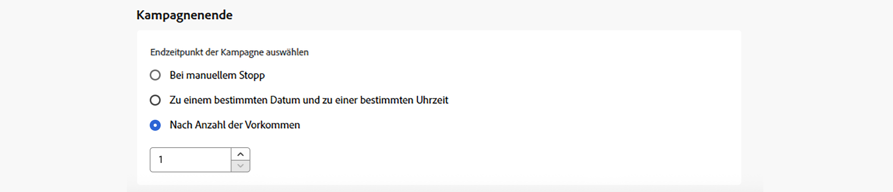

# Planen der Aktionskampagne {#action-campaign-schedule}

Definieren Sie auf der Registerkarte **[!UICONTROL Zeitplan]** den Zeitplan der Kampagne.

## Festlegen des Startdatums einer Kampagne

Standardmäßig starten Aktionskampagnen, sobald sie manuell aktiviert werden, und enden, sobald die Nachricht einmal gesendet wurde.

Wenn Sie Ihre Kampagne nicht direkt nach der Aktivierung ausführen möchten, können Sie das Datum und die Uhrzeit für den Versand der Nachricht im Abschnitt **[!UICONTROL Kampagnenstart]** angeben.

>[!NOTE]
>
>Stellen Sie bei der Planung von Kampagnen in [!DNL Adobe Journey Optimizer] sicher, dass Ihr Startdatum und Ihre Startzeit mit dem gewünschten ersten Versand übereinstimmen. Wenn bei wiederkehrenden Kampagnen die anfängliche geplante Zeit bereits überschritten ist, werden die Kampagnen gemäß ihren Intervallregeln auf das nächste verfügbare Zeitfenster verschoben.

## Festlegen der Ausführungshäufigkeit

Bei **E-Mail**-, **SMS**- und **Push-Benachrichtigungs**-Aktionen können Sie festlegen, mit welcher Häufigkeit die Nachricht der Kampagne gesendet werden soll. Verwenden Sie dazu die Option **[!UICONTROL Aktions-Trigger]** im Bildschirm zur Kampagnenerstellung, um festzulegen, ob die Kampagne täglich, wöchentlich oder monatlich ausgeführt werden soll.

>[!NOTE]
>
>Bei **E-Mail**-Aktionen können Sie spezifische Kampagnen zur Aktivierung eines IP-Aufwärmplans erstellen. Der Zeitplan der Kampagne wird von dem IP-Aufwärmplan bestimmt, mit dem er verknüpft ist. Dies bedeutet, dass der Zeitplan nicht mehr in der Kampagne selbst definiert ist. [Informationen zum Erstellen von IP-Aufwärmkampagnen](../configuration/ip-warmup-campaign.md).

## Festlegen eines Enddatums

Im Abschnitt **[!UICONTROL Kampagnenende]** können Sie angeben, wann die Ausführung einer Kampagne gestoppt werden soll. Außerhalb der angegebenen Daten wird die Kampagne nicht ausgeführt.

## Festlegen der Ratensteuerung

[!DNL Journey Optimizer] ermöglicht es Ihnen, die Ratensteuerung für ausgehende Aktionen (E-Mail, SMS, Push-Benachrichtigungen) zu aktivieren.

Diese Funktion ist besonders nützlich, um eine Überlastung nachgelagerter Systeme zu verhindern, beispielsweise Landingpages oder Plattformen für die Kundenunterstützung. Beispielsweise können Sie eine Ratenbeschränkung von 165 Nachrichten pro Sekunde festlegen, um einen stabilen Versand sicherzustellen, ohne die nachgelagerten Systeme zu überfordern.

Um die Versandrate zu steuern, aktivieren Sie die Option **[!UICONTROL Versand drosseln]** im Abschnitt **[!UICONTROL Versandeinstellungen]** und geben Sie die gewünschte **[!UICONTROL Versandrate]** pro Sekunde an.

* Unterstützte Mindestversandrate: 1 pro Sekunde.
* Maximal unterstützte Versandrate: 2.000 pro Sekunde, wenn die Option „Versand drosseln“ aktiviert ist.

>[!IMPORTANT]
>
>Bei der Festlegung einer Versandrate beträgt der maximale Zeitraum, für den die Kampagnenzielgruppe bedient werden kann, 12 Stunden. Wenn die Versandrate auf einen Wert eingestellt ist, der es nicht ermöglicht, dass die gesamte Zielgruppe die Nachricht innerhalb des 12-Stunden-Zeitrahmens erhält, werden die verbleibenden Profile aus der Kampagne ausgeschlossen. Die Anzahl dieser ausgeschlossenen Profile wird im Kampagnenbericht angezeigt.

## Nächste Schritte {#next}

Sobald Ihr Kampagnenzeitplan fertiggestellt ist, können Sie die Kampagne überprüfen und aktivieren. [Weitere Informationen](review-activate-campaign.md)
