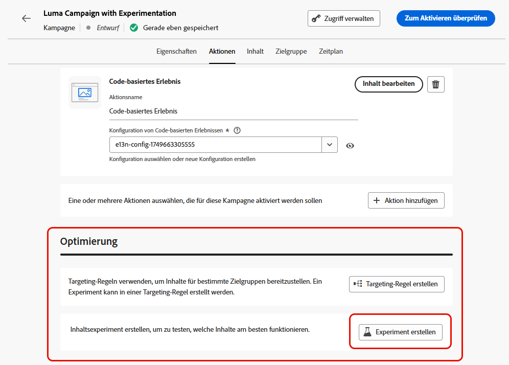

# Optimierung in Kampagnen und Journeys {#message-optimization}

Die Optimierung bietet Ihnen die Tools, mit denen Sie personalisierte und optimierte Inhalte für Ihre Zielgruppe bereitstellen können, <!--based on marketer-defined advanced decision configurations. This ensures that the right message reaches the right audience at the right time in order to maximize the effectiveness of your campaigns. (Removed for now as Decisioning is not yet supported)-->um maximale Interaktion und den größtmöglichen Erfolg zu erzielen und so äußerst <!--customized and -->effektive Journeys und Kampagnen zu erstellen.

Mit der Optimierung können Sie:

* [Targeting](#targeting)-Regeln nutzen
* [Inhaltsexperimente](#experimentation) ausführen
* [Erweiterte Kombinationen](#combination) aus Experimenten und Targeting in einer Kampagne nutzen

Sobald die Journey oder Kampagne live ist, werden die Profile anhand der definierten Kriterien bewertet und basierend auf den übereinstimmenden Kriterien mit den entsprechenden Erlebnissen oder Inhalten aus der Journey/Kampagne bereitgestellt.

Der Unterschied zwischen Experimenten und Targeting lässt sich wie folgt umreißen:

* Experimente bestehen in einer zufälligen Aufteilung der Bereitstellung von Inhalten je nach Traffic-Zuordnung.
* Beim Targeting werden deterministische Techniken verwendet, um Inhalte anhand von Benutzerprofil, Zielgruppenzugehörigkeit oder kontextbasierten Regeln bereitzustellen.

{width="110%" zoomable="yes"}

➡️ [Weitere Informationen zur Optimierung einer Kampagne finden Sie in diesem Video](#video)

## Nutzen von Targeting {#targeting}

>[!CONTEXTUALHELP]
>id="ajo_content_targeting_fallback"
>title="Was sind Fallback-Inhalte?"
>abstract="Mit Fallback-Inhalten kann Ihre Zielgruppe einen Standardinhalt erhalten, falls keine der Targeting-Regeln erfüllt ist.  Falls Sie diese Option nicht auswählen, erhalten Zielgruppen, die sich nicht für eine der oben definierten Targeting-Regeln qualifizieren, keine Inhalte."

Beim Targeting werden auf der Grundlage von Benutzerprofilattributen oder kontextuellen Attributen personalisierte Inhalte für bestimmte Zielgruppensegmente bereitgestellt.

Im Gegensatz zu Experimenten, bei denen es sich um eine zufällige Zuweisung des Inhalts einer Nachricht handelt, ist das Targeting in Bezug auf die Bereitstellung der Inhalte für die richtige Zielgruppe deterministisch.

Beim Targeting können spezifische Regeln definiert werden, die auf Folgendem basieren:

* **Benutzerprofilattribute** wie Standort (z. B. Geotargeting), Alter oder Präferenzen. In den USA wird Benutzenden beispielsweise eine „Golden Gate“-Promotion angeboten, in Frankreich hingegen eine „Eiffelturm“-Promotion.

* **Kontextdaten** wie Gerätetyp (z. B. Geräte-Targeting), Tageszeit oder Sitzungsdetails. Beispielsweise erhalten Desktop-Benutzende für den Desktop optimierte Inhalte, während mobile Benutzende für Mobilgeräte optimierte Inhalte erhalten.

* **Zielgruppen**, mit deren Hilfe Profile mit einer bestimmten Zielgruppenzugehörigkeit ein- oder ausgeschlossen werden können.

Gehen Sie folgendermaßen vor, um das Targeting einzurichten.

1. Erstellen Sie eine [Journey](../building-journeys/journey-gs.md#jo-build) oder eine [Kampagne](../campaigns/create-campaign.md).

   >[!NOTE]
   >
   >Wenn Sie sich in einer Journey befinden, fügen Sie eine Aktivität des Typs **[!UICONTROL Aktion]** hinzu, wählen Sie eine Kanalaktivität aus und wählen Sie **[!UICONTROL Aktion konfigurieren]**. [Weitere Informationen](../building-journeys/journey-action.md#add-action)

1. Wählen Sie auf der Registerkarte **[!UICONTROL Aktionen]** mindestens eine Aktion aus.

1. Wählen Sie im Abschnitt **[!UICONTROL Optimierung]** die Option **[!UICONTROL Targeting-Regel erstellen]**.

   {width=85%}

1. Verwenden Sie den Regel-Builder, um Ihre Kriterien festzulegen. Definieren Sie beispielsweise eine Regel für in den USA ansässige Personen, eine Regel für in Frankreich ansässige Personen und eine Regel für in Indien ansässige Personen.

   {width=85%}

1. Wählen Sie nach Bedarf **[!UICONTROL Fallback-Inhalte aktivieren]** aus. Mit Fallback-Inhalten kann Ihre Zielgruppe einen Standardinhalt erhalten, falls keine der Targeting-Regeln erfüllt ist. 

   >[!NOTE]
   >
   >Falls Sie diese Option nicht auswählen, erhält jede Zielgruppe, die sich nicht für eine der oben definierten Targeting-Regeln qualifiziert, keine Inhalte.

1. Speichern Sie Ihre Einstellungen für die Targeting-Regel.

1. Kehren Sie zur Registerkarte **[!UICONTROL Aktionen]** zurück und wählen Sie **[!UICONTROL Inhalt bearbeiten]**.

1. Gestalten Sie geeignete Inhalte für jede Gruppe, die durch die Einstellungen Ihrer Targeting-Regeln definiert wird.

   {width=85%}

   In diesem Beispiel erstellen wir einen bestimmten Inhalt für in den USA ansässige Personen, einen anderen Inhalt für in Frankreich ansässige Personen und einen dritten Inhalt für in Indien ansässige Personen.

1. [Aktivieren](review-activate-campaign.md) Sie Ihre Journey oder Kampagne.

Sobald die Journey/Kampagne live ist, werden für jede Zielgruppe maßgeschneiderte Inhalte versendet, sodass etwa in den USA ansässige Personen eine bestimmte Nachricht erhalten, in Frankreich ansässige Personen eine andere usw.

<!--Default content:

* If no targeting rules match, default content can be delivered.

* If default content is not enabled, passthrough behavior ensures lower-priority campaigns are evaluated.-->

## Verwenden von Experimenten {#experimentation}

Mit Experimenten können Sie verschiedene Varianten von Inhalten testen, um anhand vordefinierter Erfolgsmetriken zu bestimmen, welche am besten funktioniert.

Gehen Sie folgendermaßen vor, um Experimente einzurichten.

Angenommen, Sie möchten die folgenden Werbenachrichten in einer Kampagne testen:

* **Abwandlung A**: „20 % Rabatt auf Ihren nächsten Kauf“
* **Abwandlung B**: „Kostenloser Versand bei Bestellungen über 50 €“
* **Abwandlung C**: „Erhalten Sie eine Geschenkkarte im Wert von 10 €“

Gehen Sie wie folgt vor, um ein Experiment einzurichten und zu bestimmen, welche Nachricht für die meisten Käufe sorgt.

1. Erstellen Sie eine [Journey](../building-journeys/journey-gs.md#jo-build) oder eine [Kampagne](../campaigns/create-campaign.md).

   >[!NOTE]
   >
   >Wenn Sie sich in einer Journey befinden, fügen Sie eine Aktivität des Typs **[!UICONTROL Aktion]** hinzu, wählen Sie eine Kanalaktivität aus und wählen Sie **[!UICONTROL Aktion konfigurieren]**. [Weitere Informationen](../building-journeys/journey-action.md#add-action)

1. Wählen Sie auf der Registerkarte **[!UICONTROL Aktionen]** zwei eingehende Aktionen aus, z. B. [Code-basiertes Erlebnis](../code-based/get-started-code-based.md) und [In-App](../../rp_landing_pages/in-app-landing-page.md).

1. Wählen Sie im Abschnitt **[!UICONTROL Optimierung]** die Option **[!UICONTROL Experiment erstellen]** aus.

   {width=85%}

1. Entwerfen und konfigurieren Sie Ihr Inhaltsexperiment nach Bedarf. [Weitere Informationen](../content-management/content-experiment.md)

   {width=85%}

   Sobald das Experiment definiert ist, gilt es für alle Aktionen, die in dieser Kampagne oder über die Aktivität **[!UICONTROL Aktion]** der Journey eingefügt wurden, d. h. dieselben Kundinnen und Kunden sehen auf allen Oberflächen dieselben Angebote.

   >[!NOTE]
   >
   >Sie können weitere Aktionen auswählen: Das Experiment gilt für alle Aktionen, die zur Kampagne oder zur Journey-Aktion hinzugefügt wurden.

1. [Aktivieren](review-activate-campaign.md) Sie Ihre Journey oder Kampagne.

Sobald die Journey/Kampagne live ist, werden den Benutzenden die verschiedenen Inhaltsvarianten nach dem Zufallsprinzip zugewiesen. [!DNL Journey Optimizer] verfolgt, welche Variante zu mehr Käufen führt, und stellt verwertbare Erkenntnisse zur Verfügung.

Verfolgen Sie den Erfolg Ihrer Kampagne mit den Berichten [Journey](../reports/journey-global-report-cja.md) und [Kampagne](../reports/campaign-global-report-cja-experimentation.md). <!--Link to Experimentation journey reportis missing-->

## Kombinieren von Targeting und Experimenten {#combination}

Mit Journey Optimizer können Sie auch Targeting und Experimente innerhalb einer einzigen Journey oder Kampagne kombinieren, um komplexere Strategien zu entwickeln.

Sie können Targeting nutzen, um verschiedene Varianten einzurichten, und für jede Variante Experimente verwenden, um die jeweiligen Inhalte weiter zu optimieren. Dadurch wird sichergestellt, dass Experimente spezifisch für jede Targeting-Regel sind und nicht verschiedene Varianten umfassen.

Sie können beispielsweise eine „Promotion mit 50 % Rabatt“ gegenüber einer „Geschenkkarte im Wert von 50 Dollar“ für Kundschaft in den USA testen und für Kundschaft in Europa einen anderen Test durchführen, z. B. „kostenloser Versand bei Bestellungen über 50 €“ gegenüber „20 % Rabatt auf ihren nächsten Kauf“.

Gehen Sie wie folgt vor, um Targeting und Experimente in einer Journey oder Kampagne zu kombinieren.

1. Erstellen Sie eine Journey oder eine Kampagne, in der Sie mehrere Targeting-Regeln definieren. [Weitere Informationen](#targeting)

   {width=85%}

1. Erstellen Sie ein Experiment für die erste Targeting-Regel.

1. Entwerfen und konfigurieren Sie Ihr Inhaltsexperiment nach Bedarf. [Weitere Informationen](../content-management/content-experiment.md)

   {width=85%}

   Sobald das Experiment definiert ist, gilt es nur für die erste Targeting-Regel.

1. Kehren Sie zur Registerkarte **[!UICONTROL Aktionen]** zurück und wählen Sie **[!UICONTROL Inhalt bearbeiten]**.

1. Für die Gruppe, die in Ihrer ersten Targeting-Regel definiert ist, können Sie für jede Variante Ihres Experiments einen bestimmten Inhalt definieren.

   Wenn Sie Ihrer Journey oder Kampagne mehr als eine eingehende Aktion hinzugefügt haben, gilt für jede Aktion dieselbe Kombination aus Targeting und Experiment. Sie müssen jedoch für jede Variante von jeder Aktion einen spezifischen Inhalt definieren.

   {width=85%}

1. Gehen Sie für die anderen Targeting-Regeln genauso vor und entwerfen Sie den entsprechenden Inhalt für die einzelnen Varianten.

1. Speichern Sie Ihre Änderungen und [aktivieren](review-activate-campaign.md) Sie Ihre Journey oder Kampagne.

Sobald die Journey/Kampagne live ist, werden den Benutzenden der einzelnen Zielgruppen nach dem Zufallsprinzip die verschiedenen Inhaltsvarianten zugewiesen, die für ihre Gruppe definiert wurden.

<!--
## Reporting on Message optimization

E.g. explaining how a marketer can look at the report to determine which treatment (e.g. which message content) is performing the best for the targeting audience
-->

## Anleitungsvideo{#video}

Erfahren Sie, wie Sie die Nachrichtenoptimierung in durch eine Aktion oder durch API ausgelösten Kampagnen nutzen. Sie erfahren, wie Sie Teilzielgruppen ansprechen, Nachrichtenvarianten je nach Standort erstellen, Fallback-Inhalte aktivieren und mehrere Experimente innerhalb einer Kampagne durchführen. In diesem Tutorial wird auch beschrieben, wie Sie Multi-Channel-Kampagnen verwalten und dabei die Konsistenz der Nachrichten beibehalten können.

>[!VIDEO](https://video.tv.adobe.com/v/3470377?quality=12&captions=ger)