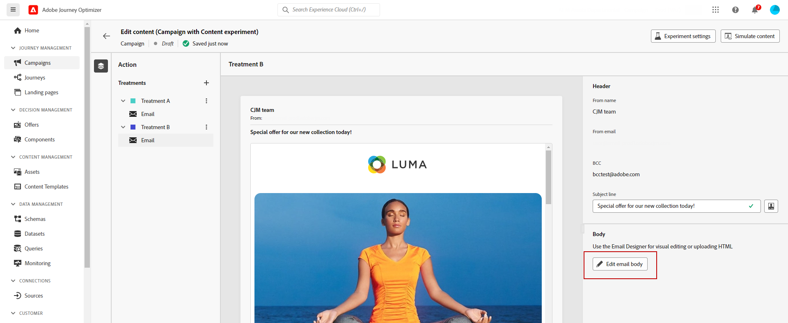

# Erstellen eines Inhaltsexperiments {#content-experiment}

>[!CONTEXTUALHELP]
>id="ajo_campaigns_content_experiment"
>title="Inhaltsexperiment"
>abstract="Der Versandinhalt, der Betreff oder der Absender kann abgeändert werden, um mehrere Abwandlungen des Versands zu definieren und die beste Kombination für die Audiences zu ermitteln."

>[!NOTE]
>
>Bevor Sie mit dem Inhaltsexperiment beginnen, stellen Sie sicher, dass die Berichtskonfiguration für Ihre benutzerdefinierten Datensätze definiert ist. Weiterführende Informationen finden Sie in [diesem Abschnitt](reporting-configuration.md).

Das Journey Optimizer-Inhaltsexperiment ermöglicht es Ihnen, mehrere Versandmethoden zu definieren, um zu messen, welche für Ihre Audience am besten geeignet ist. Sie haben die Möglichkeit, Inhalt, Betreff oder Absender des Versands zu variieren. Die Audience wird nach dem Zufallsprinzip jeder Abwandlung zugewiesen, um zu bestimmen, welche Abwandlung in Bezug auf die angegebene Metrik am besten funktioniert.

Im nachstehenden Beispiel wurde die Zielgruppe des Versands in zwei Gruppen aufgeteilt, die jeweils 45 % der Zielpopulation repräsentieren, und eine neutrale Gruppe von 10 %, die den Versand nicht erhalten wird.

Jede Person in der Audience erhält eine Version der E-Mail mit einer der beiden folgenden Betreffzeilen:

* In einer wird direkt ein 10-%-Angebot für die neue Kollektion beworben. Sie enthält außerdem ein Bild.
* In der anderen wird nur für ein Sonderangebot ohne Angabe des 10-%-Rabatts geworben. Sie enthält kein Bild.

Das Ziel besteht nun darin zu beobachten, welche Empfänger mit welcher E-Mail-Variante interagieren. Wir wählen daher in diesem Inhaltsexperiment **[!UICONTROL Geöffnete E-Mails]** als primäre Zielmetrik aus.

## Erstellen der Kampagne {#campaign-experiment}

1. Klicken Sie auf der Seite **[!UICONTROL Kampagnen]** auf **[!UICONTROL Kampagne erstellen]**.

   

<!--
1. In the **[!UICONTROL Properties]** section, choose your **[!UICONTROL Campaign type]**:

    * **[!UICONTROL Scheduled]**: designed to send marketing messages and can be executed immediately or at a specified date.

    * **[!UICONTROL API-Triggered]**: designed to send transactional messages, such as password reset notifications or cart abandonment reminders. 
    
        To execute an API-triggered campaign, you will need to make an API call. [Learn more](api-triggered-campaigns.md)
-->
1. Wählen Sie Ihren Kanal und dann die **[!UICONTROL Oberfläche]** aus, die Sie für diesen Versand verwenden möchten, und klicken Sie dann auf **[!UICONTROL Erstellen]**. Weitere Informationen dazu finden Sie auf der Seite [Kanaloberflächen](../configuration/channel-surfaces.md).

   In diesem Beispiel möchten wir eine Kampagne mit E-Mails versenden.

   

1. Richten Sie die **[!UICONTROL Eigenschaften]** Ihres Versands ein:
   * **[!UICONTROL Name]**
   * **[!UICONTROL Beschreibung]**

1. Definieren Sie die anzusprechende Audience. Klicken Sie dazu auf die Schaltfläche **[!UICONTROL Zielgruppe auswählen]**, um die Liste der verfügbaren Adobe Experience Platform-Segmente anzuzeigen. [Weitere Informationen zu Segmenten](../segment/about-segments.md)

   Wählen Sie im Feld **[!UICONTROL Identity-Namespace]** den Namespace aus, der zur Identifizierung der Personen im ausgewählten Segment verwendet werden soll. [Weitere Informationen](get-started-experiment.md#content-experiment-work)

   

1. Geben Sie im Bereich **[!UICONTROL Aktions-Tracking]** an, ob Sie verfolgen möchten, wie die Empfangenden auf Ihren Versand reagieren: Sie können Klicks und/oder Öffnungen verfolgen.

   Die Tracking-Ergebnisse sind nach Ausführung der Kampagne im Kampagnenbericht verfügbar.

1. Um Ihre Kampagne an einem bestimmten Datum oder in wiederkehrenden Abständen auszuführen, konfigurieren Sie den Abschnitt **[!UICONTROL Zeitplan]**. [Weitere Informationen](create-campaign.md)

1. Klicken Sie auf **[!UICONTROL Inhalt bearbeiten]**, um mit der Personalisierung Ihres Versands zu beginnen.

   

1. Beginnen Sie im Fenster **[!UICONTROL Inhalt bearbeiten]** mit der Personalisierung der Abwandlung A.

   Für diese Abwandlung geben wir das Sonderangebot direkt in der Betreffzeile an und fügen eine Personalisierung hinzu.

   

## Konfigurieren des Inhaltsexperiments {#configure-experiment}

1. Wenn Ihr Versand personalisiert wurde, klicken Sie auf der Übersichtsseite der Kampagne auf **[!UICONTROL Experiment erstellen]**, um mit der Konfiguration Ihres Inhaltsexperiments zu beginnen.

   

1. Wählen Sie die **[!UICONTROL Erfolgsmetrik]**, die Sie für Ihr Experiment festlegen möchten.

   Für unser Experiment wählen wir **[!UICONTROL Geöffnete E-Mails]**, um zu testen, ob Empfänger ihre E-Mails öffnen, wenn sich das Angebot in der Betreffzeile befindet.

   

1. Klicken Sie auf **[!UICONTROL Abwandlung hinzufügen]**, um so viele neue Abwandlungen wie nötig zu erstellen.

   

1. Ändern Sie den **[!UICONTROL Titel]** Ihrer Abwandlung, um die einzelnen Abwandlungen besser unterscheiden zu können.

1. Wählen Sie aus, dass eine **[!UICONTROL neutrale]** Gruppe zu Ihrem Versand hinzugefügt werden soll. Diese Gruppe erhält keine Inhalte aus dieser Kampagne.

   Wenn Sie den Umschalter aktivieren, werden für diese Gruppe automatisch 10 % Ihrer Population genommen. Sie können diesen Prozentsatz bei Bedarf aber auch anpassen.

   

1. Sie können dann jeder **[!UICONTROL Variante]** einen bestimmten Prozentsatz zuweisen oder einfach den Umschalter **[!UICONTROL Gleichmäßig verteilen]** aktivieren.

   

1. Klicken Sie auf **[!UICONTROL Erstellen]**, wenn Ihre Konfiguration festgelegt ist.

## Richten Sie das Design Ihrer Abwandlungen ein {#treatment-experiment}

1. Wählen Sie im Fenster **[!UICONTROL Inhalt bearbeiten]** Ihre Abwandlung B aus, um den Inhalt zu ändern.

   Hier wird das Angebot nicht in der **[!UICONTROL Betreffzeile]** angegeben.

   

1. Klicken Sie auf **[!UICONTROL E-Mail-Text bearbeiten]**, um Ihre Abwandlung B weiter zu personalisieren.

   

1. Nachdem Sie Ihre Abwandlungen entworfen haben, klicken Sie auf **[!UICONTROL Weitere Aktionen]**, um auf die Optionen für Ihre Abwandlungen zuzugreifen: **[!UICONTROL Umbenennen]**, **[!UICONTROL Duplizieren]** und **[!UICONTROL Löschen]**.

   

1. Rufen Sie bei Bedarf das Menü **[!UICONTROL Experimenteinstellungen]** auf, um Ihre Abwandlungskonfigurationen zu ändern.

   

1. Sobald Sie den Inhalt Ihrer Nachricht definiert haben, klicken Sie auf die Schaltfläche **[!UICONTROL Inhalt simulieren]**, um das Rendering Ihres Versands zu kontrollieren und die Personalisierungseinstellungen mit Testprofilen zu überprüfen. [Weitere Informationen](../email/preview.md)

1. Wenn Ihr Inhaltsexperiment fertig ist, können Sie auf der Seite mit der Kampagnenübersicht auf **[!UICONTROL Zum Aktivieren überprüfen]** klicken, um eine Zusammenfassung der Kampagne anzuzeigen. Warnhinweise werden angezeigt, wenn Parameter falsch sind oder fehlen.

   

1. Vergewissern Sie sich, dass Ihre Kampagne korrekt konfiguriert ist, und klicken Sie dann auf **[!UICONTROL Aktivieren]**, um sie zu starten.

   

Nach der Konfiguration Ihrer Experimente und Kampagnen können Sie mit dem Kampagnenbericht den Erfolg Ihres Versands verfolgen. [Weitere Informationen](../reports/campaign-global-report.md#experimentation-report)
