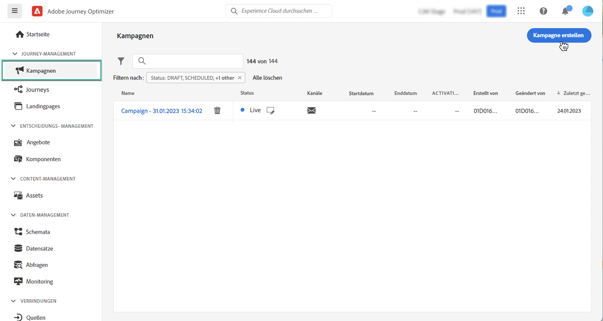
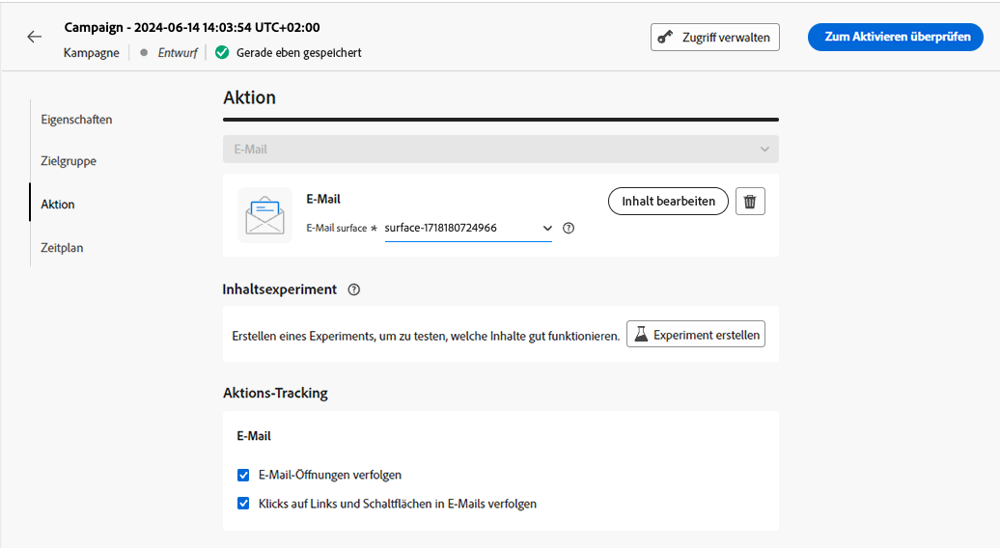
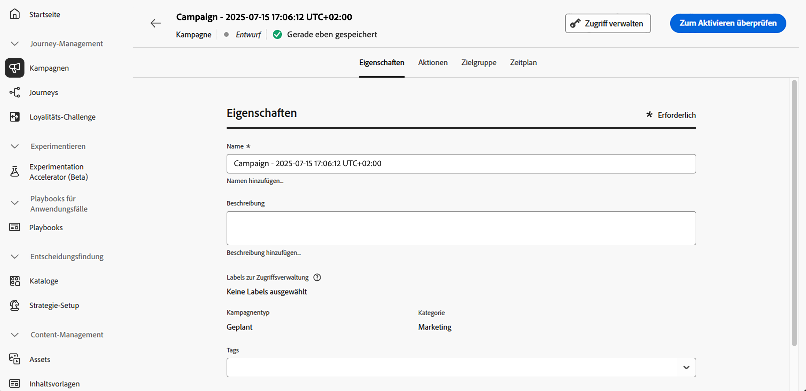
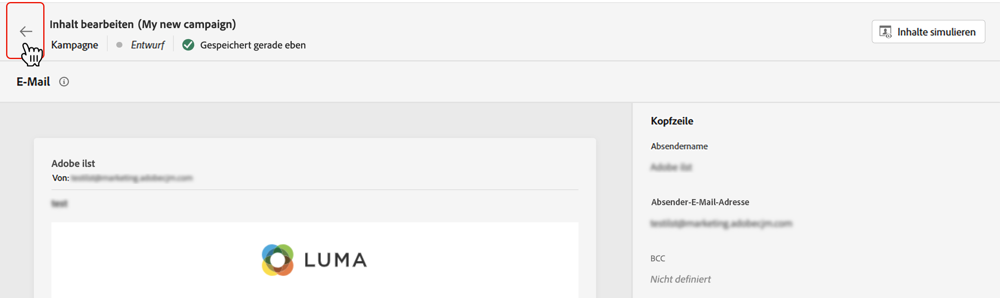
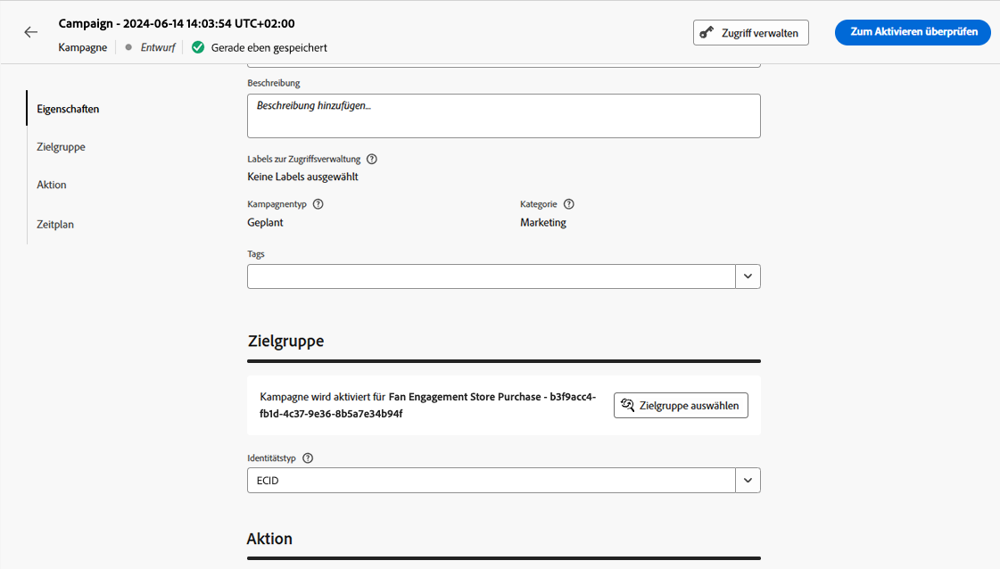
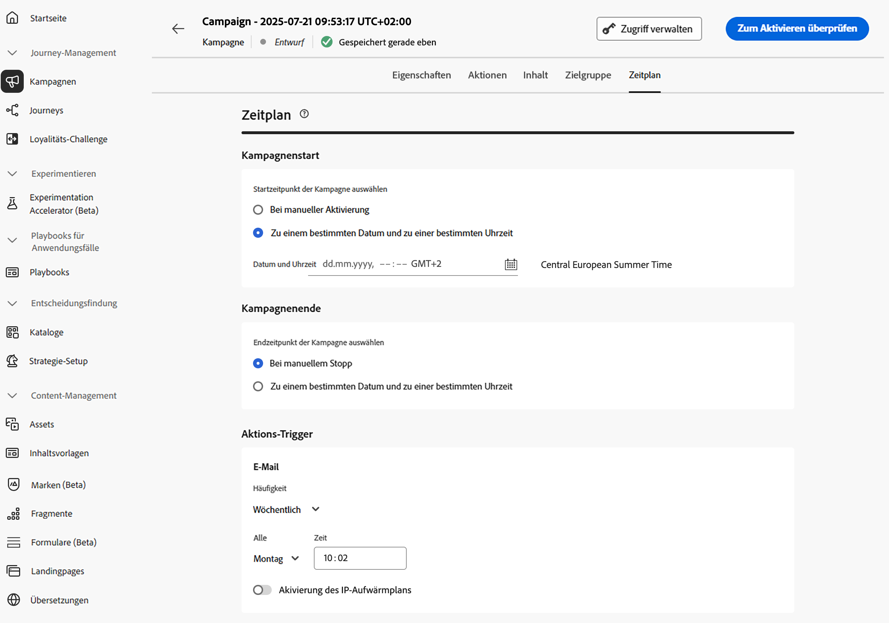

# Erstellen einer Kampagne {#create-campaign}

>[!NOTE]
>
>Bevor Sie eine neue Kampagne erstellen, überprüfen Sie, ob Sie über eine Kanaloberfläche (d. h. Nachrichtenvoreinstellung) und ein Adobe Experience Platform-Segment verfügen, die einsatzbereit sind. Weitere Informationen finden Sie in den folgenden Abschnitten:
>
>* [Erstellen von Kanaloberflächen](../configuration/channel-surfaces.md)
>* [Erste Schritte mit Segmenten](../segment/about-segments.md)

Um eine neue Kampagne zu erstellen, rufen Sie die **[!UICONTROL Kampagnen]** Menü und klicken Sie auf **[!UICONTROL Kampagne erstellen]**. Sie können auch eine bestehende Live-Kampagne duplizieren, um eine neue Kampagne zu erstellen. [Weitere Informationen](modify-stop-campaign.md#duplicate)

## Kampagnentyp und -kanal auswählen {#campaigntype}

>[!CONTEXTUALHELP]
>id="ajo_campaigns_campaign_type"
>title="Kampagnentyp"
>abstract="Bei einer Marketing-Nachricht durch Angabe eines Versanddatums wird die **Geplant** type ist am besten geeignet. Wenn Sie jedoch Transaktionsnachrichten wie das Zurücksetzen des Kennworts oder den Abbruch der Karte senden möchten, wird die Variable **API-ausgelöst** type ist die beste Wahl."

>[!CONTEXTUALHELP]
>id="ajo_campaigns_campaign_category"
>title="Kampagnenkategorie"
>abstract="Der Kategoriewert ist direkt mit dem Kampagnentyp-Wert verknüpft. Kampagnentyp für die **Marketing** Kategorie und API-gesteuerter Typ für die Kategorie **Transactional**"

1. Im **[!UICONTROL Eigenschaften]** geben Sie an, wie die Kampagne ausgeführt werden soll. Es stehen zwei Kampagnentypen zur Verfügung:

   * **[!UICONTROL Geplant]**: die Kampagne wird sofort oder an einem bestimmten Datum ausgeführt. Geplante Kampagnen dienen dem Versand von Nachrichten des Typs **Marketing**.

   * **[!UICONTROL API-ausgelöst]**: die Kampagne wird mithilfe eines API-Aufrufs ausgeführt. API-ausgelöste Kampagnen dienen dem Versand von Nachrichten des Typs **Transaktion**, d. h. Nachrichten, die aufgrund einer von einer Person durchgeführten Aktion gesendet werden: Zurücksetzen des Kennworts, Kündigung einer Karte usw. [Erfahren Sie, wie Sie eine Kampagne mithilfe von APIs auslösen](api-triggered-campaigns.md)

1. Im **[!UICONTROL Aktionen]** wählen Sie den Kanal und die Kanaloberfläche aus, die für den Nachrichtenversand verwendet werden sollen.

   Eine Oberfläche ist eine Konfiguration, die durch [Systemadmins](../start/path/administrator.md) definiert worden ist. Sie enthält alle technischen Parameter zum Senden der Nachricht, wie z. B. Kopfzeilenparameter, Subdomain, Mobile Apps usw. [Weitere Informationen](../configuration/channel-surfaces.md).

   

   >[!NOTE]
   >
   >In der Dropdown-Liste werden nur Kanaloberflächen aufgeführt, die mit dem Typ der Marketing-Kampagne kompatibel sind.

1. Klicken **[!UICONTROL Erstellen]** , um die Kampagne zu erstellen.

## Kampagneneigenschaften definieren {#create}

1. Geben Sie einen Titel und eine Beschreibung für die Kampagne an.

   <!--To test the content of your message, toggle the **[!UICONTROL Content experiment]** option on. This allows you to test multiple variables of a delivery on populations samples, in order to define which treatment has the biggest impact on the targeted population.[Learn more about content experiment](../campaigns/content-experiment.md).-->

1. Um der Kampagne benutzerdefinierte oder Core-Bezeichnungen für die Datennutzung zuzuweisen, klicken Sie auf die Schaltfläche **[!UICONTROL Zugriff verwalten]**. [Weitere Informationen zur Zugriffssteuerung auf Objektebene (OLA)](../administration/object-based-access.md)

   

## Nachricht erstellen {#content}

Im **[!UICONTROL Aktionen]** erstellen Sie die Nachricht, die mit der Kampagne gesendet werden soll.

1. Klicken Sie auf **[!UICONTROL Inhalt bearbeiten]** und erstellen Sie dann den Nachrichteninhalt.

   Hier erfahren Sie, wie Sie Ihren Nachrichteninhalt in den folgenden Seiten erstellen:

   <table style="table-layout:fixed">
    <tr style="border: 0;">
    <td>
    
    
<a href="../email/create-email.md"><strong>Erstellen von E-Mails</strong>
    

    

    </td>
    <td>
    
    

    <a href="../push/create-push.md"><strong>Push-Benachrichtigungen erstellen</strong></a>
    

    

    </td>
    <td>
    
    

    <a href="../sms/create-sms.md"><strong>SMS-Nachrichten erstellen</strong></a>
    

    

    </td>
    </tr>
    </table>

1. Nachdem Ihr Inhalt definiert ist, verwenden Sie die Schaltfläche **[!UICONTROL Inhalt simulieren]**, um eine Vorschau anzuzeigen und Ihren Inhalt mit Testprofilen zu testen. [Weitere Informationen](../email/preview.md).

1. Klicken Sie auf den Pfeil, um zum Bildschirm für die Kampagnenerstellung zurückzukehren.

   

1. Geben Sie im Bereich **[!UICONTROL Aktions-Tracking]** an, ob Sie verfolgen möchten, wie Ihre Empfänger(innen) auf Ihren Versand reagieren: Sie können Klicks und/oder Öffnungen verfolgen.

   Die Tracking-Ergebnisse sind nach Ausführung der Kampagne im Kampagnenbericht verfügbar. [Weitere Informationen zu Kampagnenberichten](../reports/campaign-global-report.md)

## Definieren der Audience {#audience}

1. Definieren Sie die anzusprechende Audience. Klicken Sie dazu auf die Schaltfläche **[!UICONTROL Zielgruppe auswählen]**, um die Liste der verfügbaren Adobe Experience Platform-Segmente anzuzeigen. [Weitere Informationen zu Segmenten](../segment/about-segments.md)

   >[!NOTE]
   >
   >Für API-ausgelöste Kampagnen muss die Audience über einen API-Aufruf festgelegt werden. [Weitere Informationen](api-triggered-campaigns.md)

   Wählen Sie im Feld **[!UICONTROL Identity-Namespace]** den Namespace aus, der zur Identifizierung der Personen im ausgewählten Segment verwendet werden soll. [Weitere Informationen über Namespaces](../event/about-creating.md#select-the-namespace)

   

   >[!NOTE]
   >
   >Personen, die zu einem Segment gehören, das nicht die ausgewählte Identität (den ausgewählten Namespace) hat, werden nicht in die Kampagne einbezogen.

   <!--If you are are creating an API-triggered campaign, the **[!UICONTROL cURL request]** section allows you to retrieve the **[!UICONTROL Campaign ID]** to use in the API call. [Learn more](api-triggered-campaigns.md)-->

## Kampagnen planen {#schedule}

>[!CONTEXTUALHELP]
>id="ajo_campaigns_schedule_start"
>title="Kampagnenstart"
>abstract="Geben Sie ein Datum und eine Uhrzeit an, zu der die Nachricht gesendet werden soll."

>[!CONTEXTUALHELP]
>id="ajo_campaigns_schedule_end"
>title="Kampagnenende"
>abstract="Geben Sie an, wann die Ausführung einer wiederkehrenden Kampagne beendet werden soll."

>[!CONTEXTUALHELP]
>id="ajo_campaigns_schedule_triggers"
>title="Trigger für Kampagnenaktionen"
>abstract="Definieren Sie die Häufigkeit, mit der die Nachricht der Kampagne gesendet werden soll."

Standardmäßig starten Kampagnen, sobald sie manuell aktiviert wurden, und enden, sobald die Nachricht einmal gesendet wurde.

Sie können aber auch festlegen, mit welcher Häufigkeit die Nachricht der Kampagne gesendet werden soll. Verwenden Sie dazu die Option **[!UICONTROL Aktions-Trigger]** im Bildschirm zur Kampagnenerstellung, um festzulegen, ob die Kampagne täglich, wöchentlich oder monatlich ausgeführt werden soll.

Wenn Sie Ihre Kampagne nicht direkt nach der Aktivierung ausführen möchten, können Sie mithilfe der Variablen **[!UICONTROL Kampagnenstart]** -Option. Über die Option **[!UICONTROL Kampagnenende]** können Sie angeben, wann die Ausführung einer wiederkehrenden Kampagne gestoppt werden soll.

Nachdem Ihre Kampagne fertiggestellt ist, können Sie sie überprüfen und veröffentlichen. [Weitere Informationen](#review-activate)
