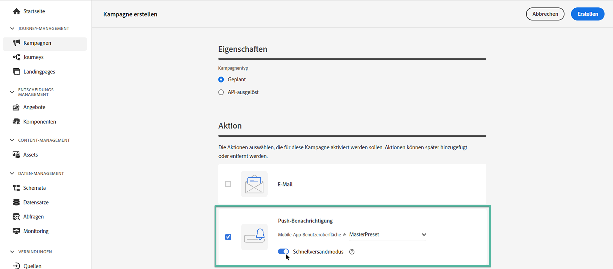

# Erstellen einer Kampagne {#create-campaign}

>[!NOTE]
>
>Bevor Sie eine neue Kampagne erstellen, überprüfen Sie, ob Sie über eine Kanaloberfläche (d. h. Nachrichtenvoreinstellung) und ein Adobe Experience Platform-Segment verfügen, die einsatzbereit sind. Weitere Informationen finden Sie in den folgenden Abschnitten:
>
>* [Erstellen von Kanaloberflächen](../configuration/channel-surfaces.md)
>* [Erste Schritte mit Segmenten](../segment/about-segments.md)

## Erstellen der ersten Kampagne {#create}

1. Rufen Sie das Menü **[!UICONTROL Kampagnen]** auf und klicken Sie auf **[!UICONTROL Kampagne erstellen]**.

   >[!NOTE]
   >
   >Sie können auch eine bestehende Live-Kampagne duplizieren, um eine neue Kampagne zu erstellen. [Weitere Informationen](modify-stop-campaign.md#duplicate)

   

1. Geben Sie im Abschnitt **[!UICONTROL Eigenschaften]** an, wann Sie die Kampagne ausführen möchten:

   * **[!UICONTROL Geplant]**: die Kampagne wird sofort oder an einem bestimmten Datum ausgeführt. Geplante Kampagnen dienen dem Versand von Nachrichten des Typs **Marketing**.
   * **[!UICONTROL API-ausgelöst]**: die Kampagne wird mithilfe eines API-Aufrufs ausgeführt. API-ausgelöste Kampagnen dienen dem Versand von Nachrichten des Typs **Transaktion**, d. h. Nachrichten, die aufgrund einer von einer Person durchgeführten Aktion gesendet werden: Zurücksetzen des Kennworts, Kündigung einer Karte usw. [Erfahren Sie, wie Sie eine Kampagne mithilfe von APIs auslösen](api-triggered-campaigns.md)

1. Wählen Sie im Bereich **[!UICONTROL Aktionen]** den Kanal und die Kanaloberfläche aus, die Sie zum Senden Ihrer Nachricht verwenden möchten, und klicken Sie dann auf **[!UICONTROL Erstellen]**.

   Eine Oberfläche ist eine Konfiguration, die durch [Systemadmins](../start/path/administrator.md) definiert worden ist. Sie enthält alle technischen Parameter zum Senden der Nachricht, wie z. B. Kopfzeilenparameter, Subdomain, Mobile Apps usw. [Weitere Informationen](../configuration/channel-surfaces.md).

   

   >[!NOTE]
   >
   >In der Dropdown-Liste werden nur Kanaloberflächen aufgeführt, die mit dem Typ der Marketing-Kampagne kompatibel sind.

1. Geben Sie einen Titel und eine Beschreibung für die Kampagne an.

   <!--To test the content of your message, toggle the **[!UICONTROL Content experiment]** option on. This allows you to test multiple variables of a delivery on populations samples, in order to define which treatment has the biggest impact on the targeted population.[Learn more about content experiment](../campaigns/content-experiment.md).-->

1. Konfigurieren Sie im Bereich **[!UICONTROL Aktionen]** die Nachricht, die mit der Kampagne gesendet werden soll:

   1. Klicken Sie auf die Schaltfläche **[!UICONTROL Inhalt bearbeiten]** und konfigurieren Sie den Nachrichteninhalt. [Weitere Informationen zu Nachrichten](../messages/get-started-content.md).

      Auf der folgenden Seite erfahren Sie mit detaillierten Schritten, wie Sie Ihren Nachrichteninhalt erstellen:

      * [Erstellen einer E-Mail](../messages/create-email.md)
      * [Erstellen einer Push-Benachrichtigung](../messages/create-push.md)
      * [Erstellen einer SMS-Nachricht](../messages/create-sms.md)
   1. Nachdem Ihr Inhalt definiert ist, verwenden Sie die Schaltfläche **[!UICONTROL Inhalt simulieren]**, um eine Vorschau anzuzeigen und Ihren Inhalt mit Testprofilen zu testen. [Weitere Informationen](../design/preview.md).

   1. Klicken Sie auf den Pfeil, um zum Bildschirm für die Kampagnenerstellung zurückzukehren.

      

   1. Geben Sie im Bereich **[!UICONTROL Aktions-Tracking]** an, ob Sie verfolgen möchten, wie Ihre Empfänger(innen) auf Ihren Versand reagieren: Sie können Klicks und/oder Öffnungen verfolgen.

      Die Tracking-Ergebnisse sind nach Ausführung der Kampagne im Kampagnenbericht verfügbar. [Weitere Informationen zu Kampagnenberichten](../reports/campaign-global-report.md)

1. Definieren Sie die anzusprechende Audience. Klicken Sie dazu auf die Schaltfläche **[!UICONTROL Zielgruppe auswählen]**, um die Liste der verfügbaren Adobe Experience Platform-Segmente anzuzeigen. [Weitere Informationen zu Segmenten](../segment/about-segments.md)

   >[!NOTE]
   >
   >Für API-ausgelöste Kampagnen muss die Audience über einen API-Aufruf festgelegt werden. [Weitere Informationen](api-triggered-campaigns.md)

   Wählen Sie im Feld **[!UICONTROL Identity-Namespace]** den Namespace aus, der zur Identifizierung der Personen im ausgewählten Segment verwendet werden soll. [Weitere Informationen über Namespaces](../event/about-creating.md#select-the-namespace)

   

   >[!NOTE]
   >
   >Personen, die zu einem Segment gehören, das nicht die ausgewählte Identität (den ausgewählten Namespace) hat, werden nicht in die Kampagne einbezogen.

   <!--If you are are creating an API-triggered campaign, the **[!UICONTROL cURL request]** section allows you to retrieve the **[!UICONTROL Campaign ID]** to use in the API call. [Learn more](api-triggered-campaigns.md)-->

1. Um Ihre Kampagne an einem bestimmten Datum oder in regelmäßigen Abständen auszuführen, konfigurieren Sie den Abschnitt **[!UICONTROL Zeitplan]**. [Informationen zum Definieren eines Zeitplans für Kampagnen](#schedule)

1. Um der Kampagne benutzerdefinierte oder Kerndatennutzungsbezeichnungen zuzuweisen, klicken Sie auf die Schaltfläche **[!UICONTROL Zugriff verwalten]** Schaltfläche. [Weitere Informationen zur Zugriffskontrolle auf Objektebene (OLA)](../administration/object-based-access.md)

Nachdem Ihre Kampagne fertiggestellt ist, können Sie sie überprüfen und veröffentlichen. [Weitere Informationen](#review-activate)

## Festlegen eines Zeitplans für eine Kampagne {#schedule}

Standardmäßig starten Kampagnen, sobald sie manuell aktiviert wurden, und enden, sobald die Nachricht einmal gesendet wurde.

Sie können aber auch festlegen, mit welcher Häufigkeit die Nachricht der Kampagne gesendet werden soll. Verwenden Sie dazu die Option **[!UICONTROL Aktions-Trigger]** im Bildschirm zur Kampagnenerstellung, um festzulegen, ob die Kampagne täglich, wöchentlich oder monatlich ausgeführt werden soll.

Wenn Sie Ihre Kampagne nicht direkt nach der Aktivierung ausführen möchten, können Sie das Datum und die Uhrzeit für den Versand der Nachricht mit der Option **[!UICONTROL Kampagnenstart]** angeben. Über die Option **[!UICONTROL Kampagnenende]** können Sie angeben, wann die Ausführung einer wiederkehrenden Kampagne gestoppt werden soll.

## Schnellbereitstellungsmodus {#rapid-delivery}

>[!CONTEXTUALHELP]
>id="ajo_campaigns_rapid_delivery"
>title="Schnellbereitstellungsmodus"
>abstract="Der Modus Schnellversand ist ein Journey Optimizer-Add-on, mit dem Sie nicht personalisierte Nachrichten für Zielgruppen mit 30 Millionen Profilen schnell ausgeben können."

Der schnelle Bereitstellungsmodus, der in Journey früher als Burst-Modus bezeichnet wurde, ist ein [!DNL Journey Optimizer] -Add-on, das den sehr schnellen Versand von Push-Nachrichten in großen Mengen durch Kampagnen ermöglicht.

Schneller Versand wird verwendet, wenn eine Verzögerung beim Nachrichtenversand geschäftskritisch ist, wenn Sie eine dringende Push-Benachrichtigung auf Mobiltelefone senden möchten, z. B. eine brechende Nachricht an Benutzer, die Ihre News-Kanal-App installiert haben.

Weitere Informationen zur Leistung bei Verwendung des Rapid-Versandmodus finden Sie unter [Adobe Journey Optimizer-Produktbeschreibung](https://helpx.adobe.com/de/legal/product-descriptions/adobe-journey-optimizer.html?lang=de).

### Voraussetzungen {#prerequisites}

Der schnelle Versand von Nachrichten umfasst die folgenden Anforderungen:

* Eine schnelle Bereitstellung ist verfügbar für **[!UICONTROL Geplant]** nur Kampagnen und nicht für API-gesteuerte Kampagnen verfügbar sind,
* In der Push-Benachrichtigung ist keine Personalisierung zulässig,
* Die Zielgruppe muss weniger als 30 Millionen Profile enthalten.
* Im Modus Schneller Versand können Sie bis zu 5 Kampagnen gleichzeitig ausführen.

### Aktivieren des Modus für schnelle Bereitstellung

1. Erstellen Sie eine Push-Benachrichtigungskampagne und aktivieren Sie die **[!UICONTROL Schneller Versand]** -Option.

1. Konfigurieren Sie den Nachrichteninhalt und wählen Sie die Zielgruppe aus. [Erfahren Sie, wie Sie eine Kampagne erstellen](#create)

   >[!IMPORTANT]
   >
   >Stellen Sie sicher, dass der Nachrichteninhalt keine Personalisierung enthält und dass die Audience weniger als 30 Millionen Profile enthält.

1. Überprüfen und aktivieren Sie Ihre Kampagne wie gewohnt. Beachten Sie, dass Nachrichten im Testmodus nicht über den Modus Schneller Versand gesendet werden. [Erfahren Sie, wie Sie eine Kampagne überprüfen und aktivieren](review-activate-campaign.md)
