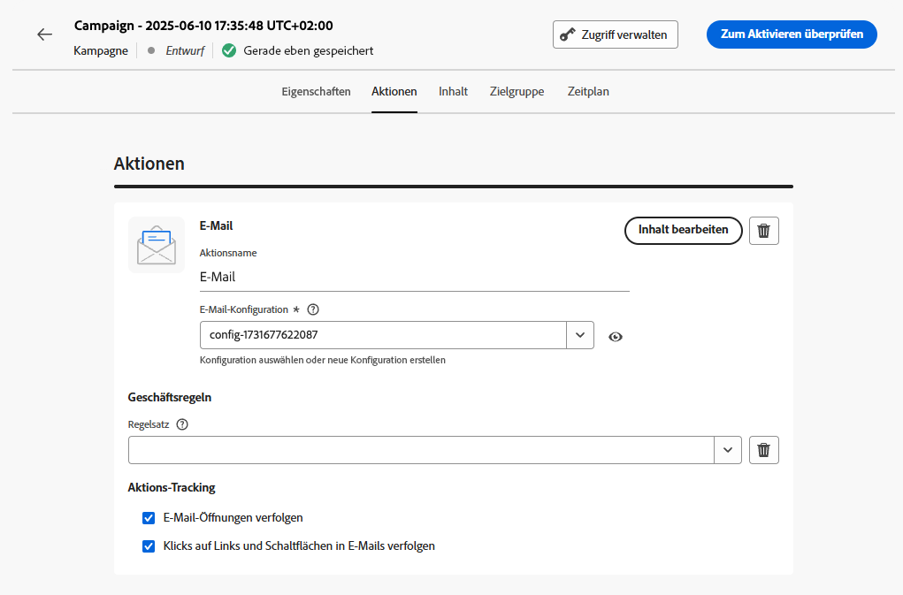

# Erstellen einer Kampagne {#create-campaign}

>[!NOTE]
>
>Bevor Sie eine neue Kampagne erstellen, überprüfen Sie, ob Sie über eine Kanaloberfläche (d. h. Nachrichtenvoreinstellung) und ein Adobe Experience Platform-Segment verfügen, die einsatzbereit sind. Weitere Informationen finden Sie in den folgenden Abschnitten:
>
>* [Erstellen von Kanaloberflächen](../configuration/channel-surfaces.md)
>* [Erste Schritte mit Segmenten](../segment/about-segments.md)

## Konfigurieren einer Kampagne {#configure}

Gehen Sie wie folgt vor, um eine Kampagne zu erstellen:

1. Rufen Sie das Menü **[!UICONTROL Kampagnen]** auf, und klicken Sie auf **[!UICONTROL Kampagne erstellen]**.

   

   >[!NOTE]
   >
   >Sie können auch eine vorhandene Live-Kampagne duplizieren, um eine neue zu erstellen.[Weitere Informationen](modify-stop-campaign.md#duplicate) <!-- check if only live campaigns-->

<!--1. In the **[!UICONTROL Properties]** section, specify when you want to execute the campaign:

    * **[!UICONTROL Scheduled]**: execute the campaign immediately or on a specified date. Scheduled campaigns are aimed at sending **marketing** type messages.
    * **[!UICONTROL API-triggered]**: execute the campaign using an API call. API-triggered campaigns are aimed at sending **transactional** messages, i.e. messages sent out following an action performed by an individual: password reset, card abandonment etc. [Learn how to trigger a campaign using APIs](api-triggered-campaigns.md)-->

1. Wählen Sie im Bereich **[!UICONTROL Aktionen]** den Kanal und die Kanaloberfläche aus, die Sie zum Senden Ihrer Nachricht verwenden möchten, und klicken Sie dann auf **[!UICONTROL Erstellen]**.

   

   >[!NOTE]
   >
   >In der Dropdown-Liste werden nur Kanaloberflächen aufgelistet, die mit dem Kampagnentyp (Marketing oder Transaktion) kompatibel sind.

1. Geben Sie einen Titel und eine Beschreibung für die Kampagne an.

   <!--To test the content of your message, toggle the **[!UICONTROL Content experiment]** option on. This allows you to test multiple variables of a delivery on populations samples, in order to define which treatment has the biggest impact on the targeted population.[Learn more about content experiment](../campaigns/content-experiment.md).-->

1. Konfigurieren Sie im Bereich **[!UICONTROL Aktionen]** die Nachricht, die mit der Kampagne gesendet werden soll:

   1. Klicken Sie auf die Schaltfläche **[!UICONTROL Inhalt bearbeiten]** und konfigurieren Sie den Nachrichteninhalt. [Weitere Informationen zu Nachrichten](../messages/get-started-content.md)

      >[!NOTE]
      >
      >Die **[!UICONTROL Inhalt simulieren]** -Schaltfläche können Sie Testprofile verwenden, um Ihre Inhalte in der Vorschau anzuzeigen und zu testen. [Weitere Informationen](../design/preview.md)

   1. Nachdem der Inhalt fertig ist, klicken Sie auf den Pfeil, um zum Kampagnenerstellungs-Bildschirm zurückzukehren.

      

   1. Geben Sie im Abschnitt **[!UICONTROL Aktionsverfolgung]** an, ob Sie verfolgen möchten, wie die Empfänger auf den Versand reagieren.

      Die Tracking-Ergebnisse sind nach Ausführung der Kampagne im Kampagnenbericht verfügbar. [Weitere Informationen zu Kampagnenberichten](../reports/campaign-global-report.md)

1. Definieren Sie die anzusprechende Audience. Klicken Sie dazu auf die Schaltfläche **[!UICONTROL Zielgruppe auswählen]**, um die Liste der verfügbaren Adobe Experience Platform-Segmente anzuzeigen. [Weitere Informationen zu Segmenten](../segment/about-segments.md)

   <!-- NOTE For API-triggered campaigns, the audience needs to be set via API call. [Learn more](api-triggered-campaigns.md)-->

   Wählen Sie im Feld **[!UICONTROL Identity-Namespace]** den Namespace aus, der zur Identifizierung der Personen im ausgewählten Segment verwendet werden soll. [Weitere Informationen über Namespaces](../event/about-creating.md#select-the-namespace)

   

   >[!NOTE]
   >
   >Personen, die zu einem Segment gehören, das nicht die ausgewählte Identität (den ausgewählten Namespace) hat, werden nicht in die Kampagne einbezogen.

1. Konfigurieren Sie das Start- und Enddatum der Kampagne. Standardmäßig sind Kampagnen so konfiguriert, dass sie starten, sobald sie manuell aktiviert werden, und enden, sobald die Nachricht einmal gesendet wurde.

1. Darüber hinaus können Sie die Ausführungshäufigkeit der in der Kampagne konfigurierten Aktion festlegen.

   <!-- NOTE For API-triggered campaigns, scheduling at a specific date and time with recurrence is not available as action is triggered via API. However, start and end date are relevant to ensure that, if an API call is made prior of after the window, then those get errored.-->

   

<!--1. If you are are creating an API-triggered campaign, the **[!UICONTROL cURL request]** section allows you to retrieve the **[!UICONTROL Campaign ID]** to use in the API call. [Learn more](api-triggered-campaigns.md)-->

Sobald Ihre Kampagne bereit ist, können Sie sie überprüfen und veröffentlichen (siehe [Kampagne überprüfen und aktivieren](#review-activate)).

## Kampagne überprüfen und aktivieren {#review-activate}

Nachdem die Kampagne konfiguriert wurde, müssen Sie ihre Parameter und Inhalte überprüfen, bevor Sie sie aktivieren. Gehen Sie dazu wie folgt vor:

1. Klicken Sie im Konfigurationsbildschirm der Kampagne auf **[!UICONTROL Zum Aktivieren überprüfen]**, um eine Zusammenfassung der Kampagne anzuzeigen.

   In der Zusammenfassung können Sie die Kampagne bei Bedarf ändern und überprüfen, ob ein Parameter falsch ist oder fehlt.

   >[!IMPORTANT]
   >
   >Bei Fehlern können Sie die Kampagne nicht aktivieren. Beheben Sie die Fehler, bevor Sie fortfahren.

   

1. Vergewissern Sie sich, dass Ihre Kampagne korrekt konfiguriert ist, und klicken Sie dann auf **[!UICONTROL Aktivieren]**.

   

1. Die Kampagne ist jetzt aktiviert und hat den Status **[!UICONTROL Live]** (oder **[!UICONTROL Geplant]**, wenn Sie ein Startdatum angegeben haben). [Weitere Informationen zum Kampagnenstatus](get-started-with-campaigns.md#statuses). Die in der Kampagne konfigurierte Nachricht wird sofort oder am angegebenen Datum ausgeführt.

   >[!NOTE]
   >
   >Die **[!UICONTROL Abgeschlossen]** Der Status wird einer Kampagne automatisch 3 Tage nach ihrer Aktivierung zugewiesen oder am Enddatum der Kampagne, wenn sie eine wiederkehrende Ausführung aufweist.
   >
   >Wenn kein Enddatum angegeben wurde, behält die Kampagne den Status &quot;Live&quot;. Um sie zu ändern, müssen Sie die Kampagne manuell stoppen. [Informationen zum Stoppen einer Kampagne](modify-stop-campaign.md)

1. Nach der Aktivierung einer Kampagne können Sie jederzeit ihre Informationen überprüfen, indem Sie sie öffnen. In der Zusammenfassung finden Sie Statistiken über die Anzahl der Zielgruppenprofile sowie der bereitgestellten und fehlgeschlagenen Aktionen.

   Sie können auch zusätzliche Statistiken in speziellen Berichten einsehen, indem Sie auf die Schaltfläche **[!UICONTROL Berichte]** klicken. [Weitere Informationen](../reports/campaign-global-report.md)

   
