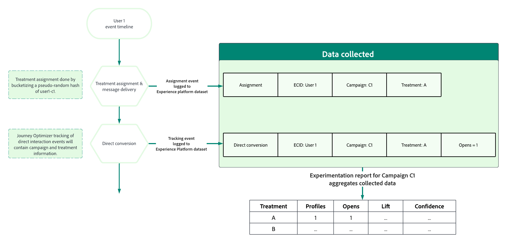

# Erste Schritte mit Inhaltsexperimenten {#get-started-experiment}

>[!AVAILABILITY]
>
>Die Funktion für Inhaltsexperimente ist derzeit nur für ausgewählte Organisationen verfügbar (eingeschränkte Verfügbarkeit). Weitere Informationen erhalten Sie beim Adobe-Support.

## Was ist ein Inhaltsexperiment?

Mithilfe von Inhaltsexperimenten können Sie Inhalte für die Aktionen in Ihren Kampagnen optimieren.

Bei Experimenten handelt es sich um eine Reihe von randomisierten Prüfungen, was im Rahmen von Online-Tests bedeutet, dass einige zufällig ausgewählte Benutzende eine bestimmten Variante einer Nachricht erhalten und eine andere zufällig ausgewählte Gruppe von Benutzenden eine andere Behandlung erfährt. Nach dem Versand der Nachricht können Sie dann die Ergebnismetriken messen, die Sie interessieren, z. B. Öffnungen von E-Mails oder Klicks.

## Warum sollten Experimente durchgeführt werden?

Mit Hilfe von Experimenten können Sie genau ermitteln, welche Änderungen zu Verbesserungen in Ihren Metriken führen. Wie in der Abbildung oben dargestellt, besteht jede Gruppe, die eine bestimmte Behandlung erhält, aus zufällig ausgewählten Benutzenden. Das bedeutet, dass die Gruppen im Durchschnitt die gleichen Merkmale aufweisen. Folglich kann jeder Unterschied bei den Ergebnissen auf die Unterschiede der Behandlungen zurückgeführt werden, d. h. Sie können einen kausalen Zusammenhang zwischen den vorgenommenen Änderungen und den Ergebnissen, die Sie interessieren, herstellen.

Auf diese Weise können Sie datengestützte Entscheidungen treffen, um Ihre geschäftlichen Ziele zu optimieren.

Für Inhaltsexperimente in Adobe Journey Optimizer können Sie beispielsweise folgende Ideen testen:

* **Betreffzeile**: Wie könnte sich eine Änderung des Tons oder des Personalisierungsgrads in der Betreffzeile auswirken?
* **Nachrichteninhalt**: Führt eine Änderung des visuellen Layouts einer E-Mail zu mehr Klicks bei der E-Mail?

## Wie funktioniert ein Inhaltsexperiment? {#content-experiment-work}

### Zufällige Zuweisung

Inhaltsexperimente in Adobe Journey Optimizer verwenden einen pseudo-zufälligen Hash der Besucheridentität, um eine zufällige Zuweisung von Benutzenden in Ihrer Audience zu einer der von Ihnen definierten Behandlungen durchzuführen. Der Hash-Mechanismus stellt sicher, dass in Szenarien, in denen Besuchende mehrmals in eine Kampagne eintreten, deterministisch dieselbe Behandlung erhalten.

Im Detail wird der 32-Bit-Algorithmus MumurHash3 verwendet, um die Benutzeridentitätszeichenfolge in einen von 10.000 Buckets zu hashen. In einem Inhaltsexperiment, bei dem jeder Behandlung 50 % des Traffics zugewiesen werden, erhalten Benutzende, die in einen der Buckets 1 bis 5.000 fallen, die erste Behandlung, während Benutzende in den Buckets 5.001 bis 10.000 die zweite Behandlung erhalten. Da pseudo-zufälliges Hashing verwendet wird, ist die Aufteilung der Besuchenden, die Sie feststellen, möglicherweise nicht genau 50–50. Die Aufteilung entspricht dennoch statistisch Ihrem Zielaufteilungsprozentsatz.

Beachten Sie, dass Sie bei der Konfiguration jeder Kampagne mit einem Inhaltsexperiment einen Identity-Namespace auswählen müssen, aus dem die userId für den Randomisierungsalgorithmus ausgewählt wird. Dies ist unabhängig von den [Ausführungsadressen](../configuration/primary-email-addresses.md).

### Datensammlung und Analyse

Zum Zeitpunkt der Zuweisung, d. h. wenn die Nachricht in ausgehenden Kanälen gesendet wird oder wenn Benutzende über eingehende Kanäle in die Kampagne eintreten, wird ein „Zuweisungseintrag“ im entsprechenden Systemdatensatz protokolliert. Dadurch wird aufgezeichnet, welcher Behandlung den Benutzenden zugewiesen wurde, dazu Experiment- und Kampagnen-Kennungen.

Zielmetriken können in zwei Hauptklassen gruppiert werden:

* Direkte Metriken, bei denen Benutzende direkt auf die Behandlung reagieren, z. B. beim Öffnen einer E-Mail oder Klicken auf einen Link.
* Indirekte oder „Trichterboden“-Metriken, die auftreten, nachdem Benutzende der Behandlung ausgesetzt wurden.

Bei direkten objektiven Metriken, bei denen Adobe Journey Optimizer Ihre Nachrichten nachverfolgt, werden die Antwortereignisse der Endbenutzenden automatisch mit den Tags zur Kampagnen- und Behandlungs-Kennung versehen, was eine direkte Verknüpfung der Antwortmetrik mit einer Behandlung ermöglicht. [Weitere Informationen zum Tracking](../design/message-tracking.md).

Bei indirekten oder „Trichterboden“-Zielen wie Käufen werden die Reaktionsereignisse der Endbenutzenden nicht mit Tags zur Kampagnen- und Behandlungs-Kennung versehen, d. h., ein Kaufereignis tritt ein, nachdem Benutzende einer Behandlung ausgesetzt waren. Dieser Kauf wird nicht direkt mit einer vorherigen Zuweisung einer Behandlung verknüpft. Für diese Metriken verknüpft Adobe die Behandlung mit dem „Trichterboden“-Konversionsereignis, wenn:

* Die Benutzeridentität zum Zeitpunkt der Zuweisung und des Konversionsereignisses identisch ist.
* Die Konversion innerhalb von sieben Tagen nach der Behandlungszuweisung erfolgt.

Adobe Journey Optimizer verwendet dann erweiterte statistische Methoden, die „jederzeit gültig“ sind, um diese Rohdaten für die Berichterstellung zu interpretieren, mit denen Sie Ihre Experimentationsberichte interpretieren können. Weitere Informationen hierzu finden Sie auf [dieser Seite](../campaigns/experiment-calculations.md).

## Tipps zum Durchführen von Experimenten

Beim Durchführen von Experimenten ist es wichtig, bestimmte Best Practices zu befolgen. Im Folgenden finden Sie einige Tipps zum Durchführen dieser Experimente:

+++ Isolieren Sie die Variablen, im Hinblick auf die Sie testen möchten

Formulieren Sie einige Hypothesen, die Sie testen möchten, und beschränken Sie diese Hypothesen auf möglichst wenige Änderungen, um festzustellen, welche Auswirkungen dadurch beim Versand erzielt werden.

Eine gute Hypothese kann beispielsweise sein, ob Personalisierung in E-Mail-Betreffzeilen zu besseren Öffnungsraten führt. Wenn Sie zusätzlich jedoch Änderungen am Nachrichteninhalt vornehmen oder Bilder hinzufügen, kann dies zu einer verwirrenden Schlussfolgerung führen.
+++

+++ Stellen Sie sicher, dass die richtige Metrik verwendet wird

Bestimmen Sie die Metrik, die Sie ins Visier nehmen möchten, und stellen Sie auch fest, ob die von Ihnen vorgenommenen Änderungen direkte Auswirkungen auf diese Metrik haben können.

So ist es beispielsweise unwahrscheinlich, dass sich eine Änderung des Nachrichteninhalts auf die Öffnungsraten der E-Mail auswirkt.
+++

+++ Führen Sie Ihren Test mit der richtige Zielgruppengröße oder lange genug aus

Je länger Sie Ihre Tests durchführen, desto geringere Unterschiede zwischen den Behandlungen können Sie in der Zielmetrik erkennen. Wenn der Ausgangswert Ihrer Zielmetrik jedoch klein ist, benötigen Sie umfangreichere Stichprobengrößen.
Wie viele Benutzende Sie in Ihr Experiment einbeziehen müssen, hängt von der zu erkennenden Effektgröße, der Varianz oder Verbreitung Ihrer Zielmetrik sowie von Ihrer Toleranz für falsch-positive und falsch-negative Fehler ab. In klassischen Experimenten können Sie einen [Stichprobengrößenrechner](https://experienceleague.adobe.com/tools/calculator/testcalculator.html?lang=de){_blank} nutzen, um zu bestimmen, wie lange Sie Ihren Test ausführen müssen.
+++

+++ Verstehen Sie statistische Unsicherheiten

Nehmen wir an, Sie haben ein Experiment durchgeführt, bei dem 1000 Benutzende eine Behandlung gesehen haben, und die Konversionsrate liegt bei 5 %. Wäre dies die tatsächliche Konversionsrate, wenn alle Ihre Benutzenden einbezogen würden? Was wäre die tatsächliche Konversionsrate?
Statistische Methoden geben uns eine Möglichkeit, diese Unsicherheit zu formalisieren. Eines der wichtigsten Konzepte, das Sie bei der Durchführung von Online-Experimenten verstehen müssen, ist, dass die beobachteten Konversionsraten mit einem Bereich zugrunde liegender realer Konversionsraten konsistent sind. Das bedeutet, dass Sie warten müssen, bis diese Schätzungen präzise genug sind, bevor Sie versuchen, eine Schlussfolgerung zu ziehen. Konfidenzintervalle und Konfidenz helfen uns, diese Unsicherheit zu quantifizieren.
+++

+++ Formulieren Sie neue Hypothesen und testen Sie sie kontinuierlich

Um echte geschäftliche Einblicke zu gewinnen, sollten Sie an nur einem Experiment festhalten. Allerdings sollten Sie im Anschluss an diese Experimente neue Hypothesen formulieren und neue Tests mit unterschiedlichen Änderungen durchführen, verschiedene Segmente betrachten und die Auswirkungen auf die verschiedenen Metriken untersuchen.
+++

## Interpretieren der Ergebnisse Ihrer Experimente {#interpret-results}

In diesem Abschnitt werden die Experimentberichte beschrieben, und Sie erfahren, wie die verschiedenen statistischen Mengen, die angezeigt werden, zu verstehen sind.

Im Folgenden finden Sie einige Richtlinien für die Interpretation der Ergebnisse Ihres Inhaltsexperiments.

Beachten Sie, dass bei einer vollständigen Beschreibung der Ergebnisse alle verfügbaren Fakten (d. h. Stichprobengrößen, Konversionsraten, Konfidenzintervalle usw.) berücksichtigt werden sollten und nicht nur, ob eine Erklärung als endgültig erfolgt ist oder nicht. Selbst wenn ein Ergebnis noch nicht endgültig ist, kann es dennoch zwingende Beweise dafür geben, dass eine Behandlung anders ist als eine andere.

Statistische Berechnungen werden auf dieser [Seite](../campaigns/experiment-calculations.md) erläutert.

### 1. Vergleichen normalisierter Metriken {#normalized-metrics}

Wenn Sie die Performance von zwei Behandlungen vergleichen, sollten Sie immer die normalisierten Metriken vergleichen, um Unterschiede in der Anzahl der Profile zu berücksichtigen, die jeder Behandlung ausgesetzt sind.

Wenn das Experimentziel beispielsweise **[!UICONTROL Einzelöffnungen]** sind und eine bestimmte Behandlung 10.000 Profilen gezeigt wurde und zu 200 erfassten Einzelöffnungen führte, entspricht dies einer **[!UICONTROL Konversionsrate]** von 2 %. Bei nicht eindeutigen Metriken, z. B. der Öffnungs-Metrik, wird die normalisierte Metrik als **[!UICONTROL Anzahl pro Profil]** angezeigt, während bei kontinuierlichen Metriken wie „Preis gesamt“ die normalisierte Metrik als **[!UICONTROL Gesamt pro Profil]** angezeigt wird.

### 2. Konzentration auf Konfidenzintervalle {#confidence-intervals}

Wenn Sie Experimente mit Stichproben Ihrer Profile durchführen, stellt die für eine bestimmte Behandlung beobachtete Konversionsrate eine Schätzung der tatsächlichen zugrunde liegenden Konversionsrate dar.

Wenn beispielsweise Behandlung A eine **[!UICONTROL Konversionsrate]** von 3 % aufweist, während Behandlung B eine beobachtete **[!UICONTROL Konversionsrate]** von 2 % hat, ist Behandlung A dann besser als Behandlung B? Um diese Frage zu beantworten, müssen wir zunächst die Unsicherheit in diesen beobachteten Konversionsraten quantifizieren.

Konfidenzintervalle helfen dabei, den Grad der Unsicherheit in den geschätzten Konversionsraten zu quantifizieren, aber breitere Konfidenzintervalle bedeuten mehr Unsicherheit. Je mehr Profile dem Experiment hinzugefügt werden, desto kleiner werden die Intervalle, die eine genauere Schätzung darstellen. Das Konfidenzintervall stellt einen Bereich von Konversionsraten dar, die mit den beobachteten Daten kompatibel sind.

Wenn sich die Konfidenzintervalle für zwei Behandlungen kaum überschneiden, bedeutet dies, dass die beiden Behandlungen unterschiedliche Konversionsraten aufweisen. Wenn es jedoch eine große Überschneidung zwischen den Konfidenzintervallen für zwei Behandlungen gibt, ist es wahrscheinlicher, dass die beiden Behandlungen dieselbe Konversionsrate aufweisen.

Adobe verwendet 95 % jederzeit gültige Konfidenzintervalle oder Konfidenzsequenzen, was bedeutet, dass die Ergebnisse zu jedem Zeitpunkt des Experiments sicher angezeigt werden können.

### 3. Verstehen von Steigerungen {#understand-lift}

In der Zusammenfassung des Experiments wird die **[!UICONTROL Steigerung gegenüber der Grundlinie]** angezeigt, die ein Maß für die prozentuale Verbesserung der Konversionsrate einer bestimmten Behandlung gegenüber der Grundlinie darstellt. Genauer gesagt handelt es sich um den Unterschied in der Leistung zwischen einer bestimmten Behandlung und der Grundlinie, geteilt durch die Leistung der Grundlinie, ausgedrückt in Prozent.

### 3. Verstehen von Konfidenz {#understand-confidence}

Während Sie sich in erster Linie auf das **[!UICONTROL Konfidenzintervall]** für die Leistung der einzelnen Behandlungen konzentrieren sollten, zeigt Adobe auch die Konfidenz an, die ein probabilistisches Maß dafür ist, wie viel Evidenz es dafür gibt, dass eine bestimmte Behandlung mit der Grundlinienbehandlung identisch ist. Ein höherer Konfidenzwert zeigt an, dass die Annahme, wonach die Grundlinien- und die Nicht-Grundlinien-Behandlung die gleiche Leistung aufweisen, weniger gut belegt ist. Genauer gesagt ist die angezeigte Konfidenz die Wahrscheinlichkeit (ausgedrückt als Prozentsatz), dass wir einen geringeren Unterschied bei den Konversionsraten zwischen einer bestimmten Behandlung und der Grundlinie beobachtet hätten, wenn es in Wirklichkeit keinen Unterschied bei den tatsächlichen zugrunde liegenden Konversionsraten gibt. Um es mit den p-Werten auszudrücken, ist die angezeigte Konfidenz 1 - p-Wert.

Adobe verwendet „jederzeit gültige“ Konfidenz und „jederzeit gültige“ p-Werte, die mit den oben beschriebenen Konfidenzsequenzen übereinstimmen.

### 4. Statistische Signifikanz

Bei der Durchführung von Experimenten wird ein Ergebnis als statistisch signifikant eingestuft, wenn es sehr unwahrscheinlich ist, dass es bei der Nullhypothese, dass eine bestimmte Behandlung und die Grundlinie identische zugrunde liegende Konversionsraten/Leistungen aufweisen, beobachtet worden wäre.

Adobe stuft ein Experiment als schlüssig ein, wenn die Konfidenz über 95 % liegt.

## Was ist nach der Durchführung eines Experiments zu tun?

Nach der Durchführung eines Experiments gibt es mehrere mögliche Folgemaßnahmen:

* **Einsatz erfolgreicher Ideen**

   Wenn das Ergebnis eindeutig ist, können Sie die erfolgreiche Idee umsetzen, indem Sie entweder die Behandlung mit der besten Leistung bei all Ihren Kunden einsetzen oder neue Kampagnen erstellen, in denen die Struktur der Behandlung mit der besten Leistung nachgebildet wird.
     Beachten Sie, dass in einer dynamischen Umgebung das, was zu einem bestimmten Zeitpunkt gut funktioniert, später möglicherweise nicht mehr gut funktioniert.

* **Durchführung von Folgetests**

   Manchmal können die Ergebnisse Ihrer Experimente nicht schlüssig sein, entweder weil nicht genügend Profile einbezogen wurden, um einen Unterschied zwischen den Behandlungen festzustellen, oder weil die von Ihnen definierten Behandlungen nicht ausreichend unterschiedlich waren.

   Wenn die Hypothese, die Sie getestet haben, immer noch relevant ist, kann es sinnvoll sein, einen Folgetest mit einer größeren oder anderen Zielgruppe durchzuführen oder die Behandlungen so zu ändern, dass die Unterschiede deutlicher werden.

* **Durchführen von vertiefenden Analysen**

   Die Behandlung, die bei einer Zielgruppe gut funktioniert, ist manchmal nicht die beste Behandlung für eine andere Zielgruppe. Vertiefende Analysen darüber, wie sich die Behandlungen in verschiedenen Segmenten entwickelt haben, helfen dabei, Ideen für neue Tests zu entwickeln.

   Ebenso kann die Untersuchung der Leistung der einzelnen Behandlungen mit verschiedenen Metriken einen umfassenderen Überblick über Ihre Experimente geben.

   >[!CAUTION]
   >
   >Je mehr Analysen durchgeführt werden, desto höher ist die Wahrscheinlichkeit, einen falschen oder falsch positiven Effekt zu erkennen.
