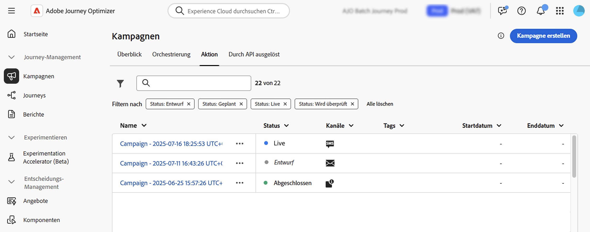
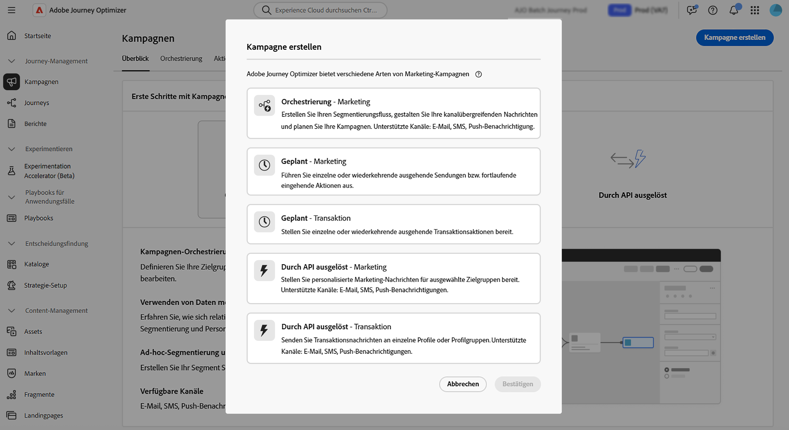

# Erste Schritte mit Kampagnen {#get-started-campaigns}

>[!CONTEXTUALHELP]
>id="ajo_campaigns_schedule"
>title="Kampagnenzeitplan"
>abstract="Standardmäßig starten Kampagnen bei manueller Aktivierung und enden unmittelbar nach dem einmaligen Versand der Nachricht. Sie haben die Möglichkeit, ein bestimmtes Datum und eine bestimmte Uhrzeit für den Versand der Nachricht festzulegen. Darüber hinaus können Sie ein Enddatum für wiederkehrende Aktionskampagnen angeben. In den Aktionsauslösern können Sie auch die Versandhäufigkeit der Nachrichten nach eigenen Wünschen konfigurieren."

>[!CONTEXTUALHELP]
>id="ajo_campaigns_schedule_start"
>title="Kampagnenstart"
>abstract="Geben Sie ein Datum und eine Uhrzeit an, zu der die Nachricht gesendet werden soll."

>[!CONTEXTUALHELP]
>id="ajo_campaigns_schedule_end"
>title="Kampagnenende"
>abstract="Geben Sie an, wann die Ausführung einer wiederkehrenden Kampagne gestoppt werden soll."

>[!CONTEXTUALHELP]
>id="ajo_campaigns_schedule_triggers"
>title="Auslöser für Kampagnenaktionen"
>abstract="Definieren Sie, wie häufig die Nachricht der Kampagne gesendet werden soll."

>[!CONTEXTUALHELP]
>id="ajo_campaigns_throttling"
>title="Ratensteuerung"
>abstract="Legen Sie die Ratensteuerung für Ihre Kampagne fest, indem Sie die gewünschten Ratenbegrenzungen angeben. Diese Funktion ist besonders nützlich, um eine Überlastung nachgelagerter Systeme zu verhindern, beispielsweise Landingpages oder Plattformen für die Kundenunterstützung."

>[!CONTEXTUALHELP]
>id="ajo_homepage_card3"
>title="Erstellen von Kampagnen"
>abstract="Verwenden Sie **Journey Optimizer-Kampagnen**, um mithilfe verschiedener Kanäle einmalige Inhalte für eine bestimmte Zielgruppe bereitzustellen. Bei Verwendung von Journeys werden die Aktionen nacheinander ausgeführt. Bei Kampagnen werden die Aktionen gleichzeitig ausgeführt, entweder sofort oder nach einem bestimmten Zeitplan."

>[!CONTEXTUALHELP]
>id="campaigns_list"
>title="Kampagnen"
>abstract="Kampagnen erstellen, um einmalige Inhalte für eine bestimmte Zielgruppe über verschiedene Kanäle hinweg bereitzustellen. Vor Erstellung einer Kampagne überprüfen, ob eine einsatzbereite Kanalkonfiguration und Adobe Experience Platform-Zielgruppe vorhanden sind."

>[!CONTEXTUALHELP]
>id="ajo_campaigns_campaign_type"
>title="Kampagnentyp"
>abstract="Den Kampagnentyp auswählen. Die verfügbaren Kanäle variieren je nach ausgewähltem Typ.  **Geplante Kampagnen** (Aktionskampagnen) – Ideal für einfache, einmalige Batch-Nachrichten, deren Ausführung für einen bestimmten Zeitpunkt geplant werden kann. **Durch API ausgelöste Kampagnen** – Werden über einen API-Aufruf aktiviert, wodurch direkt von externen Systemen aus automatisiertes, ereignisbasiertes Messaging ermöglicht wird. **Orchestrierte Kampagnen** – Stellen eine visuelle Drag-and-Drop-Arbeitsfläche bereit, auf der komplexe, mehrstufige Marketing-Workflows entworfen und automatisiert werden können: von der Zielgruppensegmentierung bis hin zum kanalübergreifenden Versand personalisierter Nachrichten."

>[!CONTEXTUALHELP]
>id="ajo_campaigns_create_orchestration"
>title="Kampagnen"
>abstract="Erstellen Sie Ihren Segmentierungsfluss, gestalten Sie Ihre kanalübergreifenden Nachrichten und planen Sie Ihre Kampagnen. Unterstützte Kanäle: E-Mail, SMS, Push-Benachrichtigung."

>[!CONTEXTUALHELP]
>id="ajo_campaigns_create_scheduled_marketing"
>title="Kampagnen"
>abstract="Führen Sie einzelne oder wiederkehrende ausgehende Sendungen bzw. fortlaufende eingehende Aktionen aus."

>[!CONTEXTUALHELP]
>id="ajo_campaigns_create_scheduled_transactional"
>title="Kampagnen"
>abstract="Stellen Sie einzelne oder wiederkehrende ausgehende Transaktionsaktionen bereit."

>[!CONTEXTUALHELP]
>id="ajo_campaigns_create_api_marketing"
>title="Kampagnen"
>abstract="Stellen Sie personalisierte Marketing-Nachrichten für ausgewählte Zielgruppen bereit. Unterstützte Kanäle: E-Mail, SMS, Push-Benachrichtigungen."

>[!CONTEXTUALHELP]
>id="ajo_campaigns_create_api_transactional"
>title="Kampagnen"
>abstract="Senden Sie Transaktionsnachrichten an einzelne Profile oder Profilgruppen. Unterstützte Kanäle: E-Mail, SMS, Push-Benachrichtigungen."

Mit Adobe Journey Optimizer können Sie zielgerichtete einmalige Inhalte für bestimmte Zielgruppen kanalübergreifend bereitstellen. Mithilfe von Kampagnen können Sie gleichzeitig koordinierte Marketing-Aktionen ausführen und Ihre Zielgruppe mit der richtigen Botschaft zur richtigen Zeit erreichen.

Dieses Handbuch bietet eine klare Roadmap, die Ihnen hilft, die Kampagnengrundlagen zu verstehen, den richtigen Kampagnentyp für Ihren Anwendungsfall auszuwählen und sicher Kampagnen zu entwerfen, die wirkungsvolle Kundenerlebnisse bieten.

## Was sind Kampagnen?

**Kampagnen** sind koordinierte Marketing-Aktionen, die Inhalte für eine bestimmte Zielgruppe über einen oder mehrere Kanäle hinweg bereitstellen. Im Gegensatz zu Journey, bei denen Aktionen sequenziell ausgeführt werden, führen Kampagnen Aktionen gleichzeitig durch - entweder sofort oder nach einem definierten Zeitplan.

Verwenden Sie [!DNL Journey Optimizer] für:

* Bereitstellen **(einmaliger oder wiederkehrender Inhalte** für ausgewählte Zielgruppensegmente
* Ausführen **koordinierten Multi-Channel-**) für E-Mail, Push, SMS, In-App, Web und mehr
* Trigger **automatisierte Antworten** über API-Aufrufe für ereignisgesteuertes Messaging in Echtzeit
* Entwerfen **komplexer Marketing-Workflows** mit visuellen Orchestrierungs-Tools

➡️ **Bereit zum Bauen?** [Erstellen Sie Ihre erste Kampagne](create-campaign.md) in Minuten.

## Kampagnentyp wählen {#campaign-types}

**Bevor Sie mit der Erstellung**, müssen Sie wissen, welcher Kampagnentyp für Ihren Anwendungsfall geeignet ist. Adobe Journey Optimizer unterstützt drei Kampagnentypen, die jeweils für verschiedene Szenarien und Aktivierungsmechanismen entwickelt wurden:

>[!BEGINTABS]

>[!TAB Aktionskampagnen (geplant)]

**Verwendung:** Einfache, geplante Batch-Kommunikation

**Aktionskampagnen** (auch als geplante Kampagnen bezeichnet) eignen sich ideal für einfache, einmalige oder wiederkehrende Batch-Nachrichten, die zu einem bestimmten Zeitpunkt ausgeführt werden.

**Zwei Kategorien:**

* **Marketing** - Werbeangebote, Interaktionskampagnen, Mitteilungen, rechtliche Hinweise oder Richtlinienaktualisierungen. Erfordert, dass Empfängerinnen und Empfänger zugestimmt haben.
* **Transaktion** - Störungen, Notfälle, Abbrüche. Erfordert keine Anmeldung.

**Perfekt für:** monatliche Newsletter an Kundensegmente, zeitkritische Werbeanzeigen, saisonale Marketing-Kampagnen, Mitteilungen über Produkteinführungen und Benachrichtigungen über Service-Unterbrechungen.

➡️ [Erfahren Sie mehr über Aktionskampagnen](create-campaign.md)

>[!TAB Durch API ausgelöste Kampagnen]

**Verwendung:** Ereignisgesteuertes Echtzeit-Messaging mit externen Systemen

**API-ausgelöste Kampagnen** werden über API-Aufrufe aktiviert, wodurch automatisiertes Messaging direkt von externen Systemen aus ermöglicht wird. Diese Kampagnen unterstützen die Personalisierung sowohl mithilfe von Profilattributen als auch anhand von Echtzeit-Kontextdaten aus der API-Payload.

**Zwei Kategorien:**

* **Marketing** - Personalisierte Marketing-Kommunikation für ausgewählte Zielgruppen
* **Transaktion** - Nachrichten nach einzelnen Aktionen (Zurücksetzen des Passworts, Warenkorbkäufe usw.)

**Perfekt für:** Bestätigungen zum Zurücksetzen des Kennworts, Wiederherstellung bei Warenkorbabbrüchen, Bestellbestätigungen und Versandaktualisierungen, Benachrichtigungen zu Kontoaktivitäten und personalisierte Empfehlungen in Echtzeit.

➡️ [Erfahren Sie mehr über API-ausgelöste Kampagnen](api-triggered-campaigns.md)

>[!TAB Orchestrierte Kampagnen]

**Verwendung:** Komplexe, mehrstufige Marketing-Workflows

**Orchestrierte Kampagnen** bieten eine visuelle Drag-and-Drop-Arbeitsfläche zum Entwerfen und Automatisieren komplexer Marketing-Workflows. Von der Zielgruppensegmentierung bis hin zum kanalübergreifenden Versand personalisierter Nachrichten erfolgt alles in einer intuitiven Umgebung, die für Geschwindigkeit und Kontrolle entwickelt wurde.

**Perfekt für:** Mehrstufige Kundeninteraktions-Programme, komplexe Segmentierungs- und Targeting-Strategien, kanalübergreifende Orchestrierung von Kampagnen, markeninitiiertes Marketing in großem Maßstab und erweiterte Workflow-Automatisierung mit mehreren Entscheidungspunkten.

➡️ [Erfahren Sie mehr über orchestrierte Kampagnen](../orchestrated/gs-orchestrated-campaigns.md)

>[!ENDTABS]

>[!NOTE]
>
>Nicht sicher, welcher Typ ausgewählt werden soll? Beginnen Sie mit **Aktionskampagnen** für geplante Batch-Nachrichten oder **API-ausgelöste Kampagnen** für Echtzeit-Messaging. Diese decken die häufigsten Anwendungsfälle ab.

## Workflow zur Kampagnenerstellung {#workflow}

Der Aufbau erfolgreicher Kampagnen erfolgt nach einem klaren, wiederholbaren Prozess. Hier finden Sie Ihren Schritt-für-Schritt-Workflow:

**1. Plan** → **2. Konfigurieren** → **3. Design** → **4.** → **5. Aktivieren** → **6. Überwachen**

### &#x200B;1. Planung der Kampagne {#plan}

Bevor Sie beginnen, klären Sie Ihre Ziele:

* **Was ist das Ziel?** (z. B. Konversionen fördern, die Interaktion steigern, Kunden benachrichtigen)
* **Wer ist das Publikum?** (z. B. aus Adobe Experience Platform erstellen oder auswählen)
* **Welcher Kampagnentyp passt?** (Siehe [Kampagnentypen](#campaign-types) oben)
* **Welche Kanäle werden Sie verwenden?** (E-Mail, Push, SMS, In-App, Web usw.) → [Siehe Unterstützte Kanäle nach Kampagnentyp](../channels/gs-channels.md#channels)
* **Wann sollte sie ausgeführt werden?** (sofort, geplant oder API-ausgelöst)

### &#x200B;2. Konfigurieren der Kampagneneigenschaften {#configure}

Richten Sie die Grundlage Ihrer Kampagne ein:

1. **Benennen und beschreiben** zur einfachen Identifizierung Ihrer Kampagne
2. **Kampagnentyp auswählen** (Aktion, API-ausgelöst oder orchestriert)
3. **Wählen Sie Ihre Audience**
4. **Priorität festlegen** bei Verwendung des Konflikt-Managements
5. **Zeitplan konfigurieren** (für Aktionskampagnen) oder API-Details (für API-ausgelöste)

**Typspezifische Handbücher:** [Kampagneneigenschaften](campaign-properties.md) | [API-ausgelöste Kampagneneigenschaften](api-triggered-campaign-properties.md) | [Orchestrierte Kampagneneinrichtung](../orchestrated/create-orchestrated-campaign.md)

### &#x200B;3. Gestalten von Inhalten {#design}

Erstellen Sie überzeugende Botschaften für Ihre Zielgruppe:

* Verwenden von **E-Mail-Designer** für umfassende E-Mail-Erlebnisse
* Konfigurieren **Push-Benachrichtigungen** mit Bildern und Deep-Links
* Gestalten **SMS/MMS-Nachrichten** mit Personalisierung
* Erstellen **In-App**- und **Web** Erlebnissen
* Hinzufügen **Personalisierung** mithilfe von Profilattributen und kontextuellen Daten

**Typspezifische Handbücher:** [Kampagneninhalt](campaign-content.md) | [API-ausgelöste Kampagneninhalte](api-triggered-campaign-content.md) | [Orchestrierte Kampagneninhalte](../orchestrated/create-orchestrated-campaign.md)

### &#x200B;4. Überprüfung und Test {#review}

Überprüfen Sie Ihre Kampagne immer vor der Aktivierung:

* **Vorschau von** mit Testprofilen
* **Zielgruppenbestimmung überprüfen** um die richtige Zielgruppe sicherzustellen.
* **Überprüfen der**- und Aktivierungseinstellungen
* **Genehmigung anfordern** bei Verwendung des Genehmigungs-Workflows
* **Zustellbarkeit testen** mit Testadressenlisten

**Typspezifische Handbücher:** [Aktionskampagnen überprüfen](review-activate-campaign.md) | [API-ausgelöste Kampagnen überprüfen](review-activate-api-triggered-campaign.md) | [Überprüfen von orchestrierten Kampagnen](../orchestrated/create-orchestrated-campaign.md)

### &#x200B;5. Aktivieren der Kampagne {#activate}

Aktivieren Sie nach Abschluss der Überprüfung Ihre Kampagne:

* **Manuelle Aktivierung** - Die Aktivierung erfolgt sofort oder zum geplanten Zeitpunkt
* **API-**: Verwenden Sie für API-ausgelöste Kampagnen den Aktivierungsendpunkt .
* **Genehmigungsprozess** - Warten Sie bei Bedarf auf die Genehmigung durch die Stakeholder
* Hinweis: Aktive Kampagnen können nicht bearbeitet werden (Sie müssen sie duplizieren, um Änderungen vorzunehmen)

**Typspezifische Handbücher:** [Aktivieren von Aktionskampagnen](review-activate-campaign.md) | [API-ausgelöste Kampagnen aktivieren](review-activate-api-triggered-campaign.md) | [Aktivieren von orchestrierten Kampagnen](../orchestrated/create-orchestrated-campaign.md)

### &#x200B;6. Überwachen und Analysieren {#monitor}

Verfolgen Sie die Leistung Ihrer Kampagne:

* Anzeigen von Kampagnenberichten und Analysen
* Überwachen von Versandraten und Interaktionsmetriken
* Tracking von Fehlern und Bounces
* Konversionen und ROI analysieren
* Verwenden von Einblicken für die Optimierung

**Typspezifische Handbücher:** [Aktionskampagnenberichte](../reports/campaign-global-report-cja.md) | [API-ausgelöste Kampagnenüberwachung](api-triggered-campaigns.md#monitor) | [Orchestrierte Kampagnenanalyse](../orchestrated/create-orchestrated-campaign.md)

➡️ **Bereit zum Start?** Wählen Sie Ihren Kampagnentyp:
* [→ für Aktionskampagnen erstellen](create-campaign.md)
* [Erstellen einer API-ausgelösten →](api-triggered-campaigns.md)
* [Erstellen einer orchestrierten →](../orchestrated/gs-orchestrated-campaigns.md)

## Voraussetzungen {#prerequisites}

Bevor Sie mit Kampagnen arbeiten, stellen Sie Folgendes sicher:

### Erforderliche Einrichtung

* **Audiences** - Audiences müssen in Adobe Experience Platform verfügbar sein, bevor sie erstellt werden können. [Erste Schritte mit Audiences →](../audience/about-audiences.md)

* **Kanalkonfigurationen** - Kanalkonfigurationen (Voreinstellungen) müssen erstellt und für die Kanäle verfügbar sein, die Sie verwenden möchten. [Einrichten von Kanalkonfigurationen →](../configuration/channel-surfaces.md)

* **Berechtigungen** - Sie benötigen entsprechende Berechtigungen basierend auf dem Kampagnentyp. Wenden Sie sich an Ihren Administrator, wenn Sie nicht auf Campaign-Funktionen zugreifen können. [Erfahren Sie mehr über integrierte Rollen →](../administration/ootb-product-profiles.md)

| Kampagnentyp | Berechtigungen |
|----------------------------|----------------------------------------------------------------------------|
| **Aktionskampagnen** | Admin einer Kampagne Genehmigende Person einer Kampagne Managerin bzw. Manager einer Kampagne Betrachterin bzw. Betrachter einer Kampagne |
| **Durch API ausgelöste Kampagnen** | Admin einer Kampagne Genehmigende Person einer Kampagne Managerin bzw. Manager einer Kampagne Betrachterin bzw. Betrachter einer Kampagne |
| **Orchestrierte Kampagnen** | Admin einer orchestrierten Kampagne Genehmigende Person einer orchestrierten Kampagne Managerin bzw. Manager einer orchestrierten Kampagne Betrachterin bzw. Betrachter einer orchestrierten Kampagne |

+++Zuweisen von Kampagnenberechtigungen

1. Navigieren Sie zur Registerkarte **[!UICONTROL Rollen]** im [!DNL Permissions] Produkt und wählen Sie eine der integrierten kampagnenbezogenen **[!UICONTROL Rollen]** aus.

1. Klicken Sie auf der Registerkarte **[!UICONTROL Benutzer]** auf **[!UICONTROL Benutzer hinzufügen]**.

1. Geben Sie Name oder E-Mail-Adresse der jeweiligen Benutzenden ein oder wählen Sie die Person aus der Liste aus und klicken Sie auf **[!UICONTROL Speichern]**.

   Wenn die Benutzerin bzw. der Benutzer vorher noch nicht erstellt wurde, lesen Sie die [Dokumentation zum Hinzufügen von Benutzenden](https://experienceleague.adobe.com/de/docs/experience-platform/access-control/ui/users){target="_blank"}.

Ihre Benutzenden sollten dann eine E-Mail mit einer Umleitung zu Ihrer Instanz erhalten.

+++

## Campaign-Funktionen {#capabilities}

Entdecken Sie die folgenden leistungsstarken Funktionen, während Sie sich mit Kampagnen vertraut machen:

:::: landing-cards-container

:::

**Planung und Timing**

Sie können Kampagnen für bestimmte Daten/Zeiten planen, wiederkehrende Sendungen festlegen und die Versandzeiten optimieren, um eine maximale Wirkung zu erzielen.

[Informationen zur Zeitplanung](campaign-schedule.md)
:::

:::

**Ratenkontrolle**

Begrenzen Sie den Nachrichtendurchsatz, um eine Überlastung nachgelagerter Systeme wie Landingpages oder Kundenunterstützungsplattformen zu verhindern.

[Limits für Kontrollsätze](create-campaign.md)
:::

:::

**Zielgruppen-Targeting**

Targeting bestimmter Adobe Experience Platform-Zielgruppen mit Präzision und dynamische Verwaltung von Zielgruppenqualifikationen.

[Auswählen der Kampagnenzielgruppe](campaign-audience.md)
:::

:::

**Genehmigungs-Workflows**

Implementieren Sie Prüfungs- und Genehmigungsprozesse, bevor Kampagnen live gehen, um Qualität und Compliance sicherzustellen.

[Überprüfen und aktivieren](review-activate-campaign.md)
:::

:::

**Ruhige Stunden**

Berücksichtigung der Kundenpräferenzen durch Vermeidung des Nachrichtenversands innerhalb bestimmter Zeitfenster

[Konfigurieren von ruhigen Stunden](quiet-hours.md)
:::

:::

**Optimierung des Versandzeitpunkts**

Verwenden Sie KI, um den besten Zeitpunkt für den Versand von Nachrichten zu bestimmen, damit jede Person maximal interagieren kann.

[Versandzeitpunkt optimieren](campaigns-message-optimization.md)
:::

::::

## Erste Schritte mit Kampagnentypen {#get-started-types}

Nachdem Sie nun mit Kampagnen in [!DNL Journey Optimizer] vertraut sind, wählen Sie Ihren Kampagnentyp aus, um zu beginnen:

<table style="table-layout:fixed"><tr style="border: 0; text-align: center;">
<td> <a href="create-campaign.md">Aktionskampagnen</a></td>
<td> <a href="api-triggered-campaigns.md">Kampagnen, die durch API ausgelöst werden</a></td>
<td><a href="../orchestrated/gs-orchestrated-campaigns.md">Orchestrierte Kampagnen</a></td>
</tr></table>
