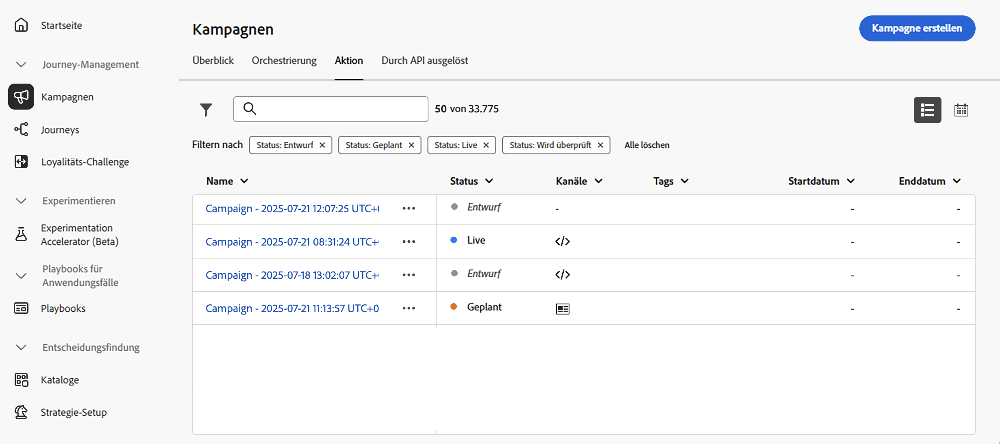

# Erste Schritte mit Kampagnen {#get-started-campaigns}

>[!CONTEXTUALHELP]
>id="campaigns_list"
>title="Kampagnen"
>abstract="Mit Kampagnen können Sie einmalige Inhalte für ein bestimmtes Segment über mehrere Kanäle hinweg bereitstellen. Bevor Sie eine neue Kampagne erstellen, stellen Sie sicher, dass Sie über eine Kanaloberfläche (d. h. eine Nachrichtenvorgabe) und ein Adobe Experience Platform-Segment verfügen, die einsatzbereit sind."

## Über Kampagnen {#about}

Mit Kampagnen können Sie einmalige Inhalte für ein bestimmtes Segment mithilfe mehrerer Kanäle bereitstellen. Im Gegensatz zu Journeys, bei denen Aktionen nacheinander ausgeführt werden sollen, führen Kampagnen Aktionen gleichzeitig aus, entweder sofort oder nach einem festgelegten Zeitplan.

Sie können zwei Kampagnentypen erstellen:

* **Geplante Kampagnen** ermöglichen einfache Ad-hoc-Batch-Nachrichten für Marketing-Anwendungsfälle wie Werbeangebote, Interaktionskampagnen, Ankündigungen, rechtliche Hinweise oder Richtlinienaktualisierungen.
* **API-ausgelöste Kampagnen** ermöglichen einfache Transaktions-/Betriebsnachrichten mit REST-APIs (Kennwortzurücksetzung, Kartenabbruch usw.), bei denen die Notwendigkeit einer Personalisierung mit Profilattributen und Kontextdaten aus der Payload bestehen kann.

Erfahren Sie, wie Sie mit Kampagnen arbeiten:
* [Erstellen einer Kampagne](create-campaign.md)
* [API-gesteuerte Kampagnen erstellen](api-triggered-campaigns.md)
* [Ändern oder Stoppen einer Kampagne](modify-stop-campaign.md)
* [Live-Bericht einer Kampagne](campaign-live-report.md)
* [Globaler Kampagnenbericht](campaign-global-report.md)

## Zugriff auf Kampagnen {#access}

Auf Kampagnen kann über das Menü **[!UICONTROL Kampagnen]** zugegriffen werden.

Standardmäßig werden in der Liste alle Kampagnen mit dem Status **[!UICONTROL Entwurf]**, **[!UICONTROL Geplant]** oder **[!UICONTROL Live]** angezeigt. Um angehaltene, abgeschlossene und archivierte Kampagnen anzuzeigen, müssen Sie den Filter löschen.

## Kampagnenstatus {#statuses}

Kampagnen können mehrere Status aufweisen:

* **[!UICONTROL Entwurf]**: Die Kampagne wird noch bearbeitet, sie wurde nicht aktiviert.
* **[!UICONTROL Wird aktiviert]**: Die Kampagne wird aktiviert.
* **[!UICONTROL Live]**: Die Kampagne wurde aktiviert.
* **[!UICONTROL Geplant]**: Die Kampagne wurde so konfiguriert, dass sie an einem bestimmten Startdatum aktiviert wird.
* **[!UICONTROL Angehalten]**: Die Kampagne wurde manuell gestoppt. Sie können sie nicht mehr aktivieren oder wiederverwenden (siehe [Stoppen einer Kampagne](modify-stop-campaign.md#stop))
* **[!UICONTROL Abgeschlossen]**: Die Kampagne ist abgeschlossen.
* **[!UICONTROL Archiviert:]** Die Kampagne wurde archiviert.

>[!NOTE]
>
>Das Symbol „Entwurfsversion öffnen“ neben einem Status **[!UICONTROL Live]** oder **[!UICONTROL Geplant]** zeigt an, dass eine neue Version der Kampagne erstellt wurde und noch nicht aktiviert wurde (siehe [Ändern einer Kampagne](modify-stop-campaign.md#modify)).
