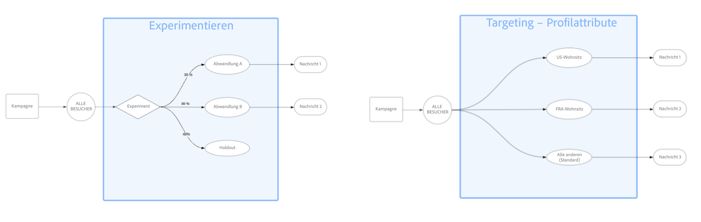

# Erste Schritte mit der Inhaltsoptimierung {#message-optimization}

>[!CONTEXTUALHELP]
>id="ajo_campaigns_content_optimization"
>title="Inhaltsoptimierung"
>abstract="Die Inhaltsoptimierung in Journey Optimizer ermöglicht es Ihnen, verschiedene Versionen Ihrer Inhalte zu testen und festzustellen, welche am besten funktioniert. Sie können Targeting verwenden, um personalisierte Inhalte für bestimmte Segmente bereitzustellen, um mehrere Varianten zu testen oder beide Ansätze für anspruchsvolle Optimierungsstrategien zu kombinieren."

Mit der Inhaltsoptimierung können Sie die richtige Botschaft zur richtigen Zeit an die richtige Zielgruppe senden. Durch die Kombination datengesteuerter Einblicke mit leistungsstarken Personalisierungsfunktionen können Sie die Interaktion und Konversionen in all Ihren Kampagnen und Journey maximieren.

Die Inhaltsoptimierung ist sowohl in [Kampagnen](../campaigns/create-campaign.md) als auch in [Journey](../building-journeys/journey-gs.md) verfügbar, sodass Sie auf all Ihre Kunden-Touchpoints dieselben Optimierungsstrategien anwenden können.

➡️ [Erfahren Sie in diesem Video, wie Sie die Inhaltsoptimierung innerhalb einer Kampagne nutzen können](#video)

## Optimierungsfunktionen {#capabilities}

Mit der Inhaltsoptimierung in Journey Optimizer können Sie:

* [Zielgruppenbestimmung verwenden](optimization-targeting.md) um personalisierte Inhalte für bestimmte Zielgruppensegmente basierend auf Profilattributen, Kontextdaten oder der Zielgruppenzugehörigkeit bereitzustellen.

* [Führen Sie Experimente ](optimization-experimentation.md), um mehrere Inhaltsvarianten zu testen und anhand Ihrer Erfolgsmetriken zu ermitteln, welche am besten abschneidet.

* [Kombinieren Sie beide Ansätze](optimization-combination.md) um komplexe Optimierungsstrategien zu erstellen, mit denen Sie verschiedene Varianten für jedes Zielsegment testen können.

## Targeting vs. Experimentieren {#targeting-vs-experimentation}

Wenn Sie den Unterschied zwischen Targeting und Experimentieren verstehen, können Sie den richtigen Optimierungsansatz für Ihre Ziele wählen.

**Targeting** verwendet deterministische Regeln, um personalisierte Inhalte basierend auf bekannten Profilattributen, dem Kontext oder der Zielgruppenzugehörigkeit für bestimmte Segmente bereitzustellen. Dadurch wird sichergestellt, dass die richtige Botschaft die richtige Zielgruppe erreicht.

**Experimentieren** verwendet die zufällige Zuweisung, um mehrere Inhaltsvarianten zu testen und festzustellen, welche am besten funktioniert. So erfahren Sie durch datengesteuerte Tests, was bei Ihrer Zielgruppe am meisten Anklang findet.

In der folgenden Tabelle sind die wichtigsten Unterschiede zusammengefasst:

| Funktion | Targeting | Experimentieren |
|--------|-----------|-----------------|
| **Zuweisungsmethode** | Deterministisch - basierend auf Regeln | Zufällig - basierend auf der Traffic-Zuordnung |
| **basierend auf** | Profilattribute, Kontext, Zielgruppen | Zufällige Verteilung |
| **Anwendungsfall** | Bereitstellen relevanter Inhalte für bekannte Segmente | Finden Sie heraus, welche Inhalte am besten funktionieren |
| **Beispiel** | Unterschiedliche Promotions nach Standort anzeigen | Testen Sie zwei Betreffzeilen, um zu sehen, welche mehr Öffnungen erhalten |
| **Am besten geeignet für** | Personalization im großen Maßstab | Optimierung und Lernen |

{width="110%" zoomable="yes"}

## Häufige Anwendungsfälle {#use-cases}

Im Folgenden finden Sie einige typische Szenarien, in denen die Inhaltsoptimierung zu besseren Ergebnissen führen kann:

Zielgruppenbestimmung:

* **Geo-Targeting** - Senden Sie standortspezifische Angebote, je nachdem, wo sich Ihre Kunden befinden. Werben Sie beispielsweise für Wintermäntel in kälteren Regionen und für Badebekleidung in wärmeren Klimazonen.

* **Geräteoptimierung** - Stellen Sie gerätespezifische Inhalte bereit, z. B. Desktop-optimierte Layouts für Desktop-Benutzer und für Smartphones optimierte Layouts.

Experimentieren:

* **A/B-Tests** - Testen Sie verschiedene E-Mail-Betreffzeilen, call-to-action-Schaltflächen oder Werbeangebote, um herauszufinden, welche die meisten Konversionen fördern.

* **Lifecycle Marketing** - Testen Sie verschiedene Onboarding-Nachrichten für neue Kunden im Vergleich zu Archivierungsangeboten für bestehende Kunden.

Kombination:

* **Erweiterte Segmentierung** Targeting von Kundinnen und Kunden nach Treuestufe und Testen verschiedener Belohnungsbotschaften innerhalb jeder Stufe, um die Interaktion über alle Segmente hinweg zu maximieren.

## Erste Schritte {#get-started}

So optimieren Sie Ihren Inhalt:

1. **Erstellen einer Kampagne oder Journey**: Richten Sie Ihre [Kampagne](../campaigns/create-campaign.md) oder [Journey ein ](../building-journeys/journey-gs.md) fügen Sie mindestens eine Aktion hinzu.

1. **Wählen Sie Ihren Optimierungsansatz**:
   * [Verwenden Sie Targeting](optimization-targeting.md) um Inhalte für bestimmte Segmente zu personalisieren.
   * [Experimentieren](optimization-experimentation.md) um mehrere Varianten zu testen.
   * [Kombinieren Sie beide](optimization-combination.md) für eine erweiterte Optimierung.

1. **Inhalt definieren**: Erstellen Sie die verschiedenen Inhaltsvarianten für Ihre Optimierungsstrategie.

1. **Aktivieren und Überwachen**: Starten Sie Ihre optimierte Kampagne oder Ihr optimiertes Journey und verfolgen Sie die Leistung in den [Berichten](../reports/campaign-global-report-cja.md).

## Funktionsweise {#how-it-works}

Sobald Ihr Journey oder Ihre Kampagne live ist, werden die Profile anhand der von Ihnen definierten Kriterien bewertet. Basierend auf diesen Auswertungen erhält jedes Profil die am besten geeignete Inhaltsversion:

1. **Profilevaluierung** - Wenn ein Profil in Ihre Kampagne oder Ihr Journey eintritt, wertet Journey Optimizer seine Attribute und den Kontext aus.

1. **Inhaltszuweisung** - basierend auf Ihrer Optimierungskonfiguration:
   * Beim **Targeting** erhalten Profile, die bestimmten Kriterien entsprechen, die entsprechenden personalisierten Inhalte.
   * Für **Experimentieren** werden Profile auf der Grundlage Ihrer Traffic-Zuordnungseinstellungen nach dem Zufallsprinzip verschiedenen Inhaltsvarianten zugewiesen.
   * Für **Kombinationen** stimmen Profile zunächst mit einer Zielgruppenbestimmungsregel überein und werden dann nach dem Zufallsprinzip einer der Experimentvarianten für dieses Segment zugewiesen.

1. **Leistungs-Tracking** - Journey Optimizer verfolgt automatisch Interaktionsmetriken und Konversionsdaten, um festzustellen, welche Inhalte am besten funktionieren.

## Anleitungsvideo {#video}

Erfahren Sie, wie Sie die Inhaltsoptimierung in durch eine Aktion oder API ausgelösten Kampagnen nutzen können. Sie erfahren, wie Sie Teilzielgruppen ansprechen, Nachrichtenvarianten je nach Standort erstellen, Fallback-Inhalte aktivieren und mehrere Experimente innerhalb einer Kampagne durchführen. In diesem Tutorial wird auch beschrieben, wie Sie Multi-Channel-Kampagnen verwalten und dabei die Konsistenz der Nachrichten beibehalten können.

>[!VIDEO](https://video.tv.adobe.com/v/3470368?quality=12)

**Verwandte Themen**

* [Erstellen einer Kampagne](../campaigns/create-campaign.md)
* [Erstellen einer Journey](../building-journeys/journey-gs.md)
* [Inhaltsexperimente](../content-management/get-started-experiment.md)
