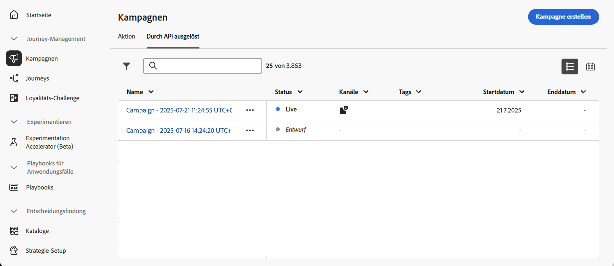
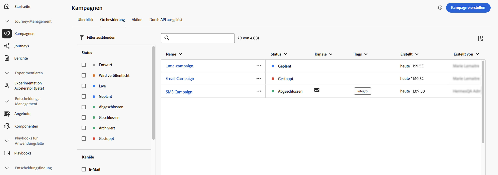
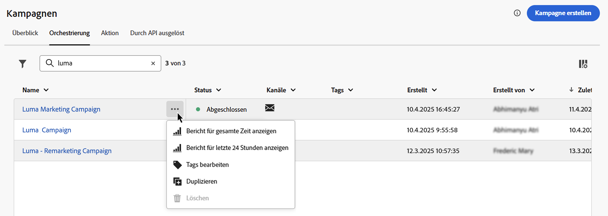
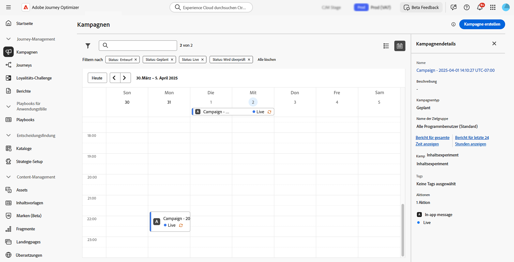
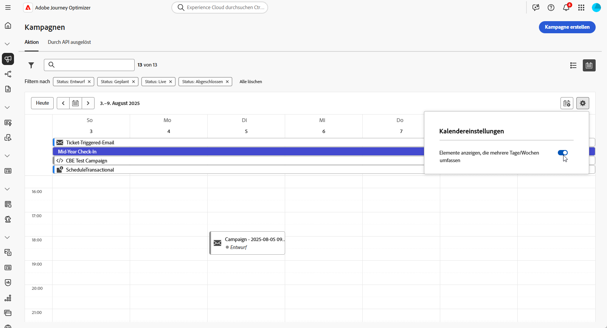
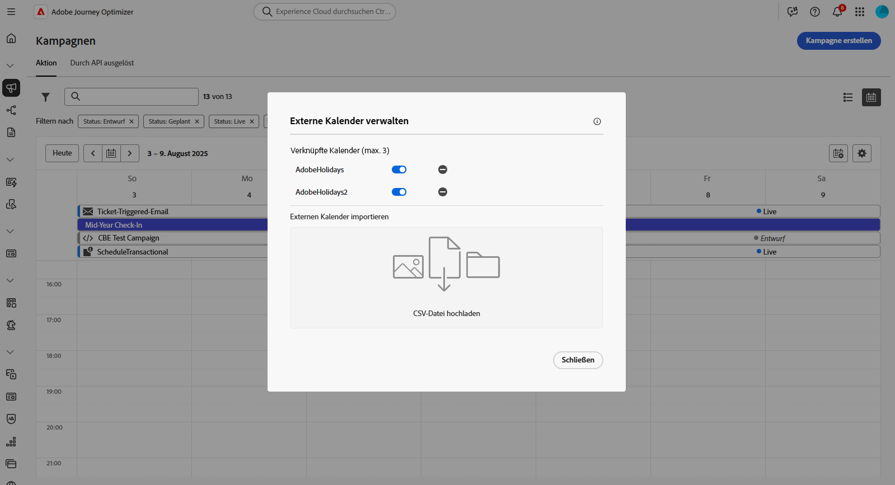
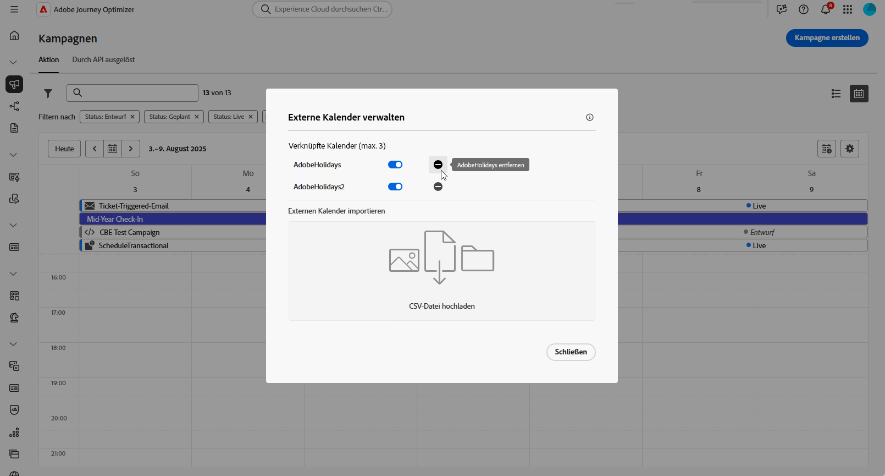
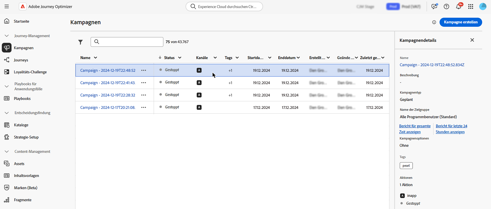
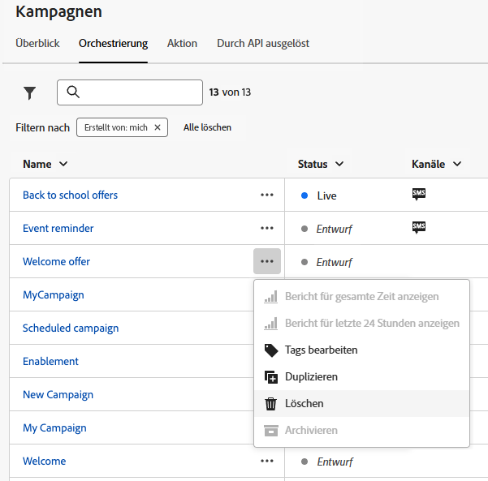

# Zugreifen auf und Verwalten von Kampagnen {#manage-campaigns}

>[!CONTEXTUALHELP]
>id="ajo_targeting_workflow_list"
>title="Inventar der orchestrierten Kampagnen"
>abstract="Auf diesem Bildschirm können Sie auf die vollständige Liste der orchestrierten Kampagnen zugreifen, ihren aktuellen Status sowie das Datum der letzten/nächsten Ausführung überprüfen und eine neue orchestrierte Kampagne erstellen."

>[!CONTEXTUALHELP]
>id="ajo_orchestration_campaign_action"
>title="Aktion"
>abstract="In diesem Abschnitt werden alle in der orchestrierten Kampagne verwendeten Aktionen aufgelistet."

Auf Kampagnen kann über das Menü **[!UICONTROL Kampagnen]** zugegriffen werden. Verwenden Sie die Registerkarten, um Kampagnen nach Typ zu durchsuchen: **Aktionskampagnen**, **durch API ausgelöste Kampagnen** und **orchestrierte Kampagnen**. Erfahren Sie mehr über die [Kampagnentypen](get-started-with-campaigns.md#get-started-campaigns). Die verfügbaren Typen hängen von Ihrer Lizenzvereinbarung und Ihren Berechtigungen ab.

>[!BEGINTABS]

>[!TAB Aktionskampagnen]

Wählen Sie die Registerkarte **[!UICONTROL Aktion]** aus, um auf die Liste aller Aktionskampagnen zuzugreifen.

Standardmäßig werden in der Liste alle Kampagnen mit dem Status **[!UICONTROL Entwurf]**, **[!UICONTROL Geplant]** oder **[!UICONTROL Live]** angezeigt. Um gestoppte, abgeschlossene und archivierte Kampagnen anzuzeigen, müssen Sie den Filter löschen.

>[!TAB Kampagnen, die durch API ausgelöst werden]

Wählen Sie die Registerkarte **[!UICONTROL Durch API ausgelöst]** aus, um auf die Liste der Kampagnen zuzugreifen, die durch API ausgelöst werden.

Standardmäßig werden in der Liste alle Kampagnen mit dem Status **[!UICONTROL Entwurf]**, **[!UICONTROL Geplant]** oder **[!UICONTROL Live]** angezeigt. Um gestoppte, abgeschlossene und archivierte Kampagnen anzuzeigen, müssen Sie den Filter löschen.

>[!TAB Orchestrierte Kampagnen]

Wählen Sie die Registerkarte **[!UICONTROL Orchestrierung]** aus, um auf die Liste der orchestrierten Kampagnen zuzugreifen.

{zoomable="yes"}{zoomable="yes"}

Zu jeder orchestrierten Kampagne in der Liste werden Informationen angezeigt, beispielsweise der aktuelle [Status](#status) der Kampagne, der zugehörige Kanal und zugehörige Tags oder der Zeitpunkt der letzten Änderung. Sie können die angezeigten Spalten anpassen, indem Sie auf die Schaltfläche  klicken.

>[!ENDTABS]

Darüber hinaus stehen eine Suchleiste und Filter zur Verfügung, um die Suche innerhalb der Liste zu erleichtern. Sie können die Kampagnen beispielsweise so filtern, dass nur die einem bestimmten Kanal oder Tag angehörenden oder nur die während eines bestimmten Datumsbereichs erstellten Kampagnen angezeigt werden.

Die Schaltfläche  im Kampagneninventar ermöglicht die Durchführung der folgenden Vorgänge.

* **[!UICONTROL Bericht für gesamte Zeit anzeigen]** / **[!UICONTROL Bericht für letzte 24 Stunden anzeigen]**: Greifen Sie auf Berichte zu, um die Wirkung und Leistung Ihrer orchestrierten Kampagnen zu messen und zu visualisieren. Weitere Informationen zu [Kampagnenberichten](../reports/campaign-global-report-cja.md).
* **[!UICONTROL Tags bearbeiten]**: Bearbeiten Sie die mit der Kampagne verknüpften Tags. Erfahren Sie, wie Sie [Tags in Ihren Kampagnen verwenden](../start/search-filter-categorize.md#add-tags) können.
* **[!UICONTROL Duplizieren]**: Verwenden Sie diese Option, um eine Kampagne zu duplizieren, z. B. um eine orchestrierte Kampagne auszuführen, die gestoppt wurde. [Weitere Informationen](#duplicate-a-campaign)
* **[!UICONTROL Löschen]**: Verwenden Sie diese Option, um eine Kampagne zu löschen. [Weitere Informationen](#delete-a-campaign)
* **[!UICONTROL Archivieren]**: Archiviert die Kampagne. Alle archivierten Kampagnen werden rollierend 30 Tage nach dem Datum ihrer letzten Änderung gelöscht. Diese Aktion ist für alle Kampagnen mit Ausnahme von Kampagnen im Status **[!UICONTROL Entwurf]** verfügbar. Weitere Informationen zur [Kampagnenarchivierung](#archive-a-campaign).

Für von einer Aktion und durch API ausgelöste Kampagnen sind die folgenden zusätzlichen Aktionen verfügbar:

* **[!UICONTROL Zu Paket hinzufügen]**: Fügt die Kampagne zu einem Paket hinzu, um sie in eine andere Sandbox zu exportieren. Erfahren Sie, wie Sie [Objekte in eine andere Sandbox exportieren](../configuration/copy-objects-to-sandbox.md) können.
* **[!UICONTROL Entwurfsversion öffnen]**: Wenn eine neue Version der Kampagne erstellt und noch nicht aktiviert wurde, können Sie mit dieser Aktion auf ihre Entwurfsversion zugreifen.

## Kampagnenlebenszyklus {#statuses}

In Adobe Journey Optimizer durchläuft jede Kampagne einen Lebenszyklus, der sich in ihrem Status in der Benutzeroberfläche widerspiegelt. Die verfügbaren Status variieren je nach Kampagnentyp: Aktion, durch API ausgelöst oder orchestriert. Verwenden Sie die folgenden Registerkarten, um den Lebenszyklus und die Status für die einzelnen Kampagnentypen zu untersuchen.

>[!BEGINTABS]

>[!TAB Aktionskampagnen]

* **[!UICONTROL Entwurf]**: Die Kampagne wird noch bearbeitet, sie wurde nicht aktiviert.
* **[!UICONTROL Geplant]**: Die Kampagne wurde so konfiguriert, dass sie an einem bestimmten Startdatum aktiviert wird.
* **[!UICONTROL Live]**: Die Kampagne wurde aktiviert.
* **[!UICONTROL Wird überprüft]**: Die Kampagne wurde zur Genehmigung eingereicht, damit sie veröffentlicht werden kann. [Informationen zum Arbeiten mit Genehmigungen](../test-approve/gs-approval.md)
* **[!UICONTROL Gestoppt]**: Die Kampagne wurde manuell gestoppt. Sie können sie nicht mehr aktivieren oder wiederverwenden. [Informationen zum Stoppen einer Kampagne](manage-campaigns.md#stop)
* **[!UICONTROL Abgeschlossen]**: Die Kampagne ist abgeschlossen. Dieser Status wird automatisch 3 Tage nach der Aktivierung einer Kampagne zugewiesen oder am Enddatum der Kampagne, wenn sie eine wiederkehrende Ausführung aufweist.
* **[!UICONTROL Fehlgeschlagen]**: Die Ausführung der Kampagne ist fehlgeschlagen. Überprüfen Sie die Protokolle, um das Problem zu identifizieren.
* **[!UICONTROL Archiviert]**: Die Kampagne wurde archiviert. [Informationen zum Archivieren von Kampagnen](manage-campaigns.md#archive)

>[!NOTE]
>
>Das Symbol „Entwurfsversion öffnen“ neben einem Status des Typs **[!UICONTROL Live]** oder **[!UICONTROL Geplant]** zeigt an, dass eine neue Version der Aktionskampagne bzw. der durch API ausgelösten Kampagne erstellt und noch nicht aktiviert wurde.

>[!TAB Durch API ausgelöste Kampagnen]

* **[!UICONTROL Entwurf]**: Die Kampagne wird noch bearbeitet, sie wurde nicht aktiviert.
* **[!UICONTROL Geplant]**: Die Kampagne wurde so konfiguriert, dass sie an einem bestimmten Startdatum aktiviert wird.
* **[!UICONTROL Live]**: Die Kampagne wurde aktiviert.
* **[!UICONTROL Wird überprüft]**: Die Kampagne wurde zur Genehmigung eingereicht, damit sie veröffentlicht werden kann. [Informationen zum Arbeiten mit Genehmigungen](../test-approve/gs-approval.md)
* **[!UICONTROL Gestoppt]**: Die Kampagne wurde manuell gestoppt. Sie können sie nicht mehr aktivieren oder wiederverwenden. [Informationen zum Stoppen einer Kampagne](manage-campaigns.md#stop)
* **[!UICONTROL Abgeschlossen]**: Die Kampagne ist abgeschlossen. Dieser Status wird automatisch 3 Tage nach der Aktivierung einer Kampagne zugewiesen oder am Enddatum der Kampagne, wenn sie eine wiederkehrende Ausführung aufweist.
* **[!UICONTROL Fehlgeschlagen]**: Die Ausführung der Kampagne ist fehlgeschlagen. Überprüfen Sie die Protokolle, um das Problem zu identifizieren.
* **[!UICONTROL Archiviert]**: Die Kampagne wurde archiviert. [Informationen zum Archivieren von Kampagnen](manage-campaigns.md#archive)

>[!NOTE]
>
>Das Symbol „Entwurfsversion öffnen“ neben einem Status des Typs **[!UICONTROL Live]** oder **[!UICONTROL Geplant]** zeigt an, dass eine neue Version der Aktionskampagne bzw. der durch API ausgelösten Kampagne erstellt und noch nicht aktiviert wurde.

>[!TAB Orchestrierte Kampagnen]

* **[!UICONTROL Entwurf]**: Die orchestrierte Kampagne wurde erstellt. Sie wurde noch nicht veröffentlicht.
* **[!UICONTROL Wird veröffentlicht]**: Die orchestrierte Kampagne wird gerade veröffentlicht.
* **[!UICONTROL Live]**: Die orchestrierte Kampagne wurde veröffentlicht und wird ausgeführt.
* **[!UICONTROL Geplant]**: Die Ausführung der orchestrierten Kampagne wurde geplant.
* **[!UICONTROL Abgeschlossen]**: Die Ausführung der orchestrierten Kampagne ist abgeschlossen. Der Status „Abgeschlossen“ wird einer Kampagne automatisch bis zu 3 Tage nach dem fehlerfreien Versand von Nachrichten zugewiesen.
* **[!UICONTROL Geschlossen]**: Dieser Status wird angezeigt, wenn eine wiederkehrende Kampagne geschlossen wurde. Die Kampagne wird ausgeführt, bis alle Aktivitäten abgeschlossen sind, aber es können keine weiteren Profile in die Kampagne eintreten.
* **[!UICONTROL Archiviert]**: Die orchestrierte Kampagne wurde archiviert. Alle archivierten Kampagnen werden rollierend 30 Tage nach dem Datum ihrer letzten Änderung gelöscht. Sie können eine archivierte Kampagne bei Bedarf duplizieren, um sie weiter zu bearbeiten.
* **[!UICONTROL Gestoppt]**: Die Ausführung der orchestrierten Kampagne wurde gestoppt. Um die Kampagne erneut zu starten, müssen Sie sie duplizieren.

>[!ENDTABS]

Tritt in einer Ihrer Kampagnen ein Fehler auf, wird neben dem Status der Kampagne ein Warnsymbol angezeigt. Klicken Sie darauf, um Informationen zum Warnhinweis anzuzeigen. Diese Warnhinweise können in verschiedenen Situationen auftreten, z. B. wenn die Kampagnennachricht nicht veröffentlicht wurde oder die gewählte Konfiguration falsch ist.

## Kampagnenkalender {#calendar}

>[!CONTEXTUALHELP]
>id="ajo_campaigns_view"
>title="Listen- und Kalenderansicht für Kampagnen"
>abstract="Zusätzlich zur Kampagnenliste bietet [!DNL Journey Optimizer] eine Kalenderansicht Ihrer Kampagnen mit einer übersichtlichen Darstellung ihrer Zeitpläne. Über diese Schaltflächen können Sie jederzeit zwischen der Listen- und Kalenderansicht wechseln."

Zusätzlich zur Kampagnenliste bietet [!DNL Journey Optimizer] eine Kalenderansicht der Kampagnen mit einer übersichtlichen Darstellung der Zeitpläne. 

Darstellung der Kampagnen:

* Standardmäßig zeigt das Kalenderraster alle Live- und geplanten Kampagnen für die ausgewählte Woche an. Zusätzliche Filteroptionen können abgeschlossene, gestoppte und beendete Aktivierungen oder Aktivierungen eines bestimmten Typs oder Kanals anzeigen.
* Kampagnenentwürfe werden nicht angezeigt.
* Kampagnen, die sich über mehrere Tage erstrecken, werden oben im Kalenderraster angezeigt.
* Wenn keine Startzeit angegeben ist, wird die nächste manuelle Aktivierungszeit zur Positionierung im Kalender verwendet.
* Kampagnen werden als Zeitspannen von 1 Stunde angezeigt, dies spiegelt jedoch nicht die tatsächliche Versand- oder Abschlusszeit wider.

So navigieren Sie in Ihrem Kampagnenkalender:

1. Klicken Sie auf das Symbol , um auf Ihren Kampagnenkalender zuzugreifen.

1. Verwenden Sie die Pfeiltasten oder die Datumsauswahl über dem Kalender, um zwischen Wochen zu wechseln.

   Der Kalender zeigt alle für die aktuelle Woche geplanten Kampagnen an.

   

1. Klicken Sie auf das Symbol , um die Anzeige von Elementen umzuschalten, die sich über mehrere Tage oder Wochen erstrecken.

   

1. Klicken Sie auf das Symbol , um bis zu drei externe Kalender zu verwalten und hinzuzufügen.

   

1. Verschieben Sie Ihre CSV-Dateien mit den Namen der Veranstaltungen sowie Start- und Enddaten per Drag-and-Drop.

   Hochgeladene Ereignisse werden für alle Benutzenden in Ihrer Organisation angezeigt und erscheinen sowohl im Journey- als auch im Kampagnenkalender.

   +++Das CSV-Format sollte wie folgt aussehen:

   | Spalte1 | Spalte2 | Spalte3 |
   |-|-|-|
   | Ereignisname | Startdatum im Format TT/MM/JJ | Enddatum im Format TT/MM/JJ |

   +++

1. Bei Bedarf können Sie hinzugefügte externe Kalender ausblenden, einblenden oder entfernen.

   

1. Durch Klicken auf den visuellen Block einer Kampagne werden weitere Details geöffnet. Dies öffnet einen Informationsbereich mit unterschiedlichen Informationen über die Kampagne, z. B. den Kampagnentyp, Zugriff auf die Berichte oder die zugewiesenen Tags.

   

## Ändern und Stoppen wiederkehrender Aktionskampagnen {#modify}

### Ändern einer Aktionskampagne

Gehen Sie wie folgt vor, um eine neue Version einer wiederkehrenden Aktionskampagne zu ändern und zu erstellen:

1. Öffnen Sie die Aktionskampagne und klicken Sie dann auf die Schaltfläche **[!UICONTROL Kampagne ändern]**.

1. Eine neue Version der Kampagne wird erstellt. Sie können die Live-Version überprüfen, indem Sie auf **[!UICONTROL Live-Version öffnen]** klicken.

   

   In der Liste der Kampagnen werden aktivierte Kampagnen, für die eine Entwurfsversion in Bearbeitung ist, mit einem speziellen Symbol in der Spalte **[!UICONTROL Status]** angezeigt. Klicken Sie auf dieses Symbol, um die Entwurfsversion der Kampagne zu öffnen.

   

1. Sobald Sie mit den Änderungen fertig sind, können Sie die neue Version der Kampagne aktivieren (siehe [Überprüfung und Aktivierung einer Kampagne](review-activate-campaign.md)).

   >[!IMPORTANT]
   >
   >Durch die Aktivierung des Entwurfs wird die Live-Version der Kampagne ersetzt.

### Stoppen einer Aktionskampagne {#stop}

Zum Stoppen einer wiederkehrenden Kampagne öffnen Sie diese und klicken Sie auf die Schaltfläche **[!UICONTROL Kampagne stoppen]**.

>[!IMPORTANT]
>
>Das Stoppen einer Kampagne stoppt keinen laufenden Versand, aber es stoppt einen geplanten Versand oder die nächsten Vorgänge, wenn der Versand bereits läuft.

## Archivieren einer Kampagne {#archive}

Mit der Zeit wächst die Liste der Kampagnen, wodurch es zunehmend schwieriger wird, abgeschlossene und gestoppte Kampagnen zu durchsuchen.

Um dies zu verhindern, können Sie abgeschlossene und gestoppte Kampagnen archivieren, die Sie nicht mehr benötigen. Klicken Sie dazu auf die Schaltfläche mit den Auslassungspunkten und wählen Sie **[!UICONTROL Archivieren]**.

Archivierte Kampagnen können dann mithilfe des entsprechenden Filters in der Liste abgerufen werden.

## Löschen einer Kampagne {#delete}

Um eine Kampagne zu löschen, verwenden Sie die Schaltfläche mit den Auslassungspunkten  und wählen Sie **[!UICONTROL Löschen]**.

{width="70%" align="left"}

>[!IMPORTANT]
>
>Diese Aktion ist nur für Kampagnen im Status **[!UICONTROL Entwurf]** verfügbar.

## Duplizieren einer Kampagne {#duplicate}

Um eine Kampagne zu duplizieren (beispielsweise wenn sie gestoppt wurde), verwenden Sie die Schaltfläche mit den Auslassungspunkten  und wählen Sie **[!UICONTROL Duplizieren]**.

Geben Sie den Namen der Kampagne ein und speichern Sie ihn. 

Die Kampagne wurde erstellt und ist nun in der Kampagnenliste sichtbar.
