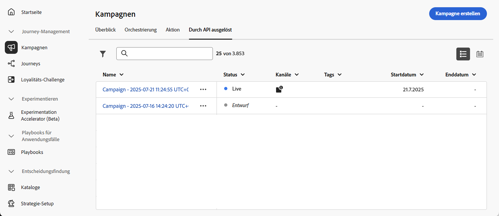
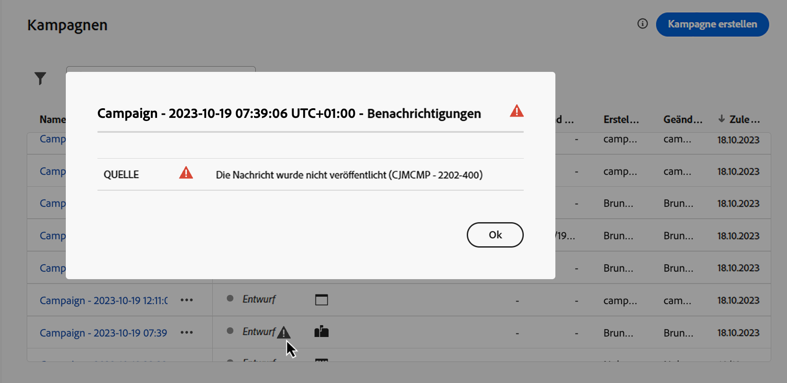
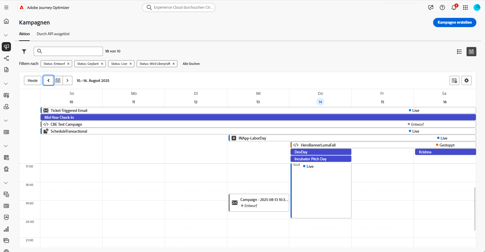

# Zugreifen auf und Verwalten von Kampagnen {#manage-campaigns}

>[!CONTEXTUALHELP]
>id="ajo_targeting_workflow_list"
>title="Inventar der orchestrierten Kampagnen"
>abstract="Auf diesem Bildschirm können Sie auf die vollständige Liste der orchestrierten Kampagnen zugreifen, ihren aktuellen Status sowie das Datum der letzten/nächsten Ausführung überprüfen und eine neue orchestrierte Kampagne erstellen."

>[!CONTEXTUALHELP]
>id="ajo_orchestration_campaign_action"
>title="Aktion"
>abstract="In diesem Abschnitt werden alle in der orchestrierten Kampagne verwendeten Aktionen aufgelistet."

Erfahren Sie, wie Sie in Adobe Journey Optimizer auf Kampagnen zugreifen und diese organisieren und verwalten können. Dieses Handbuch behandelt alle Themen, von der Suche nach Kampagnen über das Verstehen von Status, die Durchführung allgemeiner Vorgänge bis hin zur Pflege des Kampagnenarbeitsbereichs.

>[!BEGINSHADEBOX]

**Springen Sie direkt zu dem, was Sie benötigen:**

* **Neue Kampagne erstellen** - [Wählen Sie Ihren Kampagnentyp](get-started-with-campaigns.md#campaign-types) | [Erstellen einer Aktionskampagne](create-campaign.md) | [Erstellen einer API-ausgelösten Kampagne](api-triggered-campaigns.md) | [Erstellen einer orchestrierten Kampagne](../orchestrated/gs-orchestrated-campaigns.md)
* **Vorhandene Kampagnen suchen** - [Suchen und Filtern](#access)
* **Anzeigen der Kampagnenleistung** - [Kampagnenberichte](../reports/campaign-global-report-cja.md)
* **Kampagnen planen** - [Kalender verwenden](#calendar)
* **Konflikte verwalten** - [Handbuch für das Konfliktmanagement](../conflict-prioritization/gs-conflict-prioritization.md)

>[!ENDSHADEBOX]

## Zugreifen auf und Durchsuchen von Kampagnen {#access}

Auf Kampagnen kann über das Menü **[!UICONTROL Kampagnen]** zugegriffen werden. Verwenden Sie die Registerkarten, um Kampagnen nach Typ zu durchsuchen: **Aktionskampagnen**, **durch API ausgelöste Kampagnen** und **orchestrierte Kampagnen**. Erfahren Sie mehr über die [Kampagnentypen](get-started-with-campaigns.md#campaign-types). Die verfügbaren Typen hängen von Ihrer Lizenzvereinbarung und Ihren Berechtigungen ab.

>[!BEGINTABS]

>[!TAB Aktionskampagnen]

Wählen Sie die Registerkarte **[!UICONTROL Aktion]** aus, um auf die Liste aller Aktionskampagnen zuzugreifen.

Standardmäßig werden in der Liste alle Kampagnen mit dem Status **[!UICONTROL Entwurf]**, **[!UICONTROL Geplant]** oder **[!UICONTROL Live]** angezeigt. Um gestoppte, abgeschlossene und archivierte Kampagnen anzuzeigen, müssen Sie den Filter löschen.

>[!TAB Durch API ausgelöste Kampagnen]

Wählen Sie die Registerkarte **[!UICONTROL Durch API ausgelöst]** aus, um auf die Liste der Kampagnen zuzugreifen, die durch API ausgelöst werden.

Standardmäßig werden in der Liste alle Kampagnen mit dem Status **[!UICONTROL Entwurf]**, **[!UICONTROL Geplant]** oder **[!UICONTROL Live]** angezeigt. Um gestoppte, abgeschlossene und archivierte Kampagnen anzuzeigen, müssen Sie den Filter löschen.

>[!TAB Orchestrierte Kampagnen]

Wählen Sie die Registerkarte **[!UICONTROL Orchestrierung]** aus, um auf die Liste der orchestrierten Kampagnen zuzugreifen.

{zoomable="yes"}

Jede orchestrierte Kampagne in der Liste zeigt Informationen wie den aktuellen (Status[&#x200B; der Kampagne, &#x200B;](#statuses) zugehörigen Kanal und Tags oder das letzte Mal, wann sie geändert wurde, an. Sie können die angezeigten Spalten anpassen, indem Sie auf die Schaltfläche  klicken.

>[!ENDTABS]

### Kampagnen durchsuchen und filtern {#search-filter}

Darüber hinaus stehen eine Suchleiste und Filter zur Verfügung, um die Suche innerhalb der Liste zu erleichtern. Sie können die Kampagnen beispielsweise so filtern, dass nur die einem bestimmten Kanal oder Tag angehörenden oder nur die während eines bestimmten Datumsbereichs erstellten Kampagnen angezeigt werden.

## Vorgänge in Campaign {#operations}

Die  im Kampagneninventar ermöglicht die Durchführung verschiedener Vorgänge.

### Verfügbare Aktionen

**Für alle Kampagnentypen:**

* **[!UICONTROL Bericht für gesamte Zeit anzeigen]** / **[!UICONTROL Bericht für letzte 24 Stunden anzeigen]**: Greifen Sie auf Berichte zu, um die Wirkung und Leistung Ihrer orchestrierten Kampagnen zu messen und zu visualisieren. [Erfahren Sie mehr über Kampagnenberichte →](../reports/campaign-global-report-cja.md)
* **[!UICONTROL Tags bearbeiten]**: Bearbeiten Sie die mit der Kampagne verknüpften Tags. [Erfahren Sie, wie Sie Tags-→ verwenden](../start/search-filter-categorize.md#add-tags)
* **[!UICONTROL Duplizieren]**: Verwenden Sie diese Option, um eine Kampagne zu duplizieren, z. B. um eine orchestrierte Kampagne auszuführen, die gestoppt wurde. [Weitere Informationen zum Duplizieren von →](#duplicate-a-campaign)
* **[!UICONTROL Löschen]**: Verwenden Sie diese Option, um eine Kampagne zu löschen. [Weitere Informationen zum Löschen von →](#delete-a-campaign)
* **[!UICONTROL Archivieren]**: Archiviert die Kampagne. Alle archivierten Kampagnen werden rollierend 30 Tage nach dem Datum ihrer letzten Änderung gelöscht. Diese Aktion ist für alle Kampagnen mit Ausnahme von Kampagnen im Status **[!UICONTROL Entwurf]** verfügbar. [Erfahren Sie mehr über → Archivierung](#archive-a-campaign)

**Nur für von Aktionen und API ausgelöste Kampagnen:**

* **[!UICONTROL Zu Paket hinzufügen]**: Fügt die Kampagne zu einem Paket hinzu, um sie in eine andere Sandbox zu exportieren. [Erfahren Sie, wie Sie Objekte → exportieren](../configuration/copy-objects-to-sandbox.md)
* **[!UICONTROL Entwurfsversion öffnen]**: Wenn eine neue Version der Kampagne erstellt und noch nicht aktiviert wurde, können Sie mit dieser Aktion auf ihre Entwurfsversion zugreifen.

**Nur für orchestrierte Kampagnen:**

* **[!UICONTROL Zurück zum Entwurf]** - Rückgängigmachen der Veröffentlichung und Zurücksetzen einer Kampagne in den Entwurfsstatus zur Fehlerbehebung. Diese Aktion ist verfügbar, wenn eine geplante Kampagne noch nicht gestartet wurde oder wenn bei einer Live-Kampagne ein Fehler auftritt, bevor irgendwelche Ausführungen abgeschlossen sind. [Erfahren Sie mehr über das Zurücksetzen von Kampagnen →](../orchestrated/start-monitor-campaigns.md#back-to-draft)

## Kampagnenstatus {#statuses}

Jede Kampagne durchläuft einen Lebenszyklus, der sich in ihrem Status in der Benutzeroberfläche widerspiegelt. Wenn Sie diese Status verstehen, können Sie feststellen, welche Aktionen verfügbar sind und was als Nächstes zu tun ist.

| Status | Aktionskampagnen | Durch API ausgelöste Kampagnen | Orchestrierte Kampagnen | Bedeutung | Nächste Aktionen |
|--------|:----------------:|:-----------------------:|:----------------------:|---------------|--------------|
| **[!UICONTROL Entwurf]** | ✅ | ✅ | ✅ | In Bearbeitung, nicht aktiviert | Bearbeitung fortsetzen oder [Kampagne aktivieren](review-activate-campaign.md) |
| **[!UICONTROL Geplant]** | ✅ | ✅ | ✅ | Für bestimmtes Startdatum konfiguriert | Auf Launch warten, [bei Bedarf ändern](#modify) oder [im Kalender anzeigen](#calendar) |
| **[!UICONTROL Live]** | ✅ | ✅ | ✅ | Aktiviert und ausgeführt | [Überwachen der Leistung](../reports/campaign-global-report-cja.md), [Erstellen einer neuen Version](#modify) falls erforderlich. Für orchestrierte Kampagnen: [Zurück zum Entwurf](../orchestrated/start-monitor-campaigns.md#back-to-draft) für geplante Kampagnen, die noch nicht gestartet wurden, oder für Kampagnen mit Ausführungsfehlern, bevor Nachrichten gesendet werden |
| **[!UICONTROL Wird geprüft]** | ✅ | ✅ | — | Zur Genehmigung eingereicht | Warten auf [Genehmigung](../test-approve/gs-approval.md) oder ändern |
| **[!UICONTROL Gestoppt]** | ✅ | ✅ | ✅ | Manuell angehalten, kann nicht reaktiviert werden | [Duplizieren zur Wiederverwendung](#duplicate-a-campaign) |
| **[!UICONTROL Abgeschlossen]** | ✅ | ✅ | ✅ | Ausführung abgeschlossen (wird 3 Tage nach Aktivierung automatisch zugewiesen oder endet bei wiederkehrender Ausführung am Enddatum) | [Anzeigen von Berichten](../reports/campaign-global-report-cja.md), [Archivieren](#archive-a-campaign) oder [Duplizieren](#duplicate-a-campaign) |
| **[!UICONTROL Fehlgeschlagen]** | ✅ | ✅ | — | Ausführung fehlgeschlagen | Überprüfen Sie Protokolle, beheben Sie Probleme [Duplizieren Sie es erneut](#duplicate-a-campaign) |
| **[!UICONTROL Archiviert]** | ✅ | ✅ | ✅ | Archiviert (nach 30 Tagen automatisch gelöscht) | [Bei &#x200B;](#access) mit Filter abrufen |
| **[!UICONTROL Geschlossen]** | — | — | ✅ | Wiederkehrende Kampagne geschlossen, keine neuen Einträge zulässig (wird fortgesetzt, bis alle Aktivitäten abgeschlossen sind) | Auf Abschluss warten |
| **[!UICONTROL Veröffentlichung läuft]** | — | — | ✅ | In Veröffentlichung | Warten, bis die Veröffentlichung abgeschlossen ist |

>[!NOTE]
>
>Bei durch eine Aktion oder API ausgelösten Kampagnen zeigt das Symbol „Entwurfsversion öffnen“ neben einem Status **[!UICONTROL Live]** oder **[!UICONTROL Geplant]** an, dass eine neue Version erstellt wurde und noch nicht aktiviert wurde.

### Fehlerindikatoren

Tritt in einer Ihrer Kampagnen ein Fehler auf, wird neben dem Status der Kampagne ein Warnsymbol angezeigt. Klicken Sie darauf, um Informationen zum Warnhinweis anzuzeigen. Diese Warnhinweise können in verschiedenen Situationen auftreten, z. B. wenn die Kampagnennachricht nicht veröffentlicht wurde oder die gewählte Konfiguration falsch ist.

>[!NOTE]
>
>Assets/Images sind in bereitgestellten Inhalten für bis zu 2 Jahre (730 Tage) seit ihrer ersten Veröffentlichung in einem Fragment/einer Inline-Nachricht verfügbar. Nach Ablauf dieses Zeitraums (jederzeit nach 730 Tagen) ist eine erneute Veröffentlichung erforderlich, um sie für weitere 2 Jahre verfügbar zu halten. Eine erneute Veröffentlichung innerhalb von 730 Tagen nach der ersten Veröffentlichung verlängert den Ablauf der Assets/Bilder nicht auf die nächsten 730 Tage.

## Kampagnenkalender {#calendar}

>[!CONTEXTUALHELP]
>id="ajo_campaigns_view"
>title="Listen- und Kalenderansicht für Kampagnen"
>abstract="Zusätzlich zur Kampagnenliste bietet [!DNL Journey Optimizer] eine Kalenderansicht Ihrer Kampagnen mit einer übersichtlichen Darstellung ihrer Zeitpläne. Über diese Schaltflächen können Sie jederzeit zwischen der Listen- und Kalenderansicht wechseln."

Zusätzlich zur Kampagnenliste bietet [!DNL Journey Optimizer] eine Kalenderansicht der Kampagnen mit einer übersichtlichen Darstellung der Zeitpläne. 

### Funktionsweise des Kalenders

Darstellung der Kampagnen:

* Standardmäßig zeigt das Kalenderraster alle Live- und geplanten Kampagnen für die ausgewählte Woche an. Zusätzliche Filteroptionen können abgeschlossene, gestoppte und beendete Aktivierungen oder Aktivierungen eines bestimmten Typs oder Kanals anzeigen.
* Kampagnenentwürfe werden nicht angezeigt.
* Kampagnen, die sich über mehrere Tage erstrecken, werden oben im Kalenderraster angezeigt.
* Wenn keine Startzeit angegeben ist, wird die nächste manuelle Aktivierungszeit zur Positionierung im Kalender verwendet.
* Kampagnen werden als Zeitspannen von 1 Stunde angezeigt, dies spiegelt jedoch nicht die tatsächliche Versand- oder Abschlusszeit wider.

### Navigieren im Kalender

1. Klicken Sie auf das Symbol , um auf Ihren Kampagnenkalender zuzugreifen.

1. Verwenden Sie die Pfeiltasten oder die Datumsauswahl über dem Kalender, um zwischen Wochen zu wechseln.

   Der Kalender zeigt alle für die aktuelle Woche geplanten Kampagnen an.

   

1. Klicken Sie auf das Symbol , um die Anzeige von Elementen umzuschalten, die sich über mehrere Tage oder Wochen erstrecken.

   

1. Klicken Sie auf das Symbol , um bis zu drei externe Kalender zu verwalten und hinzuzufügen.

   

1. Verschieben Sie Ihre CSV-Dateien mit den Namen der Veranstaltungen sowie Start- und Enddaten per Drag-and-Drop.

   Hochgeladene Ereignisse werden für alle Benutzenden in Ihrer Organisation angezeigt und erscheinen sowohl im Journey- als auch im Kampagnenkalender.

   +++Das CSV-Format sollte wie folgt aussehen:

   | Spalte1 | Spalte2 | Spalte3 |
   |-|-|-|
   | Ereignisname | Startdatum im Format TT/MM/JJ | Enddatum im Format TT/MM/JJ |

   +++

1. Bei Bedarf können Sie hinzugefügte externe Kalender ausblenden, einblenden oder entfernen.

   

1. Durch Klicken auf den visuellen Block einer Kampagne werden weitere Details geöffnet. Dies öffnet einen Informationsbereich mit unterschiedlichen Informationen über die Kampagne, z. B. den Kampagnentyp, Zugriff auf die Berichte oder die zugewiesenen Tags.

   

## Ändern und Stoppen wiederkehrender Aktionskampagnen {#modify}

### Ändern einer Aktionskampagne {#modify-an-action-campaign}

Gehen Sie wie folgt vor, um eine neue Version einer wiederkehrenden Aktionskampagne zu ändern und zu erstellen:

1. Öffnen Sie die Aktionskampagne und klicken Sie dann auf die Schaltfläche **[!UICONTROL Kampagne ändern]**.

1. Eine neue Version der Kampagne wird erstellt. Sie können die Live-Version überprüfen, indem Sie auf **[!UICONTROL Live-Version öffnen]** klicken.

   

   In der Liste der Kampagnen werden aktivierte Kampagnen, für die eine Entwurfsversion in Bearbeitung ist, mit einem speziellen Symbol in der Spalte **[!UICONTROL Status]** angezeigt. Klicken Sie auf dieses Symbol, um die Entwurfsversion der Kampagne zu öffnen.

   

1. Sobald Sie mit den Änderungen fertig sind, können Sie die neue Version der Kampagne aktivieren (siehe [Überprüfung und Aktivierung einer Kampagne](review-activate-campaign.md)).

   >[!IMPORTANT]
   >
   >Durch die Aktivierung des Entwurfs wird die Live-Version der Kampagne ersetzt.

**Verwandte Themen:**
* [Eigenschaften der Kampagne](campaign-properties.md)
* [Kampagnenaktionen](campaign-action.md)
* [Kampagneninhalt](campaign-content.md)
* [Campaign-Zielgruppe](campaign-audience.md)
* [Kampagnenzeitplan](campaign-schedule.md)

### Stoppen einer Aktionskampagne {#stop}

Zum Stoppen einer wiederkehrenden Kampagne öffnen Sie diese und klicken Sie auf die Schaltfläche **[!UICONTROL Kampagne stoppen]**.

>[!IMPORTANT]
>
>Das Stoppen einer Kampagne stoppt keinen laufenden Versand, aber es stoppt einen geplanten Versand oder die nächsten Vorgänge, wenn der Versand bereits läuft.

## Archivieren einer Kampagne {#archive-a-campaign}

Mit der Zeit wächst die Liste der Kampagnen, wodurch es zunehmend schwieriger wird, abgeschlossene und gestoppte Kampagnen zu durchsuchen.

Um dies zu verhindern, können Sie abgeschlossene und gestoppte Kampagnen archivieren, die Sie nicht mehr benötigen. Klicken Sie dazu auf die Schaltfläche mit den Auslassungspunkten und wählen Sie **[!UICONTROL Archivieren]**.

Archivierte Kampagnen können dann mithilfe des entsprechenden Filters in der Liste abgerufen werden.

## Löschen einer Kampagne {#delete-a-campaign}

Um eine Kampagne zu löschen, verwenden Sie die Schaltfläche mit  und wählen Sie **[!UICONTROL Löschen]**.

{width="70%" align="left"}

>[!IMPORTANT]
>
>Diese Aktion ist nur für Kampagnen im Status **[!UICONTROL Entwurf]** verfügbar.

## Duplizieren einer Kampagne {#duplicate-a-campaign}

Um eine Kampagne zu duplizieren (beispielsweise wenn sie gestoppt wurde), verwenden Sie die Schaltfläche mit den  und wählen Sie **[!UICONTROL Duplizieren]**.

Geben Sie den Namen der Kampagne ein und speichern Sie ihn. 

Die Kampagne wurde erstellt und ist nun in der Kampagnenliste sichtbar.

## Weitere Ressourcen

* **Erste Schritte** - [Erste Schritte mit Kampagnen](get-started-with-campaigns.md) | [Erstellen Sie Ihre erste Aktionskampagne](create-campaign.md) | [Handbuch für API-ausgelöste Kampagnen](api-triggered-campaigns.md) | [Handbuch zu orchestrierten Kampagnen](../orchestrated/gs-orchestrated-campaigns.md)

* **Kampagnenkonfiguration** - [Kampagneneigenschaften](campaign-properties.md) | [Kampagnenaktionen und -kanäle](campaign-action.md) | [Kampagneninhaltsdesign](campaign-content.md) | [Audience-Auswahl in Campaign](campaign-audience.md) | [Kampagnenplanung](campaign-schedule.md)

* **Erweiterte Funktionen** - [Genehmigungs-Workflows](../test-approve/gs-approval.md) | [Konfliktmanagement und Priorisierung](../conflict-prioritization/gs-conflict-prioritization.md) | [Frequenzlimitierung nach Kanal](../conflict-prioritization/channel-capping.md) | [Prioritätswerte](../conflict-prioritization/priority-scores.md) | [Exportieren von Kampagnen in andere Sandboxes](../configuration/copy-objects-to-sandbox.md)

* **Überwachung und Optimierung** - [Kampagnenberichte (CJA)](../reports/campaign-global-report-cja.md) | [Einrichten von Warnhinweisen](../reports/alerts.md)

* **Organisation** - [Arbeiten mit Tags](../start/search-filter-categorize.md) | [Berechtigungen verwalten](../administration/ootb-product-profiles.md)
