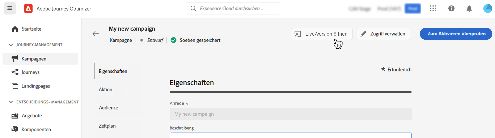

# Ändern oder Stoppen einer Kampagne {#modify-stop-campaign}

Nachdem eine Kampagne aktiviert wurde, können Sie sie jederzeit bearbeiten oder stoppen. Gehen Sie dazu wie folgt vor.

## Aktivierte Kampagne ändern {#modify}

Gehen Sie wie folgt vor, um eine neue Version einer Kampagne zu ändern und zu erstellen:

1. Öffnen Sie die Kampagne und klicken Sie auf die Schaltfläche **[!UICONTROL Kampagne ändern]** Schaltfläche.

1. Eine neue Version der Kampagne wird erstellt. Sie können die Live-Version überprüfen, indem Sie auf **[!UICONTROL Live-Version öffnen]**.

   

   In der Kampagnenliste werden aktivierte Kampagnen, deren Entwurf in Bearbeitung ist, mit einem bestimmten Symbol im **[!UICONTROL Status]** Spalte. Klicken Sie auf dieses Symbol, um den Entwurf der Kampagne zu öffnen.

   

1. Sobald Ihre Änderungen fertig sind, können Sie die neue Version der Kampagne aktivieren (siehe [Kampagne überprüfen und aktivieren](create-campaign.md#review-activate)).

   >[!IMPORTANT]
   >
   >Durch die Aktivierung des Entwurfs wird die Live-Version der Kampagne ersetzt.

## Kampagne stoppen {#stop}

Um eine Kampagne anzuhalten, öffnen Sie sie und klicken Sie auf die Schaltfläche **[!UICONTROL Kampagne stoppen]** Schaltfläche.

>[!IMPORTANT]
>
>Nach dem Anhalten einer Kampagne ist sie nur im schreibgeschützten Modus verfügbar. Sie können sie nicht erneut aktivieren oder zum Erstellen einer neuen Kampagne verwenden.

## Weitere Ressourcen

* [Erste Schritte mit Kampagnen](get-started-with-campaigns.md)
* [Erstellen einer Kampagne](create-campaign.md)
* [API-gesteuerte Kampagnen erstellen](api-triggered-campaigns.md)
* [Live-Bericht einer Kampagne](campaign-live-report.md)
* [Globaler Kampagnenbericht](campaign-global-report.md)
