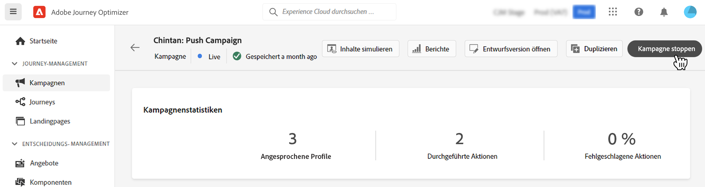

# Verwalten von Kampagnen {#modify-stop-campaign}

Sobald eine Kampagne aktiviert wurde, kann sie jederzeit geändert oder gestoppt werden. Diese Vorgänge stehen nur bei Kampagnen mit wiederkehrender Ausführung zur Verfügung.

Außerdem können Sie Live-Kampagnen (einmal oder mit wiederkehrender Ausführung) duplizieren, wenn neue Kampagnen erstellt werden sollen, und gestoppte oder abgeschlossene Kampagnen archivieren.

## Zugriff auf Kampagnen {#access}

Auf Kampagnen kann über das Menü **[!UICONTROL Kampagnen]** zugegriffen werden.

Standardmäßig werden in der Liste alle Kampagnen mit dem Status **[!UICONTROL Entwurf]**, **[!UICONTROL Geplant]** oder **[!UICONTROL Live]** angezeigt. Um gestoppte, abgeschlossene und archivierte Kampagnen anzuzeigen, müssen Sie den Filter löschen.

Darüber hinaus können Sie die Liste nach Kampagnentyp und -kanal oder nach den Tags filtern, die den Kampagnen bei ihrer Erstellung zugewiesen wurden. [Erfahren Sie, wie Sie einer Kampagne Tags zuweisen](create-campaign.md#create)

## Kampagnenstatus und -warnungen {#statuses}

Kampagnen können mehrere Status aufweisen:

* **[!UICONTROL Entwurf]**: Die Kampagne wird noch bearbeitet, sie wurde nicht aktiviert.
* **[!UICONTROL Wird aktiviert]**: Die Kampagne wird aktiviert.
* **[!UICONTROL Live]**: Die Kampagne wurde aktiviert.
* **[!UICONTROL Geplant]**: Die Kampagne wurde so konfiguriert, dass sie an einem bestimmten Startdatum aktiviert wird.
* **[!UICONTROL Gestoppt]**: Die Kampagne wurde manuell gestoppt. Sie können sie nicht mehr aktivieren oder wiederverwenden. [Informationen zum Stoppen einer Kampagne](modify-stop-campaign.md#stop)
* **[!UICONTROL Abgeschlossen]**: Die Kampagne ist abgeschlossen. Dieser Status wird automatisch 3 Tage nach der Aktivierung einer Kampagne zugewiesen oder am Enddatum der Kampagne, wenn sie eine wiederkehrende Ausführung aufweist.
* **[!UICONTROL Archiviert]**: Die Kampagne wurde archiviert. [Informationen zum Archivieren von Kampagnen](modify-stop-campaign.md#archive)

>[!NOTE]
>
>Das Symbol „Entwurfsversion öffnen“ neben einem Status **[!UICONTROL Live]** oder **[!UICONTROL Geplant]** zeigt an, dass eine neue Version der Kampagne erstellt wurde und noch nicht aktiviert wurde. [Weitere Informationen](modify-stop-campaign.md#modify).

Tritt in einer Ihrer Kampagnen ein Fehler auf, wird neben dem Status der Kampagne ein Warnsymbol angezeigt. Klicken Sie darauf, um Informationen zum Warnhinweis anzuzeigen. Diese Warnhinweise können in verschiedenen Situationen auftreten, z. B. wenn die Kampagnennachricht nicht veröffentlicht wurde oder die gewählte Oberfläche falsch ist.

## Bearbeitung einer wiederkehrenden Kampagne {#modify}

Zum Ändern und Erstellen einer neuen Version einer wiederkehrenden Kampagne wie folgt vorgehen:

1. Öffnen Sie die Kampagne und klicken Sie auf die Schaltfläche **[!UICONTROL Kampagne ändern]**.

1. Eine neue Version der Kampagne wird erstellt. Sie können die Live-Version überprüfen, indem Sie auf **[!UICONTROL Live-Version öffnen]** klicken.

   

   In der Liste der Kampagnen werden aktivierte Kampagnen, für die eine Entwurfsversion in Bearbeitung ist, mit einem speziellen Symbol in der Spalte **[!UICONTROL Status]** angezeigt. Klicken Sie auf dieses Symbol, um die Entwurfsversion der Kampagne zu öffnen.

   

1. Sobald Sie mit den Änderungen fertig sind, können Sie die neue Version der Kampagne aktivieren (siehe [Überprüfung und Aktivierung einer Kampagne](create-campaign.md#review-activate)).

   >[!IMPORTANT]
   >
   >Durch die Aktivierung des Entwurfs wird die Live-Version der Kampagne ersetzt.

## Stoppen einer wiederkehrenden Kampagne {#stop}

Zum Stoppen einer wiederkehrenden Kampagne diese bitte öffnen und auf den Button **[!UICONTROL Kampagne anhalten]** klicken.

>[!IMPORTANT]
>
>Das Anhalten einer Kampagne stoppt keinen laufenden Versand, aber es stoppt einen geplanten Versand oder die nächsten Vorgänge, wenn der Versand bereits im Gange ist.

<!-- inbound campaign (inapp): can stop and resume -->

## Duplizieren einer Kampagne {#duplicate}

Eine Live-Kampagne kann dupliziert werden, um eine neue zu erstellen. Dazu bitte die Kampagne öffnen und auf **[!UICONTROL Duplizieren]** klicken.

## Archivieren einer Kampagne {#archive}

Mit der Zeit wächst die Liste der Kampagnen, wodurch es zunehmend schwieriger wird, abgeschlossene und gestoppte Kampagnen zu durchsuchen.

Um dies zu verhindern, können Sie abgeschlossene und gestoppte Kampagnen archivieren, die Sie nicht mehr benötigen. Klicken Sie dazu auf die Schaltfläche mit den Auslassungspunkten und wählen Sie **[!UICONTROL Archivieren]**.

Archivierte Kampagnen können dann mithilfe des entsprechenden Filters in der Liste abgerufen werden. [Erfahren Sie, wie Sie auf Kampagnen zugreifen können](get-started-with-campaigns.md#access)
