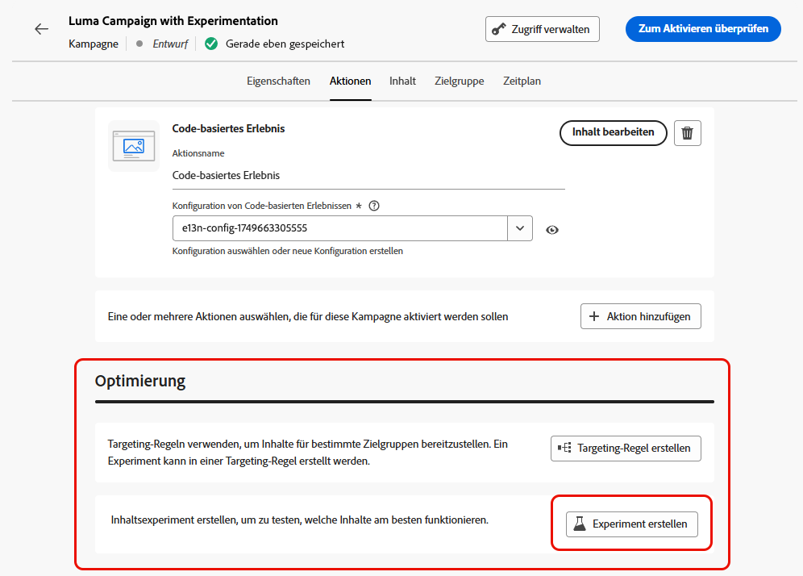
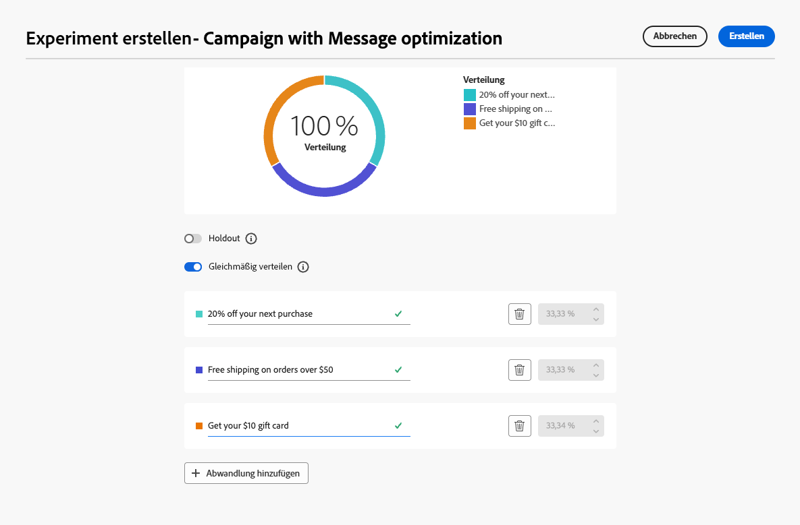

# Verwenden von Experimenten {#experimentation}

>[!NOTE]
>
>Diese Seite bietet einen Überblick über die Verwendung von Experimenten bei der Inhaltsoptimierung. Detaillierte Informationen zu Inhaltsexperimenten, einschließlich Konfigurationsoptionen, Metriken und Analysen, finden Sie unter [Dokumentation zum Inhaltsexperiment](../content-management/get-started-experiment.md).

Mit Experimenten können Sie verschiedene Varianten von Inhalten testen, um anhand vordefinierter Erfolgsmetriken zu bestimmen, welche am besten funktioniert.

Gehen Sie folgendermaßen vor, um Experimente einzurichten.

Angenommen, Sie möchten die folgenden Werbenachrichten in einer Kampagne testen:

* **Abwandlung A**: „20 % Rabatt auf Ihren nächsten Kauf“
* **Abwandlung B**: „Kostenloser Versand bei Bestellungen über 50 €“
* **Abwandlung C**: „Erhalten Sie eine Geschenkkarte im Wert von 10 €“

Gehen Sie wie folgt vor, um ein Experiment einzurichten und zu bestimmen, welche Nachricht für die meisten Käufe sorgt.

1. Erstellen Sie eine [Journey](../building-journeys/journey-gs.md#jo-build) oder eine [Kampagne](../campaigns/create-campaign.md).

   >[!NOTE]
   >
   >Wenn Sie sich in einer Journey befinden, fügen Sie eine Aktivität des Typs **[!UICONTROL Aktion]** hinzu, wählen Sie eine Kanalaktivität aus und wählen Sie **[!UICONTROL Aktion konfigurieren]**. [Weitere Informationen](../building-journeys/journey-action.md#add-action)

1. Wählen Sie auf der Registerkarte **[!UICONTROL Aktionen]** zwei eingehende Aktionen aus, z. B. [Code-basiertes Erlebnis](../code-based/get-started-code-based.md) und [In-App](../../rp_landing_pages/in-app-landing-page.md).

1. Wählen Sie im Abschnitt **[!UICONTROL Optimierung]** die Option **[!UICONTROL Experiment erstellen]** aus.

   {width=85%}

1. Entwerfen und konfigurieren Sie Ihr Inhaltsexperiment nach Bedarf. [Weitere Informationen](../content-management/content-experiment.md)

   {width=85%}

   Sobald das Experiment definiert ist, gilt es für alle Aktionen, die in dieser Kampagne oder über die Aktivität **[!UICONTROL Aktion]** der Journey eingefügt wurden, d. h. dieselben Kundinnen und Kunden sehen auf allen Oberflächen dieselben Angebote.

   >[!NOTE]
   >
   >Sie können auch andere Aktionen auswählen: Das Experiment gilt für alle Aktionen, die der Kampagne oder der Journey-Aktivität ([) hinzugefügt ](../building-journeys/journey-action.md).

1. [Aktivieren](review-activate-campaign.md) Sie Ihre Journey oder Kampagne.

Sobald die Journey/Kampagne live ist, werden den Benutzenden die verschiedenen Inhaltsvarianten nach dem Zufallsprinzip zugewiesen. [!DNL Journey Optimizer] verfolgt, welche Variante zu mehr Käufen führt, und stellt verwertbare Erkenntnisse zur Verfügung.

Verfolgen Sie den Erfolg Ihrer Kampagne mit den Berichten [Journey](../reports/journey-global-report-cja.md) und [Kampagne](../reports/campaign-global-report-cja-experimentation.md). <!--Link to Experimentation journey reportis missing-->

