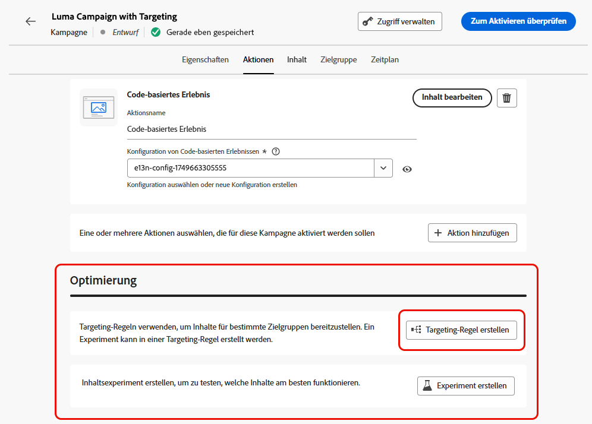
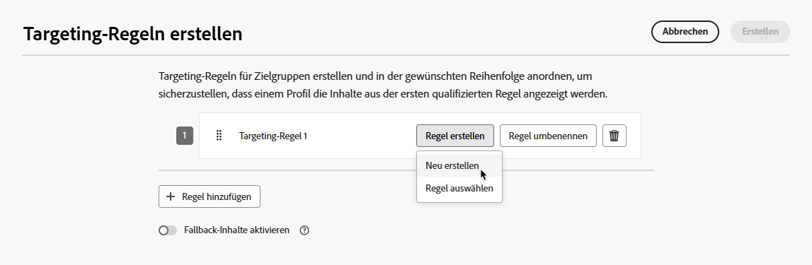
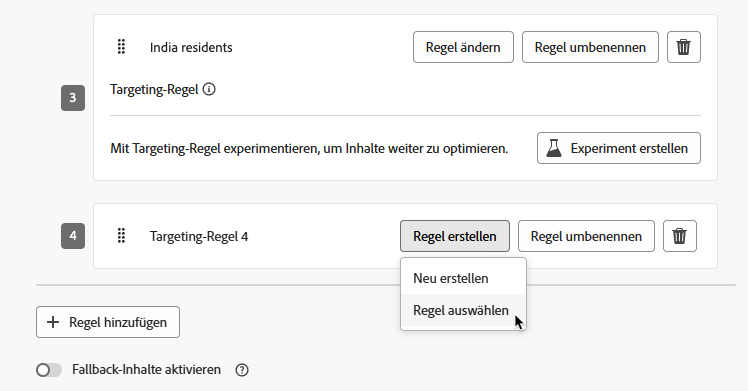
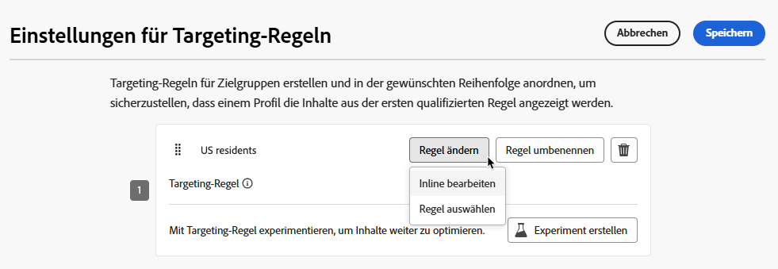
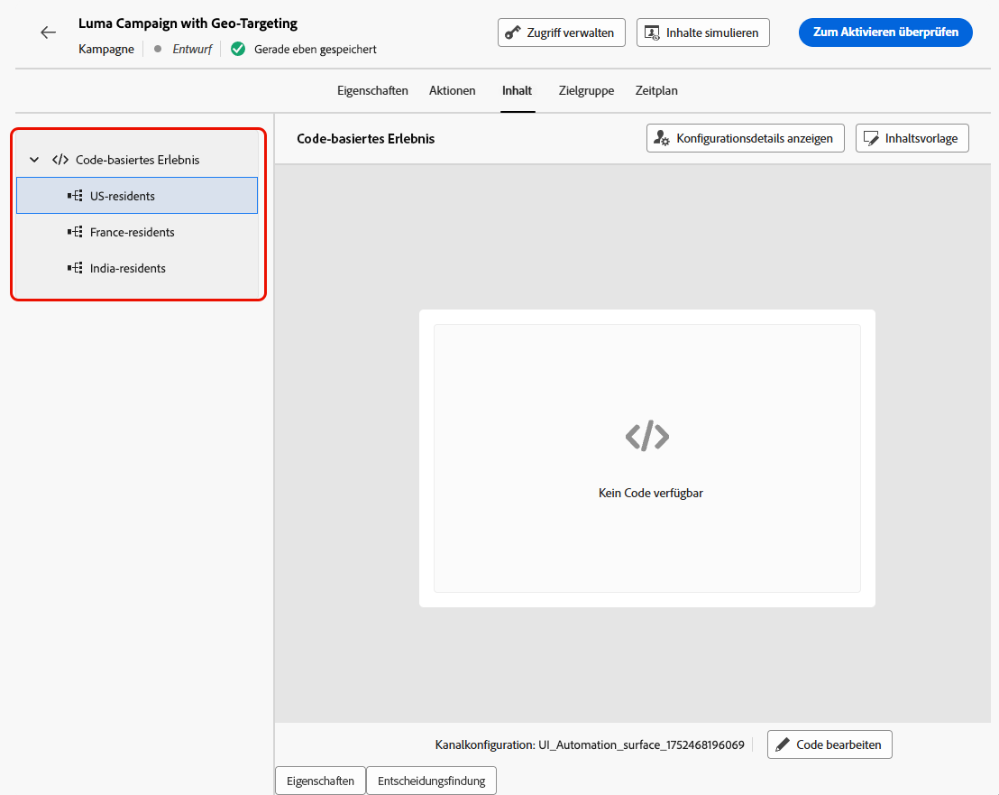

# Verwenden von Targeting {#targeting}

>[!CONTEXTUALHELP]
>id="ajo_content_targeting_fallback"
>title="Was sind Fallback-Inhalte?"
>abstract="Mit Fallback-Inhalten kann Ihre Zielgruppe einen Standardinhalt erhalten, falls keine der Targeting-Regeln erfüllt ist.  Falls Sie diese Option nicht auswählen, erhalten Zielgruppen, die sich nicht für eine der oben definierten Targeting-Regeln qualifizieren, keine Inhalte."

Beim Targeting werden auf der Grundlage von Benutzerprofilattributen oder kontextuellen Attributen personalisierte Inhalte für bestimmte Zielgruppensegmente bereitgestellt.

Im Gegensatz zu Experimenten, bei denen es sich um eine zufällige Zuweisung des Inhalts einer Nachricht handelt, ist das Targeting in Bezug auf die Bereitstellung der Inhalte für die richtige Zielgruppe deterministisch.

Beim Targeting können spezifische Regeln definiert werden, die auf Folgendem basieren:

* **Benutzerprofilattribute** wie Standort (z. B. Geotargeting), Alter oder Präferenzen. In den USA wird Benutzenden beispielsweise eine „Golden Gate“-Promotion angeboten, in Frankreich hingegen eine „Eiffelturm“-Promotion.

* **Kontextdaten** wie Gerätetyp (z. B. Geräte-Targeting), Tageszeit oder Sitzungsdetails. Beispielsweise erhalten Desktop-Benutzende für den Desktop optimierte Inhalte, während mobile Benutzende für Mobilgeräte optimierte Inhalte erhalten.

* **Zielgruppen**, mit deren Hilfe Profile mit einer bestimmten Zielgruppenzugehörigkeit ein- oder ausgeschlossen werden können.

Gehen Sie folgendermaßen vor, um das Targeting einzurichten.

1. Erstellen Sie eine [Journey](../building-journeys/journey-gs.md#jo-build) oder eine [Kampagne](../campaigns/create-campaign.md).

   >[!NOTE]
   >
   >Wenn Sie sich in einer Journey befinden, fügen Sie eine Aktivität des Typs **[!UICONTROL Aktion]** hinzu, wählen Sie eine Kanalaktivität aus und wählen Sie **[!UICONTROL Aktion konfigurieren]**. [Weitere Informationen](../building-journeys/journey-action.md#add-action)

1. Wählen Sie auf der Registerkarte **[!UICONTROL Aktionen]** mindestens eine Aktion aus.

1. Wählen Sie im Abschnitt **[!UICONTROL Optimierung]** die Option **[!UICONTROL Targeting-Regel erstellen]**.

   {width=85%}

1. Klicken Sie auf **[!UICONTROL Regel erstellen]** > **[!UICONTROL Neu erstellen]** und verwenden Sie den Regel-Builder, um Ihre Kriterien schnell zu definieren.

   {width=100%}

   Definieren Sie beispielsweise eine Regel für in den USA ansässige Personen, eine Regel für in Frankreich ansässige Personen und eine Regel für in Indien ansässige Personen.

   {width=85%}

1. Sie können auch auf **[!UICONTROL Regel erstellen]** > **[!UICONTROL Regel auswählen]** klicken, um eine vorhandene Zielgruppenregel auszuwählen, die im Menü **[!UICONTROL Regeln]** erstellt wurde. [Weitere Informationen](../experience-decisioning/rules.md)

   {width=70%}

   In diesem Fall wird die Formel, aus der die Regel besteht, einfach in die Journey oder Kampagne kopiert. Spätere Änderungen an dieser Regel im Menü **[!UICONTROL Regeln]** wirken sich nicht auf die Kopie der Journey bzw. der Kampagne aus.

   >[!AVAILABILITY]
   >
   >Das [Erstellen von Targeting-Regeln](../experience-decisioning/rules.md#create) im dedizierten [!DNL Journey Optimizer]-Menü ist derzeit für Organisationen verfügbar, die das Entscheidungsfindungs-Add-on erworben haben. Für andere Organisationen ist dies auf Anfrage verfügbar (eingeschränkte Verfügbarkeit).
   >
   >Diese Kapazität wird nach und nach für alle Kundinnen und Kunden eingeführt. Wenden Sie sich in der Zwischenzeit an den Adobe-Support, um Zugriff zu erhalten.

1. Nachdem Sie eine Regel hinzugefügt haben, können Sie sie noch ändern. Wählen Sie **[!UICONTROL Inline bearbeiten]**, um sie mithilfe des Regel-Builders schnell zu aktualisieren, oder **[!UICONTROL Regel auswählen]**, um eine andere vorhandene Regel auszuwählen.

   {width=100%}

   >[!NOTE]
   >
   >Die Inline-Bearbeitung einer Regel hat keine Auswirkungen auf die vorhandene Regel, von der sie stammt.

1. Wählen Sie nach Bedarf **[!UICONTROL Fallback-Inhalte aktivieren]** aus. Mit Fallback-Inhalten kann Ihre Zielgruppe einen Standardinhalt erhalten, falls keine der Targeting-Regeln erfüllt ist.

   >[!NOTE]
   >
   >Falls Sie diese Option nicht auswählen, erhält jede Zielgruppe, die sich nicht für eine der oben definierten Targeting-Regeln qualifiziert, keine Inhalte.

1. Speichern Sie Ihre Einstellungen für die Targeting-Regel.

1. Kehren Sie zur Registerkarte **[!UICONTROL Aktionen]** zurück und wählen Sie **[!UICONTROL Inhalt bearbeiten]**.

1. Gestalten Sie geeignete Inhalte für jede Gruppe, die durch die Einstellungen Ihrer Targeting-Regeln definiert wird.

   {width=85%}

   In diesem Beispiel erstellen wir einen bestimmten Inhalt für in den USA ansässige Personen, einen anderen Inhalt für in Frankreich ansässige Personen und einen dritten Inhalt für in Indien ansässige Personen.

1. [Aktivieren](review-activate-campaign.md) Sie Ihre Journey oder Kampagne.

Sobald die Journey/Kampagne live ist, werden für jede Zielgruppe maßgeschneiderte Inhalte versendet, sodass etwa in den USA ansässige Personen eine bestimmte Nachricht erhalten, in Frankreich ansässige Personen eine andere usw.

<!--Default content:

* If no targeting rules match, default content can be delivered.

* If default content is not enabled, passthrough behavior ensures lower-priority campaigns are evaluated.-->

