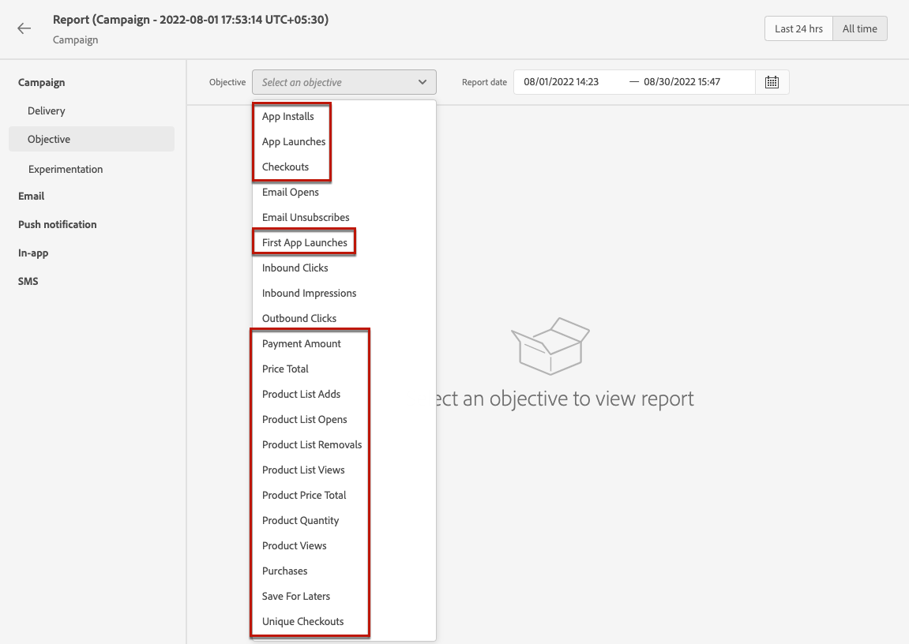

# Konfigurieren des Reportings für Experimente {#reporting-configuration}

>[!CONTEXTUALHELP]
>id="ajo_admin_reporting_config"
>title="Einrichten von Datensätzen für das Reporting"
>abstract="Mit der Reporting-Konfiguration können Sie zusätzliche Metriken abrufen, die in Ihren Kampagnenberichten verwendet werden. Sie muss von einem/r technischen Anwender(in) durchgeführt werden."

>[!CONTEXTUALHELP]
>id="ajo_admin_reporting_dataset"
>title="Auswählen eines Datensatzes"
>abstract="Sie können nur einen Ereignistyp-Datensatz auswählen, der mindestens eine der unterstützten Feldergruppen enthält: Anwendungsdetails, Commerce-Details, Web-Details."

Mit der Konfiguration von Berichtsdatenquellen können Sie eine Verbindung zu einem System definieren, um zusätzliche Informationen zur Verwendung in Ihren Berichten abzurufen.

<!--The reporting data source configuration allows you to retrieve additional metrics that will be used in the **[!UICONTROL Objectives]** tab of your campaign reports.-->

>[!NOTE]
>
>Die Reporting-Konfiguration muss von einem/r technischen Anwender(in) vorgenommen werden. <!--Rights?-->

Für diese Konfiguration müssen Sie einen oder mehrere Datensätze hinzufügen, die die zusätzlichen Elemente enthalten, die Sie für Ihre Berichte verwenden möchten. Gehen Sie dazu [wie folgt](#add-datasets) vor.

<!--
➡️ [Discover this feature in video](#video)
-->

## Voraussetzungen

Bevor Sie der Reporting-Konfiguration einen Datensatz hinzufügen können, müssen Sie diesen Datensatz erstellen. Weitere Informationen hierzu finden Sie in der [Dokumentation zu Adobe Experience Platform](https://experienceleague.adobe.com/docs/experience-platform/catalog/datasets/user-guide.html?lang=de#create){target="_blank"}.

* Sie können nur Datensätze vom Typ „Ereignis“ hinzufügen.

* Diese Datensätze müssen die [Feldergruppe](https://experienceleague.adobe.com/docs/experience-platform/xdm/tutorials/create-schema-ui.html?lang=de#field-group){target="_blank"} `Experience Event - Proposition Interactions` enthalten.

* Diese Datensätze können auch eine der folgenden [Feldergruppen](https://experienceleague.adobe.com/docs/experience-platform/xdm/tutorials/create-schema-ui.html?lang=de#field-group){target="_blank"} enthalten: `Application Details`, `Commerce Details` und `Web Details`.

  >[!NOTE]
  >
  >Es können auch andere Feldergruppen einbezogen werden, aber in Journey Optimizer-Berichten werden derzeit nur die oben genannten Feldergruppen unterstützt.

  Wenn Sie beispielsweise wissen möchten, wie sich eine E-Mail-Kampagne auf Commerce-Daten wie Käufe oder Bestellungen auswirkt, müssen Sie einen Erlebnisereignis-Datensatz mit der Feldergruppe `Commerce Details` erstellen.

  Wenn Sie einen Bericht über Mobile-Interaktionen erstellen möchten, müssen Sie außerdem einen Erlebnisereignis-Datensatz mit der Feldergruppe `Application Details` erstellen.

  <!--The metrics corresponding to each field group are listed [here](#objective-list).-->

* Sie können diese Feldergruppen zu einem oder mehreren Schemata hinzufügen, die in einem oder mehreren Datensätzen verwendet werden.

>[!NOTE]
>
>Weitere Informationen zu XDM-Schemata und Feldergruppen finden Sie in der [Dokumentation zur XDM-Systemübersicht](https://experienceleague.adobe.com/docs/experience-platform/xdm/home.html?lang=de){target="_blank"}.

<!--
## Objectives corresponding to each field group {#objective-list}

The table below shows which metrics will be added to the **[!UICONTROL Objectives]** tab of your campaign reports for each field group.

| Field group | Objectives |
|--- |--- |
| Commerce Details | Price Total Payment Amount (Unique) Checkouts (Unique) Product List Adds (Unique) Product List Opens (Unique) Product List Removal (Unique) Product List Views (Unique) Product Views (Unique) Purchases (Unique) Save For Laters Product Price Total Product Quantity |
| Application Details | (Unique) App Launches First App Launches (Unique) App Installs (Unique) App Upgrades |
| Web Details | (Unique) Page Views |
-->

## Hinzufügen von Datensätzen {#add-datasets}

1. Wählen Sie im Menü **[!UICONTROL ADMINISTRATION]** **[!UICONTROL Konfigurationen]** aus. Klicken Sie im Abschnitt **[!UICONTROL Reporting]** auf **[!UICONTROL Verwalten]**.

   

   Die Liste der bereits hinzugefügten Datensätze wird angezeigt.

1. Klicken Sie in der Registerkarte **[!UICONTROL Datensatz]** auf **[!UICONTROL Datensatz hinzufügen]**.

   

   >[!NOTE]
   >
   >Wenn Sie die Registerkarte **[!UICONTROL Systemdatensatz]** auswählen, werden nur vom System erstellte Datensätze angezeigt. Sie können keine anderen Datensätze hinzufügen.

1. Wählen Sie aus der Dropdownliste **[!UICONTROL Datensatz]** den Datensatz aus, den Sie für Ihre Berichte verwenden möchten.

   >[!CAUTION]
   >
   >Sie können nur einen Datensatz vom Typ „Ereignis“ auswählen, der mindestens eine der unterstützten [Feldergruppen](https://experienceleague.adobe.com/docs/experience-platform/xdm/tutorials/create-schema-ui.html?lang=de#field-group){target="_blank"} enthält: **Anwendungsdetails**, **Commerce-Details**, **Web-Details**. Wenn Sie einen Datensatz auswählen, der diesen Kriterien nicht entspricht, können Sie Ihre Änderungen nicht speichern.

   

   Weitere Informationen zu Datensätzen finden Sie in der [Dokumentation zu Adobe Experience Platform](https://experienceleague.adobe.com/docs/experience-platform/catalog/datasets/overview.html?lang=de){target="_blank"}.

1. Wählen Sie aus der Dropdown-Liste **[!UICONTROL Profilkennung]** das Datensatzfeldattribut aus, das zur Identifizierung der einzelnen Profile in Ihren Berichten verwendet wird.

   

   >[!NOTE]
   >
   >Es werden nur IDs angezeigt, die für das Reporting verfügbar sind.

1. Die Option **[!UICONTROL Verwenden des primären ID-Namespace]** ist standardmäßig aktiviert. Wenn die ausgewählte **[!UICONTROL Profilkennung]** **[!UICONTROL Identitätszuordnung]** lautet, können Sie diese Option deaktivieren und einen anderen Namespace aus der angezeigten Dropdown-Liste auswählen.

   

   Weitere Informationen zu Namespaces finden Sie in der [Dokumentation zu Adobe Experience Platform](https://experienceleague.adobe.com/docs/experience-platform/identity/namespaces.html?lang=de){target="_blank"}.

1. Speichern Sie Ihre Änderungen, um den ausgewählten Datensatz zur Liste der Reporting-Konfigurationen hinzuzufügen.

   >[!CAUTION]
   >
   >Wenn Sie einen Datensatz ausgewählt haben, der nicht vom Typ „Ereignis“ ist, können Sie nicht fortfahren.

Beachten Sie, dass Sie beim Web- und beim In-App-Kanal sicherstellen müssen, dass der [Datensatz](../data/get-started-datasets.md), der für die Datenerfassung konfiguriert wurde, auch zu dieser Reporting-Konfiguration hinzugefügt wird. Andernfalls werden Web- und In-App-Daten nicht in den Inhaltsexperimentberichten angezeigt.

* Weitere Informationen zu Voraussetzungen für Inhaltsexperimente für Web-Kanäle finden Sie in [diesem Abschnitt](../web/web-prerequisites.md#experiment-prerequisites).

* Weitere Informationen zur Konfiguration des In-App-Kanals finden Sie in [diesem Abschnitt](../in-app/inapp-configuration.md).

<!--
When building your campaign reports, you can now see the metrics corresponding to the field groups used in the datasets you added. Go to the **[!UICONTROL Objectives]** tab and select the metrics of your choice to better fine-tune your reports. [Learn more](content-experiment.md#objectives-global)

>[!NOTE]
>
>If you add several datasets, all data from all datasets will be available for reporting.

## How-to video {#video}

Understand how to configure Experience Platform reporting data sources.

>[!VIDEO]()
-->
