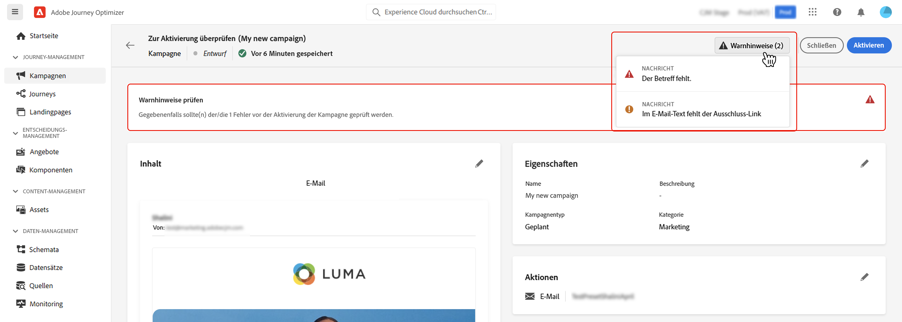

# Überprüfen und aktivieren Sie die API-ausgelöste Kampagne {#api-review}

Nachdem Ihre Aktionskampagne konfiguriert wurde, müssen Sie ihre Parameter und Inhalte überprüfen, bevor Sie sie aktivieren. Gehen Sie dazu wie folgt vor:

>[!IMPORTANT]
>
> Wenn Ihre Kampagne einer Genehmigungsrichtlinie unterliegt, müssen Sie eine Genehmigung anfordern, um Ihre Kampagne senden zu können. [Weitere Informationen](../test-approve/gs-approval.md)

1. Klicken Sie im Konfigurationsbildschirm der Kampagne auf **[!UICONTROL Zum Aktivieren überprüfen]**, um eine Zusammenfassung der Kampagne anzuzeigen.

   

1. Es wird eine Zusammenfassung der Kampagnenkonfiguration angezeigt, anhand derer Sie überprüfen können, ob ein Parameter falsch ist oder fehlt, und Ihre Kampagne bei Bedarf ändern können.

   Bei Fehlern können Sie die Kampagne nicht aktivieren. Beheben Sie die Fehler, bevor Sie fortfahren.

   

1. Vergewissern Sie sich, dass Ihre Kampagne korrekt konfiguriert ist, und klicken Sie dann auf **[!UICONTROL Aktivieren]**.

1. Die Kampagne ist aktiviert. Ihr Status lautet **[!UICONTROL Live]** oder **[!UICONTROL Geplant]**, wenn Sie ein Startdatum eingegeben haben.

   Der **[!UICONTROL Abgeschlossen]** wird der Kampagne automatisch 3 Tage nach ihrer Aktivierung zugewiesen oder am Enddatum der Kampagne, wenn es sich um eine wiederkehrende Ausführung handelt. [Weitere Informationen zum Kampagnenstatus](get-started-with-campaigns.md#statuses).

   Wenn kein Enddatum angegeben wurde, behält die Kampagne den Status **[!UICONTROL Live]**. Um ihn zu ändern, müssen Sie die Kampagne manuell anhalten. [Informationen zum Stoppen einer Kampagne](modify-stop-campaign.md)

1. Nach der Aktivierung einer Kampagne können Sie jederzeit ihre Informationen überprüfen, indem Sie sie öffnen. In der Zusammenfassung finden Sie Statistiken über die Anzahl der Zielgruppenprofile sowie der bereitgestellten und fehlgeschlagenen Aktionen.

   Sie können auch zusätzliche Statistiken in speziellen Berichten einsehen, indem Sie auf die Schaltfläche **[!UICONTROL Berichte]** klicken. [Weitere Informationen](../reports/campaign-global-report-cja.md)

   

## Nächste Schritte {#next}

Sobald die von der API ausgelöste Kampagne fertig ist, können Sie ihre Ausführung mithilfe von APIs mit einem Trigger versehen. [Weitere Informationen](trigger-campaigns.md)
