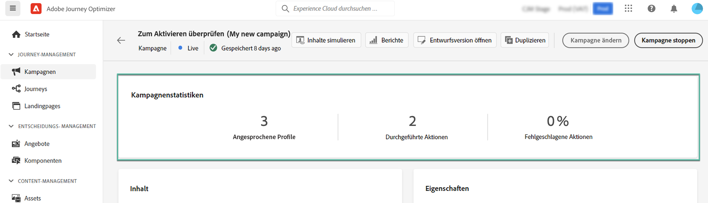

# Überprüfen und Aktivieren der Kampagne, die durch API ausgelöst wird {#api-review}

Sobald Ihre API-ausgelöste Kampagne konfiguriert ist, müssen Sie deren Parameter und Inhalte überprüfen, bevor Sie sie aktivieren. Gehen Sie dazu wie folgt vor:

>[!IMPORTANT]
>
> Wenn Ihre Kampagne einer Genehmigungsrichtlinie unterliegt, müssen Sie eine Genehmigung anfordern, um Ihre Kampagne senden zu können. [Weitere Informationen](../test-approve/gs-approval.md)

1. Klicken Sie im Konfigurationsbildschirm der Kampagne auf **[!UICONTROL Zum Aktivieren überprüfen]**, um eine Zusammenfassung der Kampagne anzuzeigen.

   

1. Anhand der angezeigten Zusammenfassung der Kampagnenkonfiguration können Sie überprüfen, ob ein Parameter falsch ist oder fehlt, und bei Bedarf Änderungen an Ihrer Kampagne vornehmen.

   Bei Fehlern können Sie die Kampagne nicht aktivieren. Beheben Sie die Fehler, bevor Sie fortfahren.

   

1. Vergewissern Sie sich, dass Ihre Kampagne korrekt konfiguriert ist, und klicken Sie dann auf **[!UICONTROL Aktivieren]**.

1. Die Kampagne ist aktiviert. Ihr Status ist **[!UICONTROL Live]** oder, wenn Sie ein Startdatum eingegeben haben, **[!UICONTROL Geplant]**.

   Der Status **[!UICONTROL Abgeschlossen]** wird einer Kampagne automatisch drei Tage nach ihrer Aktivierung zugewiesen oder am Enddatum der Kampagne, wenn es sich um eine wiederkehrende Ausführung handelt. [Weitere Informationen zum Kampagnenstatus](manage-campaigns.md#statuses).

   Wenn kein Enddatum angegeben wurde, behält die Kampagne den Status **[!UICONTROL Live]**. Um ihn zu ändern, müssen Sie die Kampagne manuell anhalten. [Informationen zum Stoppen einer Kampagne](manage-campaigns.md)

1. Nach der Aktivierung einer Kampagne können Sie jederzeit ihre Informationen überprüfen, indem Sie sie öffnen. In der Zusammenfassung finden Sie Statistiken über die Anzahl der Zielgruppenprofile sowie der bereitgestellten und fehlgeschlagenen Aktionen.

   Sie können auch zusätzliche Statistiken in speziellen Berichten einsehen, indem Sie auf die Schaltfläche **[!UICONTROL Berichte]** klicken. [Weitere Informationen](../reports/campaign-global-report-cja.md)

   

## Nächste Schritte {#next}

Sobald die durch API ausgelöste Kampagne fertiggestellt ist, können Sie ihre Ausführung mithilfe von APIs auslösen. [Weitere Informationen](trigger-campaigns.md)
